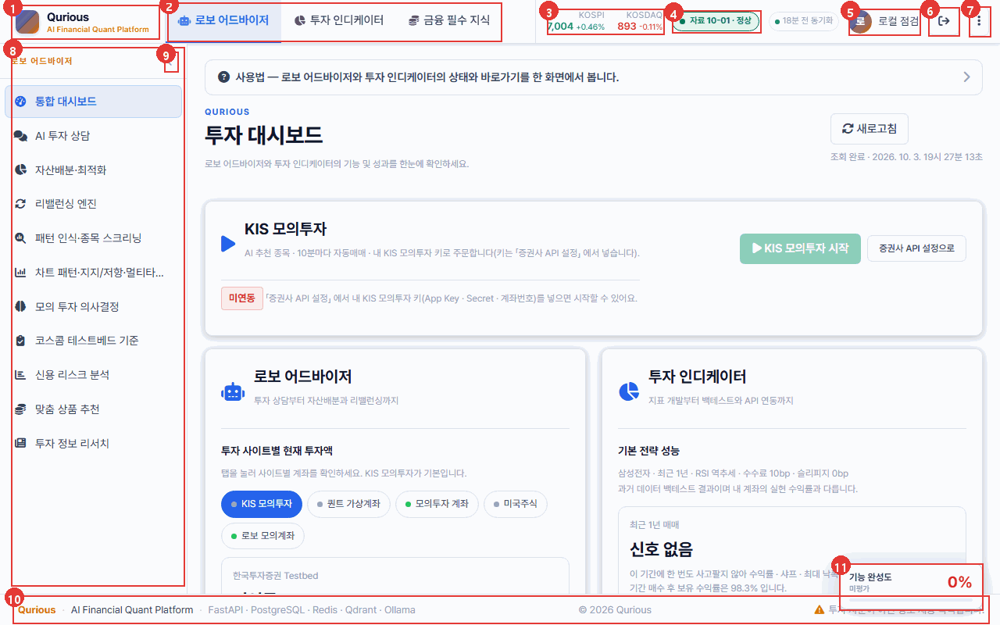
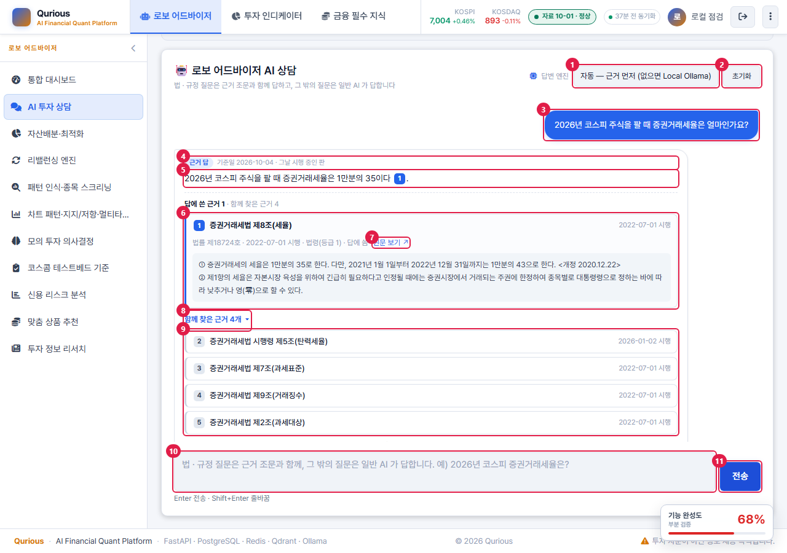
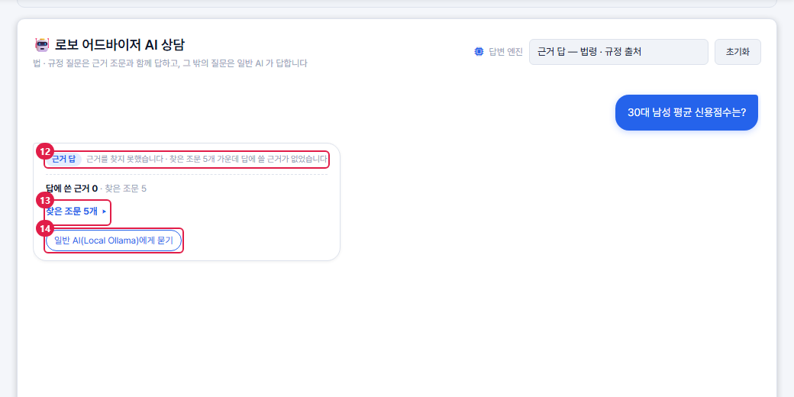
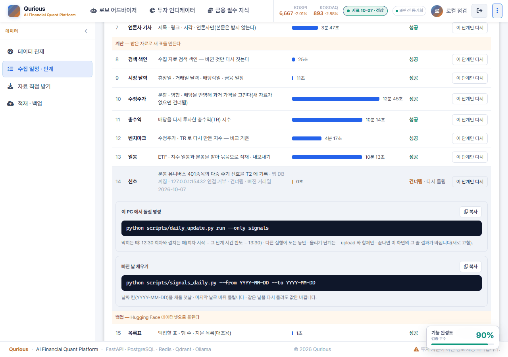
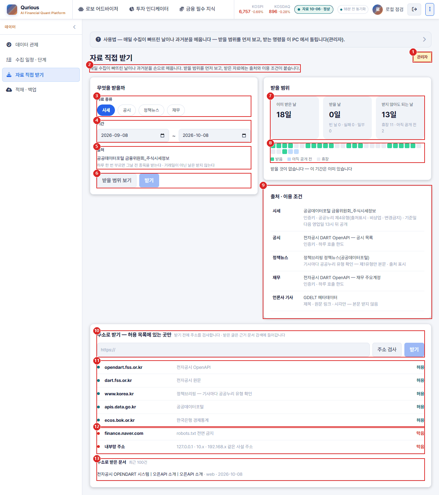
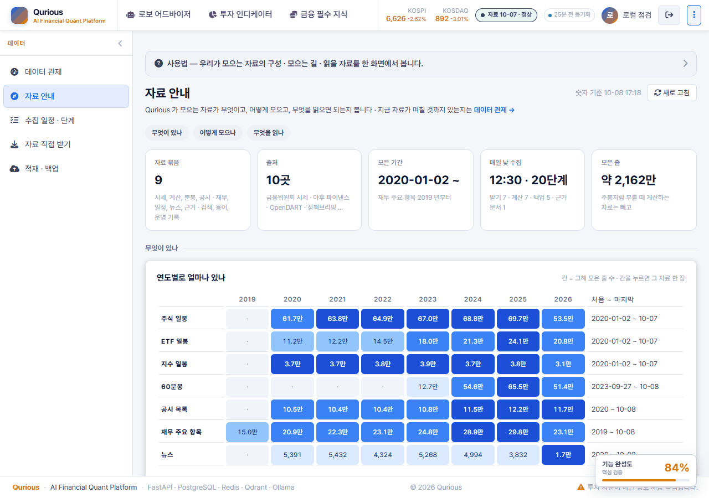
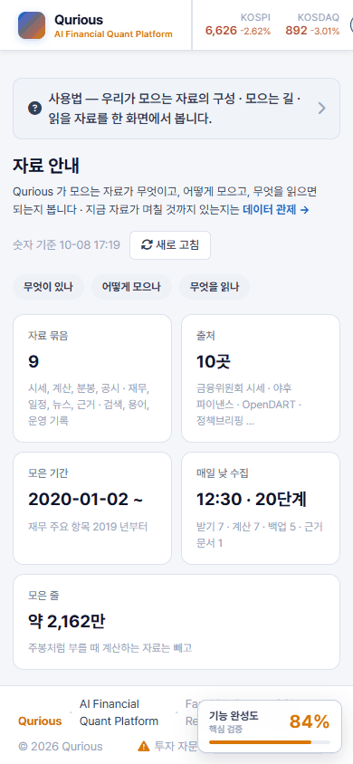
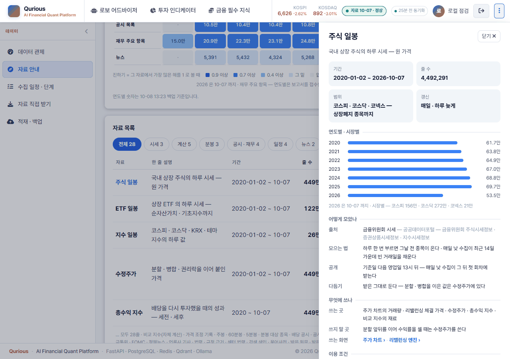

# UI 명세서(화면설계서) v0.8 — Qurious

| 문서 정보 | |
|---|---|
| **판 · 상태** | v0.8 · 초안(검토 전) — 공통 영역 · 데이터 관제 · AI 투자 상담(근거 답) 상세 · 데이터 수집 화면 셋(구현 · 2026-10-08 · 화면 수집 단추 2026-10-10) · 자료 안내(새 화면 · 2026-10-08) · 화면 70개 목록. 나머지 화면의 상세는 각 주담당이 채운다 |
| **구분** | 4. 화면·서비스 설계 — UI 명세서(화면설계서) |
| **작성** | 초안 이동원(팀장 · 공통 영역과 이동원 몫 화면) · 자기 화면의 상세 채우기와 판 올리기는 각 주담당 · 검수 이동원 |
| **검토** | 검토 전 |
| **최종 수정** | 2026-10-10 (KST) |
| **기준** | 코드 `main` `83a0b12` + 화면 수집 단추(3절 <그림 2> · 5.2 <그림 5> · <그림 5-3> — 2026-10-10 16:29 로컬 개발 앱 캡처 · Figma 「데이터 수집 화면」 03-2 결정 기록 · 구현 대조 [`51:2`](https://www.figma.com/design/AfiCh50uOwrSq5F2Tk2JLZ?node-id=51-2) · [`52:2`](https://www.figma.com/design/AfiCh50uOwrSq5F2Tk2JLZ?node-id=52-2)) · 코드 `main` `5f3c325` + 러너 묶음 · 자료 안내 1단계(5.2 <그림 5-2> · 5.7 — 2026-10-08 로컬 개발 앱 캡처) · 코드 `main` `73f075b` + 크롤링 세 화면 구현(3절 <그림 2> · 5절 — 2026-10-08 로컬 개발 앱 1280 캡처) · 코드 `main` `7afe5e9`(1 · 2절 · 6절) · `main` `163923a` + 근거 답 화면(4절 · 2026-10-04 14:05 캡처) · Figma 「데이터 수집 화면」 03 설계 · 05 결정 기록(5절 · 2026-10-06 결정 · 코드 `main` `13a6ae9` 의 러너 단계 목록과 대조) · 로컬 개발 앱 화면(1280 폭) · [IA v1.0](IA_v1.0.md) 2.1절 전수표 · [API 명세서 v0.3](../../인터페이스/지난판/API명세서_v0.3.md) 「부르는 화면」 칸 · [요구 대장](../../요구사항/대장/요구-대장.tsv) |
| **관련 문서** | [IA v1.4](../IA.md) · [와이어프레임 v0.5](../와이어프레임.md) · [유스케이스 명세서 v0.3](../../요구사항/유스케이스명세서.md) · [API 명세서 v0.17](../../인터페이스/API명세서.md) · [목표 기능 ① 설계서 v1.6](../../설계/목표기능1-데이터지식-설계.md) · [근거 답 출처 표시 조사서 v0.1](../../조사/근거답-출처표시-화면-조사.md) · [이동원 파트 할 일 v0.3](../../계획서/이동원파트-할일.md) 5절 · [코딩 표준 v0.1](../../개발/코딩표준.md) 4절 · Figma [「데이터 수집 화면 — 수집 일정 · 직접 받기 · 적재 백업」](https://www.figma.com/design/AfiCh50uOwrSq5F2Tk2JLZ) |
| **최근 개정** | v0.7 → v0.8: 화면 수집 단추 — 5.2 <표 10> 요소 12 ~ 18(전체 수집 · 작업자 띠 · 명령 · 줄의 요청 상태 · 수집 요청 · 확인 창 · 대기 창)과 6 · 10 · 11 고침 · <표 10-2> 정한 것 넷 · <그림 5> 새 캡처 · <그림 5-3> · 5.5 <표 13-2> 수집 요청 경우 표 · <표 14> · <표 15> 줄 · 3절 <표 4> 11 수집 요청 한 줄(관리자) · <그림 2> 새 캡처 · 목록 10 · 66 줄 · 지난 판 v0.6 → v0.7: 5.7 자료 안내(새 화면 · 그림 셋 · 요소 표 · 경우 표) · 5.2 신호 단계의 채울 날이 남은 건너뜀(노랑) · 빠진 날 채우기 상자(<그림 5-2>) · 화면 69 → 70 · 지난 판 v0.5 → v0.6: 5절 데이터 수집 화면 셋을 구현 화면으로(그림 셋 구현 캡처 — 적재 · 백업은 판정 기록이 처음 생긴 10-08 13:43 · 요소 표 셋 · 받은 날 규칙 표 · 경우 표 · 서버 표) · 구현 때 정한 셋(PC 쪽 일은 명령 보여 주기 · 실제 수집 단위 · 백업 판정은 도구가 쓰고 앱은 읽기) · 3절 데이터 관제 「오늘 갱신 — 단계」 → 마지막 수집 한 줄(결정 ④) · 지난 회차의 다시 돌린 줄(DF-82) · 목록 10 ~ 12 · 66 줄 · 지난 판 — v0.4 → v0.5: AI 투자 상담 답변 엔진 다섯째 칸 이름 · 답 꼬리표 · 입력 칸 안내(강사님 th06 10-07 판) · v0.3 → v0.4: 5절 <표 15> 「서버에 필요한 것」 을 만든 것으로 고침(수집 일정 · 단계 `API-DATA-05` · 주소 검사 `API-DATA-06 · 07` · 받는 길 셋이 주소 검사를 지남 · 이 PC 용량 · 한 단계 다시는 러너 명령까지) · 단계 이름표 사본을 없앤 설계 메모 · 그림 셋의 Figma 손질(경우 표 줄바꿈 · 「예시 값」 을 화면 밖 주석으로 · 설계 3 의 자료 올리기 · 위험 구역 칸 뺌) · 결정 둘(한 단계 다시는 화면이 명령만 보여 줌 · 「DB 초기화」 단추와 서버 길 모두 없앰) · 지난 판 — v0.2 → v0.3: 데이터 수집 화면 셋 상세(5절 · Figma 설계 결정 · 구현 전 — 그림 셋 · 요소 33 · 경우 표) · 목록 10 ~ 12 줄 · 절 번호(목록 6 · 채울 차례 7) — 전체는 부록 C |

> **이 문서로 알 수 있는 것**
> 1. 모든 화면에 공통으로 있는 영역은 무엇이고, 무엇을 부르며 어떻게 동작하나?
> 2. 화면 하나는 어떤 칸으로 명세하나(데이터 관제를 본보기로)?
> 3. 화면 70개는 각각 어떤 API 를 부르고, 어느 요구 · 누구의 몫인가?
> 4. AI 투자 상담의 근거 답은 어떻게 보이고, 근거가 없거나 답할 수 없을 때 무엇을 보이나?
> 5. 크롤링 세 화면을 바꾼 데이터 수집 화면 셋(수집 일정 · 단계 · 자료 직접 받기 · 적재 · 백업)은 무엇을 보이고 어떻게 동작하나?
> 6. 자료 안내는 무엇을 누구에게 보이고, 개발 정보는 어떻게 관리자에게만 가나?
> 7. 관리자는 화면에서 한 단계 · 전체 수집을 어떻게 요청하고, 막는 때 · 작업자가 꺼졌을 때 무엇을 보나?

## 요약

화면설계서의 실무 관행대로 **화면 그림에 번호를 찍고, 번호마다 요소 · 데이터(API) · 동작 · 빈 데이터 · 오류를 표로** 적는다. 모든 화면이 공유하는 공통 영역 11개와 데이터 관제 화면을 본보기로 자세히 썼고, v0.2 에서 AI 투자 상담(근거 답 · 요소 14 · 상태 표)을, v0.3 에서 데이터 수집 화면 셋(Figma 에서 정한 설계 · 요소 33 · 경우 표)을 더했고, v0.6 에서 그 셋을 만들어 그림을 구현 화면으로 바꿨고, v0.7 에서 자료 안내(새 화면)를, v0.8 에서 화면에서 수집을 요청하는 단추(요소 여덟 · 정한 것 넷 · 경우 표)를 더했다. 화면 70개의 목록(부르는 API · 관련 요구 · 주담당)은 IA 전수표와 API 명세서에서 만들었다. 화면 69개 중 51개가 API 를 불렀고(v0.1) 자료 안내가 하나를 더한다, 상세를 채울 사람은 목록의 「명세」 칸에 적었다.

---

## 1. 읽는 법

**<표 1> 화면 한 장의 칸** · 문서 작성 기준 5.4절

| 칸 | 적는 것 |
|---|---|
| 화면 정보 | 화면 ID(화면 키) · 화면명 · 들어가는 길(메뉴) · 설명 · 관련 요구 · 주담당 |
| 화면 그림 | 1280 × 800 캡처에 빨간 번호 |
| 요소 표 | 번호 · 요소 · 데이터(API ID) · 동작 · 빈 데이터 · 오류 · 비고 |

---

## 2. 공통 영역

모든 화면에 공통으로 있는 영역은 <그림 1> 과 같다(투자 대시보드에서 캡처).

**<그림 1> 공통 영역** · 범례: 빨간 상자와 번호 = <표 2> 의 요소

**<표 2> 공통 영역 요소**

| 번호 | 요소 | 데이터(API) | 동작 | 빈 데이터 · 오류 | 비고 |
|:-:|---|---|---|---|---|
| 1 | 로고 · 서비스 이름 | — | 누르면 첫 화면(투자 대시보드 `#dashboard`) | — | 부제 「AI Financial Quant Platform」 |
| 2 | 위 메뉴 | — | 화면 폭에 들어가는 만큼 묶음을 보이고(1280 에서 셋), 누르면 그 묶음의 첫 화면 · 왼쪽 메뉴가 바뀐다 | — | 나머지 묶음은 7 에서 |
| 3 | 지수 띠(KOSPI · KOSDAQ) | `API-STK-01` | 값과 등락률 | 못 받으면 칸을 비운다 | 1440 아래에서는 환율을 숨긴다 |
| 4 | 자료 상태 배지 | `API-DATA-01` | 수집 자료 기준일과 판정(정상 · 확인 필요 · 멈춤)을 보이고, 누르면 요약 서랍이 열린다 | 상태를 못 받으면 「자료 상태 …」 | 1분마다 다시 묻는다 |
| 5 | 사용자 | — | 로그인한 사람 이름 · 누르면 내 정보 | — | — |
| 6 | 로그아웃 | `API-AUTH-03` | 로그아웃 뒤 로그인 화면 | — | — |
| 7 | 더보기(전체 메뉴) | — | 13묶음 전체 메뉴 서랍 · 화면이 바뀌면 닫힌다 | — | 서랍이 열린 동안 11 을 숨긴다 |
| 8 | 왼쪽 메뉴 | — | 지금 묶음 안의 화면 목록 · 지금 화면 강조 | — | — |
| 9 | 사이드바 접기 · 펼치기 | — | 왼쪽 메뉴를 접고 편다 | — | — |
| 10 | 바닥글 | — | 서비스 이름 · 쓴 기술 · 저작권 · 투자 유의 문구 | — | — |
| 11 | 기능 완성도 배지 | 화면 쪽 고정 표 | 화면마다 완성도 점수 | 점수가 없는 화면은 「미평가 0%」 | 점검 기준은 별도 세션에서 정한다 |

---

## 3. 화면 상세 — 데이터 관제 (본보기)

**<표 3> 화면 정보**

| 칸 | 내용 |
|---|---|
| 화면 ID · 화면명 | `data-status` · 데이터 관제 |
| 들어가는 길 | 위 메뉴(또는 전체 메뉴) 「데이터」 → 왼쪽 메뉴 「데이터 관제」 · 머리글의 자료 상태 배지 서랍에서 |
| 설명 | 모은 자료가 며칠 것까지 있는지, 매일 낮 12시 30분 갱신이 돌았는지, 팀 공유 저장소에 올라갔는지를 한 화면에서 본다 |
| 관련 요구 | `P01-①-2`(수집) · `P01-①-4`(갱신일 · 정기 배치) · 유스케이스 UC-04 |
| 주담당 | 이동원 |

화면은 <그림 2> 와 같다.

**<그림 2> 데이터 관제** · 범례: 빨간 상자와 번호 = <표 4> 의 요소

로컬 개발 앱 · 1280 폭 · 2026-10-10 16:29(관리자 화면 · 그날 12:30 회차는 경고 둘 · 건너뜀 셋이라 「확인 필요」 · 「일부 실패」) · 그림 판 v0.8 — v0.6(2026-10-08 14:08)에 관리자 한 줄(11)을 더한 판 · 수집 요청 목록 응답은 정책뉴스를 요청한 직후 것으로 고정해 찍었다 · 구현 대조: [Figma 03-2 · `52:2`](https://www.figma.com/design/AfiCh50uOwrSq5F2Tk2JLZ?node-id=52-2)

**<표 4> 데이터 관제 요소**

| 번호 | 요소 | 데이터(API) | 동작 | 빈 데이터 · 오류 |
|:-:|---|---|---|---|
| 1 | 사용법 안내 | — | 누르면 펼쳐 이 화면에서 무엇을 보는지 설명 | — |
| 2 | 화면 제목 | — | — | — |
| 3 | 새로 고침 | `API-DATA-01` | 상태를 다시 받는다 | (v0.2 에서 화면으로 확인) |
| 4 | 판정 카드 | `API-DATA-01` | 정상 · 확인 필요 · 멈춤 중 하나(모든 자료가 최신이거나 하루 밀림이면 정상) | (v0.2 에서 화면으로 확인) |
| 5 | 주식 시세 기준일 | `API-DATA-01` | 수집 DB 의 시세 기준일 · 공식 자료는 다음 날 낮에 들어온다는 안내 | — |
| 6 | 낮 갱신 | `API-DATA-01` | 오늘 회차의 시작 · 끝 · 걸린 시간 · 다음 회차 | 도는 동안 「도는 중 — 시작 시각」 · 기록이 없으면 「갱신 기록이 없습니다」 |
| 7 | 팀 공유 저장소 | `API-DATA-01` | 비공개 데이터셋에 올린 날과 올린 자료 | 「올린 기록 없음」 |
| 8 | 마지막 수집 한 줄 | `API-DATA-01` `runner.last` | 마지막 회차의 시작 · 성공 n / 전체 · 확인할 단계 · 관리자에게만 「단계별로 자세히 →」(수집 일정 · 단계로 — 결정 ④ · 2026-10-08) | 기록이 없으면 그 까닭 한 줄 · 도는 중이면 「수집 중 — 시작 시각」 |
| 9 | 자료별 기준일 표 | `API-DATA-01` | 자료마다 출처 · 기준일 · 판정 · 줄 수 · 설명 · 아래에 「판정 읽는 법」 | 날짜로 판정하지 않는 자료(공시 · 일정)는 따로 묶는다 |
| 10 | 지난 회차 | `API-DATA-01` `runner.history` | 회차마다 성공 · 실패 · 걸린 분 · 시세 기준일 · 한 단계만 다시 돌린 줄은 「다시 돌림 · 단계 · 걸린 초」 로 따로(DF-82 · 2026-10-08) · 아래 「판정 읽는 법」 | 「기록이 없습니다」 |
| 11 | 수집 요청 한 줄(관리자) | `API-DATA-13` | PC 작업자 상태(서버 글) · 대기 n · 도는 중 n · 최근 요청 하나(무엇 · 상태 · 시각) · 「수집 요청 →」(수집 일정 · 단계로 — 2026-10-10 결정 ①: 안 B 의 작업자 상태 · 최근 요청을 여기 한 줄로) | 일반 사용자에게는 칸이 없고 요청 API 도 부르지 않는다(TC-CL-14 · TC-DH-01) · 읽지 못하면 「수집 요청을 읽지 못했습니다 — 까닭」 · 요청이 없으면 「요청 없음」 |

---

## 4. 화면 상세 — AI 투자 상담 · 근거 답

**<표 5> 화면 정보**

| 칸 | 내용 |
|---|---|
| 화면 ID · 화면명 | `agent-chat` · AI 투자 상담(화면 머리 「로보 어드바이저 AI 상담」) |
| 들어가는 길 | 위 메뉴 「로보 어드바이저」 → 왼쪽 메뉴 「AI 투자 상담」 · 주소 `#agent-chat` |
| 설명 | 법 · 규정 질문은 근거 조문과 함께 답하고(근거 답), 그 밖의 질문은 일반 AI(Local Ollama)가 답한다. 처음 엔진은 「자동 — 근거 먼저」 다 |
| 관련 요구 | `P01-①-3`(근거 문서와 출처를 포함한 RAG 질의응답) · 유스케이스 UC-03 |
| 주담당 | 이동원 |
| 결정 기록 | [Figma 「Qurious · AI 투자 상담 — 근거 답과 출처」](https://www.figma.com/design/4hQ9nkdEaeOb5jSlpNELaQ) 05 결정 기록(2026-10-04) — 자리(이 화면) · 출처 모양(답 아래 카드) · 부르는 길(답변 엔진 칸) · 처음 엔진(자동 — 근거 먼저) |

근거 답을 받은 화면은 <그림 3> 과 같다(질문 「2026년 코스피 주식을 팔 때 증권거래세율은 얼마인가요?」 · 처음 엔진 「자동」).

**<그림 3> AI 투자 상담 — 근거 답을 받은 때** · 범례: 빨간 상자와 번호 = <표 6> 의 요소

**<표 6> 근거 답 요소**

| 번호 | 요소 | 데이터(API) | 동작 | 빈 데이터 · 오류 |
|:-:|---|---|---|---|
| 1 | 답변 엔진 | — | 다섯 칸: 「자동 — 근거 먼저 (없으면 Local Ollama)」(처음 값) · 「근거 답 — 법령 · 규정 출처」 · Local Ollama · OpenAI · 「검색 결과 요약 (출처 확인 없음)」(옛 「순수 RAG 청크 사용 (LLM 미사용)」 — 2026-10-08 강사님 판부터 서버 LLM 이 검색 조각을 짧게 요약하고, 답 꼬리표에 실제 모델 · 요약하지 못했으면 「LLM 미사용 — 검색 조각」). 고른 칸은 이 브라우저에 기억한다(`qurious.chat.llmMode`) · 칸마다 입력칸 안내가 바뀐다 | OpenAI 는 키를 넣어야 보낸다(강사님 동작) |
| 2 | 초기화 | — | 대화를 지우고, 다음 채팅 전에 새 대화를 연다(모델이 화면에 없는 지난 대화를 보지 않게) | — |
| 3 | 질문 말풍선 | — | 보낸 질문 | — |
| 4 | 꼬리표 · 기준일 | `API-KB-03` | 「근거 답」(또는 「근거 발췌」) · 기준일 · 그날 시행 중인 판 | — |
| 5 | 답 글 · 출처 번호 | `API-KB-03` | 서버가 검사한 출처 번호만 남는다. 번호를 누르면 그 카드가 펼쳐지며 밝아진다 | 맞는 번호가 없거나 답 모델이 꺼지면 답 글 대신 근거 발췌(<표 8>) |
| 6 | 답에 쓴 근거 카드 | `API-KB-03` `citations[]` | 번호 · 문서 조(제목) · 시행일 · 판 · 법령/감독규정(등급) · 조문 글(`excerpt` · 900자에서 자름). 머리를 누르면 접히고 펼쳐진다 | 조문 글이 없으면 「원문 보기로 확인하세요」 |
| 7 | 원문 보기 | `citations[].url` | 국가법령정보센터의 그 판(시행일) 본문을 새 창으로 | 주소가 없으면 숨긴다 |
| 8 | 함께 찾은 근거 접기 | — | 함께 찾은 근거 목록을 접고 편다 | 함께 찾은 근거가 없으면 숨긴다 |
| 9 | 함께 찾은 근거 | `API-KB-03` `citations[]`(`used` 거짓) | 한 줄씩(번호 · 문서 조(제목) · 시행일) · 누르면 조문 글이 펼쳐진다 | — |
| 10 | 입력칸 | — | Enter 보내기 · Shift+Enter 줄바꿈 · 근거 답 칸에서는 300자까지(넘으면 알림 · 보내지 않고 글은 그대로) | — |
| 11 | 전송 | `API-KB-03` · 일반 AI 로 넘어가면 `API-CONV-01` → `API-CHAT-01` | 근거 답 칸이면 근거 답, 아니면 강사님 채팅 | 로그인이 풀리면 로그인 화면 · 그 밖의 오류는 위쪽 알림 |

말풍선 맨 아래에는 답 모델 · 걸린 시간 · 「답이 근거와 맞는지 조문을 열어 확인하세요」 · 투자 권유가 아니라는 안내가 붙는다(근거 목록 밖의 번호를 지웠으면 그 수도).

「근거 답」 칸에서 근거를 찾지 못한 때는 <그림 4> 와 같다.

**<그림 4> 근거 답만 — 근거를 찾지 못한 때** · 범례: 빨간 상자와 번호 = <표 7> 의 요소

**<표 7> 근거 없음 요소**

| 번호 | 요소 | 데이터(API) | 동작 | 빈 데이터 · 오류 |
|:-:|---|---|---|---|
| 12 | 근거 없음 알림 | `API-KB-03`(`no_evidence`) | 「근거를 찾지 못했습니다 · 찾은 조문 n개 가운데 답에 쓸 근거가 없었습니다」 | 찾은 조문이 0 이면 「근거 문서에서 관련 조문을 찾지 못했습니다」 |
| 13 | 찾은 조문 | `citations[]` | 접힌 목록 · 펼치면 한 줄씩 · 누르면 조문 글 | 0 이면 숨긴다 |
| 14 | 일반 AI 에게 묻기 | `API-CONV-01` → `API-CHAT-01` | 같은 질문을 Local Ollama 에게 묻는다(「자동」 칸은 이것을 누르지 않아도 한다) | 오류는 위쪽 알림 |

상태마다 화면이 보이는 것은 <표 8> 과 같다.

**<표 8> 상태별 화면** · `status` = `API-KB-03` 응답

| 경우 | 화면 |
|---|---|
| 불러오는 중 | 「법령 · 감독규정에서 근거를 찾고 답을 쓰는 중 · n초」(1초마다) · 일반 AI 로 넘어가면 「근거 문서에 없는 질문이라 Local Ollama 가 답하는 중 · n초」 |
| `answered` | <그림 3> |
| `excerpt` | 꼬리표 「근거 발췌」 · 왜 답 글 대신 조문을 보이는지 한 줄(답 모델이 응답하지 않음 · 근거로 확인할 수 없음) · 「보여 드린 근거」 카드 · 바닥글에 까닭 |
| `no_evidence` · 「자동」 칸 | 근거 없음 한 줄 → 이어서 Local Ollama 답 말풍선(노란 테두리 · 꼬리표 「일반 AI 답 · 출처 없음」 · 「근거 문서(법령 · 감독규정)에 없는 질문이라 Local Ollama 가 답했습니다. 사실 여부를 따로 확인하세요.」) |
| `no_evidence` · 「근거 답」 칸 | <그림 4> |
| `declined` | 「투자 권유나 가격 · 수익률 예측은 하지 않습니다 …」 · 물을 수 있는 예시 셋(누르면 입력칸에) · 「자동」 칸이어도 일반 AI 로 넘기지 않는다 |
| 다른 엔진(Local Ollama · OpenAI · 검색 결과 요약)의 답 | 강사님 말풍선 아래 「근거 답으로 다시 묻기」 단추와 「이 답에는 출처가 없습니다 …」 · 누르면 같은 질문을 근거 답으로(입력칸 글은 그대로) |
| 좁은 화면(768 아래) | 화면 머리(제목 · 답변 엔진)를 위아래로 쌓는다 · 640 아래에서는 말풍선이 폭을 다 쓰고 카드의 시행일을 숨긴다(펼친 칸의 판 줄에 있다) |

강사님 화면에서 바뀐 것은 다섯이다. ① 답변 엔진에 두 칸을 더하고 처음 값을 「자동」 으로 ② 고른 엔진을 기억하는 이름을 `qurious.chat.llmMode` 로(옛 저장값을 한 번 비워 처음 값이 보이게) ③ 화면 부제를 「법 · 규정 질문은 근거 조문과 함께 답하고, 그 밖의 질문은 일반 AI 가 답합니다」 로(「투자 자문을 제공」 문구 삭제) ④ 화면을 새로 열거나 초기화하면 새 대화(DF-60) ⑤ 다른 엔진 답 아래 「다시 묻기」. 화면 코드는 `public/js/kbchat.js` · 모양은 `public/css/qurious.css` 이고, 강사님 `agent.js` 에는 넘기는 갈림만 두었다.

알려진 문제 — 근거 답이 출처 번호는 맞지만 조문을 잘못 읽을 수 있다(DF-59 · 예: 증권거래세율을 법 제8조의 기본 세율로 답함). 그래서 함께 찾은 근거까지 카드로 보인다. 일반 AI 이어 받기는 이 PC 에서 1 ~ 2분 걸린다(채팅 에이전트가 자료가 없는 신용 조회 도구를 되풀이해 부름). 채팅 모델(llama3.1)의 답에는 되풀이와 「目的」 같은 한자가 섞인다.

---

## 5. 화면 상세 — 데이터 수집 화면 셋 · 자료 안내

데이터 묶음의 크롤링 세 화면(`crawl-auto` · `crawl-manual` · `crawl-ingest`)을 바꾼 화면이다. 옛 셋은 강사님 예제(외부 강의 문서 긁기 · 네이버 종목 긁기 · 신용평가 CSV 넣기 · DB 초기화)를 돌았고, 우리 수집은 화면 밖 러너가 매일 12:30 에 한다. Figma 에서 지금 화면 셋과 바꿀 화면 셋을 나란히 두고 경우 표와 정할 것 넷을 거쳐 2026-10-06 에 설계를 정했고, 2026-10-08 에 만들었다. 만들며 실제 코드와 맞대 보니 설계와 다르게 해야 할 곳이 셋 나와 그날 다시 정했다(<표 9> 결정 기록). 이 절의 그림은 2026-10-08 의 구현 화면이고, 숫자는 그날 낮(12:30 회차 전)의 실제 값이다.

### 5.1 세 화면에 공통

**<표 9> 세 화면 공통**

| 칸 | 내용 |
|---|---|
| 화면 ID · 화면명 | `crawl-auto` · 수집 일정 · 단계 / `crawl-manual` · 자료 직접 받기 / `crawl-ingest` · 적재 · 백업 — 화면 키는 옛 크롤링 그대로 두고 이름만 바꿨다(옛 주소가 열리고, 강사님 기초 코드를 받을 때 부딪히는 곳이 적다) |
| 들어가는 길 | 위 메뉴(또는 전체 메뉴) 「데이터」 → 왼쪽 메뉴 넷(데이터 관제 · 수집 일정 · 단계 · 자료 직접 받기 · 적재 · 백업) · 데이터 관제의 한 줄 「단계별로 자세히 →」 |
| 누가 쓰나 | 관리자. 일반 사용자에게는 왼쪽 메뉴 · 전체 메뉴의 셋과 데이터 관제의 「자세히 →」 가 보이지 않는다 — 로그인 정보의 역할로 몸통에 `q-admin` 을 붙이고 CSS 가 숨긴다(역할을 확인하기 전에도 숨긴 채로 시작한다). 서버도 셋의 API 를 관리자만 받는다(일반 사용자 403 — 주소로 들어오면 「관리자만 볼 수 있는 화면입니다」) |
| 설명 | 우리 수집이 무엇을 언제 했는지 보고(수집 일정 · 단계), 빠진 날을 메울 범위와 명령을 보고(자료 직접 받기), 백업이 믿을 만한지 확인한다(적재 · 백업) |
| 관련 요구 | `P01-①-2`(수집) · `P01-①-4`(정기 배치) · 유스케이스 UC-04 |
| 주담당 | 이동원 |
| 결정 기록 | [Figma 05 정할 것](https://www.figma.com/design/AfiCh50uOwrSq5F2Tk2JLZ?node-id=10-2)(2026-10-06) — ① 네이버 종목 긁기는 화면에서 빼고 「막음」 예시로만 · ③ 외부 강의 문서 긁기는 수집 화면에서 빼고 개념 학습 자료로 · ④ 데이터 관제와 따로 두고 한 줄로 잇기 + 단계가 늘면 화면이 따라오게 · ② 신용평가 CSV 는 CSV 수동 적재 · 개인 CB · 「DB 초기화」 를 빼고 그 자료를 읽던 로보 어드바이저 화면 둘은 우리 자료로 고쳐 씀(2026-10-07) · 한 단계 다시 돌리기는 화면이 명령과 막히는 때만 보여 줌 · 「DB 초기화」 는 단추와 서버 길(`API-ADM-01`)을 함께 없앰(2026-10-07) · **구현 때 셋(2026-10-08)** — 가. PC 쪽 일(한 단계 다시 · 받기 · 원격 다시 확인 · 복원 리허설)은 모두 명령을 보여 주고 복사하게 한다 나. 자료 직접 받기는 실제 수집 단위로(종류가 출처를 정함 · 종목 칸 없음 · 날 · 해 단위 — 5.3절) 다. 백업 판정은 `scripts/hf_dataset.py` 가 쓰고 앱은 읽기만(5.4절) |
| 화면이 하지 않는 일 | 앱은 수집 폴더를 읽기만 하게 붙어 있다(`./data:/app/data/csv:ro`). 그래서 PC 쪽 일은 화면이 돌리지 않는다(결정 가) — 받기 · 원격 다시 확인 · 복원 리허설은 **이 PC 에서 돌릴 명령**을 상자에 보여 주고 복사하게 하고, 수집 일정의 「다시 받기」 · 「전체 수집」 은 앱 DB 의 요청 표에 줄만 남겨 이 PC 의 수집 작업자가 가져가 돌린다(2026-10-10). 화면이 보내는 쓰기는 주소 검사 · 주소로 받기(근거 문서 — 앱 DB · 검색 색인) · 수집 요청 만들기 · 취소 넷이고, 수집 요청 둘은 화면 머리글 `X-Qurious-Action: collect` 를 붙인다 |
| 화면 글 | 실제 서비스 말로 쓴다 — 저장소 · DB 이름이나 작업 말을 화면에 쓰지 않는다. 설계 주석은 Figma 화면 프레임 밖에 둔다 · 관리자가 PC 에서 돌릴 명령만 그대로 보인다 |
| 화면 파일 | 강사님 파일(`app.html` · `agent.js` · `main.js`)에는 뿌리 칸과 부르는 줄만 두고 그리기는 `public/js/collect.js` · `public/css/collect.css` 에 둔다(수집 요청 · 확인 창 · 대기 창 · 관제 한 줄은 `public/js/collect-requests.js` · 2026-10-10). 옛 단추를 뺀 자리의 리스너도 함께 뺐다 — 남기면 그 줄이 null 오류로 `agent.js` 전체(AI 투자 상담 화면 포함)를 멈춘다 |

### 5.2 수집 일정 · 단계 (`crawl-auto`)

매일 12:30 회차 하나를 단계별로 보인다 — 단계마다 하는 일 · 걸린 시간 · 결과를 보이고, 관리자는 한 단계 · 전체 수집을 요청하거나(2026-10-10) 이 PC 에서 돌릴 명령을 본다. 화면은 <그림 5> 와 같다.

**<그림 5> 수집 일정 · 단계 — 2026-10-10 회차 · 정책뉴스 다시 받기를 요청한 직후** · 범례: 빨간 상자와 번호 = <표 10> 의 요소

로컬 개발 앱 · 1280 폭 · 2026-10-10 16:29 · 기준 `83a0b12` + 이 판의 구현 · 정책뉴스 한 단계를 실제로 요청한 직후에 찍었다 — 요청 목록 응답만 그 순간 것으로 고정했고, 작업자는 1분 안에 실제로 가져가 3초 만에 끝냈다 · 그날 12:30 회차는 경고 둘(배당 · 기업 일정) · 건너뜀 셋 · 그림 판 v0.8(v0.6 은 2026-10-08 의 「이 단계만 다시」 판) · 구현 대조: [Figma 03-2 · `51:2`](https://www.figma.com/design/AfiCh50uOwrSq5F2Tk2JLZ?node-id=51-2) · 설계 원본: [03-2 [결정] 안 A](https://www.figma.com/design/AfiCh50uOwrSq5F2Tk2JLZ?node-id=40-2) · [03 설계 1](https://www.figma.com/design/AfiCh50uOwrSq5F2Tk2JLZ?node-id=7-2)

**<표 10> 수집 일정 · 단계 요소**

| 번호 | 요소 | 데이터(API) | 동작 | 빈 데이터 · 오류 |
|:-:|---|---|---|---|
| 1 | 왼쪽 메뉴 — 데이터 넷 | — | 관리자에게만 아래 셋이 보인다 · 지금 화면을 강조 | 일반 사용자는 데이터 관제 하나 |
| 2 | 회차 고르기 | `API-DATA-05` `last` · `history` | 마지막 회차 · 지난 회차를 고르면 그 회차의 타일 · 단계 표로 바뀐다 · 한 단계만 다시 돌린 줄은 「↳ 다시 돌림 · 단계」 로 따로(DF-82) · 화면에 들어올 때마다 마지막 회차부터 | 기록이 하나뿐이면 고르는 칸을 숨긴다 |
| 3 | 관리자 꼬리표 | — | 관리자 화면임을 보인다 | — |
| 4 | 안내 | — | 무엇을 언제 하는지 한 줄 | — |
| 5 | 요약 타일 넷 | `API-DATA-05` | 고른 회차(시작 → 끝 · 걸린 시간 — 다시 돌린 줄은 그 단계의 초) · 결과(성공 n / 전체 · 실패 · 경고 · 건너뜀) · 자료 기준일(그 회차의 시세 기준일 · 출처 공개는 다음 영업일 13시 뒤) · 다음 회차 | 도는 중이면 맨 위에 「수집 중 · 시작 시각」 한 줄(아래는 지난 회차) · 기록이 없으면 「아직 회차 기록이 없습니다 — 첫 수집은 12:30」 · 단계별 기록이 없는 옛 회차는 「이 회차는 단계별 기록이 없습니다」 |
| 6 | 단계 표 머리 | — | # · 단계 · 하는 일 · 걸린 시간 · 결과 · 다시 받기(2026-10-10 · 옛 「관리자」) | — |
| 7 | 묶음 줄 | `API-DATA-05` `groups` | 받기 · 계산 · 백업 · 근거 문서와 그 설명(러너 단계 목록에서) | — |
| 8 | 걸린 시간 막대 | `steps[].seconds` | 모든 막대가 같은 눈금(가장 긴 단계가 끝까지) · 옆에 걸린 시간 글자 | 단계별 기록이 없는 회차는 「—」 |
| 9 | 결과 | `steps[].status` · `followup` · `reason` · `date` | 성공 · 경고 · 실패 · 건너뜀(그 까닭) · 채울 날이 남은 건너뜀(`followup` — 신호 단계 앱 DB 꺼짐)은 노랑 「건너뜀」 과 빠진 거래일 · 그 회차 뒤에 다시 돌린 단계는 「성공 · 다시 돌림」 | 실패 줄은 빨강 · 기록 없는 회차는 「기록 없음」 |
| 10 | 다시 받기 | `API-DATA-12` `kind=step` · `API-DATA-13` `rules.blocked_now.steps` | 누르면 그 단계의 요청 줄을 남기고(새 줄이면 「요청했습니다 — … · PC 작업자가 1분 안에 가져갑니다」, 이미 대기 · 도는 중이면 「이미 기다리는 요청이 있습니다」) 대기 창(18)을 연다 — 작업자가 `run --only <단계>` 를 돈다(올리기 단계는 `--upload`). 옛 「이 단계만 다시」(명령 상자)는 14 「명령」 으로 남겼다(2026-10-10) | 막는 때 · 수집 중 · 이미 요청함 · 목록을 읽지 못함이면 꺼지고 마우스를 올리면 까닭 · 관리자가 아니면 「관리자만 요청할 수 있습니다」 |
| 11 | 아래 안내 | `rerun.blocked` | 「다시 받기」 · 「전체 수집」 은 요청만 남기고 이 PC 의 작업자가 1분 안에 가져가 돌린다는 것 · 화면이 수집을 직접 돌리지 않는다는 것 · 막는 때와 수집 중에는 단추가 꺼진다는 것 · 작업자가 꺼져 있으면 「명령」 으로 직접 · 명령이 막히는 때 | — |
| 12 | 전체 수집 | `API-DATA-12` `kind=all` · `API-DATA-13` `rules.blocked_now.full` | 누르면 확인 창(17)을 거쳐 요청 줄 하나를 남긴다 · 이미 요청했으면 「전체 수집 요청함」(꺼짐) | 막는 때(11:00 ~ 13:30) · 수집 중 · 이미 요청함 · 목록을 읽지 못함이면 꺼지고, 마우스를 올리면 까닭이 보인다 |
| 13 | PC 작업자 띠 | `API-DATA-13` `worker` · `rules` | 작업자 상태(서버 글 — 쉬는 중 · 기다리는 중 · 도는 중 · 꺼짐 · 없음) · 마지막 신호 · 오른쪽에 막는 때. 쉬는 중은 초록 점, 기다리는 중은 노랑 띠, 도는 중은 파랑 점(무엇 · 경과) | 꺼짐 · 없음이면 빨강 띠 「요청은 받지만 작업자가 켜질 때까지 기다립니다 — 마지막 신호 · 등록 안내」 · 목록을 못 읽으면 그 까닭 |
| 14 | 명령 | `API-DATA-05` `rerun` · `catalog.steps[].fill` | 옛 「이 단계만 다시」 의 동작 그대로 — 그 줄 아래 「이 PC 에서 돌릴 명령」 상자 · 신호 단계는 「빠진 날 채우기」 상자 · 복사 · 다시 누르면 닫힘. 작업자가 꺼져 있을 때 이 PC 에서 직접 돌리는 길이다(2026-10-10 결정 ④) | 복사를 못 하는 창이면 명령 글을 골라 두고 알린다 |
| 15 | 줄의 요청 상태 | `API-DATA-13` `requests[]` | 그 단계의 요청이 대기 · 도는 중이면 단추가 「요청함」(꺼짐)이 되고 아래에 상태와 기다리는 까닭의 앞마디(도는 중이면 경과 시간) | 막는 때면 「HH:MM 뒤에 누를 수 있음」 |
| 16 | 수집 요청 | `API-DATA-13` · `API-DATA-14` | 최근 10건 — 상태 칩 · 무엇 · 요청 시각과 요청한 사람 · 시작 → 끝 · 걸린 시간 · 결과 한 줄(대기면 기다리는 까닭) · 대기 줄에만 「취소」 · 대기 · 도는 중인 요청이 있으면 5초, 없으면 1분마다 새로 고침 | 「아직 요청이 없습니다 — …」 · 취소하는 사이 이미 돌기 시작했으면 서버 409 글 그대로 |
| 17 | 전체 수집 확인 창 | `API-DATA-05` 단계 수 · 지난 회차 길이 · `API-DATA-13` 작업자 · 막는 때 · 만료 | 단계 수 · 지난 회차가 걸린 시간 · HF 데이터셋 올리기까지 한다는 것 · 막는 때 · 3시간 안에 시작하지 못하면 만료 · 지금 작업자 상태 → 「전체 수집 요청」 · 「닫기」(Esc · 바깥 누름) | 작업자가 올리기를 끈 PC 면 「올리기를 하지 않습니다」 |
| 18 | 대기 창 | `API-DATA-13`(5초마다) | 요청 직후 열린다 — 모래시계 · 무엇 · 상태 칩과 기다리는 까닭(끝나면 결과 한 줄) · 경과 시간 · 「창 닫기」(요청은 계속) · 대기일 때만 「요청 취소」 · 움직임 줄이기 설정이면 모래시계가 돌지 않는다 | 끝나면 모래시계가 멈추고 걸린 시간을 보인다 |

**채울 날이 남은 건너뜀 · 빠진 날 채우기(2026-10-08)** — 신호 단계(앱 DB 에 다중 주기 신호를 쓰는 단계)는 러너가 돌리기 전에 앱 DB 포트를 확인하고, 닫혀 있으면 돌리지 않고 「건너뜀」 으로 남긴다. 이 줄만 노랑 「건너뜀」 으로 칠하고 하는 일 칸에 까닭(러너가 적은 메모)과 빠진 거래일을 붙인다 — 할 일이 없어 건너뛴 줄(새 자료 없음 · 업로드 끔)은 회색 그대로다. 「이 단계만 다시」 를 열면 단계 목록에 빠진 날 채우기 명령이 있는 단계에만 둘째 상자 「빠진 날 채우기」 가 열린다(명령 글은 러너 단계 정의 한 곳에서 온다). 요약 타일의 결과에는 「건너뜀 n (채울 것 m)」.

**<그림 5-2> 신호 단계 — 앱 DB 꺼짐으로 건너뜀 · 빠진 날 채우기 상자**

로컬 개발 앱 · 1280 폭 · 2026-10-08 · 기준 `5f3c325` + 이 판의 구현 · 앱 DB 는 켜져 있어 신호 줄의 응답만 브라우저에서 「앱 DB 꺼짐」 으로 바꿔 그렸다(회차 기록 파일은 건드리지 않음) · 「다시 돌림」 표시는 그날 실제로 다시 돌린 기록 때문이다

**단계가 늘면 화면이 따라온다(결정 ④)** — 단계 줄 · 묶음 · 하는 일과 데이터 관제의 한 줄은 러너 단계 목록(`scripts/daily_update.py` 의 `STEPS`)과 마지막 회차 기록에서 만든다. 러너 `Step` 의 `label` · `group` · `desc` 가 정본이고, 러너가 회차마다 단계 목록 파일(`state/daily_update_steps.json`)과 회차 기록의 단계 줄에 함께 쓴다(2026-10-07). 앱에는 이름표 사본이 없고, 사본이 다시 생기면 TC-DST-08 이 실패한다. 단계를 더해도 이 화면 · 관제 한 줄은 손대지 않아도 따라온다.

데이터 관제(3절)의 「오늘 갱신 — 단계」 칸은 이 화면으로 옮겼고(2026-10-08), 관제에는 마지막 수집 한 줄과 관리자에게만 보이는 「단계별로 자세히 →」 를 두었다(3절 <표 4> 8번).

**도는 중의 「n번째 단계」** — 설계 경우 표는 「수집 중 — 10번째 수정주가」 를 그렸다. 화면은 상태 응답에 지금 단계(`running_step`)가 오면 그 줄을 그리게 만들어 두었고, 지금 단계를 기록에 쓰는 일은 러너 쪽이다(5.6절 <표 15>).

**화면에서 수집 요청(2026-10-10)** — 「다시 받기」(10) · 「전체 수집」(12)은 요청 표에 줄 하나만 남긴다. 이 PC 의 수집 작업자(작업 스케줄러가 매 분 띄운다)가 그 줄을 가져가 러너를 돌리고 결과를 줄에 적는다 — 앱이 수집 폴더를 읽기만 하게 붙어 있다는 결정 가는 그대로다. 화면 꼴은 Figma 「데이터 수집 화면」 03-2 에서 세 안을 견줘 정했다. 정한 것은 <표 10-2> 와 같다.

**<표 10-2> 화면 수집 단추 — 정한 것 넷(2026-10-10)** · 원본: [Figma 03-2 · [결정] 경우 표 · 결정 넷](https://www.figma.com/design/AfiCh50uOwrSq5F2Tk2JLZ?node-id=47-2)

| 정할 것 | 고른 것 | 까닭 |
|---|---|---|
| ① 화면 꼴 | 안 A — 줄마다 「다시 받기」 · 위 작업자 띠 · 아래 요청 목록. 안 B 의 작업자 상태 · 최근 요청은 데이터 관제에 관리자 한 줄로(<표 4> 11) | 단계 표 옆에서 바로 누르고, 데이터 관제에서도 수집이 도는지 한눈에 본다 |
| ② 막는 때 | 단추를 끈다 — 마우스를 올리면 「막는 때입니다 — HH:MM 뒤에 누를 수 있습니다」 | 정기 회차(12:30)와 겹치지 않게. 판정은 서버가 서버 시각으로 셈한 값(`rules.blocked_now`) 그대로이고 화면이 시계로 다시 세지 않는다(TC-CL-10) |
| ③ 대기 창 | 강사님 기초 코드(lumina-invest 10-08 판)의 데이터 조회 대기 창 꼴(모래시계 · 경과 시간)을 가져와 고쳤다 | 창을 닫아도 요청은 계속 돈다 · 대기일 때만 「요청 취소」 · 창은 이 화면 파일이 만들고 강사님 `app.html` 은 고치지 않는다 |
| ④ 「명령」 | 남긴다 | 작업자가 꺼져 있을 때 이 PC 에서 직접 돌리는 길 |

글(요청 상태 · 작업자 상태 · 기다리는 까닭 · 결과 한 줄)은 서버가 준 글 그대로이고 화면은 색만 고른다(TC-CL-09). 같은 대상의 요청이 이미 대기 · 도는 중이면 서버가 새 줄을 만들지 않고 그 줄을 돌려준다(「이미 기다리는 요청이 있습니다」). 서버는 막는 때에도 요청을 받는다 — 단추를 끄는 것은 화면의 선택이다. 대기 · 도는 중인 요청이 있거나 대기 창이 열려 있으면 5초, 그 밖에는 1분마다 목록을 다시 묻는다 — 처음에는 요청이 없으면 멈추게 했는데, 화면을 열어 둔 채로 작업자 띠가 25분 넘게 「꺼짐」 으로 남는 것을 확인하고 고쳤다(2026-10-10 · TC-CL-12). 확인 창 · 대기 창은 <그림 5-3> 과 같다.

**<그림 5-3> 전체 수집 확인 창(17) · 대기 창(18)** · 범례: 빨간 상자와 번호 = <표 10> 의 요소

로컬 개발 앱 · 1280 폭 · 2026-10-10 16:29 · 대기 창은 정책뉴스 한 단계를 실제로 요청한 직후(작업자는 1분 안에 가져가 3초 만에 끝냈다) · 확인 창은 「닫기」 로 닫아 요청하지 않았다 · 설계 원본: [03-2 [결정] 확인 창](https://www.figma.com/design/AfiCh50uOwrSq5F2Tk2JLZ?node-id=43-2) · [대기 창](https://www.figma.com/design/AfiCh50uOwrSq5F2Tk2JLZ?node-id=44-2)

### 5.3 자료 직접 받기 (`crawl-manual`)

매일 수집이 빠뜨린 날이나 과거분을 메운다. 받을 범위를 수집기가 남긴 기록으로 먼저 세어 보이고, 받을 것이 있으면 이 PC 에서 돌릴 명령을 보인다. 주소로 받을 때는 허용 목록에 있는 곳만 받는다. 화면은 <그림 6> 과 같다.

**설계에서 바뀐 것(2026-10-08 결정 나)** — 설계는 시세 출처를 FinanceDataReader · yfinance · KRX 정보데이터시스템 중에 고르고 종목을 고르게 그렸지만, 우리 수집기는 시세를 공공데이터포털 주식시세정보로 **하루 한 번 부르면 그날 전 종목**을 받는다(`collector.backfill`). 그래서 출처는 고르지 않고 종류가 정한 출처를 보이고, 종목 칸은 뺐고, 받을 범위는 수집기가 실제로 받는 단위(시세 · 공시 · 정책뉴스는 날, 재무는 해)로 센다. 실시간으로 화면에 보이는 기능(차트 · 3차 TradingView 등)은 이와 상관없다 — 야후 지킴이(`tests/test_no_yahoo_regression.py`)는 야후를 가리키는 줄 수가 늘지 않게 막는 「봉인」 이고, 2026-09-30 결정은 「야후 · 네이버 시세는 적재하지 않되 화면 표시는 괜찮다」 이다.

**<그림 6> 자료 직접 받기 — 시세 · 최근 한 달** · 범례: 빨간 상자와 번호 = <표 11> 의 요소

로컬 개발 앱 · 1280 폭 · 2026-10-08 12:2x · 「주소로 받은 문서」 한 건은 그날 실제로 받아 본 것 · 설계 원본: [Figma · 데이터 수집 화면 · 03 설계 2](https://www.figma.com/design/AfiCh50uOwrSq5F2Tk2JLZ?node-id=8-2)

**<표 11> 자료 직접 받기 요소**

| 번호 | 요소 | 데이터(API) | 동작 | 빈 데이터 · 오류 |
|:-:|---|---|---|---|
| 1 | 관리자 꼬리표 | — | 관리자 화면임을 보인다 | — |
| 2 | 안내 | — | 무엇을 하는 화면인지 한 줄 | — |
| 3 | 자료 종류 | `API-DATA-08` `kinds` | 시세 · 공시 · 정책뉴스 · 재무 — 서버 목록으로 그린다 · 바꾸면 받을 범위를 바로 다시 센다(기간은 그대로) | 목록을 못 받으면 「화면을 준비하지 못했습니다」 · 다시 시도 |
| 4 | 기간 | — | 시작 ~ 끝(처음은 최근 30일) · 오늘 뒤는 오늘까지로 줄인다 | 시작이 비면 알린다 · 끝 < 시작 · 400일 넘음은 서버 422 문구 그대로 |
| 5 | 출처 | `API-DATA-08` | 종류가 정한 출처와 받는 단위 한 줄(고르지 않는다 · 결정 나) | — |
| 6 | 받을 범위 보기 · 받기 | `API-DATA-09` | 받을 범위를 다시 센다 · 받기는 「이 PC 에서 돌릴 명령」 상자(받을 것의 처음 ~ 끝 · 복사 · 회차가 도는 동안엔 돌리지 말라는 말) | 받을 것이 없으면 받기 단추가 꺼진다 |
| 7 | 받을 범위 — 타일 셋 | `API-DATA-09` `counts` | 이미 받은 날 · 받을 날(빈 날 · 실패 · 일부) · 받지 않아도 되는 날(휴장 · 아직 공개 전) — 재무는 해 | 「받을 것이 없습니다 — 이 기간은 이미 있습니다」 |
| 8 | 날마다 칸 · 범례 · 받을 날 | `API-DATA-09` `days` · `years` | 날마다 한 칸(색 = 상태 · 마우스를 올리면 날짜 · 까닭) · 받을 날 목록(12개까지) · 재무는 해마다 표(묶음 끝남 / 전체 · 자료 없음) | — |
| 9 | 출처 · 이용 조건 | `API-DATA-08` | 종류 넷 + 받는 길이 화면에 없는 언론사 기사(본문 받지 않음) | — |
| 10 | 주소로 받기 | `API-DATA-07` 검사 · `API-ING-03` 받기 | 주소 검사(형식 → 내부망 → 허용 목록 → robots) 결과와 단계별 표시 · 지나면 받기 단추가 켜진다 · 받기는 리다이렉트로 옮겨 가는 주소도 보내기 전에 다시 검사한다 | 막히면 까닭 · 주소를 고치면 받기 단추가 다시 꺼진다 · 받은 글이 없으면 그 까닭 |
| 11 | 허용 목록 | `API-DATA-06` | 받아도 되는 출처 다섯과 그곳에서 받는 것 | — |
| 12 | 막음 | `API-DATA-06` | robots.txt 전면 금지(네이버 금융) · 내부망 주소 — 「막음」 예시(결정 ①) | — |
| 13 | 주소로 받은 문서 | `API-ING-12` | 최근 받은 문서 이름 · 날짜(받은 뒤 다시 읽는다) | 「아직 주소로 받은 문서가 없습니다」 |

받은 날을 세는 규칙은 <표 11-1> 과 같다. 수집기 상수(공시 유형 열 · 시장 셋 · 재무 묶음 수)를 앱에 베끼지 않고 수집기가 기록에 남긴 열쇠만 센다 — 앱 컨테이너에는 수집기 코드가 없고, 베끼면 수집기가 바뀔 때 화면이 틀린다. 처음 판은 끝난 창만 받은 날로 세어, 매일 잘 돌던 10월 공시가 모두 「일부 · 조합 0 / 30」 으로 보였다(만든 날 실제 값을 훑어 찾았다).

**<표 11-1> 받은 날을 세는 규칙**

| 종류 | 단위 · 기록 | 받은 날 | 받지 않아도 되는 날 |
|---|---|---|---|
| 시세 | 날 · 수집 기록(portal) | 그날 기록이 「받음」 — 13시 전이어도(출처가 약속보다 일찍 내주기도 한다 · 2026-10-08 12:30 회차가 10-07 을 받음) | 거래일이 아님(시장 달력) · 받지 않았고 다음 거래일 13시 전(출처 공개 전) |
| 공시 | 날 · 수집 기록(dart_list) — 창 × 조합(유형 × 시장) | 그날을 덮는 받은 창이 기록에 나온 모든 조합에 있다. 끝이 오늘인 매일 창은 그 창을 받은 날보다 앞선 날만 받은 날이고, 받은 그날은 「일부」 | 오늘 |
| 정책뉴스 | 날 · 원문 보관(과거분 `window/` · 매일 `daily/`) | 받은 창이 그날을 덮고, 그 창을 그날 뒤에 받았다 | 오늘(매일 수집은 어제까지) |
| 재무 | 해 · 수집 기록(dart_fin) — 연도 × 보고서 × 100개사 묶음 | 기록에 나온 묶음이 모두 끝났다 | 남은 묶음이 「자료 없음」 뿐(마감 전 보고서 · 매일 수집이 다시 본다) |

### 5.4 적재 · 백업 (`crawl-ingest`)

수집 자료를 Hugging Face 비공개 데이터셋으로 백업한 상태를 보이고, 로컬 원본을 지워도 되는지 판정한다. 판정 규칙(조건 여섯 — 표 빠짐 · 행 수 · 파일 · 깊은 대조 · 복원 리허설 · 원격)은 `scripts/hf_dataset.py` 한 곳에 있고, 그 도구가 판정 결과를 상태 폴더의 `hf_backup_status.json` 에 쓰면 화면은 읽어 점검 줄 넷으로 묶기만 한다(결정 다 · 단계 이름표 사본을 없앤 결정 ④ 와 같은 까닭). 확인하지 않은 조건은 통과가 아니다. 「자료 올리기(CSV)」 · 「위험 구역」 칸은 정할 것 ② 결정(2026-10-07)으로 뺐다. 화면은 <그림 7> 과 같다.

**<그림 7> 적재 · 백업 — 2026-10-08 판정 기록** · 범례: 빨간 상자와 번호 = <표 12> 의 요소

원본: 구현 화면(로컬 개발 앱 · 점검 계정 · 1280 · 2026-10-08 13:5x — 판정 기록 13:43 · 회차 13:25) · Figma 「데이터 수집 화면」 구현 대조 [`38:2`](https://www.figma.com/design/AfiCh50uOwrSq5F2Tk2JLZ?node-id=38-2) · 설계 판은 [03 설계 3](https://www.figma.com/design/AfiCh50uOwrSq5F2Tk2JLZ?node-id=9-2)(`_v0.4` 그림 · 지난판에 남음)

**<표 12> 적재 · 백업 요소**

| 번호 | 요소 | 데이터(API) | 동작 | 빈 데이터 · 오류 |
|:-:|---|---|---|---|
| 1 | 관리자 꼬리표 | — | 관리자 화면임을 보인다 | — |
| 2 | 데이터셋 머리 | `API-DATA-10` | 데이터셋 이름 · 판정 기록을 쓴 때(이 PC 기록) · 원격까지 확인했는지 | 기록이 없으면 「아직 백업 판정 기록이 없습니다」 + 기록을 만드는 명령(`status --write`) · 다른 데이터셋 · 이 PC 용량은 그대로 |
| 3 | 숫자 타일 | `API-DATA-10` `manifest` | 크기 · 파일 · 행 · 원본 대비 | — |
| 4 | 점검 줄 넷 | `API-DATA-10` `groups` | 마지막 올림(원격 조건 · 파일 n / n 일치) · 기본 대조(표 · 행 수 · 파일) · 깊은 대조(값까지) · 복원 리허설 — 통과 · 아직 · 다시와 까닭 · 통과가 아닌 줄은 할 일을 먼저 적는다 | 확인하지 않은 조건은 「아직」 · 판정 기록의 판이 화면과 다르면 알린다 |
| 5 | 로컬 원본을 지워도 되나 | `API-DATA-10` `can_delete` · `remaining` | 남은 조건을 세어 판정한다 | 조건이 남으면 「아직 아닙니다 — 남은 조건 n」 · 도구가 「된다」 고 써도 남은 조건이 있으면 아니다 |
| 6 | 원격 다시 확인 · 복원 리허설 | `API-DATA-10` `commands` | 누르면 「이 PC 에서 돌릴 명령」 상자(`hf_dataset.py status --remote --write` — 원격을 읽기만 · `restore` — 임시 폴더에 되살렸다 지움) · 다시 누르면 닫힌다 | — |
| 7 | 다른 데이터셋 보기 | `API-DATA-10` `datasets` | 이 PC 기록이 있는 데이터셋(시세 · OHLCV)의 올린 날 | 「이 PC 기록 없음」 |
| 8 | 이 PC 용량 | `API-DATA-10` `disk` | C 드라이브 여유 · 수집 DB 크기 · 잰 시각(러너가 회차 끝에 잰다) | 「아직 잰 기록이 없습니다」 |
| ~~9~~ | ~~자료 올리기(CSV)~~ — **뺐다**(2026-10-07 · 결정 ② A) | — | CSV 수동 적재는 쓰지 않는다(자료 없음 · 개인 CB 는 개인신용정보) | — |
| ~~10~~ | ~~위험 구역 — 표 비우기~~ — **뺐다**(2026-10-07 · 결정 ② A) | — | 옛 「DB 초기화」(`API-ADM-01`)는 모든 사용자의 주문 · 포트폴리오 · 증권사 설정 · 채팅 · 크롤링 문서 · 감사 로그까지 지웠다 — 서버 길까지 없앴다(2026-10-08 · DF-78 닫힘) | — |

### 5.5 경우 표

세 화면이 상태마다 무엇을 보이는지는 <표 13> 과 같다. 모든 칸을 2026-10-08 브라우저로 눌러 보거나(정상 · 비어 있음 · 일반 사용자 · 폭) 시험으로 묶었다(오류 · 관리자 아님).

**<표 13> 경우 표 — 상태 × 권한 · 폭** · 원본: Figma 02 경우 표 · 구현과 맞춤(2026-10-08)

| 화면 | 정상 | 도는 중 · 불러오는 중 | 비어 있음 | 일부 실패 | 오류 | 일반 사용자 | 폭 390 |
|---|---|---|---|---|---|---|---|
| 수집 일정 · 단계 | 19 / 19 성공 · 단계 표 · 걸린 시간 막대 · 다음 회차 | 맨 위 「수집 중 · 시작 시각」 한 줄 · 아래는 지난 회차 · 다시 받기 · 전체 수집 꺼짐(요청 경우는 <표 13-2>) | 「아직 회차 기록이 없습니다 — 첫 수집은 12:30」 | 실패 단계 빨강 · 그 단계만 다시 돌릴 명령 | 「수집 기록을 읽지 못했습니다」 · 다시 시도 | 메뉴 안 보임 · 관제에 마지막 회차 한 줄(자세히 없음) · 주소로 오면 「관리자만 볼 수 있는 화면입니다」 | 표 → 단계 카드(걸린 시간 · 결과 한 줄 · 막대 대신 시간 글자) · 타일 한 줄씩 |
| 자료 직접 받기 | 범위 보기 → 받을 날 → 받기 명령 · 출처 · 이용 조건 | 「받을 범위를 세는 중…」 | 「받을 것이 없습니다 — 이 기간은 이미 있습니다」(받기 꺼짐) | 일부 · 실패한 날을 나눠 보이고 까닭(빈 응답 · 끝난 조합 수 · 그날 받은 창) | 서버 422 문구 그대로 · 수집 DB 없음 503 · 허용 목록 밖 · 내부망 주소는 받기 전에 막음 · robots 금지 | 메뉴 안 보임 | 칸을 한 줄씩 쌓고 타일 셋도 한 줄씩 |
| 적재 · 백업 | 데이터셋 · 마지막 올림 · 대조 · 복원 리허설 · 지워도 되나 | 「불러오는 중…」 | 「아직 백업 판정 기록이 없습니다」 + 기록을 만드는 명령 · 이 PC 용량 · 다른 데이터셋은 그대로 | 깊은 대조 · 복원 리허설이 아직이면 노랑 · 지우기 막음 | 「백업 상태를 읽지 못했습니다」 · 다시 시도 | 메뉴 안 보임 | 카드를 쌓고 숫자 타일은 두 줄 · 이 PC 용량은 아래로 |

**<표 13-2> 수집 요청 경우 표(2026-10-10)** · 원본: Figma 03-2 [결정] 경우 표 · 구현과 맞춤

| 경우 | 단추 · 단계 줄 | 작업자 띠 · 요청 목록 | 대기 창 · 알림 | 확인 |
|---|---|---|---|---|
| 작업자 쉬는 중(정상) | 다시 받기 · 전체 수집 켜짐 | 초록 점 「PC 작업자 쉬는 중 · n초 전 신호 · 요청은 1분 안에 시작합니다」 | — | 브라우저 |
| 요청 직후(대기) | 그 줄 「요청함」(꺼짐) · 「대기 · 곧 시작합니다(…)」 | 목록 맨 위에 대기 줄과 「취소」 | 대기 창이 열림 · 「요청했습니다 — … · PC 작업자가 1분 안에 가져갑니다」 | 브라우저 · 실제 요청(13초 · 3초에 끝) |
| 도는 중 | 「요청함」 · 「도는 중 · 경과 m:ss」 | 파랑 점 「PC 작업자 도는 중 · 무엇 · 경과」 · 취소 없음 | 경과 시간이 흐름 · 「요청 취소」 숨김 | 브라우저 |
| 끝(끝 · 경고 · 실패) | 단추가 다시 켜지고 단계 표(회차 기록)를 한 번 다시 읽는다 | 결과 한 줄(러너 기록에서) · 걸린 시간 | 모래시계가 멈추고 걸린 시간 | 브라우저 · TC-CW |
| 같은 대상을 두 번 | 새 줄 없음 | 그 줄 그대로 | 「이미 기다리는 요청이 있습니다 — … · 대기」 | 서버 200 `created:false` 실측 · TC-CQ |
| 대기 중 취소 | 단추가 다시 켜짐 | 「취소 · 관리자가 취소」 | 「요청을 취소했습니다」 | 브라우저 · TC-CQ |
| 돌기 시작한 뒤 취소 | — | 그대로 | 서버 글 「대기 중인 요청만 취소합니다 — 지금 「도는 중」」 | TC-CQ(409) |
| 막는 때 | 둘 다 꺼짐 · 「막는 때입니다 — HH:MM 뒤에 누를 수 있습니다」 · 줄 「HH:MM 뒤에 누를 수 있음」 | 띠 오른쪽에 막는 때 | — | 브라우저(응답을 바꿔) · TC-CQ-16 · 17 · TC-CL-10 |
| 정기 회차 수집 중 | 둘 다 꺼짐 · 「수집 중에는 요청할 수 없습니다」 | 맨 위 「수집 중 · 시작 시각」 | — | TC-CL |
| 작업자 꺼짐 · 없음 | 켜짐(서버는 요청을 받는다) | 빨강 띠 「PC 작업자 꺼짐 — 요청은 받지만 작업자가 켜질 때까지 기다립니다 — 마지막 신호 HH:MM … 등록 안내」 · 대기 줄 까닭 「PC 작업자 꺼짐 — …」 | 대기 창에 같은 까닭 | 작업자를 실제로 끄고 3분 뒤 |
| 3시간 안에 시작 못 함 | — | 「만료 · 3시간 안에 시작하지 못해 만료됐습니다 — …」 | — | TC-CQ |
| 목록을 읽지 못함 | 꺼짐 · 「수집 요청을 읽지 못했습니다」 | 띠에 까닭 · 단계 표는 그대로 | — | TC-CL |
| 일반 사용자 | 화면이 안 보임 · 서버 403 | 데이터 관제의 한 줄 칸이 없고 요청 API 도 부르지 않는다 | 「관리자만 요청할 수 있습니다」 | TC-CQ · TC-CL-14 · TC-DH-01 |
| 폭 390 | 머리에서 전체 수집이 맨 앞 · 단계 카드 안에 다시 받기 · 명령 · 줄 상태 | 띠의 막는 때가 아래 줄로 · 요청 목록은 머리 줄 없이 줄마다 쌓임 | 창은 화면 폭에 맞춤(최대 460) | 브라우저 |

### 5.6 옛 화면에서 바뀐 것 · 서버

옛 화면 요소가 바뀐 곳은 <표 14> 와 같다.

**<표 14> 옛 화면에서 바뀐 것**

| 옛 요소 | 바뀐 뒤 | 까닭 |
|---|---|---|
| 자동 크롤링 「자동 크롤링 실행」(외부 강의 문서를 예제 검색 DB 에) | 없앴다 — 단계 하나씩 다시 돌릴 명령만 둔다(2026-10-08) → 2026-10-10 「다시 받기」 · 「전체 수집」 요청으로(요청 줄만 남기고 PC 작업자가 막는 때 밖에서 돌린다 · 명령은 「명령」 으로 남김) | 결정 ③ · 전체 다시 돌리기는 12:30 회차와 겹친다(99 버린 안) → 겹침은 막는 때(전체 11:00 ~ 13:30)로 풀었다(사용자 결정 2026-10-08 「사이트 단추로 언제든」 · 2026-10-10 안 A) |
| 수동 크롤링 URL 칸(아무 주소나 받음) | 주소 검사(허용 목록 · 내부망 · robots)를 지난 주소만 받고, 리다이렉트로 옮겨 가는 주소도 보내기 전에 다시 검사한다 | 옛 분석 A11(내부망 주소 요청 · robots) |
| 「네이버 주식 크롤링」 단추 | 없앴다 — 주소 검사의 「막음」 예시로만 | 결정 ① |
| 데이터 인제스트 「DB 초기화」(실행 단추 바로 옆) | 데이터 화면에서 빼고 서버 길(`API-ADM-01`)도 없앴다 — 모든 사용자 기록을 지웠다(결함 DF-78 닫힘) | IA I8 · 결정 ② A |
| 신용평가 CSV 인제스트 「데이터 인제스트 실행」 | 화면에서 뺐다 — 그 자료를 읽던 「맞춤 상품 추천」 · 「신용 리스크 분석」 은 우리 자료로 고쳐 쓴다(상품 안내 · 재무 · 신용 위험). 서버 길(`API-ING-01`)은 남아 있고 화면이 부르지 않는다 | 결정 ② A · [조사서](../../조사/신용평가CSV-인제스트-조사.md) 6절 |
| 데이터 관제 「오늘 갱신 — 단계」 칸 | 한 줄 「마지막 수집 · 결과 · 단계별로 자세히 →」(자세히는 관리자) | 결정 ④ |

서버는 <표 15> 와 같다. 화면 결정을 기다리지 않고 먼저 만들었다.

**<표 15> 서버 — 화면이 쓰는 것**

| 무엇 | 쓰는 요소 | 만든 것 |
|---|---|---|
| 단계 목록 · 마지막 회차 · 회차 기록 | <표 10> 2 · 5 ~ 9 · 데이터 관제 한 줄 | `API-DATA-05` `GET /api/data/runner`(관리자 · 2026-10-07) · 단계 이름표는 러너 한 곳에서 |
| 한 단계 다시 돌리기 | <표 10> 10 · 14 | 러너 `python scripts/daily_update.py run --only <단계>`(회차와 겹치는 때 · 다른 실행이 돌 때 막음 · 마지막 회차의 그 줄만 바꿈 · 2026-10-07) — 「명령」 은 이 명령을 보인다(결정 가) |
| 화면 수집 요청 | <표 10> 10 · 12 · 13 · 15 ~ 18 · <표 4> 11 | `API-DATA-12 ~ 15`(요청 만들기 · 목록 · 취소 · 작업자 상태 · 관리자 · 2026-10-10 · 만들기 · 취소는 화면 머리글) + 요청 표(alembic 0018) + PC 작업자 `scripts/collect_worker.py`(작업 스케줄러 매 분 · 러너가 막힘 75 로 끝나면 다시 기다림) — 같은 대상 요청은 한 줄만(멱등) |
| 막는 때 | <표 10> 10 · 12 · 13 · 15 | 러너가 막는 데 쓰는 함수(`guard_window`)로 셈해 단계 목록 파일에 쓴 창(`guards`) + 앱이 그 창과 서버 시각으로 셈한 `rules.blocked_now`(양 끝 포함 · 러너 판정과 같은지 TC-CQ-17 · 2026-10-10) |
| 받을 범위 · 종류 · 출처 표 | <표 11> 3 ~ 9 | `API-DATA-08` `GET /api/data/fetch-sources` · `API-DATA-09` `GET /api/data/fetch-plan`(관리자 · 2026-10-08) — 수집 기록을 읽기만 · 받을 것이 있으면 수집기 명령(`collector.backfill` · `disclosure` · `policy_news` · `financials` 의 `backfill`) |
| 주소 검사 · 허용 목록 | <표 11> 10 ~ 12 | `API-DATA-06 · 07`(2026-10-07) · 받는 길 셋(`API-ING-03 · 04 · 10`)이 같은 검사를 지나야 받는다(막히면 400) · 리다이렉트 홉마다 보내기 전에 다시 검사(`url_guard.guard_request` · 막히면 400 · 2026-10-08) |
| 백업 판정 · 원격 확인 · 복원 리허설 | <표 12> 2 ~ 7 | `API-DATA-10` `GET /api/data/backup`(관리자 · 2026-10-08) — 판정은 `scripts/hf_dataset.py` 가 쓰고(결정 다) 앱은 읽기만 · 원격 확인 · 리허설은 명령 |
| 이 PC 용량 | <표 12> 8 | 러너가 회차 끝에 드라이브 여유 · 수집 DB 크기를 재서 `state/pc_disk.json` 에 쓴다(2026-10-07 · [로컬 용량 조사서](../../조사/로컬용량-HF원격저장-조사.md) 권장 ①) |
| (표 비우기 — 두지 않음) | <표 12> 10 | `API-ADM-01` 을 없앴다(2026-10-08 · DF-78 닫힘 · 개발용 초기화는 일회용 시험 DB 로) |

---

### 5.7 자료 안내 (`data-guide`)

「우리가 무엇을 모으고 · 어떻게 모으고 · 무엇을 읽으면 되나」 를 한 화면에 보이는 새 화면이다(2026-10-08 사용자 요청 → Figma 세 안 → 결정: 안 B 「한 장 보고서」 + 안 A 의 「자료 한 장」 서랍). 데이터 묶음 왼쪽 메뉴의 둘째 줄(데이터 관제 바로 아래)에 있고 **모든 로그인 사용자**가 본다. 자료가 며칠 것까지 있는지(늦음 판정 색)는 데이터 관제가 맡고, 이 화면은 값 미리보기 · 내려받기를 두지 않는다(시세는 공공누리 제4유형 — 변경 · 재배포 금지).

설명(이름 · 한 줄 · 출처 · 이용 조건 · 공개 시각 · 길잡이 · 틀리기 쉬운 것)은 저장소의 대장(`docs/데이터/대장/자료안내-*.tsv` 넷)에서 스캐너가 만든 생성물이고, 숫자(줄 수 · 처음 · 마지막 · 연도별 · 시장별)는 요청 때 데이터 상태와 백업 목록 두 장에서 잰다(`API-DATA-11`). 표 이름 · 읽는 길(API) · 백업 경로 · 받는 명령 같은 개발 정보는 **서버가 관리자 응답에만** 싣는다 — 화면이 숨기는 것으로는 응답(개발자 도구)에 남기 때문이다.

**<그림 8> 자료 안내 — 1280 폭(관리자)** · 위부터 머리 · 숫자 띠 다섯 · 연도별 바둑판

로컬 개발 앱 · 1280 폭 · 2026-10-08 17:19 · 기준 `5f3c325` + 이 판의 구현 · 설계 원본: [Figma · 자료 안내 · 03 [결정] 안 B 1280](https://www.figma.com/design/VvA8jPPHsJ8bohge31hQ88?node-id=2-2)

**<그림 9> 자료 안내 — 390 폭** · 숫자 띠가 두 칸씩 접히고, 바둑판은 자료마다 막대로 바뀐다

같은 앱 · 390 폭 · 머리글 넘침은 예전부터 알려진 작은 일(390 머리글 넘침) · 설계 원본: [Figma 390](https://www.figma.com/design/VvA8jPPHsJ8bohge31hQ88?node-id=7-2)

**<그림 10> 자료 한 장 서랍 — 주식 일봉(관리자)** · 사양 칸 · 연도별 · 시장별 · 어떻게 모았나 · 무엇에 쓰나 · 이용 조건 · 개발 정보(관리자)

같은 앱 · 1280 폭 · 일반 사용자 서랍에는 개발 정보 요소가 아예 없다(서버가 싣지 않음 · TC-DG-03) · 설계 원본: [Figma 서랍 관리자](https://www.figma.com/design/VvA8jPPHsJ8bohge31hQ88?node-id=6-2) · [일반 사용자](https://www.figma.com/design/VvA8jPPHsJ8bohge31hQ88?node-id=10-2)

**<표 15-1> 자료 안내 요소**

| 번호 | 요소 | 데이터(API) | 동작 | 빈 데이터 · 오류 |
|:-:|---|---|---|---|
| 1 | 화면 머리 — 제목 · 한 줄 · 숫자 기준 시각 · 새로 고침 · 「데이터 관제 →」 | `API-DATA-11` `stats.measured_at` | 새로 고침은 다시 받기 · 자동으로 다시 묻지 않는다(상태가 늦을 때만 4초 뒤 최대 여섯 번) | 설명 파일이 없으면 「자료 안내를 읽지 못했습니다」(503) |
| 2 | 목차 단추 셋 | — | 무엇이 있나 · 어떻게 모으나 · 무엇을 읽나 절로 내려간다 | — |
| 3 | 숫자 띠 다섯 | `guide.groups` · `sources` · `stats` | 자료 묶음 · 출처 · 모은 기간 · 매일 낮 수집(단계 수 · 묶음별) · 모은 줄 — 칸을 누르면 그 절로 | 숫자가 없으면 「—」 와 까닭 · 단계 목록이 없으면 「이 PC 에서는 매일 수집을 돌리지 않습니다」 |
| 4 | 연도별 바둑판 | `stats.items[].years` | 칸을 누르면 그 자료 한 장 · 진하기는 그 자료 안의 비율 | 모은 자료가 없는 PC 는 감추고 한 줄 · 390 은 자료마다 막대 |
| 5 | 자료 목록 · 묶음 칩 | `guide.items` + `stats.items` | 칩으로 거른다 · 줄을 누르면 서랍 · 처음 다섯 줄 + 「모두 보기」(「전체」 일 때만) · 「쓰는 화면」 링크로 간다 | 화면이 없는 자료는 「화면 없음 · 백업 파일」 · 숫자 칸 「—」 와 까닭 |
| 6 | 흐름 한 장 | `stats.runner`(러너 단계 목록 · 마지막 회차) + 대장의 흐름 상자 | 상자를 누르면 그 묶음의 단계 이름이 펼쳐진다 · 확인할 단계가 있는 묶음에 표시 | 회차 기록이 없으면 단계 설명만 |
| 7 | 읽기 길잡이 | `guide.tasks` | 하려는 일 → 읽을 자료 → 어디서(화면 링크) · 관리자에게는 읽는 길(API) · 파일 | 일반 사용자에게는 관리자 화면 링크를 싣지 않는다 |
| 8 | 틀리기 쉬운 것 | `guide.pitfalls` | 펼침 | — |
| 9 | 자료 한 장 서랍 | `guide.items[키]` + `stats.items[키]` | 닫기 · Esc · 바깥 누르기 · 다른 화면으로 옮기면 닫힌다 · 닫으면 연 단추로 포커스 · 서랍 안 Tab 돌림 | 숫자 칸 「—」 와 까닭 |
| 10 | 개발 정보(서랍 안 · 관리자) | `guide.items[키].dev`(관리자 응답에만 있다) | 펼침 · 줄마다 복사 | 일반 사용자에게는 요소가 없다 |

**<표 15-2> 자료 안내 경우 표** · 「일반 사용자」 와 「비어 있음」 은 서버가 만든 응답을 브라우저 요청에 끼워 넣어 그려 봤다(이 PC 에 일반 사용자 계정 · 빈 수집 폴더가 없어서) — 서버 쪽 분리는 시험이 실제 라우트로 확인한다

| 경우 | 무엇을 보이나 |
|---|---|
| 정상 | 숫자 띠 · 바둑판 · 목록 · 흐름 · 길잡이 · 틀리기 쉬운 것 모두 |
| 불러오는 중(상태 계산이 2.5초를 넘음) | 설명과 백업 목록 숫자를 먼저 보이고, 상태에서 오는 칸은 「줄 수를 세는 중입니다 — 잠시 뒤 저절로 채워집니다」 · 4초 뒤 다시 묻는다 |
| 비어 있음(수집 자료가 없는 PC — 팀원 PC 대부분) | 「이 PC 에는 모은 자료가 없습니다 — 설명 · 흐름 · 길잡이는 그대로 봅니다」 · 바둑판을 감추고 숫자 칸은 「—」(0 을 넣지 않는다) |
| 일부(한 자료만 숫자가 없음) | 그 자료만 「—」 와 까닭(예: 「이 화면에서는 세지 않는 자료입니다」 · 「줄 수는 이 PC 에서 세지 못했습니다 — 연도별은 백업 목록 기준입니다」) |
| 오류(설명 파일 없음 · 판 다름) | 「자료 안내를 읽지 못했습니다」 와 다시 시도 |
| 일반 사용자 | 개발 정보 · 뺀 표 · 관리자 화면 링크가 응답에 없다 — 서랍의 개발 정보 요소도 없다 |
| 390 폭 | 숫자 띠 두 칸씩 · 바둑판 대신 자료마다 막대 · 서랍은 아래에서 올라온다 |

- **화면 글** — 본문은 쉬운 이름만 쓴다(표 이름 · DB 이름 · 작업 말 금지). 스캐너가 대장의 쉬운 칸에 개발 말이 섞이면 막고(TC-DG-09), 시험이 일반 사용자 응답의 글자를 본다(TC-DG-03).
- **접근성** — 서랍은 `role=dialog` · `aria-modal` · 연 단추 `aria-expanded` · 열면 「닫기」 에 포커스 · 닫으면 연 단추로 · 흐름 상자 · 틀리기 쉬운 것 · 목록 접기 단추 `aria-expanded` · 바둑판 칸 `aria-label`(자료 · 해 · 줄 수).
- **2단계로 미룬 것** — 칸 정의(서랍 안 펼침) · 설명 채움 비율 · 러너가 회차마다 쓰는 숫자 파일 · 근거 문서 · 용어 · 일정의 숫자 · 주소로 서랍 열기(`#data-guide/<키>`).

## 6. 화면 70개 목록

화면마다 부르는 API · 관련 요구 · 주담당은 <표 16> 과 같다. 「명세」 칸은 이 문서에서 상세를 누가 채우는지다.

**<표 16> 화면 목록** · 부르는 API = API 명세서 v0.3 「부르는 화면」 칸 · 관련 요구 = IA v1.0 전수표 · 주담당(추정) = 관련 요구의 첫 요구 ID 로 요구 대장에서 찾은 값(요구가 없으면 「—」)

| # | 화면 ID | 화면명 | 메뉴 묶음 | 부르는 API (`API-` 생략) | 관련 요구 | 주담당(추정) | 명세 |
|--:|---|---|---|---|---|---|---|
| 1 | `agent-chat` | AI 투자 상담 | 로보 어드바이저 | CHAT-01 · KB-03 · CONV-01 | `P01-①-3` | 이동원 | 상세(4절) |
| 2 | `robo-portfolio` | 자산배분·최적화 | 로보 어드바이저 | ML-04 · ML-07 · ML-08 · ML-09 | `U1` · `U3` · `U4` · `RFP2-3.1.3-①` | 오준영 | 주담당이 채움 |
| 3 | `robo-rebalance` | 리밸런싱 엔진 | 로보 어드바이저 | RBAL-03 · RBAL-08 · RBAL-09 | `P01-③-1` ~ `③-3` · `U2` · `U5` | 오준영 | 주담당이 채움 |
| 4 | `robo-screening` | 패턴 인식·종목 스크리닝 | 로보 어드바이저 | STK-08 · ML-10 | `P01-②-1` · `RFP2-3.1.4-③` · `P01-①-5` | 신장환 | 주담당이 채움 |
| 5 | `robo-patterns` | 차트 패턴·지지/저항·멀티타임프레임 | 로보 어드바이저 | ING-12 · STK-02 · STK-03 · STK-08 · STK-09 · STK-10 외 22 | `P01-②-2` · `P01-②-3` | 신장환 | 주담당이 채움 |
| 6 | `robo-decision` | 모의 투자 의사결정 | 로보 어드바이저 | STK-27 · STK-28 · STK-29 · PAPR-33 · PAPR-35 | `P01-④-2` · `P01-④-3` · `U10` | 강민석 | 주담당이 채움 |
| 7 | `agent-cb` | 신용 리스크 분석 | 로보 어드바이저 | CHAT-01 | — | — | 주담당이 채움 |
| 8 | `agent-products` | 맞춤 상품 추천 | 로보 어드바이저 | CHAT-01 | — | — | 주담당이 채움 |
| 9 | `agent-news` | 투자 정보 리서치 | 로보 어드바이저 | LIB-01 | `P01-①-3` | 이동원 | 주담당이 채움 |
| 10 | `crawl-auto` | 수집 일정 · 단계(옛 자동 크롤링) | 데이터 | DATA-05 · 12 · 13 · 14 | `P01-①-4` (가까움) | 이동원 | 상세(5.2) |
| 11 | `crawl-manual` | 자료 직접 받기(옛 수동 크롤링) | 데이터 | DATA-06 · DATA-07 · DATA-08 · DATA-09 · ING-03 · ING-12 | `P01-①-2` | 이동원 | 상세(5.3) |
| 12 | `crawl-ingest` | 적재 · 백업(옛 데이터 인제스트) | 데이터 | DATA-10 | `P01-①-2` | 이동원 | 상세(5.4) |
| 13 | `trading-chart` | 주가 차트 | 직접매매 | STK-02 · STK-03 · STK-06 | `U7` (가까움) | 신장환 | 주담당이 채움 |
| 14 | `trading-portfolio` | 포트폴리오 | 직접매매 | STK-09 · STK-10 · STK-11 | — | — | 주담당이 채움 |
| 15 | `trading-order` | 주문/매매 | 직접매매 | STK-12 · STK-13 · STK-15 · STK-16 | — | — | 주담당이 채움 |
| 16 | `paper-dashboard` | 모의계좌 현황 | 모의투자 | PAPR-01 · PAPR-33 | `P01-④-3` · `U2` | 강민석 | 주담당이 채움 |
| 17 | `paper-stock` | 국내주식 모의주문 | 모의투자 | PAPR-01 · PAPR-04 · PAPR-10 | `P01-④-3` | 강민석 | 주담당이 채움 |
| 18 | `paper-crypto` | 코인 모의매매 | 모의투자 | PAPR-11 · PAPR-12 · PAPR-13 · PAPR-14 · PAPR-15 · PAPR-16 외 2 | — | — | 주담당이 채움 |
| 19 | `paper-alternative` | 대체자산 | 모의투자 | PAPR-22 · PAPR-23 · PAPR-24 · PAPR-25 | — | — | 주담당이 채움 |
| 20 | `paper-openapi` | Open API · 외부 연동 | 모의투자 | PAPR-28 · PAPR-29 · PAPR-30 · O09 | `P02-③-3` | 이동원 | 주담당이 채움 |
| 21 | `quant-dashboard` | 퀀트 대시보드 | 퀀트자동매매 | STK-01 · STK-04 · STK-05 · STK-06 | `SCH-RT` (가까움) | 신장환 | 주담당이 채움 |
| 22 | `quant-auto` | 자동매매 현황 | 퀀트자동매매 | STK-24 · STK-25 · STK-26 · STK-36 · STK-37 | `P02-⑤-2` · `U10` | 오준영 | 주담당이 채움 |
| 23 | `quant-backtest` | 전략 분석 | 퀀트자동매매 | STK-04 | — | — | 주담당이 채움 |
| 24 | `quant-lean` | LEAN 백테스트 | 퀀트자동매매 | LEAN-01 · LEAN-03 | `P02-④-1` · `P02-③-2` | 강민석 | 주담당이 채움 |
| 25 | `settings` | 증권사 API 설정 | 퀀트자동매매 | STK-38 · STK-39 · STK-17 · STK-18 · STK-19 · STK-26 | `P02-⑤-1` · `RFP2-4.2-①` | 오준영 | 주담당이 채움 |
| 26 | `notification-settings` | 알림 설정 | 퀀트자동매매 | NOTI-01 · NOTI-02 · NOTI-03 · NOTI-04 | `P02-③-3` · `P02-⑤-3` | 이동원 | 주담당이 채움 |
| 27 | `us-dashboard` | 대시보드 | 미국주식 | STK-02 · MACR-03 | — | — | 주담당이 채움 |
| 28 | `us-chart` | 주가 차트 | 미국주식 | STK-02 · STK-03 | — | — | 주담당이 채움 |
| 29 | `us-order` | 주문/매매 | 미국주식 | STK-02 · STK-12 · STK-13 | — | — | 주담당이 채움 |
| 30 | `us-portfolio` | 포트폴리오 | 미국주식 | STK-02 · STK-09 · STK-10 | — | — | 주담당이 채움 |
| 31 | `indicator-strategy` | 기본 인디케이터 전략 | 투자 인디케이터 | STK-04 | `P02-①-1` · `P02-①-2` · `U6` | 신장환 | 주담당이 채움 |
| 32 | `indicator-custom` | 커스텀 인디케이터 개발 | 투자 인디케이터 | STK-30 · STK-31 · STK-32 · STK-33 | `P02-②-1` · `P02-③-1` · `U6` | 신장환 | 주담당이 채움 |
| 33 | `indicator-formula` | 자유 산식 지표 | 투자 인디케이터 | FRML-01 · FRML-06 · FRML-07 · FRML-08 | `P02-②-1` · `P02-②-2` · `P02-②-3` · `P02-③-1` | 신장환 | 주담당이 채움 |
| 34 | `indicator-backtest` | 성과 검증 | 투자 인디케이터 | STK-30 | `P02-①-3` · `P02-④-2` · `P01-④-1` · `U8` | 신장환 | 주담당이 채움 |
| 35 | `indicator-api` | 증권사 API 자동화 | 투자 인디케이터 | STK-15 · STK-16 · STK-23 | `P02-⑤-1` | 오준영 | 주담당이 채움 |
| 36 | `indicator-tradingview` | TradingView 연동 | 투자 인디케이터 | TV-02 · TV-03 · TV-05 | `P02-③-2` · `P02-③-3` · `P02-④-3` | 이동원 | 주담당이 채움 |
| 37 | `company-dashboard` | 지표 대시보드 | 투자 인디케이터 | STK-06 · STK-07 | — | — | 주담당이 채움 |
| 38 | `company-compare` | 지표 비교 분석 | 투자 인디케이터 | — | — | — | 주담당이 채움 |
| 39 | `company-sector` | 섹터 인디케이터 | 투자 인디케이터 | — | — | — | 주담당이 채움 |
| 40 | `ml-compare` | 모델 비교 (7종) | ML·딥러닝 | ML-01 | — | — | 주담당이 채움 |
| 41 | `ml-regression` | 회귀 분석 | ML·딥러닝 | ML-06 | — | — | 주담당이 채움 |
| 42 | `ml-cluster` | 종목 군집화 | ML·딥러닝 | ML-03 | — | — | 주담당이 채움 |
| 43 | `ml-tune` | 하이퍼파라미터 튜닝 | ML·딥러닝 | ML-02 | — | — | 주담당이 채움 |
| 44 | `ml-deeplearning` | 딥러닝 (LSTM·Transformer) | ML·딥러닝 | — | — | — | 주담당이 채움 |
| 45 | `macro-dashboard` | 거시경제 지표 | 투자분석 기초 | MACR-01 | — | — | 주담당이 채움 |
| 46 | `macro-industry` | 산업 분석 | 투자분석 기초 | MACR-02 | — | — | 주담당이 채움 |
| 47 | `invest-fundamental` | 재무제표 분석 | 투자분석 기초 | MACR-04 | — | — | 주담당이 채움 |
| 48 | `invest-technical` | 기술적 분석 | 투자분석 기초 | — | — | — | 주담당이 채움 |
| 49 | `fin-lectures` | 강의실 (전체 과정) | 금융 필수 지식 › 강의 | — | `P01-①-1` | 이동원 | 상세 예정(v0.2) |
| 50 | `fin-topic-futures` | 선물과 옵션 · W19 틀 | 〃 (들여쓴 주제) | — | `P01-①-1` | 이동원 | 주담당이 채움 |
| 51 | `fin-topic-funds` | 펀드와 ETF · W19 틀 | 〃 | — | `P01-①-1` · `P01-①-2` | 이동원 | 주담당이 채움 |
| 52 | `fin-topic-bonds` | 채권 · 금리 · 코인 · W19 틀 | 〃 | — | `P01-①-1` · `P01-①-2` | 이동원 | 주담당이 채움 |
| 53 | `fin-topic-allocation` | 자산배분과 퀀트 · W19 틀 | 〃 | — | `P01-①-1` | 이동원 | 주담당이 채움 |
| 54 | `fin-topic-company` | 회사 구조 · 세무회계 · W19 틀 | 〃 | — | `P01-①-1` | 이동원 | 주담당이 채움 |
| 55 | `fin-topic-stocks` | 주식시장 기초 · W19 틀 | 〃 | — | `P01-①-1` | 이동원 | 주담당이 채움 |
| 56 | `fin-topic-technical` | 기술적 분석 기초 · W19 틀 | 〃 | — | `P01-①-1` | 이동원 | 주담당이 채움 |
| 57 | `fin-topic-industry` | 산업 · 기업 · 재무 · W19 틀 | 〃 | — | `P01-①-1` | 이동원 | 주담당이 채움 |
| 58 | `fin-topic-macro` | 거시경제와 시장 · W19 틀 | 〃 | — | `P01-①-1` | 이동원 | 주담당이 채움 |
| 59 | `fin-products` | 금융상품 이해 | 금융 필수 지식 › 요약 | — | — | — | 주담당이 채움 |
| 60 | `fin-allocation` | 자산배분 모델 | 금융 필수 지식 › 요약 | — | — | — | 주담당이 채움 |
| 61 | `quant-seasonal` | 계절성 분석 | 금융 필수 지식 › 요약 | ML-05 | — | — | 주담당이 채움 |
| 62 | `fin-glossary` | 용어사전 | 금융 필수 지식 › 연습 | — | `P01-①-1` | 이동원 | 상세 예정(v0.2) |
| 63 | `sysadmin-dashboard` | 서버 대시보드 | 시스템관리 | SYS-01 | — | — | 주담당이 채움 |
| 64 | `sysadmin-logs` | 감사 로그 | 시스템관리 | ADM-03 | — | — | 주담당이 채움 |
| 65 | `mypage` | 내 정보 (마이페이지) | 내 계정 | — | — (요구 밖 · TC-AC) | — | 주담당이 채움 |
| 66 | `data-status` | 데이터 관제 | 데이터 | DATA-01 · 13(관리자) | `P01-①-2` · `P01-①-4` | 이동원 | 상세(3절) |
| 67 | `market-calendar` | 일정 | 투자분석 기초 | CAL-01 · CAL-02 | `P01-①-4` | 이동원 | 상세 예정(v0.2) |
| 68 | `robo-testbed` | 코스콤 테스트베드 기준 | 로보 어드바이저 | PAPR-33 · PAPR-36 · PAPR-37 · PAPR-38 · PAPR-39 · PAPR-40 | `U9` (가까움) | 강민석 | 주담당이 채움 |
| 69 | `dashboard` | 투자 대시보드 | 로보 어드바이저 (첫 항목) | STK-40 · STK-41 · STK-29 · STK-30 · STK-31 · STK-32 외 2 | `U9` · `P02-⑤-1` (가까움) | 강민석 | 주담당이 채움 |
| 70 | `data-guide` | 자료 안내 | 데이터 | DATA-11 | `P01-①-2` · `P01-①-4` | 이동원 | 상세(5.7) |

---

## 7. 앞으로 — 상세를 채울 차례

| 화면 | 누가 | 언제 |
|---|---|---|
| 용어사전 · 일정 · 강의실 · 투자 정보 리서치 | 이동원 | 다음 판 |
| 자기 목표 기능의 화면(목록의 「주담당이 채움」) | 각 주담당 | 각자 화면을 고칠 때 |
| 주담당이 「—」 인 화면(투자분석 기초 · 보관함 화면 등) | 팀이 정한다 | — |

---

## 부록 A. 만든 방법

- 화면 그림: 로컬 개발 앱에 점검 전용 계정으로 로그인해 1280 × 800 으로 캡처하고, 요소 위치를 브라우저에서 읽어 번호 상자를 그렸다(2026-10-03).
- 화면 목록: IA v1.0 2.1절 전수표(화면 ID · 이름 · 묶음 · 요구 ID)에 API 명세서 v0.3 의 「부르는 화면」 칸을 거꾸로 이어 붙였다. 주담당은 요구 대장의 주담당 칸이다.
- 동작은 `public/js/main.js` · `core.js` · `datahub.js` 와 화면에서 확인했다.
- 4절(v0.2): 같은 방법으로 2026-10-04 14:05 에 찍었다(근거 답은 처음 엔진 「자동」 · 근거 없음은 「근거 답」 칸). 동작은 `public/js/kbchat.js` · `agent.js` 와 화면을 눌러 확인했다(엔진 · 번호 누르기 · 함께 찾은 근거 펼치기 · 거절 예시 · 300자 막기 · 다시 묻기 · 자동 이어 받기 · 390 — 콘솔 오류 0). 연결과 규약은 시험 묶음 TC-KS 가 잰다. 목록 1번 줄의 부르는 API 는 그 판에서 손으로 고쳤다(API 명세서 v0.5 의 「부르는 화면」 칸과 같다).
- 5절(v0.3): 그림은 Figma 「데이터 수집 화면」 03 설계 프레임 셋을 1배 PNG 로 받아, 요소 위치를 Figma 에서 읽어(프레임 기준 좌표) 번호 상자를 그리고 128색으로 줄였다. 단계 표의 열아홉 줄 · 차례는 러너 단계 목록(`scripts/daily_update.py` 의 `STEPS`)과 같은 것을 확인했고, 숫자는 2026-10-06 회차의 기록이다. 경우 표는 Figma 02 경우 표를 옮겼다. 「지금 있는 것」 칸은 `app/services/data_status.py` · `scripts/daily_update.py`(인자) · API 명세서 v0.11 에서 확인했다.
- 5절 · 3절 그림 2(v0.6): 구현 화면을 로컬 개발 앱(점검 계정 · 관리자)에서 1280 폭으로, 창을 세로로 늘려 안쪽 스크롤 없이 찍고 요소 자리를 브라우저의 getBoundingClientRect 로 읽어 번호 상자를 그렸다(2026-10-08). 동작은 모든 단추(회차 고르기 · 이 단계만 다시 · 복사 · 자료 종류 넷 · 받을 범위 보기 · 받기 · 주소 검사 셋 · 주소로 받기 · 원격 다시 확인 · 복원 리허설)를 눌러 확인했고, 폭 1440 · 1024 · 768 · 390 에서 화면 안 가로 넘침 0 이다(768 · 390 의 머리글 넘침은 옛 문제 — IA I12). <그림 7> 은 백업 도구가 판정 기록을 처음 쓴 뒤(2026-10-08 13:43 · `hf_dataset.py status --write`) 같은 방법으로 찍었다.

## 부록 B. 변경 노트 — 다음 판(v0.4)에 넣을 것

| 날짜 | 종류 | 무엇 | 옮길 곳 | 근거 |
|---|---|---|---|---|
| 2026-10-07 | 정정 | 목록 <표 16> 의 부르는 API 칸은 API 명세서 v0.3 기준이라 그 뒤 바뀐 화면이 옛 값이다 — 예: `agent-news` 는 이제 수집 자료 검색(`DATA-03`)을 부른다. API 명세서 최신 판의 「부르는 화면」 칸으로 다시 채운다 | 6절 <표 16> | `public/js/research.js` · `api_scan.py --doc` |

## 부록 C. 개정 이력

| 판 | 날짜 | 무엇이 바뀌었나 | 왜 | 근거 |
|---|---|---|---|---|
| v0.8 | 2026-10-10 | 추가 — 5.2 <표 10> 요소 12 ~ 18(전체 수집 · PC 작업자 띠 · 명령 · 줄의 요청 상태 · 수집 요청 · 확인 창 · 대기 창) · <표 10-2> 정한 것 넷 · 화면에서 수집 요청 설명 · <그림 5-3> · 5.5 <표 13-2> 수집 요청 경우 표(14 경우) · <표 15> 두 줄(화면 수집 요청 · 막는 때) · 3절 <표 4> 11 수집 요청 한 줄(관리자) · 질문 7 / 변경 — <그림 2> · <그림 5> 새 캡처(v0.8) · <표 10> 6 · 10 · 11 · <표 9> 화면이 하지 않는 일 · 화면 파일 · <표 13> 수집 일정 줄 · <표 14> 첫 줄 · 목록 10 · 66 줄 · 요약 | 화면 수집 단추 구현 — 사용자 결정 2026-10-08(사이트 단추로 언제든 한 단계 · 전체) · 2026-10-10(안 A + 관제 한 줄 · 막는 때 단추 끔 · 강사님 대기 창 · 명령 남김) · 구현 중 실측(요청이 없을 때 다시 묻지 않으면 띠가 낡는다 → 1분) | 로컬 개발 앱 캡처 2026-10-10 16:29(실제 요청 하나) · Figma 03-2 결정 · 구현 대조 `51:2` · `52:2` · TC-CL-06 · 09 ~ 14 · TC-CQ-16 · 17 · TC-DH-01 |
| v0.7 | 2026-10-08 | 추가 — 5.7 자료 안내(<그림 8> 1280 · <그림 9> 390 · <그림 10> 서랍 · <표 15-1> 요소 10 · <표 15-2> 경우 표 · 화면 글 · 접근성 · 2단계로 미룬 것) · 5.2 채울 날이 남은 건너뜀 · 빠진 날 채우기(<그림 5-2> · <표 10> 9 · 10번 줄) · 6절 70번째 줄 · 화면 69 → 70 | 「자료 안내」 결정(2026-10-08 · 안 B + 서랍) · 러너 묶음(신호 단계 · 앱 DB 꺼짐은 돌리기 전에 확인 — 조사서 안 B · #142 답글 「노랑 · 채우기 명령」) | 구현 캡처 넷(로컬 개발 앱 · 같은 PR 의 코드) · TC-DG · TC-CL-08 · Figma 「자료 안내」 03 |
| v0.6 | 2026-10-08 | 변경 — 5절 데이터 수집 화면 셋을 구현 화면으로(<그림 5> · <그림 6> 구현 캡처 · <표 10> · <표 11>(13 요소) · <표 12> · <표 13> 경우 표 · <표 14> 바뀐 것 · <표 15> 서버) · 3절 <그림 2> · <표 4> 8번(마지막 수집 한 줄) · 10번(지난 회차 · DF-82) · 6절 목록 10 ~ 12 줄 / 추가 — <표 9> 「화면이 하지 않는 일」 · 구현 때 결정 셋 · <표 11-1> 받은 날을 세는 규칙 · 설계에서 바뀐 것(출처 · 종목 칸) · <그림 7> 구현 캡처(판정 기록이 처음 생긴 2026-10-08 13:43 — 기본 대조 통과 · 나머지 셋 아직) · 7절 그 할 일 끝 · <그림 2> 다시 찍음(자료별 기준일 표 뉴스 두 줄 — DF-87) | 크롤링 세 화면 구현 — 사용자 결정 셋(2026-10-08) | 구현 캡처 · TC-CL · TC-FP · TC-BK · TC-UG-07 · 08 · [API 명세서 v0.14](../../인터페이스/API명세서.md) |
| v0.5 | 2026-10-08 | 변경 — AI 투자 상담 「답변 엔진」 다섯째 칸 이름 「순수 RAG 청크 사용 (LLM 미사용)」 → 「검색 결과 요약 (출처 확인 없음)」 · 답 꼬리표에 실제 모델과 「LLM 미사용 — 검색 조각」(요약 실패 때) · 입력 칸 안내 글(「LLM 없이 그대로」 → 「짧게 요약」) | 강사님 기초 코드 th06 10-07 판부터 rag 모드도 서버 LLM 이 요약한다(응답 `llm_used`) — 옛 이름이 틀린 말이 됨 · 강사님 이름 「Qwen · 검색 근거 기반 답변」 은 우리 모델 · 근거 답과 헷갈려 우리 말로(사용자 2026-10-08) | `public/app.html` 선택 칸 · `public/js/agent.js` 꼬리표 · TC-BM 「rag 이름」 |
| v0.4 | 2026-10-07 | 변경 — 5절 <표 15> 「지금 있는 것」 칸(단계 목록 · 회차 기록 · 이 PC 용량 · 주소 검사는 만듦 · 한 단계 다시는 러너 명령까지 · 받을 범위 · 백업 상태는 남음) · 단계 이름표 사본 설계 메모(사본을 없앴다) · 관련 문서 판 / Figma 손질 — 경우 표 낱말 단위 줄바꿈 · 설계 2 「예시 값」 꼬리표를 화면 밖 주석 `29:2` 로 · 「KRX 정보데이터시스템」 줄바꿈 · 설계 3 의 자료 올리기(CSV) · 위험 구역 칸 뺌(결정 ② A) · 표지 · 지금 화면 설명의 작업 말 · 그림 6 · 7 새 판(v0.2 · 번호 상자 12 · 8) · <표 12> 9 · 10 줄을 지운 줄로 · 부록 B 의 그림 7 할 일 끝 / 결정 기록(5절) — 한 단계 다시 돌리기는 화면이 명령과 막히는 때만 보여 줌 · 「DB 초기화」 단추와 서버 길(`API-ADM-01`) 모두 없앰 | 크롤링 세 화면 서버를 만들었다(화면 구현은 다음) | `scripts/daily_update.py` · `app/services/data_status.py` · `app/services/url_guard.py` · Figma 「데이터 수집 화면」 00 · 01 · 02 · 03 · 05 |
| v0.3 | 2026-10-07 | 추가 — 5절 데이터 수집 화면 셋 상세(공통 · 그림 셋 · 요소 33 · 경우 표 · 바뀌는 것 · 서버에 필요한 것 · 단계 이름표 사본을 없애는 설계 메모) · 요약 · 질문 5 · 부록 B 두 줄 / 변경 — 목록 10 ~ 12 줄(화면명 · 묶음 「데이터」 · `crawl-auto` 요구 · 명세 칸) · 채울 차례 · 절 번호(목록 6 · 채울 차례 7) · 표 번호(목록 <표 9> → <표 16>) · 관련 문서 판 | 크롤링 세 화면의 설계를 Figma 에서 정했다(2026-10-06) — 구현 전에 화면 요소와 서버에 필요한 것을 적어 둔다 | [Figma 03 · 05](https://www.figma.com/design/AfiCh50uOwrSq5F2Tk2JLZ) · `scripts/daily_update.py` `STEPS` · `app/services/data_status.py` |
| v0.2 | 2026-10-04 | 추가 — 4절 AI 투자 상담 · 근거 답 상세(화면 정보 · 그림 둘 · 요소 14 · 상태 8 · 강사님 화면에서 바뀐 것 · 알려진 문제) / 변경 — 목록 1번 줄(부르는 API · 명세 칸) · 채울 차례 · 절 번호(목록 5 · 채울 차례 6) | 근거 답 화면을 Figma 에서 정하고 만들었다 | Figma 결정 기록 · 화면 캡처 · TC-KS |
| v0.1 | 2026-10-03 | 추가 — 새 문서(읽는 법 · 공통 영역 11 · 데이터 관제 상세 · 화면 69 목록 · 채울 차례) | 강사님 산출물 표 4구분 「UI 명세서」 가 비어 있었다 | 화면 캡처 · IA · API 명세서 |
