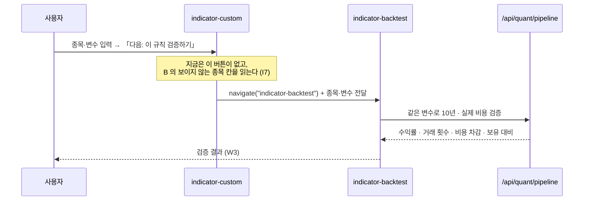

# 와이어프레임 v0.1 — Qurious 2.0 주 경로 (착수)

| 항목 | 내용 |
|------|------|
| **문서 버전** | v0.1 (착수 · 저충실도) |
| **기준 커밋** | `db00327` (main · 2026-09-28) |
| **작성** | 이동원 · 2026-09-28 (S52) |
| **산출물 구분** | 4 화면·서비스 설계 — 강사님 일정표 2차 **5번째 칸(10-06(화) 오전) 「IA·와이어프레임」**의 와이어프레임 쪽 |
| **상태** | 전부 **제안** 🟡 — [IA v0.2](IA_v0.2.md) 2절(TO-BE)과 D1 ③ 이 확정되기 전이다. 「지금」 칸은 브라우저로 본 사실 🟢 |
| **범위** | 공통 틀 2장(데스크톱 · 모바일) + 대표 화면 5장. 주 경로 12개 중 나머지 7개는 4절 표 |
| **관련 문서** | [IA v0.2](IA_v0.2.md) (문제 번호 I1~I15 · 판정 🟢🟡🔴 은 그 문서 1.5~1.6절) · [스크린샷](../img/v0.2/) |

확실도 · 🟢 코드·브라우저로 확인 / 🟡 추론·제안 / 🔴 정정·문제

> **쉬운 요약 3줄**
> 1. 와이어프레임은 화면에 **무엇이 어디 있는지**만 그린 설계도다. 색·글꼴은 뺐다. 이번 판은 모든 화면이 함께 쓰는 **틀**과, 흐름의 칸마다 대표 화면 하나씩(규칙 2 · 검증 1 · 기록 1 · 설정 1)을 그렸다.
> 2. 틀에서 바뀌는 것은 셋이다. **상단 탭 5칸**(1280 폭에서도 다 보이게), **단계 표시**(규칙 → 검증 → 기록 중 지금 어디인지), **「다음 단계」 버튼**(메뉴를 기억하지 않아도 흐름을 따라가게). 모바일은 **하단 탭 4칸**을 더한다.
> 3. 화면 안에서는 **믿을 수 없는 숫자를 먼저 걷어 낸다.** 「5년 +1,268%」 같은 추정치, 가짜 가격의 「연결 성공」, 거래 0회의 「+0.0%」는 빼거나 다르게 표시한다. 장부 문제(I14)는 화면이 아니라 서버를 고쳐야 풀린다.

---

## 0. 읽는 법

**기호**

| 기호 | 뜻 | 기호 | 뜻 |
|------|----|------|----|
| `[ 버튼 ]` | 누르는 것 | `( 입력 )` | 적는 칸 |
| `(선택 ▾)` | 고르는 칸 | `▓▓▓` | 차트·그림 자리 |
| `●━━○━━○` | 단계 표시 (● 지금) | `⚠` | 경고 띠 |
| `┆ … ┆` | 접혀 있는 영역 | `☰` | 메뉴 열기 |

**화면마다 세 덩어리** — ① 지금(브라우저로 본 배치) ② 와이어프레임(바꿀 배치) ③ 바뀌는 것 표(요소 · 지금 · 바꿀 것 · 근거 · 코드 재사용).
픽셀 크기는 뜻이 없다. **순서 · 묶음 · 버튼 위치**만 본다.

---

## 1. 공통 틀

### W0 — 데스크톱 (1280 이상)

```
┌──────────────────────────────────────────────────────────────────────────────────────────┐
│ ◆ Qurious   [규칙 만들기] [검증] [모의투자 기록] [배우기] [더보기 ▾]      (시세 띠*) (S ▾) │
├────────────────────┬─────────────────────────────────────────────────────────────────────┤
│ 규칙 만들기         │  ●━━━━━━━━━━○━━━━━━━━━━○                                            │
│                    │  규칙 만들기   검증        모의투자 기록        ← 단계 표시 (지금: 규칙) │
│ ── 2차 로보어드바이저 │                                                                     │
│  ▸ 자산배분  ◀ 지금  │  ┌ 사용법 (접힘) ──────────────────────────────────────────────┐     │
│  ▸ 종목 스크리닝     │  └──────────────────────────────────────────────────────────────┘     │
│ ── 3차 인디케이터 ┆  │                                                                     │
│  ┆ 기본 전략      ┆  │  ┌ 화면 본문 ───────────────────────────────────────────────────┐     │
│  ┆ 커스텀 지표    ┆  │  │                                                              │     │
│    (10-22 부터)    │  │  │   (화면마다 다름 — 2~3절)                                     │     │
│                    │  │  │                                                              │     │
│                    │  └──────────────────────────────────────────────────────────────┘     │
│                    │                                                                     │
│                    │                          [ ← 이전 단계 ]  [ 다음: 이 배분 검증하기 → ] │
├────────────────────┴─────────────────────────────────────────────────────────────────────┤
│ 투자 자문이 아닌 학습용 · 데이터 출처 · 기준 시각(KST)                                      │
└──────────────────────────────────────────────────────────────────────────────────────────┘
 * 시세 띠(KOSPI · KOSDAQ · USD/KRW)는 1440 미만에서 숨긴다 — 탭 5칸 자리를 만든다
```

| 요소 | 지금 🟢 | 바꿀 것 🟡 | 근거 | 재사용 |
|------|---------|------------|------|:------:|
| 상단 탭 | 9칸 · 1440 에서 5칸만 보임 | **5칸** — 규칙 만들기 · 검증 · 모의투자 기록 · 배우기 · 더보기 | I11 | ✅ `GNB_MENUS` 재배열 · 버튼 HTML |
| 왼쪽 메뉴 | 묶음 안 화면 목록 | **소제목**(2차 / 3차)으로 나누고, 차수 기간 밖은 접는다 | IA v0.2 2.2 · 공식 일정 | 🟡 `renderLnb()` 에 소제목 줄 추가 |
| 단계 표시 | 없음 | 규칙 → 검증 → 기록 3칸, 지금 칸 강조 | I3 · D1 흐름도 | 🔴 새로 (작은 부품 1개) |
| 사용법 안내 | 화면 맨 위에 펼쳐진 띠 | 기본 **접힘** | 본문이 첫 화면에 더 많이 보이게 | ✅ `VIEW_GUIDES` 그대로 |
| 「다음 단계」 줄 | 없음 (화면 사이 링크 0) | 주 경로 화면 끝에 이전 · 다음 버튼 | I3 · 원칙 7 | 🟡 `navigate()` 호출 한 줄씩 |
| 아래 띠 | 회사 정보 + 「… Redis · **MongoDB**」 | 학습용 고지 · 데이터 출처 · **기준 시각 KST** | 1.6 「MongoDB」는 옛 구성 | ✅ 문구만 |

### W0-m — 모바일 (390)

```
┌──────────────────────────────┐
│ ◆ Qurious              (S ▾) │  ← 사용자 메뉴에 로그아웃
├──────────────────────────────┤
│ ●━━━○━━━○  규칙 › 자산배분     │  ← 단계 표시 + 지금 화면 이름
├──────────────────────────────┤
│ ┌ 사용법 (접힘) ───────────┐ │
│ └──────────────────────────┘ │
│                              │
│  화면 본문 — 한 줄로 쌓는다    │
│  (카드 · 표는 가로 스크롤)     │
│                              │
│ [ 다음: 이 배분 검증하기 → ]   │
├──────────────────────────────┤
│ [규칙]  [검증]  [기록]  [☰]   │  ← 하단 탭 4칸 (☰ = 배우기 · 더보기)
└──────────────────────────────┘
      누르면 ↓ 그 묶음의 화면 목록이 아래에서 올라온다
┌──────────────────────────────┐
│ 규칙 만들기                   │
│ ── 2차 로보어드바이저          │
│  자산배분 · 종목 스크리닝       │
│ ── 3차 인디케이터 (10-22 부터) │
└──────────────────────────────┘
```

| 요소 | 지금 🟢 | 바꿀 것 🟡 | 근거 | 재사용 |
|------|---------|------------|------|:------:|
| 메뉴 | **없음** — 탭 줄 폭 0 · 왼쪽 메뉴 숨김 · 여는 버튼 없음 | 하단 탭 4칸 + 목록 시트 | I12 · IA Q7 (a) | 🔴 표시 부품 새로 · 메뉴 표는 `GNB_MENUS` 재사용 |
| 로그아웃 | 화면 밖 | 사용자 메뉴 안 | I12 | ✅ 기존 버튼 옮김 |
| 본문 | 카드가 2열로 줄어듦 ([13](../img/v0.2/13-mobile-390.png)) | 한 열로 쌓기 · 표는 가로 스크롤 | Mobile First | 🟡 CSS |

---

## 2. 규칙 만들기

### W1 — `robo-portfolio` 자산배분 (2차 · 첫 화면 후보) · 지금 판정 🟡

**지금** ([01](../img/v0.2/01-robo-portfolio.png)) — 입력 3칸(성향 · 기간 · 원금) → 「포트폴리오 최적화 실행」 → 자산군 비중 카드 5개 + 막대 → 「AI 추천 종목」 카드 → 「예상 성과 시뮬레이션」 표(1·3·5년).

```
┌ 자산배분 — 내 성향에 맞는 비중 ──────────────────────────────────────────────┐
│ (투자 성향 ▾ 중립)   (투자 기간 ▾ 중기 1~3년)   (투자 원금  5,000 만원)        │
│                                                     [ 비중 계산 ]            │
└──────────────────────────────────────────────────────────────────────────────┘
┌ 결과 ────────────────────────────────────────────────────────────────────────┐
│ 국내주식 30%   해외주식 25%   국내채권 30%   대체 10%   현금 5%                 │
│ ▓▓▓▓▓▓▓▓▓▓▓▓▓▓▓▓▓▓▓▓▓▓▓▓▓▓▓▓▓▓▓▓▓▓▓▓▓▓▓▓▓▓▓▓▓▓▓▓▓▓▓▓ (비중 막대)              │
│ ⓘ 이 비중은 성향별 **고정표**입니다 — 최적화 결과가 아닙니다 (D5 모델 전까지)   │
├──────────────────────────────────────────────────────────────────────────────┤
│ 담을 종목 (스크리닝 결과에서)     종목 · 비중 · 금액 · 고른 근거 한 줄            │
│   … 표 …                                                                     │
├──────────────────────────────────────────────────────────────────────────────┤
│ ⚠ 기대 수익은 여기서 보여 주지 않습니다. 과거 구간 성과는 「검증」에서           │
│   비용을 뺀 값으로 확인하세요.                                                 │
└──────────────────────────────────────────────────────────────────────────────┘
                              [ ← 처음으로 ]  [ 다음: 종목 스크리닝 → ]
```

| 요소 | 지금 🟢 | 바꿀 것 🟡 | 근거 | 재사용 |
|------|---------|------------|------|:------:|
| 버튼 이름 | 「포트폴리오 최적화 실행」 | 「비중 계산」 | 비중은 성향별 고정표(`app.html:3091`) — 최적화가 아니다 | ✅ 글자만 |
| 비중 카드 · 막대 | 있음 | 그대로 + 「고정표」 안내 한 줄 | RTM §4.2 · D3 ⑧ | ✅ |
| 추천 종목 카드 | 「AI 예측 수익률 **300.0%**」 · 신뢰도 0.29 | **예측 수익률 칸을 뺀다.** 고른 근거 한 줄만 | I15 계열 · 비현실 수치 | ✅ 칸 삭제 |
| 예상 성과 표 | 1년 +68.75% · 5년 **+1,268.54%** | **표를 뺀다.** 검증 화면으로 가는 안내로 바꾼다 | 비용·검증 없는 추정치가 첫 화면 첫 결과가 된다(IA 2.4) | 🟡 표 삭제 · 문구 추가 |
| 다음 단계 | 없음 | 「종목 스크리닝 →」 | I3 | 🟡 버튼 1개 |

### W2 — `indicator-custom` 커스텀 지표 (3차) · 지금 판정 🟡

**지금** ([04](../img/v0.2/04-indicator-custom.png)) — 왼쪽 변수(기반 지표 · 단기/중기 이평 · RSI 기간 · 매수/매도 기준) → 「코드 생성」 → Pine · Python 코드 상자 → 「백테스트 실행」 → 결과 카드 4개. 종목 칸이 **이 화면에 없다**(I7).

```
┌ 커스텀 지표 ─────────────────────────────────────────────────────────────────┐
│ ┌ 변수 ──────────────────────┐  ┌ 코드 ───────────────────────────────────┐  │
│ │ (종목  005930 삼성전자)  ◀새│  │ [Pine] [Python]            [ 복사 ]     │  │
│ │ (기반 지표 ▾ RSI+이평)      │  │ ┌──────────────────────────────────┐   │  │
│ │ (단기 5) (중기 20)          │  │ │ //@version=5 …                   │   │  │
│ │ (RSI 14) (매수 35) (매도 65) │  │ │                                  │   │  │
│ │ [ 코드 생성 ]  [ 💾 저장 ]   │  │ └──────────────────────────────────┘   │  │
│ └────────────────────────────┘  └─────────────────────────────────────────┘  │
├──────────────────────────────────────────────────────────────────────────────┤
│ 빠른 확인 (최근 1년)                                                          │
│  거래 0회 ⚠ 이 조건에서는 한 번도 사고팔지 않았습니다 — 기준값을 바꿔 보세요     │
│  (거래가 있으면) 누적 · 샤프 · MDD · 승률 · 거래 횟수                            │
└──────────────────────────────────────────────────────────────────────────────┘
                    [ ← 기본 전략 ]  [ 다음: 이 규칙 검증하기 (종목·변수 넘김) → ]
```

| 요소 | 지금 🟢 | 바꿀 것 🟡 | 근거 | 재사용 |
|------|---------|------------|------|:------:|
| 종목 칸 | **없음** — 보이지 않는 `indicator-backtest` 의 `ibt-symbol` 을 읽는다 | 이 화면에 종목 칸을 둔다 | I7 · `app.html:3404` | 🟡 입력 1개 · 읽는 곳 1줄 |
| 결과 카드 | 거래 0회도 「+0.0% · 샤프 0.00 · 승률 0.0%」 | **거래 횟수를 맨 앞에.** 0회면 숫자 대신 안내문 | I15 ③ · API 는 `trade_count: 0` 을 이미 준다 | ✅ 응답 값 사용 |
| 「백테스트 실행」 | 이 화면에서 결과까지 | 「빠른 확인」으로 이름을 바꾸고, 정식 검증은 다음 단계로 | 검증은 한 곳(원칙 3) | ✅ |
| 다음 단계 | 없음 | 「이 규칙 검증하기」 — **종목·변수를 넘긴다** | I3 · I7 | 🟡 아래 그림 |



---

## 3. 검증 · 기록 · 설정

### W3 — `indicator-backtest` 성과 검증 · 지금 판정 🟢 (뼈대)

**지금** ([05](../img/v0.2/05-indicator-backtest.png)) — (종목 ▾)(전략 ▾)「성과 검증 실행」 → 카드 4개(전략 · 누적 · 샤프 · MDD) → 상세 표(전략 vs 매수 후 보유 · 거래 횟수 · 승률) → 비용 설명 한 줄 → 「비교에 추가」.
**이미 2.0 검증의 요소를 거의 다 갖췄다** — 비용 차감(비용 전 13.22% → 3.70%p 차감), 단순 보유 비교, 「신호는 다음 거래일 수익률에 적용」.

```
┌ 검증 — 이 규칙을 믿어도 되나 ────────────────────────────────────────────────┐
│ 규칙: 커스텀 「RSI+이평 5/20 · 35/65」 (넘겨받음)   [ 규칙 바꾸기 ]             │
│ (종목 005930)  (기간 ▾ 10년)  (비용 ▾ 실제 요율)  (슬리피지 10bp)  [ 검증 ]      │
└──────────────────────────────────────────────────────────────────────────────┘
┌ 한 줄 판정 ──────────────────────────────────────────────────────────────────┐
│ 「이 규칙은 같은 기간 **그냥 들고 있던 것보다 낮았습니다** (+9.5% vs +661%)」     │
└──────────────────────────────────────────────────────────────────────────────┘
┌ 숫자 ────────────────────────────────────────────────────────────────────────┐
│  누적(비용 후)  +9.5%  │ 거래 14회 │ 승률 47% │ 샤프 0.14 │ MDD -41.1%           │
│  비용 전 +13.2% → 비용 3.7%p                                                   │
├──────────────────────────────────────────────────────────────────────────────┤
│ ▓▓▓▓▓▓▓▓▓▓▓▓▓▓▓▓ 누적 곡선: 규칙 ─── / 그냥 보유 ··· ▓▓▓▓▓▓▓▓▓▓▓▓▓▓▓▓▓▓▓▓▓▓▓   │
├──────────────────────────────────────────────────────────────────────────────┤
│ 비교 대상 표  (규칙 · 그냥 보유 · 비용 전/후)            [ 비교에 추가 ]          │
│ ⓘ 신호는 다음 거래일 수익률에 적용 · 슬리피지는 가정값                           │
└──────────────────────────────────────────────────────────────────────────────┘
                 [ ← 규칙 만들기 ]  [ LEAN 으로 교차 확인 ]  [ 다음: 모의투자로 → ]
```

| 요소 | 지금 🟢 | 바꿀 것 🟡 | 근거 | 재사용 |
|------|---------|------------|------|:------:|
| 규칙 출처 | 드롭다운의 기본 전략만 | **넘겨받은 규칙 이름**을 맨 위에 | W2 → W3 연결 | 🟡 |
| 한 줄 판정 | 없음 — 숫자만 | 「그냥 보유보다 높다/낮다」 한 줄 | D1 질문 「믿어도 되나」 · 두 독자(강사님 피드백) | 🟡 응답 값 비교만 |
| 숫자 카드 | 전략 이름 · 누적 · 샤프 · MDD | + **거래 횟수**, 비용 전/후 | I15 ③ 과 같은 규칙 | ✅ 응답에 이미 있음 |
| 누적 곡선 | 없음 (들어가면 차트 0개 — 1.5절) | 규칙 vs 보유 두 줄 | 응답에 `cum_returns` · `bh_returns` 가 이미 있다 | 🟡 ApexCharts 이미 로드됨 |
| 비용 설명 | 한 줄 문장 | 숫자 칸으로 올림 | 비용 차감이 2.0 의 핵심(계획서 ㉯) | ✅ |
| 다음 단계 | 없음 | LEAN 교차 확인 · 모의투자로 | I3 | 🟡 |

### W4 — `paper-dashboard` 모의투자 기록 · 지금 판정 🔴

**지금** ([10](../img/v0.2/10-paper-dashboard.png)) — 카드 6개(보유 현금 · 주식 · 코인 · 대체자산 · 총 자산 · 총 손익) → 「최근 체결」 표(시각 · 구분 · 종목 · 매매 · 수량 · 단가 · 금액 · 출처). 자동매매 매수가 현금에서 빠지지 않아 **총 손익 +3.19%** 가 없는 수익이다(I14).

```
┌ 모의투자 기록 ───────────────────────────────────────────── [ 새로고침 ] [ 초기화 ] ┐
│ ⚠ 장부 점검: 현금 + 보유 평가 = 총자산 이 맞지 않으면 여기 빨간 띠 (I14 재발 감시)   │
├──────────────────────────────────────────────────────────────────────────────────┤
│ 시작 자금 100,000,000 │ 현금 │ 보유 평가 │ 총자산 │ 손익(비용 후) │ 쌓은 거래일 N일    │
├──────────────────────────────────────────────────────────────────────────────────┤
│ 규칙별 보기   (전체 ▾ / 수동 / 자동매매 「RSI+이평」 / …)                           │
├──────────────────────────────────────────────────────────────────────────────────┤
│ 일지 — 시각(KST) · 출처 · 규칙 · 종목 · 매매 · 수량 · 단가 · 비용 · 근거  (아래는 예시)│
│  10:34  자동  RSI+이평  SK하이닉스  매수  1  1,791,000  (비용)  RSI 중립 52.1 · 이평 ↑ │
│  10:35  수동  —         삼성전자    매수  2    275,250    97원   (직접 주문)          │
├──────────────────────────────────────────────────────────────────────────────────┤
│ 보유 종목 — 종목 · 수량 · 평균단가 · 현재가 · 평가 · 손익                              │
└──────────────────────────────────────────────────────────────────────────────────┘
                                    [ ← 검증 ]  [ 다음: 해석 보고 (N6 · 예정) → ]
```

| 요소 | 지금 🟢 | 바꿀 것 🟡 | 근거 | 재사용 |
|------|---------|------------|------|:------:|
| 현금 · 총 손익 | 자동매매 매수가 현금에 반영 안 됨 → **+3.19%** | **서버에서 장부를 하나로**(자동매매도 `paper_accounts` 현금 사용) | I14 · `paper_trading.py:704-723` | 🔴 서버 수정 |
| 장부 점검 띠 | 없음 | 현금 + 보유 평가 − 시작 자금 = 손익이 **체결 합계와 맞는지** 매번 확인해 틀리면 빨간 띠 | 같은 버그가 다시 조용히 생기지 않게 | 🟡 |
| 코인 · 대체자산 카드 | 늘 0원 (둘 다 동결 화면) | 2.0 에서는 뺀다(보관함 화면에서만) | D1 ③ 동결 제안 | ✅ 카드 숨김 |
| 쌓은 거래일 | 없음 | 「N일」 — 일지를 며칠 쌓았는지 | 공식 일정상 10-14~10-20 최대 5거래일 · 대장 §5 ① | 🟡 |
| 일지 | 「최근 체결」 8칸 · 출처 `QUANT`/`PAPER` | + **규칙 이름 · 비용 · 근거** · 시각 KST | 판단 근거가 로그에만 있다 · 로그는 UTC(1.5절 8행) | 🟡 주문 표에 비용 칸은 이미 있다(`order_fields`) |
| 규칙별 보기 | 없음 | 규칙마다 걸러 보기 | 2.0 질문이 「이 규칙」 단위 | 🟡 |

### W5 — `settings` 연결 설정 (더보기) · 지금 판정 🔴

**지금** ([11](../img/v0.2/11-settings.png)) — 투자 모드(모의/실전) · 종목 선택 방식 · 증권사(Mockup/KIS/…) · 키 3칸 · 모의 체크 · 자동매매 값 4칸 · 「저장/연결」 「연결 테스트」. Mockup 상태에서 「✅ 연결 성공 – 현재가 75,496원」(실제 275,250원).

```
┌ 연결 설정 — 모의투자 전용 ───────────────────────────────────────────────────┐
│ ⓘ Qurious 2.0 은 모의투자만 합니다. 실계좌 주문은 서버에서 막혀 있습니다.       │
├──────────────────────────────────────────────────────────────────────────────┤
│ (증권사 ▾  연결 안 함 / 한국투자증권 모의)                                      │
│   ┆ 한국투자증권 모의를 고르면: (App Key) (App Secret) (모의 계좌번호) ┆         │
│                                         [ 저장 ]  [ 연결 테스트 ]              │
│ 연결 상태:  ○ 연결 안 함 — 앱 안의 모의계좌로만 거래합니다                       │
│            ● 연결됨 — 한국투자증권 모의 · 삼성전자 275,250원 (09:12 KST)         │
│            ✕ 실패 — 이유                                                       │
├──────────────────────────────────────────────────────────────────────────────┤
│ 자동매매 값 (종목 수 · 1회 금액 · 매수/매도 비중)  → 「모의투자 기록」 쪽으로 옮김  │
└──────────────────────────────────────────────────────────────────────────────┘
```

| 요소 | 지금 🟢 | 바꿀 것 🟡 | 근거 | 재사용 |
|------|---------|------------|------|:------:|
| 투자 모드 | 「모의 / **실전(Live)**」 선택지가 보인다 | 선택지를 없애고 안내 한 줄 | D7 ① L1 — 서버 관문은 이미 막혀 있다 ✅ | ✅ HTML 삭제 |
| Mockup | 「Mockup (테스트)」을 고르면 가짜 가격으로 「연결 성공」 | 이름을 **「연결 안 함」**으로 · 상태는 ○ | I15 ① | 🟡 표시 로직 |
| 연결 상태 | `settings` = 성공 · `indicator-api` = 미연결 (같은 설정) | 상태 3가지(안 함 · 연결됨 · 실패)를 **한 함수**로 판정, 두 화면이 같이 쓴다 | I4 · 1.5절 11·12행 | 🟡 |
| 증권사 목록 | Mockup + 7곳(KIS · KB · LS · 키움 · 대신 · 메리츠(출시 예정) · 신한) | 2.0 에서 쓰는 1곳(한국투자증권 모의)만 메뉴에 | 어댑터 파일은 7곳 다 있다(`app/services/brokers/`). 체결을 **실제로 대조한 곳은 KIS 모의 1곳**뿐이다(계획서 분석 방법 ⑥) | ✅ 목록 줄임 · 어댑터는 그대로 |
| 연결 테스트 호출 | 한 번 눌러 2번 | 1번 | 중복 리스너 `app.html:4559` · `:4572` | ✅ 한 줄 삭제 |
| 자동매매 값 | 연결 설정 안에 | 「모의투자 기록」의 자동매매 쪽으로 | 설정과 규칙 실행 값을 나눈다 | 🟡 |

---

## 4. 나머지 7개 — 다음 판에서 그린다

| 화면 | 묶음 (v0.2 안) | 지금 판정 | 와이어프레임에서 바꿀 것 (요지) |
|------|----------------|:---------:|--------------------------------|
| `robo-screening` | 규칙 만들기 · 2차 | 🟢 | 불러오는 중 표시(8초 넘게 빈 칸) · 「이 종목으로 배분」 → W1 |
| `indicator-strategy` | 규칙 만들기 · 3차 | 🟢 | 「이 전략을 커스텀으로 가져가기」 → W2 |
| `quant-lean` | 검증 | 🟡 | W3 의 「LEAN 으로 교차 확인」 대상 — 같은 규칙·기간으로 열리게. 엔진(LEAN/pandas) 표시를 맨 위로 |
| `quant-backtest` | 검증 (숨김 후보) | 🔴 | 백테스트가 생기기 전까지 메뉴에서 뺀다(IA 2.2) — 제목 「10년 Mockup」 |
| `robo-decision` | 모의투자 기록 | 🟡 | 근거 카드를 엔진의 실제 근거로(I15 ②) · 로그 시각 KST · 자동매매 값(W5 에서 옮김) |
| `paper-stock` | 모의투자 기록 | 🟢 | 빈 종목 칸 안내 · 주문 뒤 「기록 보기 →」 W4 |
| `indicator-api` | 더보기 · 연결 설정 | 🟡 | W5 와 합친다(설정 한 행을 두 화면이 나눠 가질 까닭이 없다 — IA Q4) |

---

## 5. 한계 · 다음 판

- **저충실도다.** 크기·간격·색은 정하지 않았다. 디자인 시스템(색·글꼴)은 이 문서 밖이다.
- 「지금」 칸은 1440 × 900 브라우저 확인 기준이다([IA v0.2](IA_v0.2.md) 1.5절 조건 — 증권사 키 없음 · LEAN 없음).
- 2차 검증 화면(N2 · 포트폴리오 검증)은 **그리지 않았다** — D5 가 모델을 정한 뒤다(IA Q5).
- **다음 판(v0.2)**: 나머지 7개 · N2 · 모바일 본문 배치 · D1 ③ 확정 반영. 목표는 10-06(화) 오전 칸 전.
