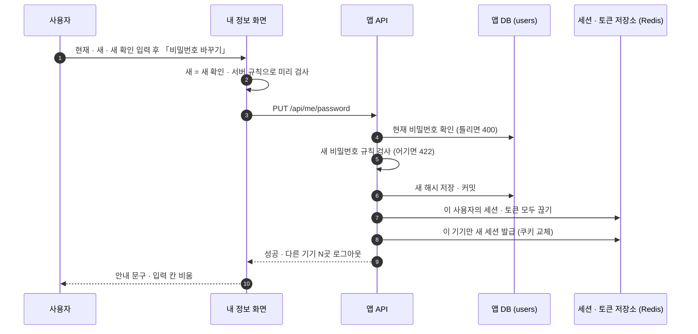
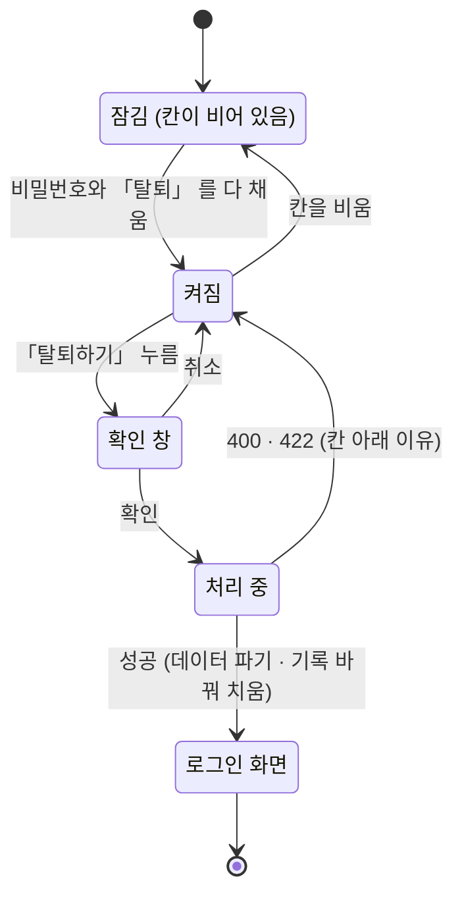
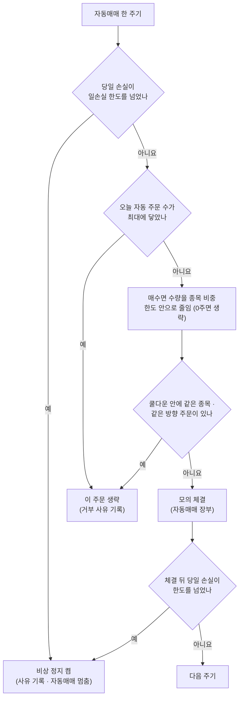

# 와이어프레임 v0.3 — Qurious

| 문서 정보 | |
|---|---|
| **판 · 상태** | v0.3 · 초안(검토 전) |
| **구분** | 4. 화면·서비스 설계 — 와이어프레임(저충실도) · 화면 한 장 명세(내 정보) |
| **작성** | 이동원(데이터 · 문서) |
| **검토** | 검토 전 |
| **최종 수정** | 2026-09-30 (KST) |
| **기준** | 코드 `main` `92087da` + 화면 스캐너 결과(화면 53) · 내 정보(`mypage`)는 같은 날 작업 사본(커밋 전)을 읽었다 · 예시 숫자는 2026-09-28 브라우저 확인 값이거나 「예시」 라고 적은 값 |
| **관련 문서** | [IA v0.3](IA_v0.3.md)(화면 번호 · 판정 · 문제 번호 I1 ~ I22) · [와이어프레임 v0.2](와이어프레임_v0.2.md)(W1 ~ W12 데스크톱) · [기능별 동작 원리서 v0.1](../../설계/기능동작원리.md) 2절(가입 · 로그인) · [계정 CRUD 점검 이슈 초안](../../github-archive/2026-09-30/이슈-계정-CRUD-점검/00-본문.md) · [강사님 기초 코드 반영 논의 초안](../../github-archive/2026-09-30/논의-강사님최신-반영/00-본문.md) · [API 명세서 v0.1](../../인터페이스/지난판/API명세서_v0.1.md) |
| **최근 개정** | v0.2 → v0.3: 새 화면 6장(내 정보 · 리밸런싱 · 위험 한도 · TradingView · 수식 지표 · 차트 패턴) · N2 첫 틀 · 주 경로 모바일 본문 4장 — 전체는 부록 D |

> **이 문서가 답하는 질문**
> 1. 새로 생긴 화면(내 정보 · 강사님 기초 코드로 들어온 다섯 곳)은 무엇이 어디에 있고, 2.0 흐름에 맞추려면 무엇을 바꾸나?
> 2. 주 경로 화면은 휴대폰 폭(390)에서 어떻게 쌓이나?
> 3. 2차 규칙을 검증할 화면(N2)은 어떤 모양으로 시작하나?
> 4. 지난 판에서 그린 12장 중 무엇이 그대로이고 무엇을 다시 봐야 하나?
>
> **읽는 순서** — 팀원: 요약 → 내 파트 화면의 절(2 ~ 4) → 6절 표 · 화면 담당: 0절 → 2절(화면 한 장 명세의 본보기) → 5절 모바일 · 강사님: 요약 → 2절 → 4절 N2 · 처음 온 사람: 0절 → 부록 A → 2절

## 요약

1. 저충실도 와이어프레임이다 — 배치 · 순서 · 버튼 위치만 정하고 색 · 글꼴 · 크기는 정하지 않는다. 이 판은 새 화면 6장 · N2 첫 틀 1장 · 주 경로 모바일 본문 4장(W1 · W3 · W4 · W10)을 그렸고, 지난 판 12장은 그대로 쓰되 코드가 바뀐 곳만 6절에 적었다.
2. 내 정보(W13)는 화면 한 장 명세의 칸(목적 · 진입 · 요소 표 · 입력 검증 · 빈 데이터 · 오류)을 모두 채운 첫 화면이다. 이름 · 비밀번호 바꾸기 · 모든 기기에서 로그아웃 · 탈퇴(현재 비밀번호 + 「탈퇴」 입력)를 한 화면에 둔다.
3. 위험 한도는 지금 두 화면(연결 설정 · 동결 제안 `quant-auto`)에 나뉘어 있어, 주 경로 자동매매 화면(W10) 위쪽 띠로 모으자고 제안한다. 모든 배치는 D1 ③ · 💬 Q8([IA v0.3](IA_v0.3.md) 10절)이 정해지기 전의 **제안**이다.

---

## 0. 읽는 법

표 1 은 「와이어프레임의 기호는 무슨 뜻인가」 에 답한다.

**표 1. 기호**

| 기호 | 뜻 | 기호 | 뜻 |
|---|---|---|---|
| `[ 버튼 ]` | 누르는 것 | `( 입력 )` | 적는 칸 |
| `(선택 ▾)` | 고르는 칸 | `▓▓▓` | 차트 · 그림 자리 |
| `●━━○━━○` | 단계 표시(● 지금) | `⚠` · `ⓘ` | 경고 · 안내 |
| `┆ … ┆` | 접혀 있는 영역 | `☰` | 메뉴 열기 |
| `____` | 정하지 않은 값 · 결정 뒤 채울 값 | `⛔` | 되돌릴 수 없는 위험 구역 |
| `?` | D1 ③ 미분류 화면 | `(새)` | 아직 ID 가 없는 새 API |

기호를 알면 그림을 읽을 수 있다. 픽셀 크기는 뜻이 없으니 순서 · 묶음 · 버튼 위치만 본다.

**화면마다 세 덩어리** — ① 지금(코드 · 브라우저로 본 배치) ② 와이어프레임(바꿀 배치) ③ 바뀌는 것 표(요소 · 지금 · 바꿀 것 · 근거 · 코드 재사용). 새 화면(W13)은 문서 작성 기준 5.4절의 「화면 한 장의 칸」 을 모두 채운다.

**번호** — W 는 와이어프레임을 그린 화면의 번호이고 한 번 붙이면 바꾸지 않는다. 이 판에서 W13 ~ W18 을 새로 붙였다. N 은 코드에 없는 새 화면 후보의 번호다([IA v0.3](IA_v0.3.md) 5절). 그림의 폭은 70자 안쪽이고, 한글 폭이 글꼴마다 달라 오른쪽 테두리는 그리지 않는다.

표 2 는 「이 판에 무엇을 그렸나」 에 답한다.

**표 2. 이 판에 그린 화면**

| 번호 | 화면 | 절 | 데스크톱 | 모바일 | 상태 |
|---|---|---|:-:|:-:|---|
| W0 | 공통 틀 — 머리글 사용자 메뉴 | 1 | ✅ 바뀐 곳만 | — | 제안 |
| W13 | `mypage` 내 정보 | 2 | ✅ | ✅ | 구현 중 🟡 · 제안 일부 |
| W14 | `robo-rebalance` 리밸런싱 | 3.1 | ✅ | — | 제안 |
| W15 | 위험 한도(`quant-auto` · `settings` → W10) | 3.2 | ✅ | ✅ | 제안 |
| W16 | `indicator-tradingview` TradingView | 3.3 | ✅ | — | 제안 |
| W17 | `indicator-formula` 수식 지표 | 3.4 | ✅ | — | 제안 |
| W18 | `robo-patterns` 차트 패턴 | 3.5 | ✅ | — | 제안 |
| N2 | 포트폴리오 검증(새 화면 후보) | 4 | ✅ | — | 제안 · D5 뒤 확정 |
| W1 · W3 · W4 | 주 경로 대표 3장 | 5 | 지난 판 | ✅ | 제안 |

데스크톱은 새 화면 6장(W13 ~ W18)과 N2 틀 1장을 그렸고, 모바일은 대표 5장(W13 · W10 · W1 · W3 · W4)만 그렸다.

---

## 1. 공통 틀 — 머리글 사용자 메뉴

공통 틀(데스크톱 W0 · 모바일 W0-m)은 [와이어프레임 v0.2](와이어프레임_v0.2.md) 1절 그대로다. 바뀐 곳은 머리글 오른쪽의 사용자 영역뿐이다.

그림 1 은 「머리글 오른쪽의 이름 · 로그아웃 · 더보기는 지금 어떻고, 무엇으로 바꾸자고 하나」 에 답한다.

**그림 1. 머리글 오른쪽 — 지금 · 추가 작업 · 제안**

```text
지금 (92087da)
 (시세 띠) (● 동기화) [U] 홍길동  [로그아웃]  [⋮]
   · 이름 · 아바타는 눌러도 반응이 없다
   · ☰ 버튼은 코드에 있지만 늘 숨어 있다 (I12)

2026-09-30 추가 (작업 사본)
 (시세 띠) (● 동기화) [홍] 홍길동  [로그아웃]  [⋮]
                      └ 누르면 W13 내 정보
   [⋮] 더보기 → 금융 지식 · 시스템 · 내 계정

제안 (2.0)
 (시세 띠*) (홍 ▾)
            ├ 내 정보
            └ 로그아웃
   * 1440 미만에서 숨긴다 · 모바일도 같은 자리
```

제안은 이름 · 로그아웃을 사용자 메뉴 하나로 모아, 데스크톱과 모바일이 같은 자리에서 내 정보와 로그아웃을 찾게 하는 것이다.

표 3 은 「머리글 요소마다 무엇이 바뀌나」 에 답한다.

**표 3. 머리글 — 바뀌는 것** · 재사용 ✅ 글자 · 위치만 / 🟡 작은 수정 / 🔴 새 부품

| 요소 | 지금 🟢 | 추가 작업 🟡 | 제안 | 근거 | 재사용 |
|---|---|---|---|---|:-:|
| 이름 · 아바타 | 글자만 | 누르면 내 정보 | 사용자 메뉴(▾)의 머리 | IA 원칙 8 | 🟡 |
| 로그아웃 | 머리글 버튼 · 누르면 `/` 로 | 기록 바꿔 치우기로 로그인 화면 | 사용자 메뉴 안 — 모바일에서도 보이게 | I12 | ✅ |
| 더보기 ⋮ | 금융 지식 · 시스템 | + 내 계정 | 상단 탭 다섯째 칸 「더보기 ▾」 로 옮기고 ⋮ 는 뺀다 | IA 그림 3 | ✅ |
| ☰ | 늘 숨김 | 그대로 | 모바일 하단 탭의 ☰ | I12 · IA 3.5 | 🔴 |

새 부품은 모바일 하단 탭 하나이고, 나머지는 자리를 옮기는 일이다.

---

## 2. 새 화면 — W13 내 정보 (`mypage`) · 2026-09-30 추가

### 2.1 화면 카드

표 4 는 「이 화면은 무엇을 위해 있고, 어디서 와서 어디로 가나」 에 답한다.

**표 4. W13 화면 카드**

| 칸 | 내용 |
|---|---|
| 화면 ID · 이름 | W13 · `mypage` · 내 정보(마이페이지) — 주소 `app.html#mypage` |
| 목적 (사용자 질문) | 「내 계정은 어떤 정보로 돼 있고, 이름 · 비밀번호를 바꾸거나 모든 기기에서 나가거나 탈퇴하려면 어떻게 하나?」 |
| 진입 | 머리글 이름 · 아바타 · 더보기 › 내 계정 › 내 정보 · 주소 직접 |
| 다음 화면 | 이름 · 비밀번호 바꾸기 → 이 화면(이 기기는 로그인 유지) · 모든 기기 로그아웃 · 탈퇴 → 로그인 화면(기록을 바꿔 치움) · 흐름도는 [IA v0.3](IA_v0.3.md) 그림 5 |
| 관련 요구 · 파트 | 요구 ID 없음 — RTM 다음 판에 추가 제안(IA v0.3 부록 C) · 계정 CRUD 점검 A-1 · A-4 · A-5 · A-6 · 파트 P-E 안전 · 실행 · 운영(역할 분배안 v1.0 · 제안) |
| 분류 | 계정 — D1 ③ 네 분류 밖 |
| 상태 | 구현 중(작업 사본 · 커밋 전) 🟡 — 아래 그림 · 표는 작업 사본의 배치에 제안 셋(오류를 칸 아래에 · 탈퇴 버튼 잠금 · 탈퇴 구역 접기)을 더했다 |

이 화면은 2.0 흐름(규칙 → 검증 → 기록)에 들지 않는 계정 화면이라 메뉴 묶음 대신 머리글과 더보기에서 연다.

### 2.2 데스크톱

그림 2 는 「내 정보 화면의 칸이 어떤 순서로 놓이나」 에 답한다.

**그림 2. W13 내 정보 — 데스크톱** · 값은 예시

```text
머리글 … [홍] 홍길동 ◀ 누르면 이 화면   [로그아웃] [⋮]
┌ 👤 내 정보 ─────────────────────────────────────
│ ① 내 정보
│   이름     홍길동
│   이메일   hong@example.com
│            ⓘ 로그인 ID · 대소문자 구분 없음 · 바꿀 수 없음
│   가입일   2026-09-30          역할   일반 사용자
├─────────────────────────────────────────────────
│ ② 이름 바꾸기
│   ( 새 이름 · 50자 이하          )          [ 저장 ]
├─────────────────────────────────────────────────
│ ③ 비밀번호 바꾸기
│   ( 현재 비밀번호 )
│   ( 새 비밀번호   )   ( 새 비밀번호 확인 )
│   ⓘ 8자 이상 · 64자 이하 · 72바이트(한글 24자) 이하
│     흔한 비밀번호 · 같은 글자 반복 · 이메일(@ 앞부분)과
│     같은 비밀번호는 쓸 수 없습니다
│   ⚠ 바꾸면 이 기기를 뺀 다른 기기는 모두 로그아웃됩니다
│                                 [ 비밀번호 바꾸기 ]
├─────────────────────────────────────────────────
│ ④ 로그인된 기기   지금 3곳 (이 기기 포함)
│                           [ 모든 기기에서 로그아웃 ]
└─────────────────────────────────────────────────
┌ ⛔ 회원 탈퇴 — 되돌릴 수 없습니다 ──────────────
│ · 모의투자 · 자동매매 장부, 주문 · 체결 기록,
│   리밸런싱 계획, 저장한 지표, 증권사 · 알림 설정,
│   API 키가 즉시 모두 삭제됩니다
│ · 감사 기록은 누구였는지 지운 채 남습니다
│ · 같은 이메일로 다시 가입하면 빈 장부의 새 계정입니다
│ ( 현재 비밀번호 )   ( 확인 — 「탈퇴」 라고 입력 )
│              [ 탈퇴하기 ]  ← 두 칸을 채워야 켜진다
└─────────────────────────────────────────────────
  오류는 칸 바로 아래에 남는 글로 보인다 (제안)
```

칸은 위험이 낮은 것부터 높은 것 순서(보기 → 이름 → 비밀번호 → 기기 → 탈퇴)로 놓고, 탈퇴는 테두리가 다른 위험 구역으로 떼어 실수로 누르기 어렵게 한다.

### 2.3 모바일 (390)

그림 3 은 「같은 화면이 휴대폰에서는 어떻게 쌓이나」 에 답한다.

**그림 3. W13 내 정보 — 모바일** · 값은 예시

```text
┌──────────────────────────────
│ ◆ Qurious            (홍 ▾)
├──────────────────────────────
│ 더보기 › 내 계정 › 내 정보
│ ① 홍길동
│    hong@example.com
│    로그인 ID · 바꿀 수 없음
│    가입 2026-09-30 · 일반 사용자
│ ─────────────────────────
│ ② 이름 바꾸기
│ ( 새 이름                   )
│ [           저장           ]
│ ─────────────────────────
│ ③ 비밀번호 바꾸기
│ ( 현재 비밀번호             )
│ ( 새 비밀번호               )
│ ( 새 비밀번호 확인          )
│ ⓘ 8 ~ 64자 · 72바이트 이하
│   ┆ 규칙 전체 보기 ┆
│ [      비밀번호 바꾸기      ]
│ ─────────────────────────
│ ④ 로그인된 기기 3곳
│ [   모든 기기에서 로그아웃   ]
│ ─────────────────────────
│ ┆ ⛔ 회원 탈퇴 ┆ 누르면 펼침
├──────────────────────────────
│ [규칙]  [검증]  [기록]  [☰]
└──────────────────────────────
```

모바일에서는 입력 칸을 한 줄에 하나씩 두고, 비밀번호 규칙과 탈퇴 구역을 접어 첫 화면에 보기 · 이름 · 비밀번호가 먼저 보이게 한다.

### 2.4 요소 표

표 5 는 「칸마다 어떤 API 를 부르고, 무엇을 검사하며, 비었거나 틀렸을 때 무엇을 보이나」 에 답한다.

**표 5. W13 요소** · API ID = [API 명세서 v0.1](../../인터페이스/지난판/API명세서_v0.1.md)의 대장 번호 · (새) = 구현 PR 에서 대장에 붙일 번호 · 작업 사본 기준 🟡

| 요소 | 종류 | 데이터 출처 (API ID) | 동작 | 입력 검증 | 빈 데이터 | 오류 표시 |
|---|---|---|---|---|---|---|
| ① 내 정보 | 읽기 | `GET /api/me` (API-AUTH-07) | 들어오면 부른다 · 세션 사본이 아니라 DB 의 지금 값 | — | 가입일이 없는 옛 계정 → 「—」 | 실패 → 「내 정보를 불러오지 못했습니다」 안내 |
| ② 이름 바꾸기 | 입력 1 · 버튼 | `PATCH /api/me` API-AUTH-12 | 저장 → ① 과 머리글 이름이 바로 바뀐다 · 다른 기기 세션의 이름도 바뀐다 | 앞뒤 공백을 떼고 겹친 공백은 하나로 · 1 ~ 50자 | — | 422 → 칸 아래 이유 |
| ③ 비밀번호 바꾸기 | 입력 3 · 버튼 | `PUT /api/me/password` API-AUTH-13 · 규칙 `GET /api/auth/password-policy` API-AUTH-11 | 성공 → 「다른 기기 N곳 로그아웃」 안내 · 이 기기는 새 세션으로 유지 | 화면 — 새 = 새 확인 · 서버가 내려준 규칙 · 서버 — 현재 비밀번호 재확인 · 규칙 · 지금과 다름 | — | 400 현재 비밀번호 틀림 → 현재 칸 아래 · 422 규칙 → 새 칸 아래 |
| ④ 로그인된 기기 | 읽기 | `GET /api/sessions` (API-AUTH-08) | 세션 수를 「N곳」 으로 | — | 못 받으면 「—」 · 화면은 그린다 | — |
| ④ 모든 기기에서 로그아웃 | 버튼 + 확인 창 | `DELETE /api/sessions` (API-AUTH-10) | 확인 → 이 기기를 포함한 모든 세션 끊기 → 로그인 화면(기록 바꿔 치움) | — | — | 실패 → 안내 · 화면 그대로 |
| ⑤ 회원 탈퇴 | 입력 2 · 버튼 + 확인 창 | `DELETE /api/me` API-AUTH-14 | 확인 → 사용자 데이터 파기(한 트랜잭션) → 세션 · 토큰 · 쿠키 삭제 → 로그인 화면 | 「탈퇴」 를 정확히 · 현재 비밀번호 필수 — 둘 다 채워야 버튼이 켜진다(제안) | — | 400 비밀번호 틀림 · 422 확인 문구 → 칸 아래 |

API 는 일곱 개이고 그중 넷(수정 · 비밀번호 · 탈퇴 · 규칙)이 새것이다. 규칙은 서버가 한 곳에서 내려주므로, 가입 화면과 이 화면이 같은 값으로 안내 · 검사한다.

### 2.5 비밀번호 바꾸기 · 탈퇴의 차례

그림 4 는 「비밀번호를 바꾸면 누가 무엇을 어떤 차례로 하나」 에 답한다.

**그림 4. 비밀번호 바꾸기 차례** · 작업 사본 기준 🟡



DB 를 먼저 커밋한 뒤 세션을 끊는다. 세션을 먼저 끊고 DB 가 실패하면 「로그아웃만 되고 아무것도 안 바뀐」 상태가 되기 때문이다. 이 기기는 세션 ID 를 새로 받아 로그인이 이어진다.

그림 5 는 「탈퇴 버튼은 어떤 상태를 거쳐 끝나나」 에 답한다.

**그림 5. 탈퇴 버튼 상태** · 잠김 · 켜짐은 제안(작업 사본은 버튼이 늘 켜져 있고 문구가 틀리면 안내를 띄운다)



탈퇴는 입력 두 칸 → 버튼 → 확인 창의 세 번을 거쳐야 실행된다. 실패하면 입력을 지우지 않고 켜짐 상태로 돌아가 이유만 보인다.

### 2.6 💬 이 화면에서 정할 것

표 6 은 「내 정보 화면에서 팀이 정해야 할 것은 무엇인가」 에 답한다.

**표 6. W13 에서 정할 것** · 추천은 작성자 제안 · 근거의 🟡 는 원문 재확인 권장

| # | 질문 | 선택지 | 추천 (미확정) | 근거 |
|---|---|---|---|---|
| W13-① | 비밀번호 최소 길이 | 8자(지금 가입 화면) · 15자 | 8자로 시작하고 설정 `PASSWORD_MIN_LENGTH` 로 바꿀 수 있게 둔다(작업 사본 그대로) | NIST SP 800-63B-4 는 다중 인증이 없는 비밀번호에 15자 이상을 요구한다 🟡 · 수업 시연 편의 |
| W13-② | 이메일(로그인 ID) 바꾸기 | 막는다 · 확인 메일 뒤 허용 | 막는다 — 메일 발송 기능이 생기면 다시 본다 | 새 주소로 확인 메일을 보내는 것이 관행 · 발송 기능 없음 |
| W13-③ | 탈퇴 즉시 파기 · 유예 | 즉시 · 일정 기간 유예(되돌리기) | 즉시 — 모의 데이터뿐이고 되돌리기 기능을 만들 칸이 없다 | 개인정보 보호법 제21조(지체 없는 파기) — 법률 해석이 아니다 🟡 |
| W13-④ | 오류 표시 | 토스트(4초) · 칸 아래 남는 글 | 칸 아래 — 무엇이 틀렸는지 입력 옆에 남게 | 지난 판 W11 빈 종목 안내와 같은 규칙 |

넷 모두 화면 배치는 바꾸지 않고 규칙 · 문구만 바꾸는 결정이라, 구현 뒤에 정해도 된다.

---

## 3. 강사님 기초 코드로 생긴 화면

강사님 기초 코드 `b055ab0` 반영(2026-09-30)으로 다섯 곳이 생겼다 — 리밸런싱(W14) · 위험 한도(W15 — 화면이 아니라 두 화면의 칸) · TradingView(W16) · 수식 지표(W17) · 차트 패턴(W18). 모두 D1 ③ 미분류라 자리는 💬 Q8 에서 정한다. 코드에는 강사님 시험이 붙어 있지만 브라우저로는 아직 누르지 않았다 🟡.

### 3.1 W14 리밸런싱 (`robo-rebalance`)

**지금** 🟢 코드 — 머리 카드(「트리거 지금 점검」 · 「새로고침」 · 숫자 4칸 · 트리거 배지) → 왼쪽 「목표 비중 플랜」(이름 · 종목 · 비중 · 「보유 비중 불러오기」 · 트리거 ① 시간 ② 이탈률 ③ 입출금 · 배당 · 최소 주문금액 · 자동 체결 · 활성화 · 「플랜 저장」) | 오른쪽 「현재 비중 vs 목표 비중」 차트 · 표 → 「주문 제안 · 수동 실행」(「주문 산출」 · 「제안 체결」) | 「입금 · 출금 · 배당 이벤트」 → 「실행 이력」. 설명 문구는 「스케줄러가 1시간마다 시간 · 이탈률 조건을 점검」 이다.

그림 6 은 「리밸런싱 화면을 2.0 흐름(배분 → 검증 → 모의 운용 → 기록)에 맞추면 어떻게 놓이나」 에 답한다.

**그림 6. W14 리밸런싱 — 제안** · 값 칸(`__`)은 D5 결정 뒤 채운다

```text
┌ 리밸런싱 — 목표 비중으로 되돌리기 ────── [ 지금 점검 ]
│ 총자산 ____ · 현금 비중 __% (목표 __%) · 최대 이탈 __%p
│ 다음 확인 ____ (매월 1일)   ● 이탈 초과   · 제안만 만듦
├ 목표 비중 ─────────────────────────────────────
│ 가져오기 [ 자산배분(W1) 결과 ] [ 지금 보유 비중 ]  ◀ 새
│ 종목             목표     지금     차이
│ 국내주식 ETF     30%      27%      -3%p
│ 국내채권 ETF     30%      33%      +3%p
│ …
│ 합계 100%  ⓘ 합이 100% 가 아니면 저장하지 않는다
├ 규칙 ──────────────────────────────────────────
│ (주기 ▾ 매월 1일)   (허용 이탈 ☑ 5 %p)
│ (현금흐름 ☐ ____원 이상)   (최소 주문 ____원)
│ ☐ 조건이 되면 자동 체결 (끄면 제안만 만든다)
│ ⓘ 기본값 = 월 1회 확인 + 5%p 밴드 (D5 ③ 안 · 확정 전)
│                                      [ 규칙 저장 ]
├ 주문 제안 ───────────────── [ 주문 계산 ] [ 제안 체결 ]
│ 매도 → 매수 순   종목 · 수량 · 금액 · 비용(세금 · 수수료)
│ ⓘ 모의투자 장부(PAPER · 1억 원)에서 체결된다
├ ┆ 입금 · 출금 · 배당 이벤트 ┆ (접힘)
├ 실행 이력 — 「모의투자 기록」 일지에도 같은 줄로
└
 [ ← 자산배분 ]  [ 이 비중 검증 (N2) ]  [ 다음: 기록 보기 → ]
```

화면의 칸은 그대로 두고, 목표 비중을 W1 에서 가져오는 버튼 · D5 ③ 기본값 · 주문 제안의 비용 칸 · 다음 단계 버튼을 더하는 안이다.

표 7 은 「리밸런싱 화면에서 요소마다 무엇을 바꾸나」 에 답한다.

**표 7. W14 — 바뀌는 것** · 재사용 ✅ 그대로 · 글자 / 🟡 작은 수정 / 🔴 새로 / 💬 결정 필요

| 요소 | 지금 🟢 | 바꿀 것 🟡 | 근거 | 재사용 |
|---|---|---|---|:-:|
| 목표 비중 출처 | 직접 입력 · 「보유 비중 불러오기」 | + 「자산배분(W1) 결과 가져오기」 — 자산군마다 대표 ETF 대응표가 먼저 | 2차 흐름 W1 → W14 · D5 ① 투자 대상 | 🟡 |
| 트리거 기본값 | 화면에서 고른다 | 월 1회 확인 + 5%p 밴드 | D5 ③ 안(⏳ 1/4) | ✅ |
| 점검 주기 | 1시간마다(Celery 예약 작업) | 매일 데이터 갱신 뒤 한 번으로 볼지 | 강사님 반영 논의 ⑧ | 💬 |
| 주문 제안 | 매도 → 매수 주문 계산 · 「제안 체결」 | 비용(세금 · 수수료 · 슬리피지)과 체결 뒤 현금을 함께 | D4 ① 비용 규격 · W11 미리보기와 같은 식 | 🟡 비용이 제안에 들어가는지 확인 전 |
| 현재 vs 목표 | 차트 + 표 | 목표 · 현재 도넛 두 개 + 이탈 막대 | `U2` · 기능 설계서 7절 | 🟡 |
| 실행 이력 | 이 화면 아래 표 | W4 일지에도 출처 「리밸런싱」 으로 한 줄 | 기록은 한 곳(W4) | 🟡 확인 전 |
| 다음 단계 | 없음 | 「이 비중 검증(N2)」 · 「기록 보기(W4)」 | I3 | 🟡 |
| 메뉴 | 로보 어드바이저 묶음 | 모의투자 기록 | IA 그림 3 · Q8 | ✅ |

큰 새 부품은 없다. W1 → W14 로 비중을 넘기는 일만 자산군 → 종목 대응이라는 결정(D5 ①)에 걸려 있다.

### 3.2 W15 위험 한도 — W10 에 모으는 안

**지금** 🟢 코드 — 한도 입력 4칸(일손실 한도 · 종목당 최대 비중 · 하루 최대 주문 · 중복 주문 쿨다운 — 기본값 3% · 30% · 20건 · 30분)은 W5 연결 설정 안에 있고, 상태 5칸과 「🛑 비상 정지」 · 「해제」 는 `quant-auto`(동결 제안)에만 있다. 주 경로 자동매매 화면 W10 에는 둘 다 없다(I16).

그림 7 은 「위험 한도가 지금 어느 화면에 어떻게 나뉘어 있나」 에 답한다.

**그림 7. 위험 한도 — 지금 세 화면** · 숫자 중 기본값(3% · 30% · 20건 · 30분) 밖은 예시

```text
settings 연결 설정 (W5 · 주 경로)
┌ 🛡 위험관리 (자동매매 공통) ──────── 🛑 배지(켜졌을 때)
│ (일손실 한도 3 %)      (종목당 최대 비중 30 %)
│ (하루 최대 주문 20 건)  (중복 주문 쿨다운 30 분)
│ ⓘ 0 을 넣으면 그 규칙을 쓰지 않는다
└
quant-auto 자동매매 현황 (동결 제안)
┌ 🛡 위험관리 상태 ────────── [ 🛑 비상 정지 ] [ 해제 ]
│ 비상 정지 OFF │ 당일 손익 -0.4% / 한도 -3%
│ 오늘 자동 주문 3 / 최대 20 │ 비중 30% │ 쿨다운 30분
│ 로그 — 체결 · 생략(거부 사유)
└
robo-decision 자동매매 (W10 · 주 경로)
┌ 위험 한도 · 비상 정지 — 없음 (I16)
└
```

같은 엔진을 두 자동매매 화면이 켜고 끄는데(I4), 멈추는 버튼은 흐름 밖 화면에만 있다. 주 경로만 따라가는 사용자는 비상 정지를 찾을 수 없다.

그림 8 은 「자동매매 주문 한 건이 위험 한도를 어떤 차례로 지나나」 에 답한다. W10 의 판단 기록에 무엇을 보여야 하는지가 여기서 나온다.

**그림 8. 위험 한도 차례** · 🟢 코드(자동매매 서비스의 위험관리 사전 · 사후 점검과 주문 직전 검사)



주문 한 건은 한도 네 가지를 차례로 지나고, 걸리면 「생략」 이나 「비상 정지」 로 끝나며 사유가 남는다. 이 사유가 `U10` 이 요구하는 「거부 사유」 이므로 W10 의 판단 기록에 체결 줄과 같은 자리로 보여야 한다.

그림 9 는 「위험 한도를 W10 에 모으면 어떻게 보이나」 에 답한다.

**그림 9. W10 자동매매 + 위험 한도 띠 — 데스크톱** · 기록 줄은 예시

```text
┌ 자동매매 — 규칙을 모의계좌에서 돌리기 ───── ● 실행 중
│ ┌ 🛡 위험 한도 ────────────────────── [ 🛑 비상 정지 ]
│ │ 당일 손익 -0.4% / 한도 -3%   ▓▓░░░░░░░░
│ │ 오늘 주문 3 / 20건 · 종목 비중 ≤ 30% · 쿨다운 30분
│ │ ┆ 한도 값 바꾸기 (지금 W5 에 있는 4칸) ┆
│ └────────────────────────────────────────
│ 규칙 (▾ 이평·RSI 기본)     종목 (▾ 대표 종목)
│ (1회 금액 ____원)              [ ▶ 시작 ] [ ■ 멈춤 ]
├ 판단 기록 — 시각 KST ──────────────────────────
│ 10:34 SK하이닉스  매수 1주  근거 RSI 52.1 · 이평 ↑
│ 10:34 삼성전자    생략      쿨다운 30분 안 같은 주문
│ 10:44 —           정지      일손실 -3.1% ≤ -3%
└
          [ ← 검증 ]  [ 다음: 모의투자 기록 보기 → ]
```

위험 띠는 규칙 입력보다 위에 두어, 자동매매를 켜기 전에 지금 한도와 비상 정지 버튼이 먼저 보이게 한다.

그림 10 은 「같은 화면이 휴대폰에서는 어떻게 쌓이나」 에 답한다.

**그림 10. W10 자동매매 + 위험 한도 띠 — 모바일** · 값은 예시

```text
┌──────────────────────────────
│ ◆ Qurious            (홍 ▾)
│ ○━━○━━●  기록 › 자동매매
├──────────────────────────────
│ ● 실행 중 (주기 ____)
│ ┌ 🛡 위험 한도
│ │ 당일 -0.4% / -3%   ▓▓░░░░
│ │ 주문 3 / 20건
│ │ [      🛑 비상 정지      ]
│ └──────────────────────
│ (규칙 ▾ 이평·RSI 기본    )
│ (종목 ▾ 대표 종목        )
│ (1회 금액 ____원         )
│ [ ▶ 시작 ]      [ ■ 멈춤 ]
│ ─────────────────────────
│ 판단 기록 (최근 순)
│ 10:44 정지 · 일손실 -3.1%
│ 10:34 SK하이닉스 매수 1주
│   근거 RSI 52.1 · 이평 ↑   ▸
│ ─────────────────────────
│ [ 다음: 기록 보기 →       ]
├──────────────────────────────
│ [규칙]  [검증]  [기록]  [☰]
└──────────────────────────────
```

휴대폰에서도 비상 정지는 전체 폭 버튼으로 위험 띠 안에 둔다. 한도 값 편집은 접힌 칸이라 모바일에서는 보이지 않게 두어도 된다.

표 8 은 「위험 한도를 W10 에 모을 때 요소마다 무엇을 바꾸나」 에 답한다.

**표 8. W15 — 바뀌는 것**

| 요소 | 지금 🟢 | 바꿀 것 🟡 | 근거 | 재사용 |
|---|---|---|---|:-:|
| 한도 입력 4칸 | W5 연결 설정 안 | W10 위험 띠의 접힌 칸 — 연결 설정에는 연결만 남긴다 | 설정과 실행 값을 나눈다(지난 판 W5) | ✅ 칸 옮김 · 저장은 `POST /api/quant/settings`(API-STK-18) 그대로 |
| 상태 5칸 · 비상 정지 · 해제 | `quant-auto` 에만 | W10 위쪽 띠 · 비상 정지는 크게 · 해제는 확인 창 | `U10` · `P02-⑤-2` · I16 | ✅ `GET /api/quant/risk/status`(API-STK-36) · `POST /api/quant/risk/kill-switch`(API-STK-37) |
| 거부 사유 | `quant-auto` 로그의 「생략」 줄 | W10 판단 기록에 같은 줄 | `U10` 「거부 사유」 · 그림 8 | 🟡 W10 로그가 사유를 받는지 확인 전 |
| 당일 손익 | 숫자만 | 한도까지 남은 정도를 막대로 | 한눈에 멈출 때를 본다 | 🟡 |
| 두 자동매매 화면 | W10(`/api/quant/auto/*`)과 `quant-auto`(`/api/auto-trade/*`)가 같은 엔진 | W10 하나 · `quant-auto` 는 보관함 | I4 · Q4 | ✅ 메뉴 한 줄 |
| 「당일」 의 기준 | 상태 줄에 날짜만 | KST 어느 날인지 표기 | W10 로그 시각이 UTC 였다(지난 판) | 🟡 |

위험 한도 쪽 API 는 모두 이미 있고, 바뀌는 것은 칸의 자리와 로그 줄이다.

### 3.3 W16 TradingView (`indicator-tradingview`)

**지금** 🟢 코드 — 위 카드 ① 웹훅 URL(복사) ② 알림 메시지 템플릿(복사) ③ 테스트 신호 보내기(API 키 · 티커 · buy/sell/alert · 수량 · 「Webhook으로 전송」) → 「수신 신호 이력」 → 「Strategy Tester ↔ LEAN 교차 검증」(종목 · LEAN 전략 4종 · 시작 · 종료 · 초기 자금 `10000` · 단기 · 장기 이평 · TradingView 성과 5칸 또는 거래 목록 CSV · 「LEAN과 비교 실행」) → 「교차 검증 이력」. API 키 칸의 안내는 「모의투자 › Open API에서 발급」 이다(I22).

그림 11 은 「이 화면을 검증 묶음에 둔다면 무엇이 맨 위에 와야 하나」 에 답한다.

**그림 11. W16 TradingView — 제안** · 대조 숫자는 예시

```text
┌ TradingView 대조 — Pine 결과와 이 서버 결과가 같은가
│ 규칙 (▾ 이평 교차 20/60 — W3 에서 넘김)  (종목 005930)
│ (기간 ____ ~ ____)   (초기 자금 ____원)
│ Strategy Tester 결과 ( 거래 목록 CSV 붙여넣기 )
│   또는 (순이익 %) (MDD %) (거래 수) (승률 %) (샤프)
│                                      [ 대조 실행 ]
├ 3층 대조 — 신호 대사(N9)의 첫 모습 ─────────────
│ 층      TradingView     이 서버(LEAN)    차이
│ 신호    14회            14회             날짜 어긋남 2
│ 체결    다음 봉 시가    다음 봉 시가     —
│ 성과    +12.5%          +11.9%           -0.6%p
│ ⓘ 합계가 같아도 날짜가 하루 밀리면 「신호」 층에 잡힌다
├ ┆ 웹훅 받기 (URL · 알림 템플릿 · 테스트 신호) ┆ 접힘
│   ⓘ API 키 — 지금은 「모의투자 › Open API」 에서만 발급
├ 받은 신호 · 대조 이력
└
          [ ← 성과 검증 ]  [ 다음: 모의투자로 → W10 ]
```

검증 묶음에서 이 화면이 답할 질문은 「두 엔진의 결과가 같은가」 하나라, 대조를 맨 위로 올리고 웹훅 설정은 접는다.

표 9 는 「TradingView 화면에서 요소마다 무엇을 바꾸나」 에 답한다.

**표 9. W16 — 바뀌는 것**

| 요소 | 지금 🟢 | 바꿀 것 🟡 | 근거 | 재사용 |
|---|---|---|---|:-:|
| 맨 위 | 웹훅 URL · 템플릿 · 테스트 신호 | 대조를 맨 위로 · 웹훅은 접는다 | 이 화면의 검증 질문 · Q8 | ✅ 순서만 |
| 대조 결과 | 비교 결과 한 덩어리 | 신호 · 체결 · 성과 3층 표 | `P02-④-3` · 기능 설계서 5.4 | 🟡 응답 칸 확인 전 |
| LEAN 전략 | 4종(이평 교차 · 모멘텀 · 적립 · 보유) | W3 규칙을 넘겨받고, 4종 밖이면 「여기서 못 돌림」 | W8 과 같은 한계 | 🟡 |
| 초기 자금 | `10000`(단위 없음) | 단위 「원」 · 쉼표 | W8 과 같음 | ✅ |
| API 키 | 「모의투자 › Open API」(동결 제안)에서만 발급 | 이 화면이나 연결 설정(W5)에서 발급 | I22 | 🟡 |
| 웹훅 받는 쪽 확인 | API 키 · 1분 안 중복 무시 · 분당 30건 · IP 목록(기본 꺼짐) | 논의 결론대로 | `P02-③-3` · 강사님 반영 논의 ⑦ | 💬 |
| 다음 단계 | 없음 | ← W3 · → W10 | I3 | 🟡 |

바꿀 것 대부분은 순서와 글자다. 3층 대조가 응답에 이미 있는지는 브라우저로 한 번 돌려 봐야 안다.

### 3.4 W17 수식 지표 (`indicator-formula`)

**지금** 🟢 코드 — 「함수 레퍼런스」 · 「새 지표」 · 템플릿 단추 → 왼쪽(이름 · 설명 · indicator 산식 · buy · sell 조건 · params JSON · 버전 메모 · 「검증」 · 「새 지표로 저장」) | 오른쪽 「계산 조건」(종목 · 기간 · 오늘 결과 재사용 · 수수료 10bp · 슬리피지 5bp · 손절 / 익절 % · 「계산 실행」 · 저장된 지표 목록) → 결과 카드 8 · 차트 → 「버전 이력」 · 「계산 결과 저장 이력(버전 × 종목 × 기간)」. 모든 함수는 과거 봉만 본다(shift ≥ 1).

그림 12 는 「수식 지표 화면을 3차 규칙 만들기의 한 칸으로 두면 어떻게 놓이나」 에 답한다.

**그림 12. W17 수식 지표 — 제안**

```text
┌ 수식 지표 — 산식으로 규칙 만들기 (3차) ── [ 새 지표 ]
│ 템플릿 [ z점수 역추세 ] [ 변동성 정규화 모멘텀 ] …
│ (이름 ____)   (설명 ____)
│ indicator  ( zscore(close, n)          )
│ buy        ( zscore(close, n) < -2     )
│ sell       ( zscore(close, n) > 0      )
│ params     ( {"n": 20} )    (판 메모 ____)
│ ⓘ 모든 함수는 과거 봉만 본다   ┆ 함수 목록 ┆
│                        [ 검사 ]  [ 저장 → 새 판 ]
├ 빠른 확인 ─────────────────────────────────────
│ (종목 005930) (기간 ▾ 2년) (비용 ▾ 실제 요율)
│ (손절 __%) (익절 __%)                  [ 계산 ]
│ 거래 N회 · 누적 · MDD · 샤프 …    ▓▓▓ 차트
│ ⓘ 거래 0회면 숫자 대신 「한 번도 사고팔지 않았다」
├ ┆ 판 이력 · 결과 이력 · Pine 내보내기 ┆
└
 [ ← 기본 전략 ]  [ 다음: 이 규칙 검증하기 (규칙 넘김) → ]
```

산식 · 판 관리 · 결과 저장은 그대로 두고, 비용 기본값을 실제 요율로 · 거래 횟수를 맨 앞으로 · 검증으로 넘기는 버튼을 더하는 안이다.

표 10 은 「수식 지표 화면에서 요소마다 무엇을 바꾸나」 에 답한다.

**표 10. W17 — 바뀌는 것**

| 요소 | 지금 🟢 | 바꿀 것 🟡 | 근거 | 재사용 |
|---|---|---|---|:-:|
| 이름 | 「자유 산식 커스텀 지표 (DSL·버전)」 | 「수식 지표」 — DSL 은 안내에서 풀이 | 두 독자(강사님 피드백) | ✅ |
| W2 와의 관계 | 둘 다 커스텀 지표 — W2 는 값 입력 → Pine · 파이썬 코드, W17 은 산식 · 판 관리 · 결과 저장 | 한 흐름으로 — W17 을 정본으로, W2 는 「템플릿에서 시작」 으로 합칠지 | I21 · `P02-②-3`(판 · 재사용)은 W17 만 채운다 | 💬 Q8 |
| 비용 | 수수료 10bp · 슬리피지 5bp(대칭) | 기본 「실제 요율」(연도별 세율 · 매도에만 세금) | D4 ① · 강사님 반영 논의 ② | 🟡 |
| 결과 카드 | 8칸 | 거래 횟수를 맨 앞 · 0회면 안내문 | 지난 판 W2 와 같은 규칙(I15) | 🟡 확인 전 |
| 다음 단계 | 없음 | 「이 규칙 검증하기」 → W3(산식 · 판 번호를 넘김) | I3 | 🔴 W3 이 산식 규칙을 받는 입구가 새로 필요 |

W17 은 강사님 배지 93점으로 코드는 가장 잘 시험된 화면이지만, 흐름에서는 W3 으로 규칙을 넘기는 길이 없다. 그 입구가 이 절에서 유일한 새 부품이다.

### 3.5 W18 차트 패턴 (`robo-patterns`)

**지금** 🟢 코드 — (종목) 「분석 실행」 → 「멀티타임프레임 종합 신호」(60분 · 일 · 주 가중치 · 점수 · RSI · 이평 · 근거 · 기준 시점 · 종합 점수 · 신뢰도(방향 일치도 50% + 점수 크기 50%) · 방향 일치) → 「캔들 패턴(최근 5봉)」 | 「지지 · 저항선(피벗 군집)」 → 「돌파 · 크로스 이벤트」.

그림 13 은 「차트 패턴 화면을 종목 스크리닝의 종목 상세로 두면 어떻게 놓이나」 에 답한다.

**그림 13. W18 차트 패턴 — 제안**

```text
┌ 차트 패턴 — 이 종목의 모양 (2차 · 종목 상세)
│ (종목 005930 — W6 에서 넘김)                [ 분석 ]
├ 여러 주기 종합 ────────────────────────────────
│ 60분 · 일 · 주 → 종합 「관망」 · 점수 ____
│ 신뢰도 ____% ⓘ 확률이 아니라 방향 일치 + 점수 크기
│ ⓘ 60분봉은 외부 시세(야후) · 기준 시점 KST
├ 캔들 패턴 (최근 5봉)   │  지지 · 저항 (가격 · 강도)
├ 돌파 · 크로스 사건 (날짜 · 종류)
└
        [ ← 종목 스크리닝 ]  [ 이 종목 담기 → W1 ]
```

이 화면은 규칙을 만들지 않고 한 종목을 자세히 보는 화면이라, W6 에서 종목을 넘겨받아 열리고 W1 의 「담을 종목」 으로 돌아가는 보조 화면으로 둔다.

표 11 은 「차트 패턴 화면에서 요소마다 무엇을 바꾸나」 에 답한다.

**표 11. W18 — 바뀌는 것**

| 요소 | 지금 🟢 | 바꿀 것 🟡 | 근거 | 재사용 |
|---|---|---|---|:-:|
| 종목 칸 | 직접 입력(기본 `005930.KS`) | W6 표의 줄에서 「패턴 보기」 로 넘겨받는다 | 2차 흐름 · I3 | 🟡 |
| 신뢰도 | 풀이 툴팁이 있다 | 칸 옆에 「확률이 아님」 한 줄 | W6 「신뢰도」 정정과 같은 문제 | ✅ |
| 60분봉 출처 | 야후 | 출처 · 기준 시각 표기 · 수집 DB 에 60분봉은 없다 | 강사님 반영 논의 ④ | ✅ 글자 |
| 다음 단계 | 없음 | ← W6 · 「이 종목 담기」 → W1 | I3 | 🟡 |
| 메뉴 | 로보 어드바이저 묶음 | 규칙 만들기 › 2차 · 분류는 최소 요건 추천 | Q8 | ✅ |

W18 은 배지 92점으로 계산 쪽 시험이 충분하다. 바꿀 것은 흐름에서 들어오고 나가는 길과 출처 표기뿐이다.

---

## 4. N2 — 포트폴리오 검증 (2차 · 새 화면 후보)

N2 는 「이 배분을 과거에 그대로 들고 리밸런싱했다면 벤치마크보다 나았나?」 에 답하는 화면이다. 2차 흐름에서 코드에 없는 유일한 칸이고(IA 그림 6), 강사님 일정 칸 14(10-13(화) 오후 · 성과 대시보드)가 이 화면을 기다린다. 요구는 `U9` · `P01-④-1` 이고, 그리는 틀은 지난 판 W3(3차 성과 검증)을 본뜬다.

그림 14 는 「2차 배분을 검증하는 화면은 어떤 칸으로 시작하나」 에 답한다.

**그림 14. N2 포트폴리오 검증 — 제안** · `____` = D5 결정 뒤 채울 값

```text
┌ 포트폴리오 검증 — 이 배분을 믿어도 되나 (2차 · 새)
│ 배분  중립 · 국내주식 30 · 해외주식 25 · 채권 30 ·
│       대체 10 · 현금 5  (W1 에서 넘김 · ETF 대응 D5 ①)
│ 리밸런싱  월 1회 확인 + 5%p 밴드 (W14 규칙 · D5 ③)
│ (기간 ▾ ____)  (비용 ▾ 실제 요율)  (시드 20260901)
│                                          [ 검증 ]
├ 한 줄 판정 ─────────────────────────────────────
│ 「같은 기간 성향별 혼합 벤치마크보다 연 ____%p 낮았다」
├ 숫자 (비용 후) ─────────────────────────────────
│ 누적 ____ │ 연수익 ____ │ 변동성 ____ │ 샤프 ____
│ MDD ____ (합격선 -20%) │ 리밸런싱 N회 · 비용 합 ____
├ ▓▓▓ 누적 곡선 — 배분 ─── / 혼합 벤치마크 ··· / KOSPI - -
├ 판정표 — 결과를 보기 전에 등록 (D5 ⑤) ──────────
│ 항목              기준            결과      통과
│ MDD               -20% 이내       ____      ☐
│ 벤치마크 대비      ____            ____      ☐
├ ┆ 과거 구간 다시 뽑기 분포 (U3) ┆ 접힘
└
 [ ← 종목 스크리닝 ]  [ 리밸런싱 규칙 → W14 ]
                      [ 다음: 모의투자로 → W10 ]
```

모양은 W3 과 같은 순서(규칙 → 한 줄 판정 → 숫자 → 곡선 → 비교표)로 두어, 2차 · 3차 발표에서 「믿어도 되나」 에 답하는 화면이 같은 틀을 갖게 한다.

표 12 는 「N2 의 칸마다 무엇에 기대고, 무엇이 아직 정해지지 않았나」 에 답한다.

**표 12. N2 — 칸마다 기대는 것** · 상태는 [결정 대장 v0.9](../../계획서/지난판/논의결정대장_v0.9.md) 기준

| 칸 | 기대는 것 | 상태 | 재사용 |
|---|---|---|---|
| 배분 입력 | W1 결과 + 자산군 → 대표 ETF 대응(D5 ① 국내주식 + 국내상장 ETF) | ⏳ 1/4 | 🟡 W1 응답 |
| 계산 도구 | D5 ② Riskfolio-Lib 하나를 정본으로 | ⏳ 1/4 | — |
| 리밸런싱 규칙 | W14 플랜 · D5 ③ 월 1회 + 5%p | ⏳ 1/4 | 🟡 리밸런싱 서비스의 주기 · 이탈 판정 |
| 비용 | D4 ① 비용 규격(연도별 세율 · 매도에만 세금 · 슬리피지 10bp) | 🟢 확정 예정 | ✅ 비용 모델 한 곳(D4 ③ C′) |
| 벤치마크 | D5 ④ 성향별 혼합 벤치마크 + KOSPI(자체 재현치) | ⏳ 2/4 | — |
| 판정표 · 합격선 | D5 ⑤ 사전등록 · D5 ⑧ MDD 포트폴리오 −20% | ⏳ 1/4 | — |
| 분포 (`U3`) | D4 ⑤ 블록 부트스트랩 · 시드 20260901 | 🟢 확정 예정 | — |
| 누적 곡선 · 한 줄 판정 | 지난 판 W3 의 제안 부품 | 제안 | 🟡 |

확정 예정인 것은 비용과 분포 둘뿐이고, 나머지는 D5 결론을 기다린다. 그래서 이 판은 칸의 자리만 정하고 값은 `____` 로 둔다(IA 💬 Q5).

---

## 5. 모바일 본문 — 주 경로 대표 3장

지난 판이 미룬 모바일 본문 배치를 대표 화면 셋으로 그린다 — 입력이 많은 W1 · 결과와 차트가 중심인 W3 · 표가 중심인 W4. 모바일 메뉴(하단 탭 · 목록 시트)는 [IA v0.3](IA_v0.3.md) 3.5절이다.

표 13 은 「데스크톱 배치를 휴대폰 폭으로 옮길 때 어떤 규칙을 따르나」 에 답한다.

**표 13. 모바일 배치 규칙 7** · 🟡 권장 값은 원문 재확인 권장

| # | 무엇 | 데스크톱 | 모바일 (390) | 근거 |
|:-:|---|---|---|---|
| 1 | 단 | 카드 2 ~ 5열 | 한 열로 쌓는다 · 숫자 카드만 2열 | Mobile First · W0-m |
| 2 | 표 | 여러 열 | 핵심 2 ~ 3열만 · 나머지는 줄을 눌러 펼친다 · 긴 표는 가로 스크롤 | 지난 판 W0-m |
| 3 | 입력 | 한 줄에 3 ~ 5칸 | 한 줄에 한 칸 · 전체 폭 | 누르기 쉽게 |
| 4 | 버튼 | 입력 오른쪽 | 입력 아래 전체 폭 · 「다음 단계」 는 본문 끝 | 누르는 곳은 최소 44 × 44 CSS px 권장(WCAG 2.5.5) 🟡 |
| 5 | 차트 | 넓고 높게 | 폭 100% · 높이를 낮게 · 범례는 아래 | 한 화면에 결론이 먼저 |
| 6 | 설명 · 사용법 | 펼침 | 접힘(`┆ ┆`) | 본문이 먼저 보이게 |
| 7 | 위험 · 삭제 | 오른쪽 | 맨 아래 · 확인 창 | 실수 방지 |

일곱 규칙은 새 부품 없이 CSS 로 할 수 있는 것들이다. 화면마다 따로 짜지 않고 공통 규칙으로 두면 12개 전부에 한 번에 걸린다.

### 5.1 W1 자산배분 — 입력이 많은 화면

그림 15 는 「입력 · 결과가 많은 W1 이 휴대폰에서 어떤 순서로 쌓이나」 에 답한다.

**그림 15. W1 자산배분 — 모바일** · 값은 2026-09-28 브라우저 확인 값 · 성향 진단 줄은 예시

```text
┌──────────────────────────────
│ ◆ Qurious            (홍 ▾)
│ ●━━○━━○  규칙 › 자산배분
├──────────────────────────────
│ ┆ 사용법 ┆
│ 🧭 투자 성향 진단
│   최근 진단 · 위험중립형 (18점)
│ [      설문 다시 하기      ]
│ ─────────────────────────
│ (투자 성향 ▾ 중립        )
│ (투자 기간 ▾ 중기 1~3년  )
│ (투자 원금   5,000 만원  )
│ [        비중 계산        ]
│ ─────────────────────────
│ 국내주식 30  │ 해외주식 25
│ 국내채권 30  │ 대체 10
│ 현금 5
│ ▓▓▓▓▓▓▓▓▓▓▓▓▓▓▓ 비중 막대
│ ⓘ 성향별 고정표 — 최적화 아님
│ ─────────────────────────
│ 담을 종목   종목 · 비중
│   ┆ 고른 근거는 줄을 눌러 ┆
│ ┆ 목표 수익률 달성 확률 ┆
│ [ 다음: 종목 스크리닝 →   ]
├──────────────────────────────
│ [규칙]  [검증]  [기록]  [☰]
└──────────────────────────────
```

성향 진단(`U1`)을 맨 위에 두어 설문 → 비중 → 종목 순서가 한 줄로 이어지게 한다. 목표 달성 확률(`U4`)은 입력이 네 칸 더 있어 접어 둔다.

### 5.2 W3 성과 검증 — 결과가 중심인 화면

그림 16 은 「결과 · 차트가 중심인 W3 이 휴대폰에서 무엇을 먼저 보이나」 에 답한다.

**그림 16. W3 성과 검증 — 모바일** · 값은 2026-09-28 브라우저 확인 값

```text
┌──────────────────────────────
│ ◆ Qurious            (홍 ▾)
│ ○━━●━━○  검증 › 성과 검증
├──────────────────────────────
│ 규칙  RSI+이평 5/20 (넘겨받음)
│ (종목 005930 삼성전자     )
│ (기간 ▾ 10년) (비용 ▾ 실제)
│ ┆ 손절 · 익절 · 슬리피지 ┆
│ [          검증          ]
│ ─────────────────────────
│ 「그냥 들고 있던 것보다
│   낮았습니다」
│    +9.5%   vs   +661%
│ ─────────────────────────
│ 누적(비용 후) +9.5 │ 거래 14회
│ 승률 47%          │ MDD -41%
│ 비용 전 +13.2% → 비용 3.7%p
│ ─────────────────────────
│ ▓▓▓▓▓▓▓ 누적 곡선 (낮게)
│   ── 규칙   ··· 그냥 보유
│ ─────────────────────────
│ [   LEAN 으로 교차 확인   ]
│ [ 다음: 모의투자로 →      ]
├──────────────────────────────
│ [규칙]  [검증]  [기록]  [☰]
└──────────────────────────────
```

휴대폰의 첫 화면에는 한 줄 판정과 숫자 네 칸만 들어가도 「믿어도 되나」 의 답이 보인다. 손절 · 익절 · 슬리피지처럼 강사님 기초 코드로 늘어난 입력은 접는다.

### 5.3 W4 모의투자 기록 — 표가 중심인 화면

그림 17 은 「표가 중심인 W4 가 휴대폰에서 어떻게 줄어드나」 에 답한다.

**그림 17. W4 모의투자 기록 — 모바일** · 기록 줄은 2026-09-28 브라우저 확인 값 · 금액 칸은 비움

```text
┌──────────────────────────────
│ ◆ Qurious            (홍 ▾)
│ ○━━○━━●  기록 › 모의투자 기록
├──────────────────────────────
│ ⚠ 장부 점검 띠 (틀릴 때만)
│ (장부 ▾ 모의투자 1억 / 자동매매)
│ 총자산 ____   │ 손익 ____
│ 현금 ____     │ 보유 평가 ____
│ 쌓은 거래일 N일
│ ─────────────────────────
│ (보기 ▾ 전체 / 수동 / 리밸런싱)
│ ─────────────────────────
│ 일지 (최근 순)
│ 10:35 삼성전자  매수 2  수동
│       275,250 · 비용 97원   ▸
│ 10:34 SK하이닉스 매수 1  자동
│       근거 RSI 52.1 · 이평 ↑ ▸
│ ─────────────────────────
│ ┆ 보유 종목 ┆
│ [ 다음: 해석 보고 (N6 · 예정) ]
├──────────────────────────────
│ [규칙]  [검증]  [기록]  [☰]
└──────────────────────────────
```

일지 표 9칸(시각 · 출처 · 규칙 · 종목 · 매매 · 수량 · 단가 · 비용 · 근거)을 두 줄 카드로 줄이고, 나머지는 줄을 눌러 펼친다. 「장부 ▾」 칸은 장부가 둘인 지금 구조(강사님 반영 논의 ①)에서 금액 합계와 체결 목록이 같은 장부를 보게 하려는 제안이다 — 장부를 하나로 되돌리면 빼는 칸이다.

---

## 6. 지난 판에서 그대로인 화면 — 링크 표

표 14 는 「지난 판에서 그린 W1 ~ W12 가 지금도 맞나, 어디를 보면 되나」 에 답한다. 데스크톱 그림은 [와이어프레임 v0.2](와이어프레임_v0.2.md)를 그대로 쓰고, 여기에는 강사님 기초 코드 반영 뒤 달라진 곳만 적는다.

**표 14. W1 ~ W12 — 지난 판 링크와 달라진 곳** · 판정은 [IA v0.3](IA_v0.3.md) 표 3

| W | 화면 | 지난 판의 자리 | 기초 코드 반영 뒤 코드 🟢 | 이 판에서 | 판정 |
|---|---|---|---|---|:-:|
| W0 | 공통 틀 | 1절 | 머리글 이름 · 아바타가 눌림 · 더보기에 「내 계정」(작업 사본) | 1절(바뀐 곳만) | — |
| W1 | `robo-portfolio` | 2절 | 바뀜 — 성향 진단 7문항 카드(위) · 목표 달성 확률 카드(아래) | 지난 판 그림 + 두 카드 · 모바일 5.1 | 🟡 |
| W6 | `robo-screening` | 2절 | 바뀜 — 결과 표에 XAI 「🧠 설명」 열 | 지난 판 그림 + 「설명」 열(누르면 기여도 블록) | 🟡 |
| W7 | `indicator-strategy` | 2절 | 그대로(스크립트만 기능별 파일로) | 지난 판 그대로 | 🔴 |
| W2 | `indicator-custom` | 2절 | 그대로 — 숨은 의존 남음(I7 ①) | 지난 판 그대로 · W17 과의 관계는 3.4 | 🟡 |
| W3 | `indicator-backtest` | 3절 | 바뀜 — 수수료 · 슬리피지(bp) · 손절 · 익절 칸 | 지난 판 그림 + 접힌 칸 · 모바일 5.2 | 🟢 |
| W8 | `quant-lean` | 3절 | 그대로 | 지난 판 그대로 | 🟡 |
| W9 | `quant-backtest` | 3절 | 그대로 | 지난 판 그대로(보관함 후보) | 🔴 |
| W10 | `robo-decision` | 4절 | 그대로 — 근거 카드 고정 문구 | 지난 판 그림 + 위험 한도 띠(3.2) | 🟡 |
| W4 | `paper-dashboard` | 4절 | 서버만 — 장부 둘 · 금액은 PAPER 만 | 지난 판 그림 + 「장부 ▾」 칸 · 모바일 5.3 | 🟡 |
| W11 | `paper-stock` | 4절 | 그대로 — 미리보기 비용 빠짐 | 지난 판 그대로 | 🟢 |
| W5 | `settings` | 5절 | 바뀜 — 위험관리 4칸 · 비상 정지 배지 | 지난 판 그림 · 위험 칸은 W10 으로(3.2) | 🔴 |
| W12 | `indicator-api` | 5절 | 그대로 | 지난 판 그대로(W5 와 합침) | 🟡 |

12장 중 코드가 바뀐 것은 다섯(W1 · W6 · W3 · W5 화면, W4 서버)이고, 모두 지난 판 그림에 칸을 더하거나 옮기는 정도라 다시 그리지 않았다. 나머지 일곱은 지난 판 그대로 읽으면 된다.

---

## 부록 A. 용어

표 15 는 「이 문서의 낯선 말은 무슨 뜻인가」 에 답한다. 공용 용어집은 [문서 작성 기준 v0.1](../../문서기준/지난판/문서작성기준_v0.1.md) 8절, 화면 분류 용어는 [IA v0.3](IA_v0.3.md) 부록 A 다.

**표 15. 용어**

| 용어 | 뜻 | 이 문서에서 | 헷갈리는 점 |
|---|---|---|---|
| 와이어프레임 · 저충실도 | 화면에 무엇이 어디 있는지만 그린 설계도 · 배치만 합의하는 수준 | 이 문서 전체 | 디자인 시안이 아니다 — 색 · 글꼴은 UI 명세 · 디자인 단계 |
| 화면 한 장 명세 | 화면 하나의 목적 · 진입 · 요소 · 검증 · 오류를 한 장에 적은 것(국내 관행 명칭 「화면설계서」) | 2절 W13 | 이 판에서는 W13 만 모든 칸을 채웠다 |
| 재인증 | 민감한 것을 바꾸기 전에 지금 비밀번호를 다시 받는 것 | W13 ③ ⑤ | 로그인해 있어도 한 번 더 묻는다 |
| 세션 · 기기 | 로그인 한 번이 만든 서버 쪽 기록 · 그 기록을 가진 브라우저 하나 | W13 ④ | 「기기 3곳」 은 브라우저 셋일 수 있다 |
| 기록 바꿔 치우기 | 방문 기록에 새 줄을 쌓지 않고 지금 줄을 바꾸는 이동(`location.replace`) | W13 · IA 표 6 | 뒤로가기로 지난 화면이 다시 나오지 않는다 |
| 위험 구역 | 되돌릴 수 없는 동작을 테두리 · 색으로 떼어 둔 칸 | W13 ⑤ | 버튼 하나로 실행되지 않게 칸 · 확인 창을 거친다 |
| 비상 정지 · 쿨다운 · 일손실 한도 | 자동매매를 즉시 멈추는 스위치 · 같은 종목 · 방향 재주문을 막는 시간 · 하루 손실이 넘으면 멈추는 선 | W15 | 한도는 0 을 넣으면 꺼진다 |
| 트리거 · 이탈률 | 리밸런싱을 시작하게 하는 조건 · 목표 비중에서 벗어난 정도(%p) | W14 | 트리거가 되어도 「제안만」 이면 체결하지 않는다 |
| 웹훅 · Strategy Tester | 외부 서비스가 이 서버 주소로 신호를 보내는 방식 · TradingView 의 백테스트 기능 | W16 | 웹훅은 받는 쪽 확인(키 · 중복 · 속도)이 필요하다 |
| 신호 대사 | 두 엔진의 결과를 신호 · 체결 · 성과 층으로 나눠 맞춰 보는 일 | W16 · N9 | 합계가 같아도 날짜가 어긋날 수 있다 |
| 판(수식 지표) | 산식을 저장할 때마다 올라가는 번호 · 계산 결과는 판 × 종목 × 기간으로 남는다 | W17 | 문서의 판과 같은 뜻의 말이다 |
| 멀티타임프레임 | 60분 · 일 · 주처럼 여러 주기의 신호를 합친 것 | W18 | 신뢰도는 확률이 아니다 |

---

## 부록 B. 만든 방법

### B.1 다시 만드는 법

- 화면 목록 — `env -u PYTHONIOENCODING PYTHONUTF8=1 python scripts/view_scan.py --md` 로 화면 ID · 선언 위치를 뽑는다([IA v0.3](IA_v0.3.md) 부록 B).
- 「지금」 배치 — 각 화면의 선언 블록(`public/app.html` 의 `data-view`)과 그 화면을 그리는 `public/js/` 파일을 읽어 칸 순서를 옮긴다. 내 정보는 작업 사본(`public/js/mypage.js` · `app/routes/auth.py` 계정 관리 절 · `app/services/account.py`)을 읽었다.
- 그림 폭 — 코드 블록의 줄마다 표시 폭(한글 2칸)을 세어 70 이하인지 본다. 이 판은 짧은 파이썬 검사로 모든 그림이 70 이하인 것을 확인했다.
- Mermaid — 그림 4 · 5 · 8 은 로컬 Mermaid CLI 로 그려 문법 오류가 없는 것을 확인했다.

### B.2 한계

- 이 판의 「지금」 은 모두 코드 읽기다 — 새 화면 6장 · 모바일 3장은 브라우저로 보지 않았다. 지금 모바일에서는 메뉴가 열리지 않으므로(I12) 모바일 그림은 전부 제안이다.
- 예시 숫자(275,250원 · 체결 줄 · 성향 점수)는 2026-09-28 브라우저 확인 값이거나 설명용 예시다. `____` 는 정하지 않은 값이다.
- 크기 · 간격 · 색 · 글꼴과 접근성(화면 읽기 프로그램 · 키보드 조작)은 다루지 않았다.
- 내 정보는 커밋 전 작업 사본이라 칸 이름 · 문구가 바뀔 수 있다. 요소 표의 새 API 넷은 같은 날 대장 번호 `API-AUTH-11~14` 를 받았다.

### B.3 판정을 뒤집을 조건

- 💬 Q8 이 추천과 다르게 정해지면 → 3절 각 화면의 「메뉴」 줄과 다음 단계 버튼을 고친다.
- D5 가 정해지면 → N2 의 `____` 를 채우고, 벤치마크 · 합격선이 바뀌면 판정표 칸을 고친다.
- 장부를 하나로 되돌리면(강사님 반영 논의 ①) → W4 의 「장부 ▾」 칸을 뺀다.
- 성과 검증 비용 기본값이 대칭 bp 로 정해지면(논의 ②) → W3 · W17 · N2 의 「비용 ▾ 실제 요율」 을 고친다.
- 내 정보 구현이 커밋 때 달라지면 → 2절 요소 표와 그림 4 · 5 를 다시 맞춘다.

---

## 부록 C. 변경 노트 — 다음 판(v0.4)에 넣을 것

표 16 은 「이 판 뒤에 쌓인 것을 다음 판 어디에 넣나」 에 답한다.

**표 16. 변경 노트**

| 날짜 | 종류 | 무엇 | 옮길 곳 | 근거 |
|---|---|---|---|---|
| 2026-09-30 | 변경 | 내 정보 커밋 뒤 요소 표의 칸 이름 · API ID(새 넷)를 대장과 맞춘다 | 2.4 | 구현 PR |
| 재확인 뒤 | 변경 | 새 화면 6장 · 모바일 3장을 브라우저로 보고 「지금」 칸을 사실로 바꾼다 | 2 ~ 5절 | 부록 B.2 |
| Q8 결정 뒤 | 변경 | W14 ~ W18 의 메뉴 자리 · 다음 단계 버튼 | 3절 | IA 10절 |
| D5 결정 뒤 | 추가 | N2 의 벤치마크 · 판정표 · 합격선 값 | 4절 | 결정 대장 v1.0 |
| 다음 판 | 추가 | 나머지 주 경로 모바일(W6 · W7 · W2 · W8 · W11 · W5) | 5절 | 지난 판에서 미룬 것 |
| 다음 판 | 추가 | 요소 표(API ID · 입력 검증 · 빈 데이터 · 오류)를 W1 ~ W12 에도 — UI 명세서로 넘길 재료 | 새 절 | 문서 작성 기준 5.4 |
| 2026-10-01 | 추가 | **새 화면 둘의 틀** — 강의실(과정 카드 넷 · 교재 카드 다섯 · 실습 모음) · 주제 화면(머리: 제목 · 출처 칩 · 질문 넷 / 본문: 강의 페이지 iframe 또는 교재 목차 | 본문). 자세한 그림은 Figma 「03 설계」 결정안 · 「구현 결과」, 문서에는 글자 그림 요약과 데이터 칸(`/lectures/catalog.json` 의 days · units · questions · sections · terms · `/api/lectures/*`) | 새 절(W 번호는 IA v0.4 번호를 따른다) | [화면 자리 조사 v0.1](../화면자리조사.md) 4 · 7절 |
| 2026-10-01 | 변경 | **요약 화면 셋 아래 「강의에서 자세히」 입구**(관련 주제 단추) · 카드 본문 글자 대비 고침(DF-35) | 금융 필수 지식 화면 절 | `public/js/finlearn.js` · `css/finlearn.css` |
| 2026-10-01 | 변경 | **브랜드 · 바닥글** — 설계(Figma)에는 Qurious · AI Financial Quant Platform · 바닥글 한 곳 관리를 그렸고, 서비스 화면 반영은 다음 작업(이름 · 바닥글을 설정값 하나로 모으는 안) | 공통 틀 절 | Figma 결정안 · 구현 대조의 「그림과 다른 곳 ①」 |
| 2026-10-02 | 변경(반영) | **브랜드 · 바닥글을 서비스 화면에 반영** — 앱 · 로그인 · 가입의 이름 「Qurious」 · 부제 「AI Financial Quant Platform」(대문자로 바꾸지 않음) · 바닥글 = 이름 · 부제 · 실제로 도는 기술(FastAPI · PostgreSQL · Redis · Qdrant · Ollama) · © 연도 Qurious · 「투자 자문이 아닌 정보 제공 목적」. 기초 코드의 회사 이름 · 메일 · 누리집은 화면에서 뺐다(원저작자 표시는 NOTICE.md · README). 값은 `public/js/brand.js` 한 곳 — HTML 은 `data-brand` 자리만 | 공통 틀 절 · 로그인 · 가입 | `public/js/brand.js` · `css/qurious.css` · 브라우저 캡처(2026-10-02) |
| 2026-10-02 | 결정 | **용어 풀이 화면 결정 넷**(Figma 05 결정 기록) — ① 용어사전 = 찾기 첫 화면(검색 · 분류 · 최근) → 용어 한 장(풀이 + 관계 지도) ② 다른 화면의 용어 = 기본 오른쪽 서랍 · 내 계정에서 서랍 / 가운데 작은 창 / 큰 창 · 그림 · 표가 든 풀이는 창 크기 자동 ③ 교재 · 강의 밑줄 = 절마다 처음 한 번 · 자주 나오는 말 43개는 쪽마다 처음 한 번 ④ 연관 개념 = 칩 + 헷갈리는 말 차이 한 줄 + 작은 관계 지도 · 덧붙임: 금융 필수 지식의 작은 창 · 실습 화면이 잘리거나 가득 차지 않게 | 새 절(용어사전 · 서랍) · 금융 필수 지식 절 | Figma 「Qurious · 용어사전 — 찾기 · 풀이 화면」 05 결정 기록 |

---

## 부록 D. 개정 이력

표 17 은 「이 문서가 판마다 무엇이 바뀌었나」 에 답한다. 최신이 위다.

**표 17. 개정 이력**

| 판 | 날짜 | 무엇이 바뀌었나 | 왜 | 근거 |
|---|---|---|---|---|
| v0.3 | 2026-09-30 | 추가 — W13 내 정보(화면 한 장 명세) · W14 ~ W18 · N2 첫 틀 · 모바일 본문 W1 · W3 · W4 · W10 · 머리글 사용자 메뉴 / 변경 — 문서 작성 기준 v0.1 틀 · 그림 폭 70자 | 강사님 기초 코드 `b055ab0` 반영 · 계정 CRUD 점검 · 지난 판이 미룬 모바일 · N2 · 10-06 오전 칸 준비 | 이 판의 PR |
| v0.2 | 2026-09-28 | 추가 — W6 ~ W12(주 경로 12개 전부) · IA 판정 정정 7건(2026-09-30 에 ⑧ ~ ⑩ 더함) | 주 경로를 다 그리기 | `e393a49` · `f31011c` |
| v0.1 | 2026-09-28 | 추가 — 공통 틀 2장 · 대표 화면 5장(W1 ~ W5) | 와이어프레임 착수 | `629c83b` |

v0.1 · v0.2 는 옛 판 파일로 남겨 두고, W1 ~ W12 의 데스크톱 그림은 v0.2 가 계속 정본이다.
