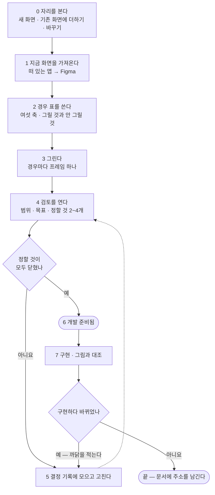
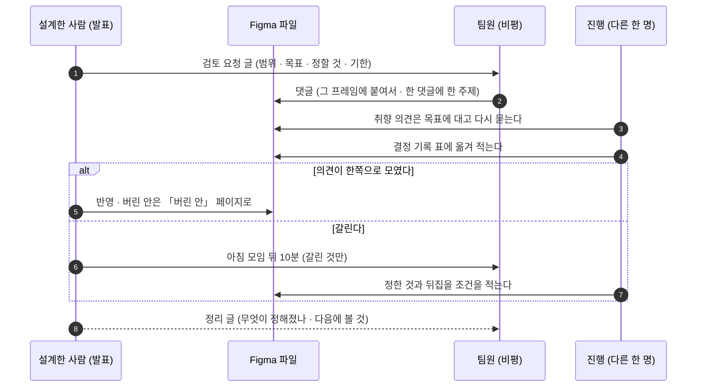
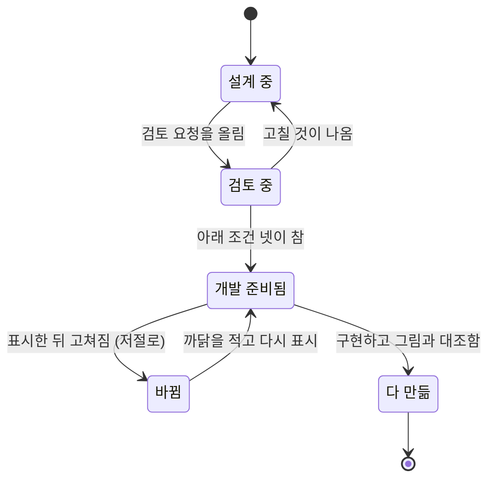

# 화면 설계 절차 v0.2 — Qurious

| 문서 정보 | |
|---|---|
| **판 · 상태** | v0.2 · 초안(검토 전 · 제안) |
| **구분** | 4. 화면·서비스 설계 — 화면 설계 절차(자리 조사 → 설계 → 검토 → 개발에 넘김) |
| **작성** | 이동원(데이터 · 문서) |
| **검토** | 검토 전 |
| **최종 수정** | 2026-10-02 (KST) |
| **기준** | 조사 2026-09-30(출처 7곳 · 부록 E) · 화면 65개([IA v0.4](IA_v0.4.md)) · Figma 팀 계정(교육 요금제 · Full 좌석) · **두 번 돌려 봤다** — 금융 필수 지식(2026-10-01) · 용어사전(2026-10-02) |
| **관련 문서** | [화면 IA v0.4](IA_v0.4.md) · [와이어프레임 v0.4](와이어프레임_v0.4.md) · [화면 자리 조사 v0.1](화면자리조사_v0.1.md) · Figma — [금융 필수 지식](https://www.figma.com/design/JsapuQdop63m9n0KLjiYgo) · [용어사전](https://www.figma.com/design/FCVkBrbwMwV1uzFotZBCb6) · [통합본 이식 계획서 v0.1](../설계/통합본-이식계획_v0.1.md) 5절 · [용어사전 설계서 v0.1](../설계/용어사전-설계_v0.1.md) 7절 · [문서 작성 기준 v0.1](../문서작성기준_v0.1.md) |
| **최근 개정** | v0.1 → v0.2: 두 번 돌려 본 결과를 넣었다 — 표지 · 읽는 법, 실제 서비스 말투, 결정의 「합치기」 · 「설정으로 둘 다」, 사용자가 바로 정하는 검토 길, 구현 대조 구역, 이름 머리 표시 넷 — 전체는 부록 D |

> **이 문서가 답하는 질문**
> 1. 화면 하나를 새로 만들거나 고칠 때 무엇을 어떤 차례로 하나?
> 2. 화면의 「경우의 수」 를 어떻게 빠짐없이, 그러나 다 곱하지 않고 나눠 그리나?
> 3. 팀원의 의견을 어떻게 받고 하나로 합치나?
> 4. 언제 「이대로 만들어도 된다」 가 되나?
>
> **읽는 순서** — 화면을 설계할 사람: 3절 → 4절 → 6절 · 검토하는 팀원: 5절 · 구현하는 사람: 6.3절 · 강사님: 요약 → 1절 → 2절

## 요약

1. **화면은 Figma 에서 먼저 설계해 팀이 본 뒤에 만든다.** 빈 캔버스에서 그리지 않고, 지금 떠 있는 화면을 가져와 고친다. 그리기 전에 「새 화면이어야 하나, 이미 있는 화면에 더하면 되나」 부터 본다.
2. **경우의 수는 여섯 축으로 나누되 다 곱하지 않는다.** 주 경로에 상태 다섯(정상 · 비어 있음 · 불러오는 중 · 일부 · 오류)과 폭 둘을 곱하고, 나머지 갈림은 대표 하나씩만 그린다. 그리기 전에 경우 표를 먼저 쓴다.
3. **의견은 범위 · 목표 · 정할 것을 먼저 적은 검토에서 받고, 결정 기록 표 하나에 모은다.** 검토는 팀 댓글로도, 사용자에게 그림을 붙여 바로 묻는 길로도 연다. 고른 답에는 두 안을 「합치기」 와 「설정으로 둘 다 두기」 가 있다. 두 번 돌려 본 결과 두 번 다 「고른 뒤」 의 상태 · 폭 그림보다 구현이 먼저였다 — 그 대신 구현을 그림 옆에 놓고 대조한다(7단계).

---

## 1. 왜 절차가 필요한가

지금까지 화면 설계는 Markdown 문서의 글자 그림으로 했다(와이어프레임 v0.1 ~ v0.3). 글자 그림은 git 에서 바뀐 줄이 보이는 장점이 있지만, 통합본의 화면 73개를 옮겨 Qurious 화면으로 다시 만들려면 팀원이 **같은 그림을 보고 의견을 낼 자리**가 필요하다. 강사님 산출물 표도 이 구분의 도구로 Figma · FigJam 을 적는다.

표 1 은 「절차 없이 그리면 무엇이 어긋나고, 실무는 그것을 어떻게 막나」 에 답한다.

**표 1. 어긋나는 곳과 막는 법** · 출처 번호는 부록 E

| 절차 없이 그리면 | 무엇이 어긋나나 | 실무의 답 | 이 문서에서 |
|---|---|---|---|
| 자료가 가득 찬 화면만 그린다 | 비었을 때 · 불러오는 중 · 오류는 만드는 사람이 그 자리에서 지어낸다 | 화면마다 상태 다섯을 본다 [S1] | 4절 축 A |
| 새 화면부터 그린다 | 이미 있는 화면과 겹치고 메뉴가 는다 | — (우리 상황: 화면 54개가 이미 있다) | 3절 0단계 |
| 의견을 그때그때 말로 받는다 | 누가 무엇에 동의했는지 남지 않고, 취향 이야기가 된다 | 범위와 목표를 먼저 정하고, 진행자가 적는다 [S6] | 5절 |
| 그림이 계속 바뀐다 | 어디까지가 확정인지 몰라 만들다가 다시 만든다 | 끝난 구역에 「개발 준비됨」 표시 · 바뀌면 표시가 바뀐다 [S2] [S3] | 6.3절 |
| 그림만 넘긴다 | 간격 · 글이 길 때 · 어느 데이터인지는 그림에 없다 | 그림이 못 보여 주는 것을 주석으로 적는다 [S2] [S4] | 6.2절 |

---

## 2. 실무에서는 어떻게 하나 — 조사 결과

표 2 는 「디자이너는 경우를 어떻게 나눠 보여 주고, 의견을 어떻게 합치고, 개발에 어떻게 넘기나」 에 답한다.

**표 2. 조사한 것** · 확실도 🟢 원문 확인(2026-09-30) · 🟡 2차 출처뿐

| # | 출처 | 원문 요지 | 이 절차에서 | 확실도 |
|---|---|---|---|:-:|
| S1 | Scott Hurff, 「UI Stack」(2015-08-17) | 화면에는 상태가 다섯 있다 — 정상(Ideal) · 비어 있음(Empty) · 오류(Error) · 일부(Partial) · 불러오는 중(Loading). 「우리가 사는 세계는 완벽하지 않고, 일은 잘못된다」 | 경우 나누기의 첫 축(4절) | 🟢 |
| S2 | Figma, 「The Designer's Handbook for Developer Handoff」(2025-04-01) | 층에 이름을 붙이고 군더더기를 지운다 · 끝난 구역에 「Ready for dev」 를 붙인다 · 간격 · 배치 · 접근성 · 자산의 자리를 주석으로 단다 · 실제 같은 내용을 넣고 글이 길어 줄이 바뀌거나 잘릴 때를 그린다 · 넘긴 뒤 바뀐 것은 상태와 알림으로 알린다 | 파일 정리 · 주석 · 넘김(6절) | 🟢 |
| S3 | Figma 도움말, 「Dev Mode statuses and notifications」 | 상태는 셋 — Ready for dev(만들어도 된다) · Completed(다 만들었다 · 상위 요금제만) · Changed(표시한 뒤 고쳐지면 **저절로** 붙는다 · 손으로 못 붙인다). 구역 · 프레임 · 부품에 붙인다. 바뀐 까닭을 적으면 판 이력과 알림에 실린다 | 「개발 준비됨」 과 「바뀜」(6.3절) | 🟢 |
| S4 | Figma 도움말, 「Guide to Dev Mode」 | 디자이너가 주석으로 맥락 · 규격 · 치수를 단다 · 바뀐 곳을 견줘 볼 수 있다 · 구역을 개발 준비로 표시하면 한곳에 모여 보인다 | 주석 · 바뀐 곳 확인(6절) | 🟢 |
| S5 | Figma 도움말, 「Create and use variants」 | 비슷한 부품을 한 묶음에 두고 속성으로 가른다 — 상태 속성의 값은 default · hover · pressed · disabled. 이름은 `부품/속성값/속성값` | 부품의 상태(4절 축 F · 6.1절) | 🟢 |
| S6 | Nielsen Norman Group, 「Design Critiques」(2016-10-23) | 비평은 「설계가 목표를 이루는지 분석해 의견을 주는 것」 이다. 범위를 분명히 · 합의한 목표에 대고 · 지시가 아니라 대화로. 역할은 발표 · 진행 · 비평이고, 진행자가 범위와 순서를 미리 돌리고 · 취향 의견을 목표에 대고 다시 묻고 · 그 자리에서 적고 · 뒤에 정리해 보낸다. 방식은 돌아가며 말하기 · 개수 정하기 | 검토 방식(5절) | 🟢 |
| S7 | Nielsen Norman Group, 「Wireflows」(2016-12-04) | 와이어플로 = 화면 그림과 흐름 화살표를 합친 것. 페이지 수는 적고 한 페이지의 내용이 상호작용으로 바뀌는 앱에 맞다 | 우리 앱이 그 모양이다(한 파일 · 화면 54개) — 진입의 갈림을 화살표로(4절 축 D) | 🟢 |
| — | Figma 교육 요금제의 Dev Mode | 교육 요금제가 유료 요금제의 기능을 준다는 소개 글들과, 학생 계정에서 Dev Mode 가 안 보인다는 포럼 글이 함께 있다 | 상태 표시를 쓸 수 있는지는 **처음 쓸 때 확인**한다 · 안 되면 구역 이름 머리에 적는다(6.3절) | 🟡 |

조사에서 확인하지 못한 것 — 「경우를 어떻게 줄이나」 의 정해진 규칙은 찾지 못했다. 4.2절의 「주 경로만 곱하고 나머지는 대표 하나」 는 이 문서의 제안이다.

---

## 3. 절차 — 화면 하나

그림 1 은 「화면 하나가 어떤 단계를 거쳐 만들어지나」 에 답한다.

**그림 1. 화면 하나의 설계 절차** · 범례: 네모 = 하는 일 · 마름모 = 판정 · 둥근 끝 = 결과물 · 점선 = 되돌아감



**목적** — 화면 하나(또는 기능 묶음 하나의 화면들)를 팀이 본 그림대로 만든다.
**사전 조건** — 그 화면이 쓸 API 가 있거나 응답 모양이 정해져 있다 · 앱이 개발 모드로 떠 있다(`.\scripts\personal\start.ps1 -Dev`) · Figma 계정이 팀 계정이다.

0. **자리를 본다.** 같은 일을 이미 하는 화면이 있는지 먼저 찾는다 — [IA v0.4](IA_v0.4.md)의 화면 표와 메뉴 묶음, 이식 대장의 「Qurious 에 있는 것」 칸, 화면에 뜨는 강사님의 「기능 완성도」 표시(점수가 낮은 화면이 채울 자리의 단서다 — 다만 강사님이 기초 코드를 고치면 바뀐다). 자리 후보를 둘이나 셋 적는다: **새 화면 · 이미 있는 화면에 더하기 · 이미 있는 화면을 바꾸기.** 옮길 묶음이 많으면 이 단계를 한 번에 돌려 한 문서로 낸다 — 첫 적용에서 통합본 19묶음을 [화면 자리 조사 v0.1](화면자리조사_v0.1.md) 한 장으로 냈다.
1. **지금 화면을 가져온다.** 후보가 닿는 기존 화면을 떠 있는 앱에서 Figma 로 옮긴다. 새로 그리지 않는다 — 색 · 글꼴 · 간격은 `public/css/app.css` 의 값을 그대로 쓴다. 가져온 것은 「지금 화면」 페이지에 두고 고치지 않는다(전후를 견주려고). 찍으면서 **글자 대비도 본다** — 첫 적용에서 카드 본문이 거의 안 보이는 결함(DF-35)을 여기서 찾았다. 캡처 이미지는 **영어 파일 이름으로 올린 뒤** 레이어 이름을 바꾼다 — 한글 파일 이름은 레이어 이름이 깨진다(서버가 UTF-8 이름을 Latin-1 로 읽는다 · 실측).
2. **경우 표를 쓴다.** 4절의 여섯 축으로 그릴 경우와 그리지 않을 경우를 표로 적는다. 그리지 않는 줄에는 까닭을 적는다.
3. **그린다.** 경우마다 프레임 하나. 이름 · 구역 · 주석은 6절을 따른다. 내용은 실제 값으로 넣는다(API 를 불러 받은 것).
4. **검토를 연다.** 5절의 양식으로 범위 · 목표 · 정할 것을 적어 알린다.
5. **결정 기록에 모으고 고친다.** 의견을 결정 기록 표에 옮기고, 정해진 것을 그림에 반영한다. 버린 안은 지우지 않고 「버린 안」 페이지로 옮긴다.
6. **개발 준비됨.** 6.3절의 조건이 차면 그 구역에 표시를 붙인다.
7. **구현하고 대조한다.** 만든 화면을 그림 옆에 놓고 경우 표의 줄마다 본다. 대조는 Figma 의 「구현 결과 — 그림과 대조」 구역에 둔다 — 결정안 바로 아래에 구현 캡처를 놓고, 그림과 다른 곳을 글로 적는다(첫 적용: 서비스 이름 미반영 · 4일 과정의 목차가 본문 안 · 교재 용어 서랍 미구현 → 셋 다 다음 작업으로).
8. **바뀌면 다시.** 구현하다 그림과 달라져야 하면 그림을 먼저 고치고 까닭을 적는다 — 고치면 표시가 「바뀜」 이 된다.

**확인** — 경우 표의 모든 줄이 「그렸다」 또는 「그리지 않음 — 까닭」 이다 · 정할 것이 모두 닫혔다 · 화면이 그림과 같다.
**실패하면** — 의견이 갈려 닫히지 않으면 선택지를 나란히 그려 한 번 더 묻고, 그래도 갈리면 팀장이 정한 뒤 결정 기록에 「뒤집을 조건」 을 적는다. 두 안이 모두 맞는 경우가 있으면 「합치기」 나 「설정으로 둘 다 두기」 를 선택지에 더해 묻는다(5.3절).
**되돌리기** — 그림은 Figma 의 판 이력으로, 화면은 git 으로 되돌린다.

---

## 4. 경우의 수 나누기

### 4.1 여섯 축

표 3 은 「화면의 경우를 무엇으로 나누나」 에 답한다. 예시는 「용어를 찾는 자리」 를 가정한 것이고 **정해진 설계가 아니다.**

**표 3. 경우를 나누는 축**

| 축 | 값 | 빠뜨리면 | 예시(가정) |
|---|---|---|---|
| A 상태 [S1] | 정상 · 비어 있음 · 불러오는 중 · 일부 · 오류 | 정상만 그려, 나머지를 만드는 사람이 지어낸다 | 정상 = 검색 결과 8건 / 비어 있음 = 처음 들어옴 · 결과 0건(둘은 다른 그림이다) / 불러오는 중 / 일부 = 결과 1건 · 풀이가 한 줄뿐인 용어 / 오류 = 서버가 답하지 않음 |
| B 폭 | 데스크톱 · 모바일 | 좁은 화면에서 표와 옆 칸이 넘친다 | 1280 · 390 |
| C 자리 | 새 화면 · 기존 화면에 더하기 · 기존 화면 바꾸기 | 팀이 「어디에 두나」 를 그림 없이 말로만 정한다 | 새 화면 / 개념 화면 묶음에 한 칸 / 설명창을 넓히기 |
| D 진입 [S7] | 어디서 어떻게 들어오나 · 로그인 여부 | 들어온 길에 따라 처음 보이는 것이 달라야 하는데 하나만 그린다 | 메뉴에서(빈 검색창) / 다른 화면의 용어 칩에서(그 용어가 열린 채로) / 주소로 바로 |
| E 내용 | 길이 · 빈 칸 · 개수의 양 끝 | 글이 길 때 줄이 넘치고, 칸이 비었을 때 빈 제목만 남는다 | 풀이가 1,700자인 용어 / 예시 · 영어 이름이 없는 용어 / 다른 이름이 6개인 용어 / 한자 풀이뿐인 용어 |
| F 부품의 상태 [S5] | 기본 · 올림 · 누름 · 못 씀 · 초점 | 눌렀을 때 · 키보드로 옮겼을 때가 없다 | 검색창 · 분류 단추 · 결과 한 줄 |

### 4.2 다 곱하지 않는다

여섯 축을 다 곱하면 그릴 수 없다 — 위 예시는 5 × 2 × 3 × 3 × 4 = 360 가지다. 그래서 **주 경로에만 상태와 폭을 곱하고, 나머지 갈림은 대표 하나씩** 그린다. 그림 2 는 「그렇게 하면 몇 장을 그리나」 에 답한다.

**그림 2. 경우 표 — 예시(가정)** · ■ = 그린다 · □ = 그리지 않는다(까닭을 적는다) · 세로 = 상태 · 가로 = 폭

```
 주 경로 (자리 = 고른 안 하나 · 진입 = 메뉴에서)        1280   390
 ───────────────────────────────────────────────────────────────
 정상          검색 결과 8건                             ■      ■
 비어 있음     처음 들어옴                               ■      ■
 비어 있음     결과 0건                                  ■      □  1280 과 배치가 같다
 불러오는 중                                             ■      □  같은 부품이다
 일부          결과 1건                                  ■      □
 오류          서버가 답하지 않음                        ■      ■
 ───────────────────────────────────────────────────────────────
 갈림 — 대표 하나씩 (정상 · 1280)
 자리 C        세 안을 나란히                            ■ ■ ■          ← 검토에서 하나를 고른다
 진입 D        용어 칩에서 · 주소로 바로                 ■ ■
 내용 E        긴 풀이 · 빈 칸 · 다른 이름 6개 · 한자뿐   ■ ■ ■ ■
 부품 F        검색창 · 분류 단추 · 결과 한 줄            부품 페이지에 상태별로
 ───────────────────────────────────────────────────────────────
 그리는 프레임 9 + 3 + 2 + 4 = 18 (다 곱하면 360)
```

- **자리(C)를 먼저 고른다.** 세 안을 같은 크기로 나란히 그려 검토에서 하나를 고른 뒤, 고른 안에만 상태와 폭을 곱한다. 고르기 전에 세 안 모두의 상태를 그리지 않는다.
- **「비어 있음」 은 둘이다.** 처음 들어와 아무것도 하지 않은 때와, 찾았는데 없는 때는 사용자가 다음에 할 일이 다르다.
- **그리지 않는 줄도 표에 남긴다.** 빈 줄로 두면 빠뜨린 것과 구별되지 않는다.

---

## 5. 의견을 받고 합치는 법

### 5.1 검토를 여는 글

검토는 「봐 주세요」 가 아니라 **무엇을 정해 달라는지**로 연다 [S6]. 표 4 는 「검토를 열 때 무엇을 적나」 에 답한다.

**표 4. 검토 요청에 적는 것** · 팀 대화방 글(표 없이 목록으로 옮겨 적는다)

| 칸 | 적는 것 | 예(가정) |
|---|---|---|
| 범위 | 이번에 보는 것과 **보지 않는 것** | 용어를 찾는 자리와 설명창 · 색과 글꼴은 이번에 보지 않는다 |
| 목표 | 이 화면이 이루려는 것 한두 줄 — 의견은 여기에 대고 낸다 | 결과 화면의 용어를 누른 사람이 세 번 안에 뜻과 예를 읽는다 |
| 정할 것 | 둘에서 넷 — 선택지와 함께 | ① 자리: 새 화면 · 개념 화면 묶음 · 설명창 ② 분류 22개를 다 보일까 접을까 |
| 어디 | Figma 파일 주소 · 볼 구역 | 「03 설계」 의 「자리 세 안」 구역 |
| 언제까지 | 날짜와 시각 · 그때까지 의견이 없으면 어떻게 하나 | 10-02(금) 17:30 — 의견이 없으면 제안대로 |

### 5.2 받는 법

그림 3 은 「의견이 어떤 차례로 모여 결정이 되나」 에 답한다.

**그림 3. 검토 한 번의 흐름** · 범례: 실선 = 하는 일 · 점선 = 돌아오는 것



- **글로 먼저, 말은 갈린 것만.** 댓글은 그 프레임에 붙여 한 주제씩 단다. 모여서 말하는 것은 글로 닫히지 않은 것만, 아침 모임 뒤 10분 안에.
- **역할 셋** [S6] — 발표(설계한 사람 · 맥락과 까닭을 짧게) · 진행(다른 한 명 · 시간과 범위를 지키고 적는다) · 비평(팀원). 설계한 사람이 진행까지 하면 자기 안을 변호하게 된다.
- **취향은 목표에 대고 다시 묻는다.** 「이 자리는 별로다」 는 「목표(세 번 안에 뜻을 읽는다)에 비춰 어디가 걸리나」 로 바꿔 묻는다.
- **재촉하지 않는다.** 기한까지 의견이 없으면 제안대로 가고, 그 사실을 결정 기록에 적는다.

**검토의 두 길** — 두 번 돌려 보니 검토가 늘 팀 댓글로 열리지는 않았다. 표 4-2 는 「어느 길로 검토를 여나」 에 답한다.

**표 4-2. 검토의 두 길** · 두 번의 적용에서 실제로 쓴 것은 둘째 길이다

| 길 | 언제 | 하는 법 | 남기는 곳 |
|---|---|---|---|
| 팀 검토 | 여러 사람의 화면에 닿거나 담당이 여럿일 때 | 위 그림 3 — 검토 요청 글 · 프레임 댓글 · 기한 · 진행 | 결정 기록 표 |
| 사용자가 바로 정함 | 한 사람의 담당 영역 · 그 사람이 지금 정할 수 있을 때 | 정할 것마다 질문 하나 — **쉬운 말 · 고를 그림(Figma 캡처)을 질문에 붙인다 · 추천을 첫 칸에** · 답에 「합치기」 · 「다른 의견」 을 열어 둔다 | 결정 기록 표(정한 방식 = 「질문 · 바로」) · 와이어프레임 변경 노트 |

둘째 길은 빠르지만 팀원이 보지 못한 채 정해진다. 그래서 정한 뒤에는 결정 기록 표의 주소를 팀 대화방에 한 줄로 알리고, 팀원이 다른 의견을 내면 「뒤집을 조건」 으로 다시 연다.

### 5.3 결정 기록

의견을 한 곳에 모으는 표다. Figma 파일의 「결정 기록」 페이지에 두고, 닫힌 줄은 와이어프레임 문서의 변경 노트에 옮긴다. 「버린 안」 페이지에는 어느 답에도 쓰이지 않은 안만 옮긴다 — 합친 안의 재료는 버린 것이 아니다.

**표 5. 결정 기록 한 줄**

| 칸 | 적는 것 |
|---|---|
| 번호 · 정할 것 | 검토 요청의 「정할 것」 그대로 |
| 선택지 | 나란히 그린 안들의 프레임 이름 — 고른 답이 「합치기」(예 B + C) · 「설정으로 둘 다」(예: 기본은 서랍 · 내 정보에서 창으로 바꾸기)일 수 있다 |
| 의견 | 누가 어느 쪽을 · 왜(한 줄씩) — 의견이 없었으면 「의견 없음」 |
| 결정 · 날짜 | 고른 안 · 정한 날 · 정한 방식(모임 · 기한 지남 · 팀장 · 질문 · 바로) |
| 왜 | 목표에 비춘 까닭 |
| 뒤집을 조건 | 이렇게 되면 다시 본다 |

---

## 6. 파일 구조와 「개발 준비됨」

### 6.1 파일 · 페이지

그림 4 는 「Figma 파일 하나가 어떻게 생겼나」 에 답한다. 파일 하나는 기능 묶음 하나다(이식 대장의 묶음 · 팀 폴더 안에 둔다).

**그림 4. 파일 하나의 페이지** · 범례: 들여쓴 줄 = 그 페이지의 구역

```
 R01 용어사전 (파일)
 ├─ 00 표지 · 읽는 법 ·· 서비스 · 화면 이름 · 한 줄 설명 · 상태 · 날짜 / 무엇 · 누구 · 정할 것 · 보지 않는 것 · 의견 남기는 법
 ├─ 01 지금 화면 ······· 떠 있는 앱에서 가져온 것 — 고치지 않는다
 ├─ 02 경우 표 ········· 4절의 표 (그린다 · 그리지 않는다 · 까닭)
 ├─ 03 설계
 │    ├─ 자리 세 안 ····· 검토에서 하나를 고른다
 │    ├─ 주 경로 ········ 상태 × 폭
 │    └─ 갈림 ··········· 진입 · 내용
 ├─ 04 부품 ············ 상태별 (기본 · 올림 · 누름 · 못 씀 · 초점)
 ├─ 05 결정 기록 ······· 표 5
 └─ 99 버린 안 ········· 지우지 않고 옮긴다
```

- **프레임 이름** — `화면 이름 / 상태 / 폭` 으로 쓴다(예: `용어사전 / 비어 있음 · 결과 0건 / 1280`). 「Frame 123」 같은 이름도, 화면 키(`fin-glossary`) 같은 코드 이름도 남기지 않는다 [S2].
- **실제 서비스 디자인 파일처럼 쓴다** — Figma 는 저장소에 들어올 수 없는 사람도 본다. 표지 · 읽는 법 · 주석에 저장소 경로 · 커밋 · 묶음 번호 · 화면 키 · 코드 파일 이름 · 줄 번호를 쓰지 않고 말로 푼다(사용자 지적 2026-10-01). 그런 것은 저장소 문서(와이어프레임 · 설계서)가 맡는다.
- **파일 이름 · 썸네일은 사람이 정한다** — 연결 도구로는 바꿀 수 없다.
- **부품의 상태** — 상태 속성으로 가른 한 묶음으로 둔다 [S5].
- **「지금 화면」 은 고치지 않는다** — 설계가 무엇을 바꿨는지 견줄 기준이다.

### 6.2 주석 — 그림이 못 보여 주는 것

그림만으로는 알 수 없는 것을 그 자리에 적는다 [S2] [S4]. 주석 하나는 질문 하나에만 답한다.

| 종류 | 적는 것 | 예(가정) |
|---|---|---|
| 데이터 | 이 칸에 무엇이 오나 — 말로 · API 칸 이름은 저장소의 와이어프레임 요소 표에 | 「뜻 한 줄 — 용어사전의 짧은 풀이」(Figma) · `summary`(와이어프레임 표) |
| 조건 | 언제 보이고 언제 안 보이나 | 「주의할 점」 은 `caution` 이 비면 제목째 감춘다 |
| 간격 · 배치 | 고정인가 늘어나나 · 줄이 넘치면 | 결과 한 줄의 뜻은 두 줄까지 · 넘으면 말줄임 |
| 접근성 | 키보드 차례 · 읽어 주는 이름 | 검색창 → 분류 → 결과 · 설명창은 Esc 로 닫힌다 |
| 자산 | 그림 · 아이콘이 어디서 오나 | 아이콘은 지금 쓰는 글꼴 아이콘 |

### 6.3 「개발 준비됨」

그림 5 는 「구역의 표시가 어떻게 바뀌나」 에 답한다.

**그림 5. 구역의 상태** · 범례: 화살표 위 글 = 바뀌는 조건



**「개발 준비됨」 의 조건 넷**

- [ ] 경우 표의 모든 줄이 「그렸다」 또는 「그리지 않음 — 까닭」 이다
- [ ] 정할 것이 결정 기록에서 모두 닫혔다
- [ ] 내용이 실제 값이다(API 를 불러 받은 것 · 가장 긴 것과 빈 것을 포함)
- [ ] 데이터 · 조건 주석이 달렸다

표시는 Figma 의 상태 표시(Ready for dev)로 붙인다 [S3]. 표시한 뒤 고치면 「바뀜」 이 저절로 붙으므로, 까닭을 적고 다시 표시한다. 「다 만듦」 표시는 상위 요금제에서만 되어 [S3], 우리는 구역 이름 머리에 적는다. 두 번의 적용에서는 상태 표시(Dev Mode)를 시험하지 않고 이름 머리 넷으로 적었다 — `[설계 중]` · `[결정됨]`(결정 기록에서 닫힘) · `[준비]`(개발 준비됨) · `[만듦]`. 「바뀜」 은 저절로 붙지 않으므로 고친 사람이 `[결정됨]` 을 `[설계 중]` 으로 되돌린다.

구현한 사람은 **표시가 붙은 구역만** 만든다. 만든 뒤에는 화면을 그림 옆에 놓고 경우 표의 줄마다 보고, Figma 주소를 [와이어프레임](와이어프레임_v0.4.md) 문서의 그 화면 줄에 남긴다.

**두 번의 적용에서 실제로 일어난 일** — 두 번 다 결정 기록이 닫힌 뒤 「고른 안의 상태 × 폭」 그림을 그리기 전에 구현했다. 구현이 빨라 그림이 뒤처졌고, 그 자리를 7단계의 구현 대조(캡처 + 다른 곳 글)가 메웠다. 조건 ① 을 「구현 대조로 대신할 수 있다」 로 바꿀지는 💬 ⑥ 이다.

---

## 7. 하지 않는 것 · 한계

| 무엇 | 왜 · 뒤집을 조건 | 확실도 |
|---|---|:-:|
| 새 디자인 체계를 만들지 않는다 | 색 · 글꼴 · 부품은 지금 앱의 것을 쓴다. 팀이 함께 쓰는 것을 바꾸는 일은 논의가 먼저다 | 🟢 |
| 화면 65개를 다 다시 그리지 않는다 | 옮기는 묶음과 고치는 화면만 그린다 | 🟢 |
| Markdown 와이어프레임을 버리지 않는다 | 글자 그림은 문서 안의 요약으로 남긴다(git 에서 바뀐 줄이 보인다). 자세한 그림은 Figma 에 두고 주소를 문서에 적는다 | 🟢 |
| 두 번 돌려 봤을 뿐이다 | 금융 필수 지식(10-01) · 용어사전(10-02) — 둘 다 한 사람의 담당 영역이라 팀 검토(댓글 · 진행)는 한 번도 돌지 않았다 | 🟢 |
| 교육 요금제에서 상태 표시가 되는지 모른다 | 두 번 다 시험하지 않고 이름 머리에 적었다(6.3절). 팀 검토를 처음 여는 때 시험한다 | 🟡 |
| 「다 곱하지 않는다」 의 기준은 우리 제안이다 | 조사에서 정해진 규칙을 찾지 못했다. 빠뜨린 경우가 구현 뒤에 나오면 경우 표의 규칙을 고친다 | 🟡 |
| 설계하는 사람이 한 명이다 | 화면을 맡는 사람이 정해지면(역할 희망 논의) 그 사람이 발표를, 다른 사람이 진행을 맡는다 | 🟡 |

---

## 8. 팀이 정할 것 💬

| # | 무엇 | 선택지 | 누가 |
|:-:|---|---|---|
| ① | 이 절차를 쓸까 | 그대로 · 가볍게(경우 표와 결정 기록만) · 글자 그림만 계속 | 팀 |
| ② | 검토의 진행은 누가 | 돌아가며 · 화면을 맡는 사람이 아닌 한 명 고정 | 팀 |
| ③ | 의견 기한 | 검토마다 적는다 · 늘 이틀 | 팀 |
| ④ | Figma 계정이 없는 팀원 | 보기 주소로 본다(댓글은 계정이 있어야 한다) · 팀 폴더에 초대 | 팀장 |
| ~~⑤~~ | ~~첫 적용의 범위~~ | ✅ 닫힘 — 금융 필수 지식(10-01) → 용어사전(10-02) 차례로 적용 | 사용자 |
| ⑥ (새) | 「개발 준비됨」 조건 ① 을 구현 대조로 대신할까 | 그대로(상태 × 폭을 다 그린 뒤 구현) · 고른 안의 정상 · 휴대폰만 그리고 나머지는 구현 대조로 | 팀 |
| ⑦ (새) | 「사용자가 바로 정함」 을 언제까지 쓸까 | 담당 한 사람의 영역이면 늘 · 화면 담당이 정해지면 팀 검토로 | 팀 |

---

## 부록 A. 용어

| 용어 | 뜻 | 이 문서에서 | 헷갈리는 점 |
|---|---|---|---|
| 화면의 상태 | 같은 화면이 데이터와 때에 따라 달라 보이는 모습 | 정상 · 비어 있음 · 불러오는 중 · 일부 · 오류 [S1] | 부품의 상태(올림 · 누름)와 다른 축이다 |
| 주 경로 | 그 화면을 쓰는 가장 흔한 한 길 | 상태와 폭을 곱해 그리는 대상 | IA 의 「주 경로 12」 는 화면들의 길이고, 여기서는 한 화면 안의 길이다 |
| 비평(크리틱) | 설계가 목표를 이루는지 분석해 의견을 주는 자리 [S6] | 5절의 검토 | 승인받는 자리(리뷰)가 아니다 — 고치려고 여는 것이다 |
| 와이어플로 | 화면 그림과 흐름 화살표를 합친 그림 [S7] | 진입의 갈림을 그릴 때 | 와이어프레임은 화면 하나, 흐름도는 화살표만 |
| 부품의 상태(variant) | 한 부품의 모습을 속성으로 가른 것 [S5] | 「04 부품」 페이지 | 화면의 상태와 다른 축이다 |
| 개발 준비됨 | 그 구역을 그림대로 만들어도 된다는 표시 [S3] | 6.3절의 조건 넷이 참일 때 | 표시한 뒤 고치면 「바뀜」 이 된다 — 다시 표시해야 한다 |
| 구역(section) | Figma 에서 프레임 여럿을 묶는 칸 | 표시를 붙이는 단위 | 페이지보다 작고 프레임보다 크다 |
| 합치기 · 설정으로 둘 다 | 두 안의 좋은 곳을 한 화면에 섞은 답 · 기본값 하나에 사용자가 다른 안으로 바꿀 수 있게 둔 답 | 5.3절 결정 기록의 선택지 | 버린 안이 아니다 — 「버린 안」 페이지로 옮기지 않는다 |
| 구현 대조 | 만든 화면 캡처를 결정안 옆에 놓고 다른 곳을 글로 적는 구역 | 3절 7단계 | 그림보다 구현이 앞선 때 그 사이를 메운다 |

## 부록 B. 만든 방법 — 다시 확인하는 법

- **조사** — 2026-09-30 에 부록 E 의 일곱 곳을 읽었다. 표 2 의 「원문 요지」 는 읽은 글을 줄인 것이고 따옴표 안만 원문 그대로다(번역).
- **계정** — Figma 연결의 계정 확인 도구로 본 값: 팀 계정 · 교육 요금제 · Full 좌석 · 관리자(2026-09-30).
- **예시의 수** — 그림 2 의 18 과 360 은 예시로 든 값들을 센 것이다(상태 5 · 폭 2 · 자리 3 · 진입 3 · 내용 4).
- **두 번의 적용** — ① 금융 필수 지식(2026-10-01): 0단계를 19묶음에 한 번에 · 지금 화면 4 · 자리 세 안 3 · 결정안 2 · 구현 대조 3 = 프레임 12 · 경우 표 11줄 중 「고른 뒤」 7줄은 그리지 않음 · 결정 「B + C 합치기」. ② 용어사전(2026-10-02): 정할 것 넷 — ① 찾기 화면 세 안 → 합치기 ② 다른 화면의 용어 두 안 → 설정으로 둘 다 ③ 교재 밑줄 규칙 → 혼합 ④ 연관 개념 세 안 → 합치기. 넷 다 「사용자가 바로 정함」 길 · 결정 기록은 Figma 「05 결정」 · 구현은 ① ② 같은 날.
- **한계** — 두 번 다 한 사람의 담당 영역이라 팀 검토(그림 3)를 돌려 보지 않았다. 걸린 시간은 재지 않았다.

## 부록 C. 변경 노트 — 다음 판(v0.3)에 넣을 것

v0.1 의 변경 노트 여섯 줄(첫 적용 결과 · 실제 서비스 말투 · 영어 파일 이름 · 합치기 · 구현 대조 · 대비 보기)은 이 판 본문에 넣었다 — 부록 D 의 v0.2 줄.

| 날짜 | 종류 | 무엇 | 옮길 곳 | 근거 |
|---|---|---|---|---|
| 다음 적용 | 확인 | 팀 검토(그림 3 · 댓글 · 진행)를 처음 돌릴 때 걸린 시간 · 닫히지 않은 것 · Dev Mode 상태 표시가 되는지 | 5.2 · 6.3 · 7절 | — |
| 2026-10-02 | 추가 | 사용자 화면 요청 넷(국내 주식 대시보드 · 로그인 · 가입 · 랜딩 · 내 정보 · 개념 학습 이식)에 이 절차를 차례로 적용 — 0단계 자리부터 | 부록 B | [IA v0.4](IA_v0.4.md) 10절 |
| 2026-10-02 | 확인 | 용어사전 Figma 의 「고른 뒤」 그림(합친 안 · 휴대폰 · 카드 상태 · 버린 안 페이지)을 구현 뒤에 채울지 — 💬 ⑥ 과 함께 | 6.3절 | Figma 용어사전 파일 |
| 2026-10-02 | 확인 · 셋째 적용 | **데이터 관제 · 금융 일정**(파일 하나에 화면 둘) — ① 세 안을 모두 그날의 실제 값(API 응답)으로 그려 견주기가 쉬웠다 ② 사용자가 「다른 의견」 으로 「A + C 융합」 을 내면 뜻이 둘로 읽혔다(한 화면 안의 융합 ↔ 달력 화면 + 다른 화면 카드) — 구현 전에 두 해석을 그림 설명과 함께 한 번 더 물어 정했다 → 절차에 「융합 답은 해석을 확인한다」 를 더할 것 ③ 결정 뒤 같은 세션에 구현하고 「구현 결과 — 그림과 대조」 구역에 캡처와 다른 곳을 적었다 · 이름 머리 [고름] → [만듦] ④ 캡처 함정 — 좁은 화면(390)을 전체 페이지로 찍으면 화면 밖 메뉴까지 찍혀 폭이 953 이 된다 → 왼쪽 390 만 잘라 올린다 ⑤ 「가져올 화면」 이 정적 사이트면 작은 정적 서버(자산 경로 `/static/` 앞머리 떼기 + 필요한 API 하나 흉내)로 띄워 찍을 수 있다 | 3절 7단계 · 5.3절 · 부록 B | Figma `ZevHwCOXTkCIuUVXDL48pt` 05 · 03 페이지 |

## 부록 D. 개정 이력

| 판 | 날짜 | 무엇이 바뀌었나 | 왜 | 근거 |
|---|---|---|---|---|
| v0.2 | 2026-10-02 | 추가 — 두 번 돌려 본 결과(부록 B) · 검토의 두 길(표 4-2) · 이름 머리 표시 넷 · 💬 ⑥ ⑦ / 변경 — 「00 표지 · 읽는 법」 · 프레임 이름을 화면 이름으로 · 주석은 말로(API 칸은 저장소 문서) · 결정 기록의 「합치기」 · 「설정으로 둘 다」 · 1단계에 대비 보기 · 영어 파일 이름 · 7단계 구현 대조 구역 / 닫음 — 💬 ⑤ | 금융 필수 지식 · 용어사전 두 번의 적용 · 사용자 지적 둘(10-01) | 이 판의 PR |
| v0.1 | 2026-09-30 | 추가 — 첫 판(제안): 조사 7곳 · 절차 아홉 단계 · 경우를 나누는 여섯 축과 줄이는 법 · 검토 요청 양식과 결정 기록 · 파일 구조 · 「개발 준비됨」 의 조건 | 통합본의 화면을 옮겨 다시 설계하기 전에, 실무에서 하는 방식을 조사해 그 틀로 하자는 팀장 요청 | PR #77 · [v0.1 파일](화면설계절차_v0.1.md) |

## 부록 E. 조사 출처

| # | 출처 | 주소 | 본 날 |
|---|---|---|---|
| S1 | Scott Hurff, 「How to fix a bad user interface」(UI Stack 을 소개한 글 · 2015-08-17) | https://www.scotthurff.com/posts/why-your-user-interface-is-awkward-youre-ignoring-the-ui-stack/ | 2026-09-30 |
| S2 | Figma 블로그, Jake Albaugh · Chad Bergman, 「The Designer's Handbook for Developer Handoff」(2025-04-01) | https://www.figma.com/blog/the-designers-handbook-for-developer-handoff/ | 2026-09-30 |
| S3 | Figma 도움말, 「Dev Mode statuses and notifications」 | https://help.figma.com/hc/en-us/articles/26781702258583-Dev-Mode-statuses-and-notifications | 2026-09-30 |
| S4 | Figma 도움말, 「Guide to Dev Mode」 | https://help.figma.com/hc/en-us/articles/15023124644247-Guide-to-Dev-Mode | 2026-09-30 |
| S5 | Figma 도움말, 「Create and use variants」 | https://help.figma.com/hc/en-us/articles/360056440594-Create-and-use-variants | 2026-09-30 |
| S6 | Nielsen Norman Group, Sarah Gibbons, 「Design Critiques: Encourage a Positive Culture to Improve Products」(2016-10-23) | https://www.nngroup.com/articles/design-critiques/ | 2026-09-30 |
| S7 | Nielsen Norman Group, Page Laubheimer, 「Wireflows: A UX Deliverable for Workflows and Apps」(2016-12-04) | https://www.nngroup.com/articles/wireflows/ | 2026-09-30 |
