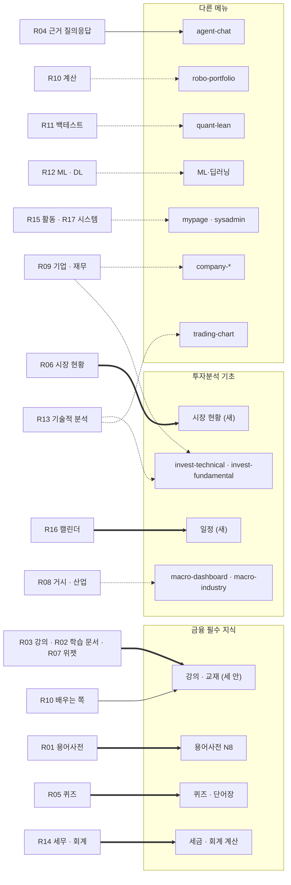
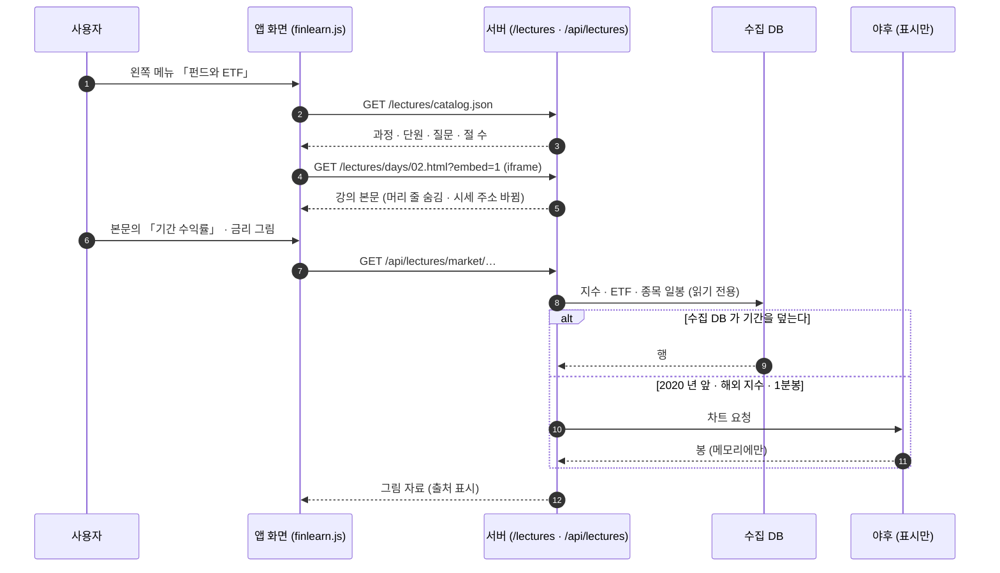

# 화면 자리 조사 v0.1 — 통합본 19묶음 (화면 설계 0단계)

| 문서 정보 | |
|---|---|
| **판 · 상태** | v0.1 · 초안 — 정할 것 Q1 ~ Q4 는 사용자가 정했다(2026-10-01) · 팀 검토 전 |
| **구분** | 4. 화면·서비스 설계 — 화면 설계 절차의 0단계 「자리를 본다」 결과 |
| **작성** | 이동원(데이터 · 문서) |
| **검토** | 검토 전 |
| **최종 수정** | 2026-10-01 (KST) |
| **기준** | 코드 `main` `09a5e9b` · 통합본 사본 `rag-lab/`(원본 `investment-rag-lab@2f0e71f`) · 이식 대장 19줄 · 강사님 「기능 완성도」 표(`public/js/completion.js` 2026-09-29) · 요구 대장 담당 칸 |
| **관련 문서** | Figma 「Qurious · 금융 필수 지식 — 학습 화면」 https://www.figma.com/design/JsapuQdop63m9n0KLjiYgo · [화면 설계 절차 v0.1](화면설계절차_v0.1.md) 3절 0단계 · [통합본 이식 계획서 v0.1](../설계/통합본-이식계획_v0.1.md) 4절 · [이식 대장](../설계/통합본-이식대장.tsv) · [IA v0.3](IA_v0.3.md) · [와이어프레임 v0.3](와이어프레임_v0.3.md) · [용어사전 설계서 v0.1](../설계/용어사전-설계_v0.1.md) 7절 · [개념 학습 설계서 v0.1](../설계/개념학습-설계_v0.1.md) |
| **최근 개정** | 첫 판 |

> **이 문서가 답하는 질문**
> 1. 통합본의 기능 묶음 19개는 Qurious 의 어느 화면으로 가나 — 새 화면인가, 이미 있는 화면에 더하나, 바꾸나?
> 2. 강의 4일치 · 10단원 교재 · 학습 문서는 「금융 필수 지식」 에 어떤 모양으로 들어가나?
> 3. 누가 연결하나 — 다른 주담당 화면에 닿는 묶음은 어떻게 하나?
> 4. 무엇을 먼저 연결하나, 무엇이 정해져야 하나?
>
> **읽는 순서** — 팀원: 요약 → 2절 표 2(내 화면에 닿는 줄) → 5절 → 6절 💬 · 화면을 그릴 사람: 4절 → 화면 설계 절차 4절 · 처음 온 사람: 부록 A → 1절

## 요약

1. **19묶음 모두에 자리를 정했다 — 「보류」 0 · 「제외」 1(AWS 연동).** 새 화면 6 · 이미 있는 화면에 합침 8 · 바꿈 3 · 흡수 1 이다. 조사 첫머리에 앱 화면에서 쓰이던 묶음은 **0 / 19** 였고, 같은 날 강의 · 교재(R03)를 이어 **끝 2 · 구현 중 3 / 19** 가 됐다(7절).
2. **강의 4일치 · 10단원 교재 · 학습 문서 9편 · 개념 학습 사이트의 금융 장 8편은 한 덩어리의 금융 지식이고, 자리는 메뉴 「금융 필수 지식」 이다.** 모양은 세 안 — A 지금 화면에 붙이기 · B 강의실 한 화면 · C 주제별 화면 — 을 Figma 에 나란히 그렸고(추천 C), 사용자가 **B + C 융합**(강의실 한 곳 + 주제 화면 아홉)으로 정했다.
3. **연결 차례는 강의 · 교재 → 용어사전 화면 → 퀴즈 → 세금 · 회계 계산 → 일정 → 근거 질의응답 → 시장 현황이다.** 다른 주담당 화면에 닿는 8묶음도 통합본(세부기능 1)이라 **화면 연결까지 이동원이 한다**(사용자 결정 Q2) — 그 화면의 기존 계산 · 저장은 바꾸지 않고 탭 · 칸만 더한다.

---

## 1. 무엇을 했나 — 범위와 재료

화면 설계 절차의 0단계는 「같은 일을 이미 하는 화면이 있는지 먼저 찾고, 자리 후보를 둘이나 셋 적는다」 이다. 이 문서는 그 0단계를 통합본 19묶음 전부에 한 번에 돌린 결과다. 표 1 은 「무엇을 보고 자리를 골랐나」 에 답한다.

**표 1. 자리를 고를 때 본 것** · 확실도 🟢 파일 · 코드에서 셌다 · 🟡 화면 이름 · 설명으로 짐작했다

| 재료 | 무엇을 봤나 | 어디 | 확실도 |
|---|---|---|:-:|
| 통합본 화면 73 · 강의 사이트 5장 · API 110 | 묶음마다 화면 · API · 데이터 출처(야후 · 합성 · DART · Mongo · torch) | 이식 계획서 3절 · 부록 E · 이식 대장 | 🟢 |
| Qurious 화면 54 | 메뉴 13묶음 · 화면 키 | `public/js/core.js` `GNB_MENUS` · `public/app.html` | 🟢 |
| 강사님 「기능 완성도」 | 화면마다 점수 · 이름표 — 점수가 낮은 화면이 채울 자리의 단서 | `public/js/completion.js` (2026-09-29) | 🟢 |
| 담당 | 묶음의 요구 ID → 주담당 · 부담당 | `docs/요구사항/요구-대장.tsv` | 🟢 |
| 강의 · 교재 | 강의 4일치(절 · 시뮬레이터 · 용어) · 교재 10단원(목차 · 원문 출처) | `rag-lab/frontend/days/` · `rag-lab/data/curriculum/manifest.json` | 🟢 |
| 화면의 실제 내용 | 「금융 필수 지식」 화면 셋의 카드 · 문장 | `public/app.html` 2219~2350줄 | 🟢 |
| 통합본 기능의 쓰임새 | 활동 기록 · 접속자 수 · 시장 일정 · 금융 지식 화면이 실제로 하는 일 | 통합본 라우트 · 화면 코드 | 🟢 |

판정에 쓰는 말은 표 2 의 다섯이다(이식 대장과 같은 말). 이식 계획서 v0.1 의 여섯 경우에서 **「보류」 를 쓰지 않았고**(사용자 지시 — 「전부」 를 좁히지 않는다), 「참고」 는 「가져올 것이 있는 합침」 으로 바꿨고, 「흡수」 를 더했다(스캐너 `raglab_scan.py` 의 판정 목록에도 더함).

**표 2. 판정 말**

| 판정 | 뜻 | 화면 설계에서 할 일 |
|---|---|---|
| **새 화면** | Qurious 에 같은 일을 하는 화면이 없다 | 화면을 설계하고 새 화면 번호를 받는다 |
| **합침** | 비슷한 화면이 있다 — 칸 · 탭 · 패널을 더한다 | 그 화면의 지금 모습을 가져와 더할 자리를 그린다 |
| **바꿈** | 있는 화면이 고정 값 · 설명 전용이다 — 통합본 방식으로 다시 만든다 | 지금 모습과 바꾼 모습을 나란히 그린다 |
| **흡수** | Qurious 의 다른 부분이 이미 그 일을 한다 — 옮길 것이 없다 | 없음 — 까닭만 남긴다 |
| **제외** | 가져오지 않는다 | 없음 — 사용자 결정(AWS)만 해당 |

---

## 2. 한눈에 — 19묶음의 자리

표 3 은 「묶음마다 어디로 가고, 누가 연결하고, 몇 번째로 하나」 에 답한다. 「다른 후보」 는 0단계의 둘째 · 셋째 후보다(3절에 까닭).

**표 3. 묶음 → 자리** · 담당 = 요구 대장의 주담당(요구 ID 가 없는 묶음은 「제안」) · 차례 = 연결 순서 제안 · 💬 = 6절에서 정할 것

| 묶음 | 담당 | 판정 (옛 → 새) | 추천 자리 | 다른 후보 | 차례 |
|---|---|---|---|---|:-:|
| R01 용어사전 · 연관 개념 | 이동원 | 새 화면 → **새 화면 + 합침** | 「금융 필수 지식」 칸 「용어사전」(N8) + 모든 화면의 용어 설명창을 `/api/glossary` 로 | 머리글 검색창 | 2 |
| R02 학습 문서 · 문서 검색 | 이동원 | 새 화면 → **합침** | 강의 · 교재와 같은 자리(학습 문서 9편은 교재 1~5단원의 원문이다) · 검색은 용어사전 · 강의 검색과 하나로 | 「투자분석 기초」 화면 넷 아래 | 1 |
| R03 단원 학습 · 강의 사이트 | 이동원 (제안) | 보류 → **새 화면** | 「금융 필수 지식」 › 강의실 + 주제 화면 아홉 — 세 안 중 **B + C 융합**으로 결정(Q1) · **연결 끝** | — | 1 |
| R04 근거 질의응답 · 에이전트 | 이동원 | 합침 → **합침** | `agent-chat` 에 「근거」 칸(출처 · 문서 목록) + 강의 화면에 「이 장에서 묻기」 + 오케스트레이터의 도구 이력 · 리포트를 `agent-chat` 칸으로 💬 Q5 | 새 화면 「근거 질의응답」 | 6 |
| R05 퀴즈 · 단어장 시험 | 이동원 (제안) | 보류 → **새 화면 + 합침** | 「금융 필수 지식」 칸 「퀴즈 · 단어장」 + 강의 장 끝 확인 문제 + 용어사전 「단어장 시험」 💬 Q4 | — | 3 |
| R06 시장 현황 대시보드 | 이동원 (제안 · 자료 표시) | 합침 → **새 화면** | 「투자분석 기초」 첫 칸 「시장 현황」 — 국내 · 세계 증시 · 자산군 · 오늘의 종목 · 거래량 · 섹터 구름 · 자금 지도 | `quant-dashboard` · `us-dashboard` 에 탭 | 7 |
| R07 시장 사례 · 과거 시세 위젯 | 이동원 | 합침 → **합침** | 강의 · 교재 본문 안 위젯(R02 · R03 와 함께 온다) · 받은 값을 저장하는 `period-return/extend` 는 **저장 없이** 화면 표시로 | — | 1 |
| R08 거시 · 산업 분석 | 미정 (스트레스 검증은 오준영 · 강민석) | 합침 → **합침** | `macro-dashboard` 에 「실시간 · 시뮬레이션 · KOSPI 제외 지수」 탭 · `macro-industry` 에 「산업 경쟁력」 탭 💬 Q2 | 교재 5단원 실습 칸 | 8 |
| R09 기업 · 재무 분석 (공시) | 오준영 (재무 필터) · 수집은 이동원 | 바꿈 → **바꿈** | `company-compare`(정적 목업 45) · `company-sector`(42)를 DART 재무로 다시 · `invest-fundamental`(목업 45)에 재무제표 · 밸류에이션 실습 · 공시 검색 · 그룹 네트워크 · 지역 조회는 `company-dashboard` 탭 💬 Q2 | 새 화면 「공시 · 재무」 | 9 |
| R10 포트폴리오 · 자산배분 · 위험 | 오준영 · 강민석 (계산) · 이동원 (배우는 쪽) | 참고 → **합침 (둘로 나눔)** | 배우는 화면(`financial-knowledge`) → 「자산배분 모델」 의 「간단 자산배분 시뮬레이션」 칸 / 성향 · 추천 · 위험선호도 R1~R5 · 최적화 · 조합 · 시뮬레이션 · VaR → `robo-portfolio` 탭(합성 데이터를 수집 DB 시세로) 💬 Q2 | — | 1 · 10 |
| R11 백테스트 · LEAN | 강민석 | 참고 → **합침** | `quant-lean` 에 「저장된 리포트 목록」 · 교육용 백테스트 · 파이프라인은 강의(자산배분 · 퀀트) 안 실습 💬 Q2 | — | 1 · 11 |
| R12 ML · DL 실습 | 미정 | 보류 → **바꿈 + 합침** | `ml-deeplearning`(설명 전용 40)을 DL 실습(LSTM · Transformer · 1D CNN)으로 · 「ML·딥러닝」 메뉴에 「실습실」(교차검증 · 결정 경계 · 랜덤포레스트 · KMeans · SVM · MLP · 선형회귀 · 텍스트 분류 · OpenCV · 이미지 생성) 💬 Q2 · Q3 | — | 12 |
| R13 기술적 분석 실습 · 차트 그리기 | 신장환 | 합침 → **바꿈 + 합침** | `invest-technical`(설명 전용 40)을 기술적 분석 실습으로 · `trading-chart` 에 「그리기」 패널 💬 Q2 | 강의(교재 3단원) 안 실습 | 13 |
| R14 세무 · 회계 시뮬레이션 | 이동원 (제안) | 보류 → **새 화면** | 「금융 필수 지식」 칸 「세금 · 회계 계산」(교재 1단원 「회사 구조 · 세무회계」 와 짝) | `invest-fundamental` 탭 | 4 |
| R15 계정 · 활동 기록 | 팀 (계정) | 제외 → **합침** | `mypage` 에 「최근 본 화면 · 학습 기록」 — 계정 자체는 Qurious 것이 정본 💬 Q2 | — | 14 |
| R16 캘린더 | 이동원 | 새 화면 → **새 화면** | 「투자분석 기초」 칸 「일정」 — 시장 일정은 수집 DB(배당 기준일 · 휴장일), 내 일정은 새 표 | `mypage` 「내 일정」 | 5 |
| R17 시스템 · 운영 | 팀 (운영) | 제외 → **합침** | `sysadmin-dashboard` 에 「지금 접속 중」 · 서버 자원의 빠진 칸 💬 Q2 | — | 15 |
| R18 분석 화면으로 가는 입구 | — | 제외 → **흡수** | Qurious 의 화면 틀(위 메뉴 · 왼쪽 메뉴)이 같은 일을 한다 — 옮길 것이 없다 | — | — |
| R19 AWS 연동 | — | 제외 → **제외** | 사용자 결정 「AWS 만 빼고」 | — | — |

판정이 어떻게 바뀌었는지는 표 4 와 같다.

**표 4. 판정 수 — 이식 계획서 v0.1 → 이 문서**

| 판정 | 이식 계획서 v0.1 | 이 문서 | 바뀐 까닭 |
|---|--:|--:|---|
| 새 화면 | 3 | 6 | 보류였던 강의(강의실 + 주제 화면) · 퀴즈 · 세금 계산이 새 칸으로 · 시장 현황은 같은 일을 하는 화면이 없어서 · 학습 문서는 강의 자리로 |
| 합침 (옛 「합침」 · 「참고」) | 7 | 8 | 「참고」 둘(포트폴리오 · 백테스트)에 가져올 칸이 있다 · 「제외」 둘(활동 기록 · 시스템)에 Qurious 에 없는 칸이 있다 |
| 바꿈 | 1 | 3 | 설명 전용 화면 둘(딥러닝 · 기술적 분석)을 실습으로 |
| 흡수 | — | 1 | 화면 틀은 Qurious 것이 그 일을 한다 |
| 보류 | 4 | **0** | 사용자 지시 — 보류 없이, 걸리면 묻는다 |
| 제외 | 4 | 1 | AWS 만 |
| **합계** | **19** | **19** | |

그림 1 은 「묶음이 메뉴의 어디에 붙나」 에 답한다.

**그림 1. 묶음 → Qurious 메뉴** · 범례: 굵은 화살표 = 새 화면 · 실선 = 합침 · 바꿈 · 점선 = 다른 주담당 화면(연결은 이동원 — Q2)



그림 2 는 「메뉴 「금융 필수 지식」 · 「투자분석 기초」 가 어떻게 바뀌나」 에 답한다(4절 추천안 C 를 넣은 모습).

**그림 2. 두 메뉴의 지금과 제안** · `+` = 새 칸 · `~` = 바뀌는 칸 · 괄호 = 강사님 「기능 완성도」

```text
 금융 필수 지식 (지금)                    금융 필수 지식 (제안 · 안 C)
 ├─ 금융상품 이해    fin-products (45)    ├─ ~ 금융상품 이해 ······ 한눈에 보기 → 주제로 가는 입구
 ├─ 자산배분 모델    fin-allocation (45)  ├─ + 주식과 시장 ········· 교재 2단원 · 학습 문서
 ├─ 계절성 분석      quant-seasonal (74)  ├─ + 회사와 재무 ········· 교재 1 · 4단원
 └─ 금융 교재 → /learn/ (링크)            ├─ + 펀드와 ETF ·········· 강의 02일차 · 교재 7단원
                                          ├─ + 채권 · 금리 · 코인 ·· 강의 03일차 · 교재 8단원
 투자분석 기초 (지금)                     ├─ + 선물과 옵션 ········· 강의 01일차 · 교재 6단원
 ├─ 거시경제 지표    macro-dashboard (75) ├─ ~ 자산배분 모델 ······ + 강의 04일차 · 교재 9단원 · 계산기
 ├─ 산업 분석        macro-industry (72)  ├─   계절성 분석
 ├─ 재무제표 분석    invest-fundamental   ├─ + 세금 · 회계 계산 ···· R14
 └─ 기술적 분석      invest-technical     ├─ + 퀴즈 · 단어장 ······· R05
                                          └─ + 용어사전 (N8) ······· R01
                                          (금융 교재 → /learn/ 링크는 뺀다)

                                          투자분석 기초 (제안)
                                          ├─ + 시장 현황 ··········· R06
                                          ├─ ~ 거시경제 지표 ······· R08 탭 (💬 Q2)
                                          ├─ ~ 산업 분석 ··········· R08 탭 (💬 Q2)
                                          ├─ ~ 재무제표 분석 ······· R09 (💬 Q2)
                                          ├─ ~ 기술적 분석 ········· R13 실습 (💬 Q2)
                                          └─ + 일정 ················ R16
```

---

## 3. 묶음별 자리 후보 — 0단계

표 5 는 「묶음마다 후보 셋(새 화면 · 합침 · 바꿈)을 견주면 왜 그 자리인가」 에 답한다. ✔ = 추천 · ✕ = 버린 후보 · — = 해당 없음.

**표 5. 자리 후보와 까닭**

| 묶음 | 새 화면 | 합침 | 바꿈 | 까닭 |
|---|---|---|---|---|
| R01 | ✔ 「용어사전」 칸(N8) — 755개를 찾고 연관 개념을 따라가는 곳 | ✔ 설명창 — 모든 화면의 용어 칩이 `/api/glossary/{이름}` 을 읽는다 | ✕ 머리글 검색창 — 화면 틀(강사님 기초 코드)을 고쳐야 한다 | 찾는 곳과 읽는 곳이 둘 다 필요하다. 설명창만 넓히면 「연관 개념을 따라가기」(요구 P01-①-1)를 둘 자리가 없다 |
| R02 | ✕ 「교재 읽기」 새 화면(이식 계획서 그림 4 의 안) | ✔ 강의 · 교재 자리 | — | 학습 문서 9편(`learn-03` ~ `learn-11`)은 교재 1~5단원의 원문과 같은 파일이다(`manifest.json` 의 `sources`). 두 곳에 두면 같은 글이 두 번 나온다 |
| R03 | B 강의실 한 화면 ✔ | A 지금 화면에 붙이기 | C 주제별 화면 ✔ | 4절 — B 와 C 를 합쳤다(결정 2026-10-01) |
| R04 | ✕ 「근거 질의응답」 새 화면 | ✔ `agent-chat` 「근거」 칸 + 강의 화면 「이 장에서 묻기」 | — | 답의 출처 칸이 늘 비어 있는 것이 문제다(`citations` 늘 `[]`). 화면이 아니라 칸이 빠졌다 |
| R05 | ✔ 「퀴즈 · 단어장」 칸 — 모의고사 · 지난 기록 | ✔ 강의 장 끝 확인 문제 · 용어사전 단어장 시험 | — | 장 끝에서 바로 풀고, 모아 보는 곳이 따로 있어야 「내 기록」 이 된다 |
| R06 | ✔ 「시장 현황」 | ✕ `quant-dashboard`(신호 대시보드) · `us-dashboard`(미국) 탭 | — | 지금 화면은 둘 다 「국내 · 세계 시장을 한 장에」 가 아니다. 탭으로 넣으면 그 화면의 목적이 흐려진다. 첫 화면 후보(IA 💬 Q6)와 같이 정한다 |
| R07 | — | ✔ 강의 · 교재 본문 안 | — | 화면이 없는 API 19개 — 본문 그림이 부르는 것이라 본문과 함께 온다 |
| R08 | ✕ 「거시 시뮬레이션」 새 칸 | ✔ `macro-dashboard` · `macro-industry` 탭 | — | 같은 주제의 화면이 있고 둘 다 실데이터 API 가 붙어 있다(75 · 72). 시뮬레이션은 합성 경로라 탭에 「가정 값」 표시를 붙인다 |
| R09 | ✕ 「공시 · 재무」 새 화면 | ✔ `company-dashboard` 탭 · `invest-fundamental` 실습 | ✔ `company-compare` · `company-sector` | 고정 재무(23Q2~24Q1)로 그리는 화면 둘을 공시 재무로 바꾸는 것이 가장 큰 개선이다. DART 키가 필요하다 |
| R10 | — | ✔ 둘로 나눔 — 배우는 쪽은 「자산배분 모델」, 계산은 `robo-portfolio` | — | 계산은 Qurious 가 수집 DB 시세로 더 나아가 있다(88). 가져올 것은 화면 구성(위험선호도 R1~R5 · VaR)이다 |
| R11 | — | ✔ `quant-lean` 리포트 목록 · 강의 실습 | — | LEAN 실행기는 이미 있다. 저장된 리포트를 다시 여는 목록이 없다 |
| R12 | ✔ 「실습실」(교육용 · 합성 데이터) | — | ✔ `ml-deeplearning` | 딥러닝 화면은 설명뿐(40)이다. 지금 ML 화면 넷은 실제 종목 데이터라 합성 데이터 실습과 섞지 않는다 |
| R13 | — | ✔ `trading-chart` 그리기 패널 | ✔ `invest-technical` | 기술적 분석 화면은 설명뿐(40)이다. 차트 그리기는 화면이 아니라 패널이다 |
| R14 | ✔ 「세금 · 회계 계산」 칸 | ✕ `invest-fundamental` 탭 | — | 교재 1단원(회사 구조 · 세무회계)과 짝이다. 재무제표 분석 화면은 기업을 보는 곳이라 맞지 않는다 |
| R15 | — | ✔ `mypage` 「최근 본 화면 · 학습 기록」 | — | 통합본의 활동 기록은 「본 화면」 을 남겨 보여 주는 기능이다(`/api/auth/activity`) — Qurious 에 없다. 계정 표 · 로그인은 Qurious 것을 쓴다 |
| R16 | ✔ 「일정」 | ✕ `mypage` 「내 일정」 | — | 시장 일정(누구나)과 내 일정(나만)을 한 달력에 겹쳐 본다. 통합본의 시장 일정은 코드 안 고정 목록이라 수집 DB 의 배당 기준일 · 휴장일로 바꾼다(요구 P01-①-4) |
| R17 | — | ✔ `sysadmin-dashboard` | — | 같은 화면이 있다. 「지금 접속 중」(통합본 — 메모리에 90초만 두는 표시)만 없다 |
| R18 | — | — | — | 흡수 — 통합 화면의 위 메뉴 한 칸이다 |
| R19 | — | — | — | 제외 — AWS |

---

## 4. 「금융 필수 지식」 — 첫 설계 대상

### 4.1 넣을 것 — 주제마다 자료가 어디에 있나

표 6 은 「같은 주제의 자료가 몇 군데에 흩어져 있나」 에 답한다. 한 줄이 Qurious 의 화면 하나(또는 칸 하나)가 될 후보다.

**표 6. 주제 × 자료** · 강의 = `rag-lab/frontend/days/` · 교재 = `rag-lab/data/curriculum/` · 학습 문서 = 통합본 분석 화면 `learn-*` · 개념 학습 = `/learn/` 의 금융 장(모두 뼈대) · 점수 = 강사님 「기능 완성도」

| 주제 | 강의 | 교재 | 학습 문서 | 개념 학습 (뼈대) | 지금 앱 | 통합본 실습 화면 |
|---|---|---|---|---|---|---|
| 회사 구조 · 세무회계 | — | 1단원 | `learn-10-1` ~ `10-3` | — | 없음 | 재무제표분석 · 세무·회계 시뮬레이션 |
| 주식시장 · 투자 기초 | — | 2단원 | `learn-03` | 주식 · 시장 · 주문 · 배당 기준일 · 매매 비용 | 「금융상품 이해」 의 주식 카드 (45) | 세계증시 · 기초자산 차트 · DART 상장기업 검색 |
| 가격 · 거래량 · 기술적 분석 | — | 3단원 | `learn-05` · `learn-04` | — | 「기술적 분석」 (40) | 기술적 분석 실습 · 거래량 클라우드 · 차트 그리기 |
| 산업 · 기업 · 재무 | — | 4단원 | `learn-06` · `learn-07` | — | 「산업 분석」 (72) · 「재무제표 분석」 (45) | 산업 경쟁력 · 기업 파이낸셜 · DART 재무 AI · 밸류에이션 |
| 거시경제 | — | 5단원 | `learn-11` | — | 「거시경제 지표」 (75) | 거시 실시간 · 시뮬레이션 · KOSPI 제외 지수 |
| 선물 · 옵션 · 헤지 | 01일차 | 6단원 | — | 선물과 옵션 | 「금융상품 이해」 의 파생상품 카드 | 리스크 분석(VaR) |
| 펀드 · ETF | 02일차 | 7단원 | — | 펀드와 ETF | 「금융상품 이해」 의 ETF 카드 | 포트폴리오 조합 · 추천 |
| 채권 · 금리 · 코인 | 03일차 | 8단원 | — | 채권과 코인 | 「금융상품 이해」 의 채권 카드 | 거시 실시간 · 리스크 |
| 자산배분 · 퀀트 | 04일차 | 9단원 | — | 자산배분과 퀀트 | 「자산배분 모델」 (45) | 포트폴리오 최적화 · 위험선호도 · 시뮬레이션 · 금융상품·자산배분 |
| 계절성 | — | — | — | — | 「계절성 분석」 (74) | — |
| 로보어드바이저 제도 | — | — | — | 로보어드바이저와 법 | — | — |

자료를 읽다 찾은 것 셋.

- **교재 6~9단원은 강의 4일치를 글로 옮긴 것이다** — 그림 · 시뮬레이터 · 표가 빠졌다(6~9단원의 표 줄 0). 강의 쪽이 원본이고 더 풍부하다 🟢.
- **학습 문서 9편과 교재 1~5단원 · 10단원은 같은 원문이다** — `manifest.json` 의 `sources` 가 같은 파일(`investment-analysis/docs/03.md` 등)을 가리킨다 🟢.
- **10단원은 제목과 본문이 다르다** — 제목은 「퀀트·AI·금융 지식 시스템」 인데 본문은 「법인과 회사 구조 이해하기」(원문 `docs/10.md`)이고 1단원과 주제가 겹친다 🟢. 옮길 때 10단원의 실습 목록(백테스트 · LEAN · 파이프라인 · 교차검증 · 근거 질의응답)은 「자산배분 · 퀀트」 주제로, 본문은 「회사 구조 · 세무회계」 의 보충으로 둔다. `rag-lab/` 사본은 고치지 않는다(원본과 같아야 `raglab_scan --check` 가 통과한다).

### 4.2 세 안

화면 설계 절차 4.1 의 축 C(자리)를 「금융 필수 지식」 에 돌린 것이다. 세 안을 같은 크기로 Figma 에 그려(「03 설계 — 자리 세 안」) 하나를 고른 뒤, 고른 안에만 상태 · 폭을 곱해 그린다.

그림 3 은 「세 안은 각각 어떻게 생겼나」 에 답한다(1280 폭 · 정상 상태 · 글자 그림은 요약이고 자세한 그림은 Figma).

**그림 3. 자리 세 안**

```text
 안 A — 지금 화면에 붙이기              안 B — 강의실 한 화면                  안 C — 주제별 화면 (추천)
 ┌────────┬────────────────────────┐   ┌────────┬────────────────────────┐   ┌────────┬────────────────────────┐
 │금융상품│ 금융상품 이해           │   │금융 강의│ 금융 강의               │   │금융상품│ 펀드와 ETF              │
 │ 이해 ● │ [주식][ETF][채권][파생] │   │  ●     │ ┌4일 과정┐ ┌10단원 ┐  │   │ 이해   │ 한눈에 ─ 카드 4 (지금 것)│
 │자산배분│ ┌카드┐┌카드┐ (지금 것) │   │금융상품│ │01 선물 │ │1 회사 │  │   │주식과  │ ─────────────────────── │
 │ 모델   │ ───────────────────────│   │ 이해   │ │02 ETF  │ │2 주식 │  │   │ 시장   │ 목차 │ 본문(강의 02일차)│용어│
 │계절성  │ ▼ 자세히 배우기 (탭)    │   │자산배분│ │03 채권 │ │ …     │  │   │회사와  │ ·펀드│ 질문형 절 · 그림 │서랍│
 │용어사전│ 강의 본문 · 시뮬레이터  │   │계절성  │ └────────┘ └───────┘  │   │ 재무   │ ·NAV │ 시뮬레이터       │    │
 │        │ (화면 하나가 길어진다)  │   │용어사전│ → 읽기 화면(목차·본문) │   │펀드와  │ ·괴리│ 확인 문제        │    │
 │        │                        │   │        │ 지금 화면 카드에는      │   │ ETF ●  │      │                  │    │
 │        │                        │   │        │ 「강의에서 자세히 →」   │   │ …      │      │ [다음: 채권 →]   │    │
 └────────┴────────────────────────┘   └────────┴────────────────────────┘   └────────┴────────────────────────┘
```

표 7 은 「세 안을 무엇으로 견주나」 에 답한다.

**표 7. 세 안 견주기** · 확실도: 고치는 양은 파일 수로 셌고(🟢), 사용자에게 어떻게 읽히나는 짐작이다(🟡)

| 기준 | A 붙이기 | B 강의실 | C 주제별 (추천) |
|---|---|---|---|
| 메뉴 칸 (「금융 필수 지식」) | 3 + 세금 · 퀴즈 · 용어 = 6 | 3 + 강의 + 세금 · 퀴즈 · 용어 = 7 | 3 + 주제 5 + 세금 · 퀴즈 · 용어 = 11 |
| 같은 주제가 몇 곳에 나오나 | 1 | **2** (지금 카드 · 강의) | 1 |
| 강사님 기초 코드(`app.html` 화면 구역)를 고치는 양 | **크다** — 화면 셋의 구역을 넓힌다 | 작다 — 메뉴 한 줄 · 카드 링크 | 작다 — 메뉴 줄 · 「금융상품 이해」 카드에 입구 링크 |
| 새 파일 | 적다 | 화면 하나(조각) | 주제마다 조각 하나 |
| 교재 1단원(회사 구조) · 세금 계산을 둘 곳 | 없다 — 붙일 화면이 없다 | 강의실 안 | 「회사와 재무」 · 「세금 · 회계 계산」 |
| 강의 원본의 모양(시뮬레이터 · 그림 · 용어)을 살리나 | 일부 — 탭 안에 들어가 좁아진다 | 그대로 | 그대로 (주제 화면 본문이 강의다) |
| 실제 서비스의 「투자 공부」 처럼 읽히나 🟡 | 설명 화면이 길어진 모양 | 앱 안에 사이트가 하나 더 있는 모양 | 주제를 골라 읽는 모양 |
| 사용자 피드백(「부족한 부분을 더하라」 · 「추가 html 로 보완」)과 | 「더하라」 에 맞다 | 「추가 html」 에 맞다 | 둘 다 — 지금 화면을 남기고 주제 화면을 더한다 |

C 를 추천하는 까닭은 셋이다. 한 주제가 한 곳에만 있고, 강의 원본의 모양을 그대로 살리며, 강사님 기초 코드를 거의 고치지 않는다(새 화면은 조각 파일로 — IA v0.3 부록 C 의 「새 화면부터 화면별 파일」 과 같은 방향). 걸리는 것은 메뉴 칸이 11개로 길어지는 것이고, 왼쪽 메뉴에 「상품 · 시장 / 계산 · 연습」 소제목을 두어 나눈다.

### 4.3 용어사전의 자리

용어사전(R01)은 어느 안을 고르든 「금융 필수 지식」 의 마지막 칸이다. 표 8 은 「용어는 어디서 보이나」 에 답한다.

**표 8. 용어가 보이는 곳 (제안)**

| 어디서 | 무엇이 | 무엇을 부르나 |
|---|---|---|
| 「용어사전」 칸 (N8) | 검색창 · 분류 22 · 결과 목록 · 한 용어 화면(풀이 · 예 · 다른 이름 · 연관 개념) | `GET /api/glossary` · `/api/glossary/{이름}` |
| 강의 · 주제 화면 본문 | 밑줄 친 용어 → 오른쪽 서랍(강의 원본의 서랍 모양) | `/api/glossary/{이름}` |
| 모든 화면의 용어 칩 · 「사용법」 안내 | 지금 설명창 — 내용만 화면 상수 55 → API 755 로 | `/api/glossary/{이름}` |

---

## 5. 다른 주담당 화면에 닿는 묶음

표 9 는 「통합본 묶음을 이으려면 누구의 화면에 무엇을 더하나」 에 답한다. 다른 주담당의 화면은 그 담당이 고치는 것이 원칙이지만, 통합본은 세부기능 1(이동원 몫) 전체라 **화면 연결까지 이동원이 한다**(사용자 결정 2026-10-01 — *「지금 원래 있던 코드를 가져오는거지? 그러면 일단 화면까지 내가 연결하는게 맞을 것 같습니다 … 실제 다른 기능에는 문제가 없잖아」*). 그 화면의 기존 계산 · API · 저장은 바꾸지 않고 탭 · 칸만 더하며, 기존 동작에서 찾은 결함은 여전히 담당에게 이슈 초안으로 넘긴다.

**표 9. 다른 담당에 닿는 8묶음**

| 묶음 | 닿는 화면 | 그 화면의 담당 | 옮길 것(이동원) | 더할 자리(이동원 · 기존 동작은 그대로) |
|---|---|---|---|---|
| R08 거시 · 산업 | `macro-dashboard` · `macro-industry` | 미정 (스트레스 검증은 오준영 · 강민석) | 통합본 API 다섯을 옮기기(야후 표시 · 합성 시뮬레이션은 「가정 값」 표시) | 탭 둘 |
| R09 기업 · 재무 | `company-compare` · `company-sector` · `company-dashboard` · `invest-fundamental` | 오준영 · 신장환(인디케이터 메뉴) | 공시 재무 수집(요구 P01-①-2) · DART API 다섯 | 화면 넷을 공시 재무로 |
| R10 포트폴리오 계산 | `robo-portfolio` | 오준영 · 강민석(시뮬레이션) | — (계산은 Qurious 쪽이 앞서 있다) | 위험선호도 R1~R5 · VaR · 시나리오 탭 |
| R11 백테스트 | `quant-lean` | 강민석 | — | 저장된 리포트 목록 |
| R12 ML · DL | `ml-deeplearning` + 새 「실습실」 | 미정 | 무거운 패키지를 어디에 둘지 정하기(💬 Q3) | 실습 13 |
| R13 차트 | `trading-chart` · `invest-technical` | 신장환 | 강의(교재 3단원) 안의 실습 위젯 | 그리기 패널 · 실습 화면 |
| R15 활동 기록 | `mypage` | 팀 (계정) | — | 「최근 본 화면 · 학습 기록」 |
| R17 시스템 | `sysadmin-dashboard` | 팀 (운영) | — | 「지금 접속 중」 |

---

## 6. 정할 것 💬

| # | 무엇 | 선택지 (첫 칸 = 추천) | 누가 |
|:-:|---|---|---|
| Q1 | 「금융 필수 지식」 의 강의 · 교재 자리 | ~~C 주제별 화면 · A 지금 화면에 붙이기 · B 강의실 한 화면~~ → **B + C 융합**(강의실 한 곳 + 주제 화면 아홉) — 사용자 2026-10-01 · Figma 결정 기록 1 | 사용자 → 팀 검토 |
| Q2 | 다른 주담당 화면에 닿는 8묶음을 어떻게 연결하나 | → **화면까지 이동원이 연결**(세부기능 1 전체가 이동원 몫 · 기존 동작은 그대로) — 사용자 2026-10-01 | 사용자 |
| Q3 | ML · DL 실습의 무거운 패키지(torch · diffusers · opencv) | → **따로 켜는 실습 컨테이너**(기본 앱 이미지 1.39GB 는 그대로 · 이미지 생성은 GPU 전용 코드를 CPU 로) — 사용자 2026-10-01 | 사용자 |
| Q4 | 퀴즈 · 시험 기록을 어디에 두나 | → **Mongo 컨테이너를 더한다**(R05 를 옮길 때). 사용자 「앞으로도 쓸 것 같으면 더하자」 → 조사: 퀴즈 · 단어장 시험 · 활동 기록(R15) · 도구 호출 기록(R04)이 모양이 자주 바뀌는 문서형이고, 통합본 설계 결정(역할별 다중 저장소)도 이 셋을 Mongo 에 뒀다. 강사님 기초 코드가 계정 · 매매를 Mongo → PostgreSQL 로 옮긴 것은 관계형 기록이라 그대로 둔다. 탈퇴 때 Mongo 쪽 기록도 지운다 | 사용자 |
| Q5 | 통합본의 오케스트레이터(Streamlit · 따로 뜨는 화면) | 기능(도구 호출 이력 · 리포트)을 `agent-chat` 칸으로 · Streamlit 을 그대로 띄우기 | 근거 질의응답 설계 때 |
| Q6 | 새 화면 번호 | 「일정」 · 「시장 현황」 · 주제 화면 · 「퀴즈 · 단어장」 · 「세금 · 회계 계산」 에 N10 부터 — IA v0.4 에서 붙인다 | 이동원 (IA v0.4) |

---

## 7. 첫 연결 — 강의 · 교재 (2026-10-01)

정한 차례의 첫 묶음(R03 강의 · R02 학습 문서 · R07 강의 시세 그림)을 같은 날 이었다. 표 10 은 「무엇을 만들고 어디에 붙였나」 에 답한다.

**표 10. 만든 것**

| 무엇 | 어디 | 내용 |
|---|---|---|
| 강의실 | 화면 `fin-lectures` | 4일 과정 카드 넷(절 · 용어 수 · 이 강의에서 답하는 질문 둘 · 이해도 막대) · 교재 카드 다섯 · 퀀트 · AI 실습 모음(이 서비스의 분석 화면 다섯으로) |
| 주제 화면 아홉 | 화면 `fin-topic-*` | 머리(제목 · 출처 칩 · 질문 넷) + 본문. 4일 과정은 강의 페이지를 앱 안에 싣고(계산기 · 그림 · 용어 창이 그대로 돈다), 교재 1~5 · 10단원은 마크다운을 목차 | 본문으로 그린다 |
| 메뉴 | `public/js/core.js` | 「금융 필수 지식」 = 강의(강의실 + 주제 아홉, 들여씀) · 요약(지금 화면 셋). 앱 밖 /learn/ 금융 링크는 뺐다 |
| 요약 화면의 입구 | 금융상품 이해 · 자산배분 모델 · 계절성 분석 | 화면 아래 「강의에서 자세히」 단추(관련 주제로) · 흐린 본문 글자색을 진하게(그 화면들에만) |
| 강의 파일 | `public/lectures/` (파일 74 · 37.7MB) | `scripts/lectures_build.py` 가 사본에서 만든다 — 시세 주소 · 앱 안 싣기 · 일차 링크 · 그림 주소 · 글꼴 경로를 바꾼다. `--check` 로 손 고침을 잡는다 |
| 강의 시세 API | `/api/lectures/*` (API-LEC-01 ~ 08) | 통합본 `/market/*` 일곱 + 국채 사료 그림. 국내 지수 · ETF · 종목은 수집 DB 먼저, 야후는 해외 지수 · 1분봉 · 대체로만, 저장하지 않는다 |
| 시험 | `tests/test_lectures.py` (TC-LC 10 · 전체 458) | 빌드 = 저장소 · 주소 바꿈 · 목록 · 그림 · 수집 DB 먼저 · 야후 대체 · 기간 한도 · 기간 수익률 · 저장 없음 · 메뉴 = 화면 = 주제 |

그림 6 은 「주제 화면 하나가 어떻게 그려지나」 에 답한다.

**그림 6. 주제 화면이 열릴 때** · 범례: 실선 = 요청 · 점선 = 응답



연결하며 찾아 고친 결함 여섯 — 시험이 다 통과한 뒤 화면을 눈으로 훑어 찾았다.

| # | 무엇이 틀렸나 | 어떻게 찾았나 | 고친 곳 |
|:-:|---|---|---|
| 1 | 기간 수익률이 고른 시작일보다 늦은 날부터 계산한 숫자를 아무 표시 없이 냈다(2019 년부터를 골랐는데 2020-01-02 부터의 수익률) — 통합본에도 같은 결함 | 일곱 주소를 실제로 불러 결과를 훑음 | 시작일이 가진 자료보다 한 주 넘게 앞서면 「더 앞선 자료 필요」 로 답한다 · TC-LC-06 |
| 2 | 강의 2일차가 `window.API_BASE` 를 빈 값으로 다시 정해, 기간 수익률 칸이 옛 주소를 불렀다 | iframe 안의 값을 읽음 | 빌드가 「없을 때만」 으로 바꾼다 · TC-LC-02 |
| 3 | 굵은 글씨 바로 뒤 한글 조사(`**…**는`)에서 별표가 그대로 보였다 — 마크다운 표준의 강조 규칙 | 교재 화면을 눈으로 봄 | 그리기 전에 같은 줄의 `**…**` 를 굵은 글씨로(코드 안은 그대로) · 다섯 주제 남은 별표 0 |
| 4 | 4일차가 부르는 `../assets/day4-project-schedule.js` 를 빌드가 옮기지 않았다(목록을 손으로 적었었다) | 브라우저 콘솔 404 | 페이지의 참조를 읽어 전부 옮긴다 · TC-LC-02 |
| 5 | 3일차 국채 사료 그림이 통합본 서버 주소(`/learning/historic-bond-image`)를 불렀다 | 콘솔 404 | 같은 일을 하는 주소를 옮겼다(API-LEC-08 · e뮤지엄 공개 사료 · 메모리에만) |
| 6 | 강의의 한글 글꼴 주소가 404 — 글꼴 저장소 구조가 바뀌었다 | 콘솔 404 → 새 경로 200 확인 | 빌드가 새 경로로 바꾼다 |

함께 고친 것 — 앱의 `/js` · `/css` 에 「바뀌었는지 매번 묻기」(no-cache)를 걸었다. 그 전에는 브라우저가 옛 `main.js` 를 계속 써서 고친 화면이 새로고침해도 안 보였다(팀원 · 사용자도 같은 일을 겪는다).

남은 것 — 교재 마크다운 본문 속 용어 밑줄(R01 화면과 함께) · 학습 문서 위젯 12(R07 의 나머지 · 위기 사례 그림 등) · 문서 검색 · 「이 장에서 묻기」(R04).

---

## 부록 A. 용어

| 용어 | 뜻 | 이 문서에서 | 헷갈리는 점 |
|---|---|---|---|
| 0단계(자리 조사) | 화면을 그리기 전에 「새 화면인가, 있는 화면에 더하나」 를 먼저 보는 일 | 이 문서 전체 | 화면을 그리는 단계가 아니다 — 그리기는 3단계 |
| 기능 묶음(R01~R19) | 통합본의 화면 · API 를 함께 옮길 단위로 나눈 것 | 표 3 | 화면 하나가 아니다 — 묶음 하나에 화면이 0~13개 |
| 기능 완성도 | 강사님이 화면마다 붙인 점수(UI 20 · 백엔드 30 · DB/외부 25 · 자동 시험 25) | 표 3 · 표 6 의 괄호 숫자 | 우리 기준이 아니다 — 강사님이 기초 코드를 고치면 바뀐다 |
| 조각 파일 | 화면 하나의 HTML 을 `app.html` 밖 파일로 두고 불러오는 방식 | 표 7 | 화면 주소(`#화면키`)는 그대로다 |
| 흡수 | Qurious 의 다른 부분이 이미 그 일을 해 옮길 것이 없음 | R18 | 「제외」 와 다르다 — 기능은 있고 화면만 안 옮긴다 |

## 부록 B. 만든 방법 — 다시 확인하는 법

- **묶음 · 화면 · API 수** — 이식 대장(`docs/설계/통합본-이식대장.tsv`)과 이식 계획서 4.2절 표(스캐너 `scripts/raglab_scan.py` 가 센 값).
- **기능 완성도** — `public/js/completion.js` 의 `A(점수, 이름표, 근거)` 줄을 읽었다.
- **담당** — 요구 대장의 `주담당` 칸을 묶음의 요구 ID 로 찾았다. 요구 ID 가 없는 묶음(R03 · R05 · R06 · R14)은 「제안」 이다.
- **교재와 학습 문서가 같은 원문이라는 것** — `rag-lab/data/curriculum/manifest.json` 의 `units[].sources`.
- **강의 4일치의 크기 · 절 · 용어 수** — 파일에서 `<section` · `<h2` · `glossary-item` · `type="range"` 를 셌다(01일차: 절 70 · 큰 제목 48 · 용어 62 · 조절 막대 11).
- **한계** — 화면을 브라우저로 열어 보지 않고 코드로 판정했다. 화면 설계 1단계(지금 화면 가져오기)에서 브라우저로 다시 본다. 「실제 서비스처럼 읽히나」(표 7)는 짐작이다.

## 부록 C. 변경 노트 — 다음 판(v0.2)에 넣을 것

| 날짜 | 종류 | 무엇 | 옮길 곳 | 근거 |
|---|---|---|---|---|
| — | — | (다음 판 재료: 팀 검토 결과(Figma · 기한 10-05(월) 23:59) · 💬 Q5 · Q6 · 묶음을 이을 때마다 표 3 의 상태 · 서비스 화면의 이름 · 바닥글 반영) | 2 · 4 · 6 · 7절 | — |

## 부록 D. 개정 이력

| 판 | 날짜 | 무엇이 바뀌었나 | 왜 | 근거 |
|---|---|---|---|---|
| v0.1 | 2026-10-01 | 추가 — 첫 판: 19묶음의 자리 · 판정(보류 0 · 대장과 같은 말) · 「금융 필수 지식」 의 주제 × 자료 표 · 자리 세 안 · 다른 담당에 닿는 묶음 · 정할 것 6(Q1 ~ Q4 사용자 답 반영) · 7절 첫 연결(강의 · 교재 — 만든 것 · 그림 · 결함 여섯) | 통합본을 「AWS 만 빼고 전부」 앱에 연결하라는 사용자 지시 — 화면 설계 절차의 첫 적용 | 이 문서를 싣는 PR |
