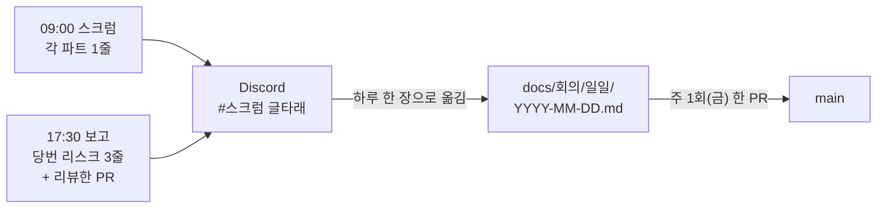

# 양식 — 일일 스크럼 · 퇴근 전 보고 (v0.1 · 제안)

> ⏳ **팀 논의 전 제안이다.** 팀 공용 장치라 쓰기 전에 팀이 정한다(ADR-0003 의 교훈 — 만들고 나서 논의하지 않는다).
> 논의 글: [2026-09-28 일일 기록 남기는 곳 제안](2026-09-28-일일-기록-남기는-곳-제안.md)
>
> **규칙의 출처** — 강사님 「진행 중 유의사항」 ⑤ 매일 09:00~09:15 스크럼 · ⑥ 매일 17:30~17:50 진행 · 리스크 · 명일 계획 보고.
> 누가 무엇을 하는지는 역할 분배안 v1.0 이 이미 정했다(옛 `#62` [기록](../github-archive/2026-09-21/이슈-062/00-기록.md) §7.4):
> 09:00 은 **각 파트 1줄(어제 / 오늘 / 막힌 것) · 팀장 진행**, 17:30 은 **당번(P-E)이 리스크 3줄 취합 → 팀장 보고** +
> 각자 **「내가 리뷰한 PR」 한 줄**. 이 양식은 그 규칙을 **남기는 칸**만 만든다(산출물목록 14절 ⑤⑥).

## 흐름 — 말은 Discord 에서, 기록은 저장소에



```
매일                         금요일
─────────────────────        ──────────────────────────────
Discord 에 1줄씩  ──▶  파일 한 장  ──▶  한 주치(최대 5장)를 PR 하나로
                                       GitHub 쓰기 = 주 1건
```

하루 한 PR 로 올리면 한 달에 20건이 넘는 쓰기가 생긴다. 이 저장소는 계정 정지를 두 번 겪었다 — **쓰기를 몰아서 줄인다.**

---

아래부터가 양식이다. `일일/YYYY-MM-DD.md` 로 복사해 채운다.

```markdown
# YYYY-MM-DD (요일) 일일 기록

> 스크럼 진행: 팀장 · 이번 주 당번(P-E): 이름 · 참석: 이름, 이름, …

## 09:00 스크럼 — 파트별 1줄

- **P-A 데이터** (이동원) — 어제: … / 오늘: … / 막힌 것: 없음
- **P-B 지표·신호** (신장환) — 어제: … / 오늘: … / 막힌 것: …
- **P-C 자산배분·스크리닝** (오준영) — 어제: … / 오늘: … / 막힌 것: …
- **P-D 비용차감 검증·LEAN** (강민석) — 어제: … / 오늘: … / 막힌 것: …

## 17:30 보고 — 당번 취합

- **진행**: (오늘 머지된 PR · 닫힌 이슈 번호)
- **리스크 3줄**
  1. …
  2. …
  3. …
- **내일 계획**: …
- **내가 리뷰한 PR** (보조담당 증빙 · 분배안 §5 규칙 2 ①')
  - 이름 — #번호 (없으면 「없음」)

## 강사님 전달 사항 · 정한 것 (있으면)

- …
```

## 칸마다 왜 있나

| 칸 | 무엇을 증명하나 | 산출물목록 |
|---|---|---|
| 파트별 1줄 | 매일 스크럼을 했다 (유의사항 ⑤) · 막힌 것이 언제부터였나 | 3절 · 14절 ⑤ |
| 리스크 3줄 | 매일 보고를 했다 (유의사항 ⑥) · 리스크가 며칠 이어졌나 | 14절 ⑥ |
| 내가 리뷰한 PR | **주·보조 2인 이상**이 실제로 돌았다 (유의사항 ①) — 지금 증빙 0건 | 14절 ① |
| 참석 | 이탈 판정의 근거(분배안 §8.2 — 스크럼 3연속 무응답) | 14절 ② |

**용어**
- **스크럼** — 매일 짧게 서서(또는 온라인으로) 「어제 한 것 · 오늘 할 것 · 막힌 것」만 말하는 회의입니다. *이 문서에서*: 09:00~09:15, 파트마다 1줄.
  *헷갈리는 점*: 문제를 **푸는** 자리가 아닙니다. 막힌 것은 이름만 올리고 푸는 것은 따로 합니다.
- **당번** — P-E(안전·실행·운영) 파트를 한 주씩 돌아가며 맡는 사람입니다(분배안 v1.0). *이 문서에서*: 17:30 리스크 3줄을 모읍니다.
