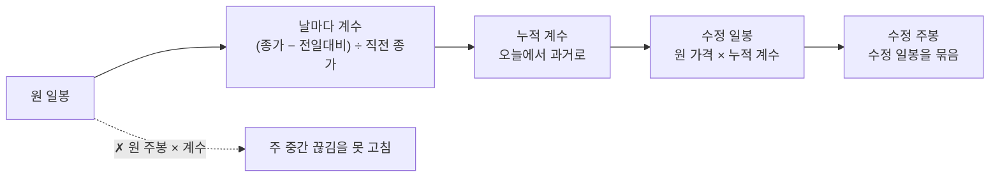

> [!GOAL]
> - 원 가격과 수정 가격이 왜 다른지, 어느 쪽을 언제 쓰는지 설명할 수 있습니다.
> - 시세 자료 안에 이미 들어 있는 기준가로 조정계수를 구해 과거 가격을 고칠 수 있습니다.
> - 수정 주봉을 바른 순서로 만들고, 가격 수익률과 총수익을 나눠 계산할 수 있습니다.
> - 받은 시세 파일이 어떤 방식으로 수정된 값인지 알아볼 수 있습니다.

## 액면분할 다음 날 주가가 1/5 이 되면 손실일까요?

카카오는 2021년 4월 15일에 1주를 5주로 나누는 액면분할을 마치고 거래를 다시 시작했습니다. 분할 전 마지막 종가는 558,000원, 다시 열린 날의 종가는 120,500원입니다. 두 숫자로 하루 수익률을 계산하면 −78.41% 입니다.

하지만 그날 주주가 잃은 것은 없습니다. 1주를 갖고 있던 사람은 5주를 갖게 됐고, 5주 × 120,500원 = 602,500원이니 오히려 558,000원보다 늘었습니다. 회사의 가치가 아니라 주식을 세는 단위가 바뀐 것입니다. 이런 날을 그대로 둔 가격 계열로 수익률 · 이동평균 · 변동성을 계산하면 있지도 않은 폭락이 들어갑니다. 백테스트라면 그날 손절 신호가 나가고, 변동성은 몇 배로 부풀어 오릅니다.

그래서 과거 가격을 오늘의 주식 단위로 다시 적습니다. 이렇게 고친 가격을 수정주가(adjusted price), 거래소가 그날 실제로 낸 가격을 원 가격(raw price)이라고 부릅니다.

<figure>
<svg viewBox="0 0 760 270" xmlns="http://www.w3.org/2000/svg" role="img" aria-label="카카오 액면분할 전후의 원 가격과 수정 가격">
<rect x="8" y="8" width="360" height="254" rx="14" fill="#f8fafc" stroke="#dde2ec"/>
<text x="24" y="34" font-size="15" font-weight="700" fill="#0f172a">원 가격 — 하루에 −78.41%</text>
<line x1="221" y1="48" x2="221" y2="236" stroke="#cbd5e1" stroke-dasharray="4 4"/>
<text x="226" y="58" font-size="11.5" fill="#64748b">04-15 분할</text>
<polyline fill="none" stroke="#dc2626" stroke-width="2.5" points="50,85.3 71.4,70.2 92.9,70.9 114.3,68.7 135.7,65.1 157.1,65.1 178.6,65.1 200,65.1 221.4,222.6 242.9,223.2 264.3,223.2 285.7,223.0 307.1,223.5 328.6,223.7 350,223.7"/>
<text x="54" y="58" font-size="11.5" fill="#b91c1c">558,000</text>
<text x="300" y="214" font-size="11.5" fill="#b91c1c">120,500</text>
<text x="24" y="252" font-size="11" fill="#64748b">2021-04-05 ~ 04-23 종가 · 세로축 10만~60만 원</text>
<rect x="392" y="8" width="360" height="254" rx="14" fill="#f8fafc" stroke="#dde2ec"/>
<text x="408" y="34" font-size="15" font-weight="700" fill="#0f172a">수정 가격 — +7.59% 로 이어짐</text>
<line x1="605" y1="48" x2="605" y2="236" stroke="#cbd5e1" stroke-dasharray="4 4"/>
<text x="610" y="58" font-size="11.5" fill="#64748b">04-15 분할</text>
<polyline fill="none" stroke="#2563eb" stroke-width="2.5" points="434,195.4 455.4,144.9 476.9,147.3 498.3,140 519.7,128 541.1,128 562.6,128 584,128 605.4,77 626.9,86 648.3,86 669.7,83 691.1,92 712.6,95 734,95"/>
<text x="500" y="120" font-size="11.5" fill="#1d4ed8">112,000</text>
<text x="612" y="72" font-size="11.5" fill="#1d4ed8">120,500</text>
<text x="408" y="252" font-size="11" fill="#64748b">분할 전 가격에 0.2007168 을 곱함 · 세로축 9.5만~12.5만 원</text>
</svg>
<figcaption>그림 1. 같은 15일의 종가 — 원 가격은 분할일에 절벽이 생기고, 수정 가격은 주주가 실제로 겪은 흐름대로 이어집니다(출처: 금융위원회 주식시세정보).</figcaption>
</figure>

## 조정계수는 어떻게 구하나요?

조정계수는 「그날 가격이 직전 가격과 그대로 이어지는가」 를 나타내는 배수입니다. 이어지면 1 이고, 분할처럼 단위가 바뀐 날에는 1 보다 작아집니다. 계수를 구할 때 따로 공시를 찾아 분할 비율을 넣을 필요는 없습니다. 시세 자료의 전일대비(vs)가 그 답을 이미 담고 있습니다.

거래소는 분할 · 권리락이 있는 날 새 출발 가격인 기준가를 정하고, 그날의 전일대비를 직전 종가가 아니라 이 기준가와 견줘 냅니다. 그래서 「종가 − 전일대비」 를 계산하면 평소에는 직전 종가가, 분할한 날에는 기준가가 나옵니다.

**표 1. 카카오의 기준가와 조정계수**

| 기준일 | 종가 | 전일대비 | 종가 − 전일대비 | 직전 종가 | 계수 |
|---|---:|---:|---:|---:|---:|
| 2021-04-09 | 558,000 | +10,000 | 548,000 | 548,000 | 1 |
| 2021-04-12 (정지) | 558,000 | 0 | 558,000 | 558,000 | 1 |
| 2021-04-15 (분할) | 120,500 | +8,500 | **112,000** | 558,000 | 0.2007168 |
| 2021-04-16 | 119,000 | −1,500 | 120,500 | 120,500 | 1 |

계수 = (종가 − 전일대비) ÷ 직전 종가 입니다. 분할한 날의 계수는 그날 이전의 모든 가격에 곱해야 하므로, 오늘에서 과거로 거슬러 가며 곱해 나갑니다(누적 계수). 그러면 오늘 가격은 그대로 두고 과거만 고쳐집니다. 거꾸로 과거에서 오늘로 곱해 가면 오늘 가격이 바뀌어, 어제 본 차트와 오늘 본 차트의 현재가가 달라집니다.

```python
def factors(rows):
    out, prev = [], None
    for r in rows:
        day, close, vs = r[0], r[-2], r[-1]
        f = (close - vs) / prev if prev else 1.0      # 첫날은 비교할 직전이 없다
        out.append((day, f))
        prev = close
    return out

def cumulative(fs):
    cum, c = {}, 1.0
    for day, f in reversed(fs):                       # 뒤에서 앞으로 — 오늘 가격은 그대로 둔다
        cum[day] = c
        c *= f
    return cum
```

예제 [`adjusted_price.py`](/learn/examples/adjusted_price.py) 를 돌리면 카카오의 계수와 분할일 수익률이 나옵니다.

```output
① 카카오 — 계수가 1 이 아닌 날
  2021-04-15  계수 0.2007168  (기준가 112,000 ÷ 직전 종가 558,000)
  「1주를 5주로」 만 보고 나누면 계수 0.2 · 기준가 111,600 — 실제 기준가와 400원 차이
② 카카오 — 2021-04-15 하루 수익률
  원 가격    120,500 ÷ 558,000 − 1 = -78.41%
  수정 가격  120,500 ÷ (558,000 × 0.2007168) − 1 = +7.59%
```

## 분할 비율 1/5 로 나누면 안 되나요?

나눌 수 있고, 그렇게 하는 곳도 있습니다. 문제는 거래소의 기준가가 분할 비율로 나눈 값과 꼭 같지는 않다는 점입니다. 558,000 ÷ 5 = 111,600원이지만 카카오의 기준가는 112,000원이었습니다. 그 무렵 이 가격대의 호가 단위는 500원이어서 111,600원은 주문을 낼 수 없는 가격이고, 112,000원은 낼 수 있는 가격입니다.

그래서 같은 「수정 가격」 이라도 무엇으로 고쳤느냐에 따라 값이 다릅니다. 야후 파이낸스(`yfinance`)로 같은 날을 받아 견줘 보면 차이가 그대로 보입니다.

```output
⑤ 카카오 2021-04-09 종가 — 출처마다 다른 「수정 가격」
  원 가격(거래소 원자료)                558,000.0
  기준가 계수로 고친 값 × 0.2007168      112,000.0
  야후 Close (분할 비율 1/5 로 고침)     111,600.0
  야후 Adj Close (배당까지 고침)         110,981.9
  야후 거래량 3,944,195 = 원자료 788,839 × 5.0000
```

<small>`python adjusted_price.py --live` · 2026-10-01 실행 · yfinance 0.2.66</small>

야후의 `Close` 는 이름과 달리 원 가격이 아닙니다. 분할 비율로 이미 고친 값이고, 거래량도 다섯 배로 고쳐 줍니다. `Adj Close` 는 여기에 배당까지 반영한 값입니다. `yfinance.download` 의 `auto_adjust` 는 기본값이 `True` 라서, 아무 옵션 없이 받으면 시가 · 고가 · 저가 · 종가가 모두 배당까지 고친 값으로 옵니다.

두 방식의 차이는 이 분할 하루에 0.38%p 입니다. 5주를 받은 주주의 실제 평가액 변화는 602,500 ÷ 558,000 − 1 = +7.97% 이고, 기준가 계수로 고친 수익률은 +7.59% 입니다. 분할 비율이 주주의 몫을 정확히 따라가고, 기준가 계수는 거래소가 낸 숫자를 그대로 따라갑니다. 기준가 방식은 유상증자 권리락처럼 「새로 받는 주식의 값」 이 섞여 비율 하나로 나타낼 수 없는 경우에도 같은 식으로 계수를 구할 수 있다는 장점이 있습니다. **어느 쪽을 쓰든, 받은 자료와 내 자료를 견줄 때는 서로 어떤 방식으로 고쳤는지부터 맞춰야 합니다.**

## 수정 주봉은 왜 수정 일봉을 묶어야 하나요?

원 가격 주봉을 먼저 만들고 거기에 계수를 곱하면 될 것 같지만, 주 중간에 끊김이 있으면 고칠 수 없습니다. 가온전선은 2026년 6월 30일(화)에 권리락이 있었습니다. 월요일은 343,000원으로 끝났고 화요일의 기준가는 190,600원이었습니다. 정지 없이 이어졌기 때문에 이 주의 일봉 다섯 개에는 권리락 전과 후의 가격이 섞여 있습니다.

```output
③ 가온전선 — 권리락(2026-06-30 화)이 낀 주의 주봉
  계수가 1 이 아닌 날 2026-06-30  계수 0.5556851  → 그 전날까지 곱할 누적 계수 0.5556851
                          시가       고가       저가       종가   주간 수익률
  원 주봉              329,500    353,500    210,500    277,500   -15.7%
  원 주봉 × 계수 1.0   329,500    353,500    210,500    277,500   (그 주 마지막 날의 누적 계수는 1.0 — 고쳐지는 것이 없다)
  수정 일봉을 묶음     183,098    326,000    178,097    277,500   +51.8%
```

원 주봉의 고가 353,500원은 월요일, 저가 210,500원은 화요일 값이라 서로 다른 단위의 숫자가 한 봉에 들어 있습니다. 주봉의 날짜인 금요일의 누적 계수는 1 이라 곱해도 아무것도 바뀌지 않습니다. 월요일만 0.5556851 을 곱하고 나서 묶어야 고가가 목요일의 326,000원, 저가가 월요일을 고친 178,097원이 됩니다. 주간 수익률은 −15.7% 와 +51.8% 로 부호까지 뒤집힙니다.

그래서 순서는 언제나 **일봉을 먼저 고치고, 고친 일봉을 묶는다**입니다.



## 배당은 어떻게 다루나요?

배당은 회사의 돈이 주주에게 나가는 것이라, 배당락일에는 그만큼 가격이 낮아진 채로 거래가 시작됩니다. 분할과 달리 거래소는 현금배당에 기준가를 따로 고쳐 주지 않습니다. 삼성전자는 2025-12-29 가 결산배당(1주당 566원)의 배당락일이었습니다.

```output
④ 삼성전자 — 배당락일 2025-12-29 (1주당 566원)
  2025-12-26  종가 117,000  가격 수익률 +5.31%  총수익 +5.31%
  2025-12-29  종가 119,500  가격 수익률 +2.14%  총수익 +2.62%  ← 배당락
  2025-12-30  종가 119,900  가격 수익률 +0.33%  총수익 +0.33%
```

가격 수익률은 가격만 보고, 총수익(Total Return)은 받은 배당을 그날 다시 그 주식에 넣었다고 보고 계산합니다.

| | 계산 | 2025-12-29 |
|---|---|---:|
| 가격 수익률 | 오늘 종가 ÷ 어제 종가 − 1 | +2.14% |
| 총수익 | (오늘 종가 + 오늘 배당락된 배당금) ÷ 어제 종가 − 1 | +2.62% |

하루로 보면 0.48%p 이지만 해마다 쌓입니다. 삼성전자의 2020-01-02 종가를 1 로 두면 2026-09-29 까지 가격 지수는 4.94, 배당을 다시 넣은 총수익 지수는 5.76 이 됩니다. 같은 기간을 「+394%」 로 볼지 「+476%」 로 볼지가 갈리는 셈입니다. 배당을 주는 종목과 주지 않는 종목, 또는 종목과 지수를 견줄 때는 양쪽을 같은 기준(둘 다 가격 또는 둘 다 총수익)으로 맞춥니다.

## 받은 시세가 어떤 방식으로 고쳐진 값인지 어떻게 알아보나요?

분할이나 권리락이 있었던 종목의 그 전날 종가 하나만 견줘 봐도 대부분 가려집니다.

**표 2. 카카오 2021-04-09 종가로 보는 네 가지 기준**

| 받은 파일의 값 | 뜻 | 흔한 출처 |
|---:|---|---|
| 558,000 | 원 가격 | 거래소 원자료 · 공공데이터포털 |
| 112,000 | 기준가 계수로 고친 수정 가격 | 기준가로 수정주가를 만드는 곳 |
| 111,600 | 분할 비율로 고친 가격(배당은 그대로) | 야후 `Close` |
| 110,981.9 | 분할 · 배당까지 고친 가격 | 야후 `Adj Close` · `auto_adjust=True` |

끊김이 있었던 날 앞쪽 구간 전체에서 「받은 값 ÷ 내 값」 이 한 숫자로 일정하면 수정 방식이 다른 것이고, 들쭉날쭉하면 다른 문제(날짜 밀림 · 다른 종목)입니다. 이 판정을 자동으로 하는 방법은 [데이터 품질 검사](#/p/data-quality-check) 장에서 다룹니다.

## Qurious 의 수정주가는 이렇게 만듭니다

- 원 가격은 지우거나 덮어쓰지 않고 그대로 둡니다. 수정 가격은 원 가격과 누적 계수로 따로 만든 계열입니다.
- 계수는 원자료의 전일대비로 구한 기준가 계수입니다. 분할 · 병합처럼 주식 수가 바뀌는 날에는 상장주식수의 비율과 한 번 더 견줘 보고, 둘이 크게 어긋나면 사람이 확인할 목록에 올립니다.
- 오래 거래가 정지됐다가 감자 뒤에 다시 열린 종목은 전일대비가 감자 전 가격으로 계산돼 계수가 1 로 나오기도 합니다. 이런 날은 상장주식수의 변화로 계수를 구합니다.
- 가격 계열(PR)과 배당을 다시 넣은 총수익 계열(TR)을 따로 둡니다. 배당은 DART 공시의 배당락일 · 1주당 배당금을 씁니다.
- 수정 주봉은 수정 일봉을 묶어 만듭니다.

## 흔한 실수

1. **야후 `Close` 를 원 가격으로 알고 쓰기** — 분할 비율로 이미 고친 값입니다. 원 가격과 섞으면 분할일 앞뒤가 두 번 고쳐지거나 한 번도 안 고쳐집니다.
2. **분할 비율만 넣어 계수를 만들기** — 권리락 · 감자는 비율 하나로 나타나지 않습니다. 기준가로 구하면 같은 식으로 다룰 수 있습니다.
3. **원 주봉에 계수를 곱하기** — 주 중간의 끊김을 고치지 못합니다(가온전선 −15.7% ↔ +51.8%).
4. **과거에서 오늘 쪽으로 계수를 곱하기** — 오늘 가격이 바뀌어 날마다 현재가가 달라집니다.
5. **가격 수익률로 배당주와 지수를 견주기** — 배당만큼 해마다 불리하게 나옵니다. 둘 다 총수익으로 맞춥니다.

## 정리

- 분할 · 권리락은 회사 가치가 아니라 주식 단위를 바꾸므로, 과거 가격에 조정계수를 곱해 오늘 단위로 이어 붙입니다.
- 계수는 (종가 − 전일대비) ÷ 직전 종가 로 자료 안에서 구하고, 오늘에서 과거로 누적합니다.
- 수정 주봉은 수정 일봉을 묶어 만들고, 배당은 총수익 계열로 따로 다룹니다.
- 같은 「수정 가격」 도 출처마다 고친 방식이 다르므로 견주기 전에 기준부터 맞춥니다.

<details>
<summary>확인 문제 1 — 어떤 종목의 종가가 50,000원, 다음 날 종가가 10,600원, 그날 전일대비가 +600원입니다. 그날의 조정계수와 수정 수익률은?</summary>

기준가 = 10,600 − 600 = 10,000원, 계수 = 10,000 ÷ 50,000 = 0.2 입니다. 수정 수익률은 10,600 ÷ (50,000 × 0.2) − 1 = +6% 입니다. 원 가격으로 계산한 −78.8% 는 단위가 바뀐 것을 반영하지 않은 숫자입니다.
</details>

<details>
<summary>확인 문제 2 — 수요일에 권리락이 있었던 주의 수정 주봉을 만들 때, 금요일의 누적 계수를 원 주봉에 곱하면 어떻게 되나요?</summary>

금요일은 권리락 뒤라 누적 계수가 1 이므로 원 주봉이 그대로 남습니다. 월 · 화요일의 권리락 전 가격이 고쳐지지 않은 채 고가 · 저가에 섞입니다. 월 · 화요일 일봉을 먼저 고친 뒤 묶어야 합니다.
</details>

<details>
<summary>확인 문제 3 — 받은 파일의 카카오 2021-04-09 종가가 111,600원이면 어떤 자료일 가능성이 큰가요?</summary>

분할 비율(1/5)로 고친 가격입니다. 야후의 `Close` 가 이 값입니다. 원 가격(558,000)도, 기준가 계수로 고친 값(112,000)도 아니므로 그대로 견주면 「다르다」 로 나옵니다. 분할 전 구간에서 「받은 값 ÷ 내 값」 이 0.9964 로 일정한지 보면 방식 차이라는 것을 알 수 있습니다.
</details>

## 더 읽을거리

- 금융위원회 「주식시세정보」 — 공공데이터포털 <https://www.data.go.kr/data/15094808/openapi.do> · 전일대비(vs) · 등락률(fltRt) · 상장주식수 항목. 2026-10-01 확인.
- yfinance `download` 문서 — <https://ranaroussi.github.io/yfinance/reference/api/yfinance.download.html> · `auto_adjust`(기본 `True` — 모든 OHLC 를 고친다) · `actions`(배당 · 분할 내역). 2026-10-01 확인.
- 전자공시시스템 DART — <https://dart.fss.or.kr> · 「현금 · 현물배당 결정」 공시의 배당기준일 · 1주당 배당금.

**용어**

| 말 | 뜻 |
|---|---|
| 원 가격 · 수정 가격 | 거래소가 그날 낸 가격 · 오늘의 주식 단위로 고쳐 적은 과거 가격 |
| 액면분할 | 1주를 여러 주로 나누는 것 — 주식 수가 늘고 주당 가격이 낮아진다 |
| 권리락 | 유상 · 무상증자로 새 주식을 받을 권리가 떨어지는 날 — 그만큼 가격 기준이 낮아진다 |
| 기준가 | 분할 · 권리락이 있는 날 거래소가 정하는 출발 가격 — 그날 전일대비의 기준 |
| 조정계수 · 누적 계수 | 그날 가격이 직전과 이어지는지 나타내는 배수 · 그날 이후의 계수를 모두 곱한 값 |
| 배당락일 | 이날부터 산 사람은 이번 배당을 받지 못하는 날 |
| 가격 수익률 · 총수익 | 가격 변화만 본 수익률 · 받은 배당을 다시 넣었다고 본 수익률 |
