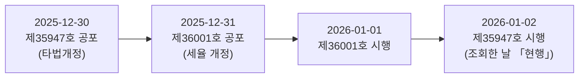
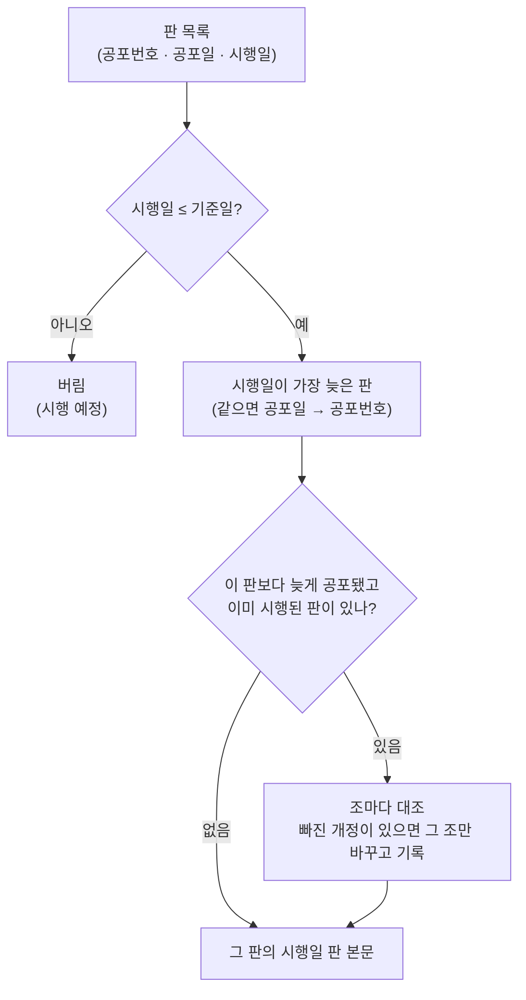

> [!GOAL]
> - 공포일 · 시행일 · 「현행」 표시가 각각 무엇을 뜻하는지, 왜 셋이 엇갈릴 수 있는지 설명할 수 있습니다.
> - 기준일에 효력이 있는 판을 고르는 규칙을 말하고, 「공포일이 가장 늦은 판」 이 틀리는 실제 사례 두 가지를 들 수 있습니다.
> - 조문을 조 · 항 · 호 단위로 쪼개고, 조각마다 첫 줄에 「법령 > 편 > 장 > 조」 경로를 붙이는 까닭을 설명할 수 있습니다.
> - 조각 ID 를 내용이 아니라 자리로 만들어, 다시 색인해도 같은 조각이 둘이 되지 않게 할 수 있습니다.

## 같은 시행령을 두 번 불렀는데 왜 세율이 다를까요?

2026년 10월 3일, 국가법령정보센터 Open API 로 증권거래세법 시행령 제35947호의 제5조(탄력세율)를 두 번 불렀습니다. 법령 일련번호는 같고, 부른 길만 다릅니다. 아래는 응답에서 제5조 머리와 제1호(유가증권시장 · 코스피) · 제3호(코스닥 등)의 첫머리만 옮긴 것입니다.

```output
== target=law · 공포번호 35947 · 시행일자 20260102
   제5조(탄력세율) 법 제8조제2항을 적용받는 주권과 그 세율은 다음 각 호와 같다. <개정 2013.8.27, 2017.2.7, 2019.5.28, 2020.12.29, 2022.12.31>
   1. 유가증권시장(…)에서 양도되는 주권: 영(零). 다만, 2021년 1월 1일부터 2022년 12월 31일까지는 1만분의 8로 하고, …
   3. 다음 각 목의 어느 하나에 해당하는 주권의 경우: 1만분의 15. 다만, …
== target=eflaw · 공포번호 35947 · 시행일자 20260102
   제5조(탄력세율) 법 제8조제2항을 적용받는 주권과 그 세율은 다음 각 호와 같다. <개정 2013.8.27, 2017.2.7, 2019.5.28, 2020.12.29, 2022.12.31, 2025.12.31>
   1. 유가증권시장(…)에서 양도되는 주권: 1만분의 5
   3. 다음 각 목의 어느 하나에 해당하는 주권의 경우: 1만분의 20
```

같은 판, 같은 조인데 코스피 세율이 「영(零)」 과 「1만분의 5」 로 갈립니다. 첫째 응답(`target=law`)은 이 개정령이 **공포될 때의 본문**이고, 둘째 응답(`target=eflaw` · 시행일 `20260102`)은 **그 시행일에 시행 중인 본문**입니다. 둘째 본문의 개정 꼬리표에는 `2025.12.31` 이 하나 더 붙어 있습니다 — 하루 늦게 공포된 다른 개정(제36001호)이 바꾼 세율까지 담겨 있다는 뜻입니다.

2026년 10월에 코스피 주식을 팔 때 맞는 값은 둘째입니다. 첫째 길로 색인을 만들었다면, 근거를 달아 답하는 시스템이 출처까지 정확히 붙인 채 틀린 세율을 말했을 것입니다. 근거 문서를 다루는 일은 「무엇을 찾을까」 보다 먼저 「어느 판을 넣을까」 에서 시작합니다.

## 공포일 · 시행일 · 「현행」 은 무엇이 다를까요?

법령은 만들어지는 날과 효력이 생기는 날이 다릅니다. 국가법령정보센터의 판 목록은 판마다 아래 칸을 줍니다.

**표 1. 판 목록의 칸**

| 말 | 뜻 | 예(증권거래세법 시행령) | 헷갈리기 쉬운 점 |
|---|---|---|---|
| 공포일 | 관보에 실어 널리 알린 날 | 제36001호 2025-12-31 | 공포했다고 바로 효력이 생기지 않는다 |
| 시행일 | 효력이 생기는 날 | 제36001호 2026-01-01 | 한 개정령 안에서도 조마다 시행일이 다를 수 있다 |
| 공포번호 | 공포 차례로 붙는 번호(대통령령 제○호) | 36001 | 번호가 크다고 시행일이 늦은 것은 아니다 |
| 일부개정 · 타법개정 | 그 법을 직접 고친 개정 · 다른 법을 고치며 함께 고친 개정 | 제36001호 일부개정 · 제35947호 타법개정 | 타법개정 판도 본문 전체를 가진 하나의 판이다 |
| 현행 · 연혁 · 시행예정 | 조회한 날 기준의 표시 | 제35947호 「현행」 | 표시는 조회한 날의 것이다 — 기준일이 다르면 다시 골라야 한다 |

증권거래세법 시행령의 마지막 두 판은 공포와 시행의 차례가 뒤집혀 있습니다.



제35947호는 하루 먼저 공포됐지만 하루 늦게 시행됩니다. 2026-01-02 의 시행일 판 본문에는 그 사이에 시행된 제36001호의 세율이 이미 들어 있습니다. 판을 고를 때 볼 날짜는 공포일이 아니라 시행일입니다.

## 기준일에는 어느 판을 골라야 할까요?

규칙은 한 줄입니다.

> **시행일이 기준일보다 늦지 않은 판 가운데 시행일이 가장 늦은 판.** 시행일이 같으면 공포일, 그다음 공포번호가 늦은 판.

「공포일이 가장 늦은 판」 으로 고르면 어떻게 되는지 두 법령으로 봅니다(아래 「직접 해 보기」 의 실제 출력).

**표 2. 두 규칙이 갈린 경우**

| 법령 · 기준일 | 공포일 순 | 시행일 순 | 무엇이 빠지나 |
|---|---|---|---|
| 증권거래세법 시행령 · 2026-10-02 | 제36001호(01-01 시행) | 제35947호(01-02 시행) | 공포일 순은 01-02 에 시행된 타법개정분을 놓친다 |
| 자본시장법 시행령 · 2026-10-02 | 제36729호(10-01 시행) | 제36728호(10-02 시행) | 같은 날(09-29) 공포된 두 판 — 번호가 큰 쪽을 고르면 10-02 에 시행된 조 넷이 빠진다 |
| 자본시장법 시행령 · 2026-09-30 | 제36543호(07-28 시행) | 제36543호(08-04 시행) | 한 개정령에 시행일이 둘 — 공포일만으로는 두 판을 가를 수 없다 |

셋째 줄이 판의 정체를 알려 줍니다. 판은 공포번호 하나가 아니라 **(공포번호, 시행일) 한 쌍**입니다.

시행일 순으로 골라도 확인할 것이 하나 남습니다. 고른 판보다 늦게 공포됐는데 기준일까지 이미 시행된 판(증권거래세법 시행령에서는 제36001호)이 있다면, 고른 판의 본문이 그 개정을 정말 담았는지 조마다 견줘 봅니다. 법령 DB 가 시행일 판을 다시 만들지 않은 경우를 조용히 넘기지 않기 위해서입니다.



## 조문은 어떻게 쪼갤까요?

법령 본문 응답은 조문 하나를 이렇게 줍니다(필요한 칸만).

```json
{
  "조문번호": "464", "조문가지번호": "2", "조문여부": "조문",
  "조문제목": "이익배당의 지급시기",
  "조문내용": "제464조의2(이익배당의 지급시기)",
  "항": [
    {"항번호": "①", "항내용": "① 회사는 제464조에 따른 이익배당을 … 1개월 내에 하여야 한다. …"},
    {"항번호": "②", "항내용": "②제1항의 배당금의 지급청구권은 5년간 이를 행사하지 아니하면 소멸시효가 완성한다."}
  ]
}
```

조각을 만드는 규칙은 넷입니다.

1. **조 하나가 조각 하나입니다.** 답에 「상법 제464조의2」 처럼 조 단위로 출처를 달기 위해서입니다.
2. **긴 조는 항(①②…) 단위로, 항도 길면 호(1. 2.) 단위로 나눕니다.** 한 조각을 1,200자 안팎으로 맞추면 임베딩이 문장 하나하나를 흐리지 않고, 답에 「제○항」 까지 달 수 있습니다.
3. **조각마다 첫 줄에 제목 사슬을 되풀이합니다.** 「상법 > 제3편 회사 > 제4장 주식회사 > 제7절 회사의 회계 > 제464조의2(이익배당의 지급시기)」. 항 하나만 떼어 읽어도 어느 법 · 어느 편의 몇 조인지 알 수 있어야 합니다.
4. **본문 첫머리에 같은 조 머리가 또 있으면 뺍니다.** 항이 없는 조는 응답의 `조문내용` 이 「제638조(보험계약의 의의) 보험계약은 …」 처럼 머리째 옵니다. 그대로 두면 조각마다 같은 머리가 두 번 들어가 벡터가 머리 쪽으로 쏠립니다. 다만 「제2조에 따른 신고를 한 자는 …」 처럼 다른 말이 붙은 첫머리는 그대로 둡니다.

감독규정(행정규칙)은 사정이 다릅니다. 금융투자업규정 본문은 줄바꿈 하나 없는 35만 자 문자열로 옵니다. 「제1-2조의2(제목)」 모양의 머리를 정규식으로 찾되, 본문 속 인용(「영 제2조제6호」)을 머리로 잘못 잡지 않도록 **앞 조의 다음 번호답게 이어지는 머리만** 조의 시작으로 받습니다.

## 조각 첫 줄에 왜 편 · 장 경로를 붙일까요?

같은 낱말이 법의 여러 편에 나오기 때문입니다. 투자 서비스의 근거 색인에 상법 전체를 넣으면, 회사편 말고도 보험편 · 해상편 · 상행위편의 조문이 함께 들어갑니다. 2026-10-03 에 낱말 검색(SQLite FTS5 · 한글 두 글자 묶음)으로 질문 20개의 상위 10개를 세어 보니 이런 일이 있었습니다.

**표 3. 같은 낱말로 다른 편의 조문이 섞인 예**

| 질문 | 섞여 들어온 조문 | 왜 |
|---|---|---|
| 위험 고지 | 상법 제4편 보험 제651조(고지의무위반으로 인한 계약해지) 등 셋 | 보험계약자의 「고지의무」 와 투자 위험의 「고지」 가 같은 낱말이다 |
| 이익배당 한도 | 상법 제2편 상행위 제82조(이익배당과 손실분담) | 익명조합의 이익배당도 「이익배당」 이다 |

조각의 첫 줄이 「상법 제651조(…)」 뿐이면, 낱말 색인도 임베딩도 그 조각이 보험편의 말이라는 것을 모릅니다. 첫 줄이 「상법 > 제4편 보험 > 제1장 통칙 > 제651조(…)」 이면 「보험」 이라는 맥락이 조각 안에 들어갑니다.

이 방법에는 근거가 있습니다. Anthropic 은 조각마다 문서 속 위치를 설명하는 50~100토큰의 맥락을 언어 모델로 만들어 붙였더니, 상위 20개 검색에서 정답을 놓치는 비율이 35%(임베딩만) · 49%(BM25 까지) 줄었다고 보고했습니다(2024-09). 언어 모델을 부르지 않고 문서 제목과 머리 경로만 붙이는 방법도 질문 1,600개 평가에서 MRR@5 를 0.374 에서 0.463 으로 올렸습니다(arXiv 2608.00824 · 2026-08). 법령은 편 · 장 · 절 이름이 이미 정확한 맥락이라, 언어 모델 없이 그 이름을 붙이는 것만으로 같은 효과를 노릴 수 있습니다.

> [!NOTE]
> 경로의 「<개정 2011.4.14>」 같은 꼬리표는 붙이지 않습니다. 그 머리를 고친 날이지 편 · 장의 이름이 아닙니다.

## 조각 ID 는 왜 자리로 만들까요?

벡터 DB 는 같은 ID 로 다시 넣으면 덮어쓰고, 다른 ID 면 새 점을 하나 더 만듭니다. ID 를 파이썬 내장 `hash()` 로 만들면 프로세스마다 값이 달라져(문자열 해시는 실행마다 무작위 씨앗을 쓴다), 다시 색인할 때마다 같은 조각이 새 점으로 쌓입니다.

그래서 ID 는 **자리**로 만듭니다 — `sha256(문서 · 판 · 조 · 순번)` 의 앞 32자. 같은 판의 같은 조는 본문을 고쳐 다시 쪼개도 같은 ID 이고, 벡터 DB 에서는 덮어쓰기가 됩니다. 본문이 바뀌었는지는 ID 가 아니라 따로 둔 **본문 지문**(`sha256(조각 글)`)으로 알아내, 바뀐 조각만 다시 임베딩합니다.

**표 4. ID 와 지문의 몫**

| | 만드는 재료 | 바뀌는 때 | 쓰는 곳 |
|---|---|---|---|
| 조각 ID | 문서 · 판 · 조 · 순번 | 판이 바뀌거나 조가 더 잘게 나뉠 때 | 벡터 DB 의 점 ID · 답의 출처 |
| 본문 지문 | 조각 글 전체 | 머리 규칙 · 본문이 바뀔 때 | 「이 조각을 다시 임베딩해야 하나」 |

## 직접 해 보기 — 판 고르기 · 쪼개기 · ID 를 한 번에

예제 파일은 [`/learn/examples/legal_versions.py`](/learn/examples/legal_versions.py) 입니다. 표준 라이브러리만 씁니다. 판 목록은 2026-10-02 에 받은 목록의 마지막 여섯 줄씩, 조문은 실제 응답에서 필요한 줄만 옮겼습니다.

두 규칙의 차이는 정렬 키 하나입니다.

```python
def by_promulgation(versions, as_of):
    """흔한 실수 — 이미 시행된 판 가운데 가장 늦게 공포된 판(같은 날이면 공포번호가 큰 판)."""
    cands = [v for v in versions if v.effective <= as_of]
    return max(cands, key=lambda v: (v.promulgated, _num(v.no))) if cands else None


def by_effective(versions, as_of):
    """맞는 규칙 — 이미 시행된 판 가운데 시행일이 가장 늦은 판(같으면 공포일 → 공포번호가 늦은 판)."""
    cands = [v for v in versions if v.effective <= as_of]
    return max(cands, key=lambda v: (v.effective, v.promulgated, _num(v.no))) if cands else None
```

조각 ID 는 자리 네 칸을 이어 해시합니다.

```python
def chunk_id(doc, version, article, seq):
    raw = "\x1f".join((doc, version, article, str(seq)))   # 칸 사이에 글에 나오지 않는 구분자
    return hashlib.sha256(raw.encode("utf-8")).hexdigest()[:32]
```

아래는 2026-10-03 이 PC(Python 3.12)에서 실제로 나온 출력입니다.

```bash
python legal_versions.py
```

```output
1) 판 고르기 — 증권거래세법 시행령 · 기준일 2026-10-02
   공포일 순: 제36001호(공포 2025-12-31 · 시행 2026-01-01)
   시행일 순: 제35947호(공포 2025-12-30 · 시행 2026-01-02)
   고른 판보다 늦게 공포된 판: ['제36001호(공포 2025-12-31 · 시행 2026-01-01)']
   같은 제35947호 제5조 제1호를 두 길로 부르면:
     공포 때 본문  → 1. 유가증권시장(…)에서 양도되는 주권: 영(零). 다만, 2021년 1월 1일부터 2022년 12월 31일까지는 1만분의 8로 하고, 2023년 1월 1일부터 2023년 12월 31일까지는 1만분의 5로 하며, …
     시행일 판 본문 → 1. 유가증권시장(…)에서 양도되는 주권: 1만분의 5
2) 판 고르기 — 자본시장법 시행령 · 같은 날(2026-09-29) 공포된 두 판
   기준일 2026-09-30 · 공포일 순 제36543호(2026-07-28 시행) · 시행일 순 제36543호(2026-08-04 시행) · 다르다 ←
   기준일 2026-10-01 · 공포일 순 제36729호(2026-10-01 시행) · 시행일 순 제36729호(2026-10-01 시행) · 같다
   기준일 2026-10-02 · 공포일 순 제36729호(2026-10-01 시행) · 시행일 순 제36728호(2026-10-02 시행) · 다르다 ←
3) 조문 쪼개기 — 첫 줄은 제목 사슬, 본문의 되풀이된 머리는 뺀다
   | 상법 > 제4편 보험 > 제1장 통칙 > 제638조(보험계약의 의의)
   | 보험계약은 당사자 일방이 약정한 보험료를 지급하고 …
   | 상법 > 제3편 회사 > 제4장 주식회사 > 제7절 회사의 회계 > 제464조의2(이익배당의 지급시기)
   | ① 회사는 제464조에 따른 이익배당을 …의 결의를 한 날부터 1개월 내에 하여야 한다. …
4) 조각 ID — 자리로 만들면 몇 번을 다시 만들어도 같다
   첫째 4e879a7b82c5c4fe4e79be01167f9520
   둘째 4e879a7b82c5c4fe4e79be01167f9520 · 같다 True
   순번 1 ddd20cbe9d15ed70ed0475eba23f9861 · 같다 False
```

읽는 법은 이렇습니다.

- **1)** 공포일 순은 제36001호를, 시행일 순은 제35947호를 고릅니다. 시행일 순으로 골라도 「고른 판보다 늦게 공포된 판」 에 제36001호가 남아, 그 개정이 담겼는지 대조할 대상이 됩니다. 같은 제35947호라도 공포 때 본문은 옛 세율, 시행일 판 본문은 새 세율입니다.
- **2)** 2026-10-01 에는 두 규칙이 같은 판을 고르지만, 하루 뒤에는 갈립니다. 09-30 줄은 공포번호가 같은(제36543호) 두 판을 공포일만으로는 가르지 못하는 모습입니다.
- **3)** 첫 줄은 편 · 장 경로를 가진 제목 사슬이고, 「<개정 2011.4.14>」 꼬리표는 빠졌습니다. 제638조는 본문 첫머리의 「제638조(보험계약의 의의)」 가 빠졌습니다.
- **4)** 같은 자리는 몇 번을 만들어도 같은 ID 이고, 순번이 다르면 다른 ID 입니다.

## Qurious 에서는 어떻게 만들까요?

Qurious 는 법령 10 · 감독규정 4, 모두 14개 문서를 이 규칙으로 받아 둡니다(2026-10-03 · 조문 3,463개 · 조각 4,067개).

**표 5. 이 장의 규칙이 사는 곳**

| 무엇 | 파일 · 함수 | 메모 |
|---|---|---|
| 판 고르기 · 늦게 공포된 판 대조 | `app/services/kb_text.py` 의 `select_version` · `later_promulgated` · `missing_changes` | 받는 쪽 · 찾는 쪽이 같은 규칙 한 벌을 쓴다 |
| 받기 · 쪼개기 · 저장 | `collector/kb_law.py` 의 `fetch_doc` · `chunk_article` | 원문은 응답 속 키를 지운 뒤 gzip 으로 보관한다 |
| 제목 사슬 · 머리 되풀이 빼기 | `kb_text.chunk_header` · `strip_heading` · `clean_part` | 경로의 꼬리표는 뺀다 |
| 규칙만 바꿨을 때 다시 쪼개기 | `python -m collector.kb_law rechunk` | 받아 둔 원문으로 같은 길을 다시 돈다 — 14문서 2.8초 · 네트워크 없이 |
| 바뀐 조각만 다시 임베딩 | `collector/kb_index.py` | 본문 지문이 다른 조각을 다시 넣고, 사라진 조각의 점을 지운다 |

실제 법령 응답을 저장해 둔 고정값으로 판 고르기 · 쪼개기 · ID · 키 지우기를 확인하는 자동 시험이 11건 있습니다(`tests/test_kb_law.py`).

## 흔한 실수

**표 6. 흔한 실수**

| 실수 | 무엇이 틀어지나 | 이렇게 |
|---|---|---|
| 법령 일련번호로 본문을 부른다(`target=law`) | 공포 때 본문 — 뒤에 시행된 개정이 빠진다 | 시행일 판(`target=eflaw` + 시행일)으로 부른다 |
| 공포일이 가장 늦은 판을 고른다 | 같은 날 공포 · 공포와 시행이 뒤집힌 경우에 틀린 판 | 시행일이 가장 늦은 판 + 늦게 공포된 판 대조 |
| 「현행」 표시를 그대로 믿는다 | 조회한 날 기준이라 기준일이 다르면 맞지 않는다 | 기준일로 다시 고른다 |
| 판을 공포번호 하나로 센다 | 시행일이 둘인 개정령에서 판이 하나로 뭉친다 | (공포번호, 시행일) 한 쌍 |
| 이름이 비슷한 법령까지 받는다 | 검색이 부분 일치라 「…시행령중개정령의시행일에관한규칙」 이 섞여 온다 | 이름이 똑같은 행만 쓴다 |
| 항만 떼어 조각으로 만든다 | 어느 법 몇 조인지 모르는 조각 | 조각마다 제목 사슬 첫 줄 |
| ID 를 `hash()` 로 만든다 | 다시 색인할 때마다 같은 조각이 쌓인다 | 자리로 만든 sha256 ID |
| 목록 응답을 그대로 저장한다 | 상세 링크 칸에 요청한 API 키가 실려 온다 | 저장 · 출력 전에 키를 지운다 |

## 정리

- 판은 (공포번호, 시행일) 한 쌍이고, 기준일의 판은 **시행일이 가장 늦은 판**입니다. 공포일 순은 같은 날 공포 · 공포와 시행이 뒤집힌 경우에 틀립니다.
- 본문은 시행일 판으로 부르고, 늦게 공포된 판이 있으면 그 개정이 담겼는지 조마다 대조합니다.
- 조각은 조 단위로 만들고, 길면 항 · 호로 나누며, 첫 줄에 「법령 > 편 > 장 > 조」 경로를 붙여 같은 낱말이 어느 편의 말인지 함께 색인합니다.
- 조각 ID 는 자리로, 다시 임베딩할지는 본문 지문으로 정합니다.

<details><summary>확인 문제 1. 2026-01-01 을 기준일로 증권거래세법 시행령의 판을 고르면 어느 판인가요?</summary>

제36001호(2026-01-01 시행)입니다. 제35947호는 2026-01-02 에 시행되므로 기준일에는 아직 시행 전입니다. 이날만큼은 두 규칙이 같은 판을 고릅니다.

</details>

<details><summary>확인 문제 2. 시행일 순으로 골랐는데도 「늦게 공포된 판」 을 따로 대조하는 까닭은 무엇인가요?</summary>

시행일 판 본문은 법령 DB 가 그 시행일 기준으로 만들어 준 글입니다. 뒤에 공포된 개정이 그 글에 반영되지 않은 경우가 생기면 고른 판만 보고는 알 수 없습니다. 조마다 「앞 판 → 늦은 판」 에서 바뀐 곳이 고른 판에도 있는지 견주면, 빠진 개정을 조용히 넘기지 않습니다.

</details>

<details><summary>확인 문제 3. 조각 첫 줄을 「상법 제651조(…)」 에서 「상법 > 제4편 보험 > 제1장 통칙 > 제651조(…)」 로 바꾸면 무엇이 다시 필요한가요?</summary>

조각 글이 바뀌었으므로 본문 지문이 바뀌고, 그 조각은 다시 임베딩해야 합니다. 조각 ID 는 자리로 만들었으니 그대로이고, 벡터 DB 에서는 같은 점을 덮어씁니다. 다만 머리가 길어져 한 조가 더 잘게 나뉘면 순번이 달라져, 사라진 순번의 점은 따로 지워야 합니다.

</details>

## 더 읽을거리

- 국가법령정보센터 Open API — <https://open.law.go.kr>
- Anthropic, 「Introducing Contextual Retrieval」, 2024-09 — <https://www.anthropic.com/news/contextual-retrieval>
- Yang Yang, 「Structure-Aware Semantic Chunking with Title-Chain Prefixes: A 1600-Query Evaluation and the Measurement Trap in Text-Transform Ablations」, arXiv 2608.00824, 2026-08 — <https://arxiv.org/abs/2608.00824>
- Qdrant, 「A Complete Guide to Filtering in Vector Search」 — <https://qdrant.tech/articles/vector-search-filtering/>

## 이 장의 용어

| 말 | 뜻 | 이 장에서 | 헷갈리기 쉬운 점 |
|---|---|---|---|
| 공포 | 법령을 관보에 실어 알리는 일 | 판 목록의 공포일 · 공포번호 | 공포일과 시행일은 다를 수 있다 |
| 시행 | 법령의 효력이 생기는 일 | 판을 고르는 기준 | 한 개정령 안에서도 조마다 다를 수 있다 |
| 판 | 한 시점에 시행 중인 법령 본문 하나 | (공포번호, 시행일) | 「현행」 은 조회한 날의 판일 뿐이다 |
| 타법개정 | 다른 법령을 고치며 함께 고친 개정 | 제35947호 · 제36728호 | 이것도 본문 전체를 가진 하나의 판이다 |
| 시행일 판 본문 | 그 시행일에 시행 중인 본문 | `target=eflaw` | 공포 때 본문(`target=law`)과 다르다 |
| 조 · 항 · 호 · 목 | 조문의 단위(제○조 › ① › 1. › 가.) | 쪼개는 단위 | 행정규칙 본문은 이 구조 없이 한 줄로 온다 |
| 제목 사슬 | 문서 제목부터 편 · 장 · 절 · 조까지 이은 경로 | 조각의 첫 줄 | 개정 꼬리표는 넣지 않는다 |
| 조각 ID | 조각을 가리키는 고정 이름 | sha256(문서 · 판 · 조 · 순번) | 내용이 아니라 자리로 만든다 |
| 본문 지문 | 조각 글의 해시 | 다시 임베딩할지 판단 | 머리 규칙만 바뀌어도 달라진다 |
