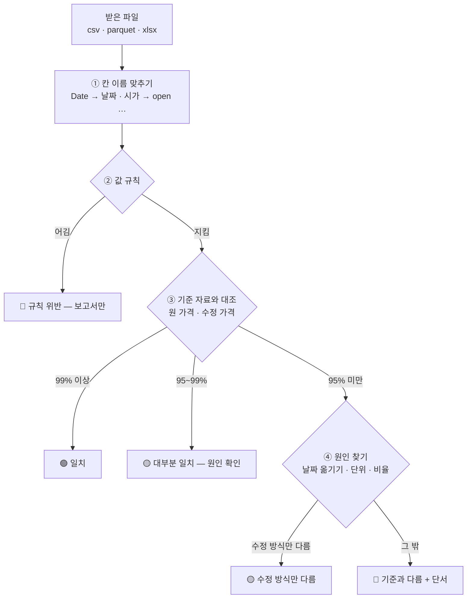

> [!GOAL]
> - 값 규칙 위반과 「출처가 다르게 적었을 뿐」 인 차이를 구분할 수 있습니다.
> - 하루 밀림 · 단위 차이 · 수정 방식 차이를 숫자로 알아내는 방법을 쓸 수 있습니다.
> - 일치율 문턱(99% · 95%)으로 판정하고, 검사 보고서를 읽을 수 있습니다.

## 같은 종목 같은 날의 종가가 출처마다 다를 수 있나요?

다를 수 있고, 다른 까닭은 대개 몇 가지로 정해져 있습니다. 앞 장들에서 이미 만난 것들입니다. 카카오의 2021-04-09 종가는 원자료로 558,000원, 기준가 계수로 고친 수정 가격으로 112,000원, 야후의 `Close` 로 111,600원, 야후의 `Adj Close` 로 110,981.9원이었습니다. 여기에 시간대를 잘못 바꿔 날짜가 하루 밀린 파일, 가격을 천 원 단위로 적은 파일이 더해집니다.

반대로 같은 기준끼리는 거의 같습니다. 삼성전자의 2026-09-23 ~ 09-30 일봉을 야후에서 받아 거래소 원자료와 견줘 보면 종가와 거래량이 한 원, 한 주까지 같았습니다([분봉과 시간대](#/p/intraday-timezone)). 기간을 2025년부터로 넓히면 423일 가운데 4일은 달랐는데, 이 차이를 어떻게 다루는지는 아래 「문턱」 절에서 봅니다. 그래서 검사의 목표는 「다른가」 가 아니라 **「왜 다른가」 를 가려내 같은 기준으로 맞출 수 있는지 판정하는 것**입니다.

## 검사는 어떤 순서로 하나요?



순서에 까닭이 있습니다. 값 규칙은 기준 자료 없이도 볼 수 있으니 먼저 봅니다. 규칙을 어긴 파일은 대조해 봐야 결과를 믿을 수 없습니다. 대조에서 일치율이 낮으면 바로 버리지 않고, 앞 장들에서 본 흔한 원인을 하나씩 대입해 봅니다.

## 무엇을 「같다」 고 볼까요? — 허용 오차

두 종가가 정확히 같은지만 보면 수정 가격끼리는 거의 늘 「다르다」 가 나옵니다. 수정 가격은 원 가격에 계수를 곱한 소수라서, 출처마다 반올림하는 자리가 다르기 때문입니다. 예를 들어 가온전선의 권리락 전날 시가 329,500원에 계수 0.5556851 을 곱하면 183,098.25원이고, 어떤 곳은 183,098 로, 어떤 곳은 183,098.3 으로 적습니다.

그래서 차이가 1원 이하이거나 0.01% 이하이면 같다고 봅니다.

```python
def same(a: float, b: float) -> bool:
    return abs(a - b) <= max(1.0, abs(b) * 0.0001)
```

1원은 정수로 반올림한 차이를, 0.01% 는 값이 클 때의 반올림 차이를 덮습니다. 분할 비율과 기준가 계수의 차이(0.36%)는 이 오차보다 훨씬 커서 「같다」 로 넘어가지 않습니다. 그 차이는 따로 찾아내야 합니다.

## 일곱 가지 파일로 판정해 보기

예제 [`quality_check.py`](/learn/examples/quality_check.py) 는 카카오의 2021-04-05 ~ 04-23 일봉(원 가격과 수정 가격)을 기준으로 두고, 그 기준에서 흔한 문제를 하나씩 넣은 가짜 파일 일곱 개를 만들어 판정합니다.

```output
[정상(원 가격)] 🟢 일치 (원 가격) · 원 가격 일치 100% · 수정 가격 일치 47%
[수정 가격] 🟢 일치 (수정 가격) · 원 가격 일치 47% · 수정 가격 일치 100%
[하루 밀림] 🔴 기준과 다름 · 원 가격 일치 36% · 수정 가격 일치 14%
    단서: 날짜를 하루 뒤로 옮기면 일치율 100% — 날짜가 밀려 있음(시간대 의심)
[천 원 단위] 🔴 기준과 다름 · 원 가격 일치 0% · 수정 가격 일치 0%
    단서: 기준 ÷ 받은 값의 가운데 값 1,000 — 천 원 단위로 보임
[같은 날 두 줄] 🔴 규칙 위반 · 원 가격 일치 94% · 수정 가격 일치 44%
    규칙: 2021-04-14 같은 날짜가 두 줄
[규칙 위반] 🔴 규칙 위반 · 원 가격 일치 100% · 수정 가격 일치 47%
    규칙: 2021-04-06 저가 ≤ 시가·종가 ≤ 고가 를 어김
    규칙: 2021-04-19 거래량이 음수
[분할 비율로 고친 값] 🟡 수정 방식만 다름 · 원 가격 일치 47% · 수정 가격 일치 47%
    단서: 분할 전 구간에서 받은 값 ÷ 기준 수정 값 = 0.99643 로 일정 — 수정 방식이 다름 (받은 자료의 계수 0.20000 = 1/5.000)
```

몇 줄은 더 들여다볼 만합니다.

정상 파일인데도 수정 가격과의 일치율이 47% 입니다. 분할 뒤 일곱 날은 원 가격과 수정 가격이 같아서, 분할 전 여덟 날만 어긋나기 때문입니다. 일치율 하나만 보면 「절반만 맞는 자료」 로 오해할 수 있으니, 원 가격과 수정 가격 두 기준을 함께 재고 높은 쪽을 그 파일의 기준으로 봅니다.

하루 밀린 파일이 원 가격과 36% 나 맞습니다. 거래정지 사흘의 종가가 558,000원으로 같고, 그 뒤에도 119,000원 · 117,500원처럼 같은 종가가 이틀씩 이어진 날이 있어서, 날짜가 하루 밀려도 우연히 맞는 날이 생깁니다. **그래서 일치율이 낮을 때는 날짜를 하루 앞 · 뒤로 옮겨 다시 재 봐야 합니다.** 옮겨서 100% 가 되면 밀림이 원인입니다.

```python
def match_rate(rows, ref, shift=0, scale=1.0):
    ref_close = {r[0]: r[4] for r in ref}
    hits = total = 0
    for d, *_, c, _v in rows:
        if d not in DAYS:
            continue
        i = DAYS.index(d) + shift                   # 받은 날짜를 거래일 달력에서 shift 칸 옮긴다
        if 0 <= i < len(DAYS) and DAYS[i] in ref_close:
            total += 1
            hits += same(c * scale, ref_close[DAYS[i]])
    return hits / total if total else 0.0
```

날짜를 옮길 때는 달력의 하루가 아니라 거래일 달력의 한 칸을 옮깁니다. 금요일 자료가 하루 밀리면 토요일이 아니라 다음 주 월요일 자리와 견줘야 하기 때문입니다.

분할 비율로 고친 파일은 원 가격과도, 수정 가격과도 47% 만 맞습니다. 그런데 분할 전 구간의 「받은 값 ÷ 기준 수정 값」 이 모두 0.99643 으로 같습니다. 값이 틀린 것이 아니라 계수가 다른 것이고, 그 계수를 되짚으면 정확히 1/5 이 나옵니다. 이 경우는 버릴 자료가 아니라 계수를 맞춰 쓸 자료라서 🟡 로 판정합니다.

## 검사 보고서에는 무엇을 남기나요?

판정만 남기면 나중에 「왜 🔴 였지?」 를 다시 재야 합니다. 판정에 쓴 숫자와 단서를 함께 남깁니다.

```output
보고서 한 개의 모양 (하루 밀림)
{
  "rows": 14,
  "rule_problems": [],
  "match": {
    "raw": 0.3571,
    "adjusted": 0.1429
  },
  "price_basis": "원 가격",
  "hints": [
    "날짜를 하루 뒤로 옮기면 일치율 100% — 날짜가 밀려 있음(시간대 의심)"
  ],
  "verdict": "🔴 기준과 다름"
}
```

<small>`python quality_check.py` · 2026-10-01 실행 · Python 3.12.13 · 표준 라이브러리만</small>

## 문턱을 99% 와 95% 로 둔 까닭은?

기준이 같은 두 자료도 100% 맞지는 않습니다. 삼성전자의 2025-01-02 ~ 2026-09-30 일봉을 야후에서 받아 거래소 원자료와 견줘 보면 423일 가운데 419일이 같고 4일이 달랐습니다(99.05%). 가장 크게 다른 날은 2025-10-02 로, 야후 종가가 89,750원 · 원자료가 89,000원이었습니다(0.84%). 같은 기간 거래대금 상위 ETF 20종목은 424일이 모두 같았습니다.

그래서 99% 이상을 「일치」 로 둡니다. 95~99% 는 「대부분 맞지만 사람이 어긋난 날을 봐야 하는」 구간이고, 보고서에 어긋난 날의 예시를 다섯 줄까지 함께 싣습니다. 95% 아래는 기준이 다르거나 자료가 깨진 것이라 원인을 찾기 전에는 쓰지 않습니다. 이 숫자들은 고정된 정답이 아니라 출발점이고, 실제 파일을 판정해 보며 고칩니다.

## 실제로 받은 파일을 검사해 보면

예제가 아니라 실제 도구(`python -m collector.intake`)에 흔히 받는 파일 두 개를 넣어 봤습니다. 하나는 yfinance 로 받아 그대로 저장한 삼성전자 일봉, 하나는 FinanceDataReader 로 받은 KODEX 200 입니다.

```output
[samsung_yf.csv] 🟢 일치 · 423줄
  005930 🟢 일치 · 원 0.9905 · 수정 0.9905 · 수정 방식 raw
[kodex200_fdr.csv] 🟡 확인 필요 · 424줄
  069500 🟡 수정 방식만 다름 · 원 0.0991 · 수정 0.0991 · 수정 방식 adj_total
      단서: 「받은 값 ÷ 원 가격」 이 0.9706 에서 1 로 계단처럼 커진다 — 배당 · 분배금까지 고친 값으로 보인다(야후 Adj Close · auto_adjust=True · FinanceDataReader 의 ETF 가격)
```

<small>2026-10-01 실행 · 받은 기간 2025-01-02 ~ 2026-09-30 · yfinance 0.2.66 · FinanceDataReader 0.9.202</small>

yfinance 로 저장한 파일은 머리가 「Price / Ticker / Date」 세 줄이고 `Adj Close` 칸이 맨 앞에 있습니다. 도구는 이 모양을 알아보고 `Close` 를 종가로 씁니다. KODEX 200 은 원자료와 9.9% 만 같았는데, 받은 값과 원자료의 비율이 과거로 갈수록 조금씩 작아지는 계단 모양이었습니다. ETF 가 분배금을 줄 때마다 그 앞 가격을 고친 자료라는 뜻입니다. 분배금이 없는 레버리지 · 인버스 ETF 는 같은 출처에서도 원자료와 100% 같았습니다.

## Qurious 는 받은 시세를 이렇게 검사합니다

- 칸 이름을 공통 규격(종목 · 시장 · 주기 · 날짜 · 시가 · 고가 · 저가 · 종가 · 거래량 · 수정 여부 · 출처)으로 맞춘 뒤 값 규칙을 봅니다.
- 기준은 매일 받아 두는 거래소 원자료와, 그로 만든 수정 가격 두 가지입니다. 겹치는 종목 · 날짜의 종가로 일치율을 재고, 낮으면 날짜 옮기기 · 단위 · 수정 방식을 차례로 봅니다.
- 판정과 숫자는 보고서 파일로 남기고, 통과한 자료만 정리(중복 · 거래일 밖 · 종목코드 6자리 · KST 날짜)해 따로 보관합니다. 원래 자료와 합치지 않고 출처 표시로 고르게 둡니다.
- 분봉처럼 기준 자료가 없는 것은 값 규칙만 보고 「대조 불가」 로 표시합니다.

## 흔한 실수

1. **일치율 하나만 보기** — 정상 파일도 수정 가격과는 47% 였습니다. 두 기준을 함께 잽니다.
2. **일치율이 낮으면 바로 버리기** — 하루 밀림 · 천 원 단위 · 수정 방식 차이는 고쳐 쓸 수 있는 자료입니다.
3. **허용 오차 없이 견주기** — 수정 가격은 소수라 반올림 자리만 달라도 「다르다」 가 됩니다.
4. **날짜를 달력의 하루로 옮기기** — 거래일 달력의 한 칸으로 옮겨야 주말을 건너뜁니다.
5. **검사를 통과한 자료를 원래 자료에 바로 합치기** — 출처가 섞이면 나중에 어느 값이 어디서 왔는지 모릅니다. 출처 칸을 두고 따로 둡니다.

## 정리

- 출처마다 값이 다른 까닭은 대개 수정 방식 · 날짜(시간대) · 단위입니다. 검사는 그 까닭을 가려내는 일입니다.
- 순서는 값 규칙 → 원 · 수정 두 기준과 대조 → 낮으면 원인 찾기(날짜 옮기기 · 단위 · 구간 비율)입니다.
- 「같다」 는 1원 · 0.01% 오차 안이고, 판정은 99% · 95% 문턱으로 나눕니다.
- 판정과 근거 숫자를 보고서로 남기고, 통과한 자료는 출처를 붙여 따로 둡니다.

<details>
<summary>확인 문제 1 — 받은 파일이 원 가격과 30%, 수정 가격과 10% 맞습니다. 날짜를 하루 앞으로 옮기니 원 가격과 100% 맞습니다. 판정과 원인은?</summary>

그대로는 🔴(기준과 다름)이지만, 원인은 날짜가 하루 밀린 것입니다. 시간대를 잘못 바꿔 KST 의 날짜 대신 UTC 날짜를 적었을 가능성이 큽니다. 날짜를 고쳐 다시 검사하면 🟢 가 됩니다.
</details>

<details>
<summary>확인 문제 2 — 「기준 ÷ 받은 값」 이 모든 날 1,000 근처입니다. 무엇을 의심하나요?</summary>

가격이 천 원 단위로 적힌 파일입니다. 받은 값에 1,000 을 곱해 다시 견줘 봅니다.
</details>

<details>
<summary>확인 문제 3 — 분할 전 구간의 「받은 값 ÷ 기준 수정 값」 이 날마다 0.990 · 0.996 · 1.003 처럼 들쭉날쭉합니다. 수정 방식 차이일까요?</summary>

아닙니다. 수정 방식이 다르면 그 구간 전체가 한 계수로 곱해진 것이라 비율이 한 숫자로 일정해야 합니다. 들쭉날쭉하면 다른 종목 · 다른 날짜의 값이 섞였거나 값 자체가 틀린 것입니다.
</details>

## 더 읽을거리

- 금융위원회 「주식시세정보」 — 공공데이터포털 <https://www.data.go.kr/data/15094808/openapi.do> · 기준 자료의 항목과 갱신 주기. 2026-10-01 확인.
- yfinance `download` 문서 — <https://ranaroussi.github.io/yfinance/reference/api/yfinance.download.html> · `auto_adjust` 기본값이 받는 값의 수정 방식을 정한다. 2026-10-01 확인.
- pandera 문서 — <https://pandera.readthedocs.io/en/stable/> · 표 자료의 칸마다 규칙(범위 · 형식)을 선언하고 검사하는 라이브러리. 값 규칙을 규모 있게 적을 때 쓸 수 있다. 0.33.0, 2026-10-01 확인.

**용어**

| 말 | 뜻 |
|---|---|
| 값 규칙 | 기준 자료 없이도 확인할 수 있는 봉의 조건 — 가격 > 0 · 저가 ≤ 시가 · 종가 ≤ 고가 등 |
| 대조 · 일치율 | 같은 종목 · 날짜의 값을 기준 자료와 견주는 것 · 겹치는 날 중 같은 날의 비율 |
| 허용 오차 | 「같다」 로 볼 차이의 한도 — 이 교재는 1원 또는 0.01% |
| 하루 밀림 | 날짜가 거래일 한 칸씩 어긋난 자료 — 시간대 변환 실수에서 자주 생긴다 |
| 수정 방식 | 과거 가격을 고친 기준 — 원 가격 · 기준가 계수 · 분할 비율 · 배당까지 |
| 검사 보고서 | 판정과 그 근거(일치율 · 위반 · 단서)를 남긴 파일 |
