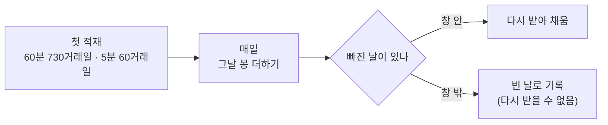

> [!GOAL]
> - UTC 로 적힌 봉 시각을 KST 로 바꾸고, 그 봉이 속한 거래일을 정할 수 있습니다.
> - 정규장 · 시가 단일가 · 종가 단일가 · 장 밖을 시각으로 가를 수 있습니다.
> - 분봉 출처가 주는 범위(하루 몇 개 · 과거 며칠)를 확인하고, 일봉과 맞지 않는 까닭을 설명할 수 있습니다.

## 09:00 에 시작한 봉이 왜 00:00 으로 오나요?

야후 파이낸스 같은 해외 출처는 시각을 협정 세계시(UTC)로 줍니다. 한국 시간(KST)은 UTC 보다 9시간 빠르므로, 한국 장이 열리는 09:00 KST 는 같은 날 00:00 UTC 이고 장이 끝나는 15:30 KST 는 06:30 UTC 입니다. 시각 끝에 붙은 `Z` 나 `+00:00` 이 「이 시각은 UTC」 라는 표시이고, KST 는 `+09:00` 을 붙여 적습니다.

<figure>
<svg viewBox="0 0 760 200" xmlns="http://www.w3.org/2000/svg" role="img" aria-label="KST 와 UTC 의 장 시간 대응">
<rect x="8" y="8" width="744" height="184" rx="14" fill="#f8fafc" stroke="#dde2ec"/>
<text x="24" y="40" font-size="13" font-weight="700" fill="#0f172a">KST</text>
<text x="24" y="122" font-size="13" font-weight="700" fill="#0f172a">UTC</text>
<line x1="80" y1="56" x2="736" y2="56" stroke="#94a3b8"/>
<line x1="80" y1="138" x2="736" y2="138" stroke="#94a3b8"/>
<rect x="140" y="44" width="54" height="24" fill="#fde68a"/>
<rect x="194" y="44" width="351" height="24" fill="#bfdbfe"/>
<rect x="527" y="44" width="18" height="24" fill="#fca5a5"/>
<rect x="140" y="126" width="54" height="24" fill="#fde68a"/>
<rect x="194" y="126" width="351" height="24" fill="#bfdbfe"/>
<rect x="527" y="126" width="18" height="24" fill="#fca5a5"/>
<text x="140" y="86" font-size="11.5" fill="#334155" text-anchor="middle">08:30</text>
<text x="194" y="86" font-size="11.5" fill="#334155" text-anchor="middle">09:00</text>
<text x="527" y="86" font-size="11.5" fill="#334155" text-anchor="middle">15:20</text>
<text x="562" y="86" font-size="11.5" fill="#334155" text-anchor="middle">15:30</text>
<text x="140" y="168" font-size="11.5" fill="#334155" text-anchor="middle">전날 23:30</text>
<text x="194" y="168" font-size="11.5" fill="#334155" text-anchor="middle">00:00</text>
<text x="527" y="168" font-size="11.5" fill="#334155" text-anchor="middle">06:20</text>
<text x="562" y="168" font-size="11.5" fill="#334155" text-anchor="middle">06:30</text>
<text x="600" y="40" font-size="11.5" fill="#64748b">노랑 = 시가 단일가(주문만)</text>
<text x="600" y="58" font-size="11.5" fill="#64748b">파랑 = 정규장(접속 매매)</text>
<text x="600" y="76" font-size="11.5" fill="#64748b">빨강 = 종가 단일가</text>
<text x="600" y="122" font-size="11.5" fill="#64748b">같은 순간, 9시간 차이</text>
</svg>
<figcaption>그림 1. 한국 정규장을 두 시간대로 — 장 안의 봉은 KST 와 UTC 의 날짜가 같지만, 장 시작 전 주문 시간(08:30~09:00)은 UTC 로 전날입니다.</figcaption>
</figure>

예제 [`intraday_kst.py`](/learn/examples/intraday_kst.py) 의 `to_kst` 는 UTC 시각 글자를 KST 시각으로 바꿉니다. 시간대 정보는 Python 표준 라이브러리의 `zoneinfo` 로 다룹니다.

```python
from datetime import datetime
from zoneinfo import ZoneInfo

KST = ZoneInfo("Asia/Seoul")

def to_kst(utc_text: str) -> datetime:
    return datetime.fromisoformat(utc_text.replace("Z", "+00:00")).astimezone(KST)
```

```output
① UTC → KST
  2026-09-30T00:00:00Z  →  2026-09-30 09:00 KST  정규장           UTC 날짜 2026-09-30 · KST 거래일 2026-09-30
  2026-09-30T05:55:00Z  →  2026-09-30 14:55 KST  정규장           UTC 날짜 2026-09-30 · KST 거래일 2026-09-30
  2026-09-30T06:20:00Z  →  2026-09-30 15:20 KST  종가 단일가        UTC 날짜 2026-09-30 · KST 거래일 2026-09-30
  2026-09-30T06:30:00Z  →  2026-09-30 15:30 KST  장 밖           UTC 날짜 2026-09-30 · KST 거래일 2026-09-30
  2026-09-29T23:40:00Z  →  2026-09-30 08:40 KST  시가 단일가(주문만)   UTC 날짜 2026-09-29 · KST 거래일 2026-09-30
  2026-09-29T15:00:00Z  →  2026-09-30 00:00 KST  장 밖           UTC 날짜 2026-09-29 · KST 거래일 2026-09-30
```

마지막 두 줄을 보세요. 08:40 KST 와 00:00 KST 는 UTC 로는 전날입니다. UTC 날짜를 그대로 거래일로 쓰면 하루가 밀립니다. 특히 마지막 줄처럼 일봉을 「그날 자정(KST)」 으로 적은 자료를 UTC 로 저장하면 모든 일봉이 하루씩 앞당겨집니다. 거래일은 반드시 KST 로 바꾼 뒤의 날짜로 정합니다.

## 봉의 시각은 시작일까요, 끝일까요?

09:00 이 붙은 5분봉은 09:00~09:05 의 봉일 수도, 08:55~09:00 의 봉일 수도 있습니다. 출처마다 관례가 다르므로 하루의 첫 봉과 마지막 봉을 보고 정합니다. 첫 봉이 09:00 이면 시작 시각을 붙인 것이고, 09:05 이면 끝 시각을 붙인 것입니다. 아래에서 받아 볼 야후의 5분봉은 첫 봉이 09:00 이므로 시작 시각입니다.

시작 시각으로 통일해 두면 다른 주기와 맞추기 쉽습니다. 09:00 에 시작한 60분봉 하나에는 09:00 · 09:05 · … · 09:55 에 시작한 5분봉 열두 개가 들어갑니다.

## 장 시간 안팎은 어떻게 가르나요?

**표 1. 한국 주식시장의 시간 (유가증권시장 · 코스닥 정규시장)**

| 구간 | KST | UTC | 무엇이 일어나나 |
|---|---|---|---|
| 시가 단일가 | 08:30~09:00 | 23:30~00:00 (전날) | 주문만 받고, 09:00 에 한 가격으로 체결해 시가를 정한다 |
| 정규장 — 접속 매매 | 09:00~15:20 | 00:00~06:20 | 주문이 들어오는 대로 체결한다 |
| 정규장 — 종가 단일가 | 15:20~15:30 | 06:20~06:30 | 주문을 모아 15:30 에 한 가격으로 체결해 종가를 정한다 |
| 장 밖 | 그 밖 | 그 밖 | 시간외 거래 등 — 정규장 봉에 넣지 않는다 |

```python
def session(kst):
    t = kst.timetz().replace(tzinfo=None)
    if time(15, 20) <= t < time(15, 30):
        return "종가 단일가"
    if time(9, 0) <= t < time(15, 30):
        return "정규장"
    if time(8, 30) <= t < time(9, 0):
        return "시가 단일가(주문만)"
    return "장 밖"
```

정규장은 09:00~15:30 이고, 그 마지막 10분이 종가 단일가입니다. 장 밖의 봉을 지우지는 않습니다. 따로 표시해 두면 「장 밖 체결까지 볼 것인가」 를 분석하는 쪽이 고를 수 있습니다.

## 실제로 받은 분봉은 하루에 몇 개일까요?

정규장 6시간 30분을 5분으로 나누면 78개여야 합니다. 삼성전자(005930.KS)의 5분봉을 야후에서 받아 날짜별로 세어 보고, 같은 출처의 일봉과 견줘 봤습니다.

```output
③ 야후 5분봉 · 받은 시각 2026-10-01 12:25 KST · 시간대 UTC
  2026-09-23  봉  72개  09:00~14:55  분봉 거래량 합  14,254,427 / 일봉  20,864,376 =  68.3%  마지막 분봉 종가   284,250 · 일봉 종가   285,500
  2026-09-28  봉  72개  09:00~14:55  분봉 거래량 합  14,895,841 / 일봉  21,346,064 =  69.8%  마지막 분봉 종가   271,500 · 일봉 종가   270,000
  2026-09-29  봉  72개  09:00~14:55  분봉 거래량 합  12,286,415 / 일봉  15,963,864 =  77.0%  마지막 분봉 종가   270,500 · 일봉 종가   272,500
  2026-09-30  봉  72개  09:00~14:55  분봉 거래량 합  11,794,975 / 일봉  16,477,580 =  71.6%  마지막 분봉 종가   270,000 · 일봉 종가   268,500
```

<small>`python intraday_kst.py --live` · 2026-10-01 실행 · yfinance 0.2.66 · 09-24 · 09-25 는 추석 연휴라 없음</small>

하루 72개, 마지막 봉은 14:55 입니다. 15:00~15:30 이 통째로 없습니다. 같은 날 1분봉은 하루 360개(09:00~14:59), 60분봉은 하루 6개(09:00~14:00)였으니 주기와 상관없이 15:00 에서 끝납니다. 그래서 분봉 거래량을 다 더해도 일봉 거래량의 68~77% 이고, 마지막 분봉의 종가는 일봉 종가(15:30 단일가)와 다릅니다. 반대로 이 나흘의 야후 일봉 종가와 거래량은 거래소 원자료와 한 원 · 한 주까지 같았습니다(기간을 넓히면 드물게 다른 날이 있습니다 — [데이터 품질 검사](#/p/data-quality-check)).

이 결과에서 두 가지를 정합니다. 일봉은 분봉을 더해 만들지 않고 일봉 출처에서 받습니다. 그리고 분봉 자료에는 「이 출처는 09:00~15:00 만 준다」 를 함께 적어 둡니다. 장 마감 무렵의 움직임을 보는 분석이라면 이 분봉으로는 할 수 없다는 뜻입니다.

## 과거 분봉은 얼마나 받을 수 있나요?

분봉은 출처마다 과거로 받을 수 있는 기간이 짧습니다. 야후에 기간을 바꿔 가며 요청해 보면 이렇습니다.

**표 2. 야후 분봉 — 받을 수 있는 과거 (005930.KS · 2026-10-01 요청)**

| 주기 | `period` 로 요청 | 받은 범위 | 날짜(`start`)로 요청할 때의 한도 |
|---|---|---|---|
| 1분 | `7d` | 7거래일 | 최근 30일 안 · 한 번에 8일까지 — 09-15~23 요청 → 2,160개 · 09-14~30 요청은 오류 |
| 5분 | `60d` | 2026-07-06 09:00 ~ · 4,268개 | 최근 60일 안 — 07-01 요청은 오류 |
| 60분 | `730d` | 2023-09-27 09:00 ~ · 4,360개 | 최근 730일 안 — 2024-08-01 요청은 오류 |

한도를 넘겨 날짜로 요청하면 오류 문장이 그대로 옵니다.

```output
['005930.KS']: YFPricesMissingError('possibly delisted; no price data found  (5m 2026-07-01 -> 2026-07-03) (Yahoo error = "5m data not available for startTime=1782831600 and endTime=1783004400. The requested range must be within the last 60 days.")')
```

`possibly delisted`(상장폐지된 듯)라는 말이 앞에 붙지만 종목 문제가 아니라 기간 문제입니다. 오류 문장의 뒷부분까지 읽어야 합니다. 또 `period="60d"` 는 거래일로 세는지 2026-07-06 부터 왔고, 날짜로 요청할 때의 한도는 달력 날짜로 셉니다. 같은 「60일」 이 요청 방법에 따라 다릅니다.

이 창 밖의 분봉은 나중에 다시 받을 방법이 없습니다. 그래서 처음 한 번은 창 전체를 받고, 그 뒤로는 날마다 그날 봉을 더해 쌓아 갑니다. 하루라도 거르면 그날의 1분봉은 30일이 지나면 영영 못 받습니다.



## 흔한 실수

1. **UTC 날짜를 거래일로 쓰기** — 장 시작 전 · 자정 표기 자료가 하루 밀립니다. KST 로 바꾼 뒤 날짜를 잡습니다.
2. **시간대 표시를 잃은 값에 다른 시간대를 붙이기** — 원래 UTC 였던 00:00 에 KST 를 붙이면 9시간 이른 봉이 됩니다.

```output
② 흔한 실수 — 시간대 표시를 잃은 값(naive)에 시간대를 잘못 붙이기
  잘못  naive.replace(tzinfo=KST)                         → 2026-09-30 00:00 KST  (9시간 이른 봉)
  맞음  naive.replace(tzinfo=timezone.utc).astimezone(KST) → 2026-09-30 09:00 KST
```

3. **분봉을 더해 일봉을 만들기** — 이 출처는 15:00 이후를 주지 않아 거래량이 30% 가까이 모자랍니다.
4. **60분봉이 하루 7개라고 가정하기** — 실제로 받은 것은 6개였습니다. 개수를 가정하지 말고 받은 자료로 셉니다.
5. **`possibly delisted` 오류를 보고 종목을 지우기** — 기간 한도를 넘긴 요청에서도 같은 말이 나옵니다.

## Qurious 의 분봉은 이렇게 받습니다

- 5분봉 · 60분봉을 받고, 봉의 시각은 시작 시각을 KST(`+09:00`)로 바꿔 둡니다. 거래일은 KST 날짜입니다.
- 정규장 · 단일가 · 장 밖 표시를 봉마다 붙이고, 출처가 주는 시간 범위(지금은 09:00~15:00)를 자료 설명에 적습니다.
- 처음에 받을 수 있는 창 전체를 받고, 그 뒤로는 매 거래일 새 봉을 더합니다. 일봉은 분봉에서 만들지 않습니다.

## 정리

- 해외 출처의 봉 시각은 UTC 입니다. KST 로 바꾼 뒤 날짜를 잡아야 하루 밀림이 없습니다.
- 봉 시각은 시작 시각으로 통일하고, 장 시간 표시로 정규장과 그 밖을 나눕니다.
- 실제로 받은 분봉은 15:00 에서 끝나 일봉과 맞지 않았습니다 — 일봉은 일봉 출처에서 받습니다.
- 분봉은 받을 수 있는 과거가 짧으므로 처음에 창 전체를 받고 날마다 쌓습니다.

<details>
<summary>확인 문제 1 — 2026-10-05T23:45:00Z 에 붙은 주문 시각은 한국 시간으로 언제이고 어느 구간인가요?</summary>

2026-10-06 08:45 KST, 시가 단일가(주문만) 구간입니다. UTC 날짜는 10-05 지만 그 주문이 속한 거래일은 10-06 입니다.
</details>

<details>
<summary>확인 문제 2 — 어떤 출처의 5분봉이 하루 첫 봉을 09:05 로 적었습니다. 이 봉은 몇 시부터 몇 시까지의 봉인가요?</summary>

09:00~09:05 입니다. 첫 봉이 09:05 라면 끝 시각을 붙이는 출처입니다. 시작 시각으로 통일하려면 5분을 빼서 09:00 으로 적습니다.
</details>

<details>
<summary>확인 문제 3 — 1분봉을 날마다 받다가 열흘 동안 잊었습니다. 그 열흘의 1분봉을 모두 되찾을 수 있나요?</summary>

받은 출처의 1분봉 한도가 「최근 30일 안」 이므로 열흘 전 것은 아직 받을 수 있습니다. 날짜로 요청할 때는 한 번에 8일까지만 받으므로 두 번에 나눠 받습니다. 30일이 지나면 되찾을 수 없습니다.
</details>

## 더 읽을거리

- Python 문서 `zoneinfo` — <https://docs.python.org/3/library/zoneinfo.html> · IANA 시간대 이름(`Asia/Seoul`)으로 시간대를 다룬다.
- yfinance `download` 문서 — <https://ranaroussi.github.io/yfinance/reference/api/yfinance.download.html> · `interval` · `period` · `start` · `end`. 2026-10-01 확인.
- 찾기 쉬운 생활법령정보(법제처) 「매매거래일 · 거래시간 및 거래 원칙」 — <https://easylaw.go.kr/CSP/CnpClsMain.laf?popMenu=ov&csmSeq=1701&ccfNo=2&cciNo=1&cnpClsNo=2> · 정규시장 09:00~15:30 · 호가 접수 08:30 부터. 2026-09-15 기준 글.
- KB Think 「시간외거래란? 주식 거래 시간은 언제일까요?」 — <https://kbthink.com/stock/hours.html> · 시가는 08:30~09:00, 종가는 15:20~15:30 주문으로 정한다. 2024-11-13 글.

**용어**

| 말 | 뜻 |
|---|---|
| UTC · KST | 협정 세계시 · 한국 표준시(UTC+9) |
| 시간대 표시가 있는 시각 · 없는 시각 | `+09:00` 처럼 기준이 붙은 시각(aware) · 기준이 빠진 시각(naive) — 없는 쪽은 어느 나라 시각인지 모른다 |
| 단일가 매매 | 일정 시간 주문을 모아 한 가격으로 체결하는 방식 |
| 접속 매매 | 주문이 들어오는 대로 가격이 맞으면 체결하는 방식 |
| 봉 시작 시각 | 그 봉이 덮는 구간의 처음 — 이 교재의 분봉 키 |
