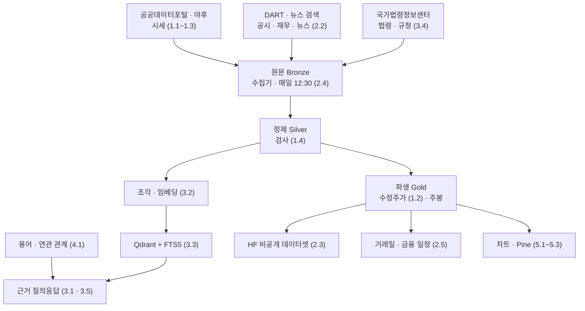

> [!GOAL]
> - 목표 기능 ① 의 네 요구가 왜 하나의 흐름인지 그림으로 설명할 수 있습니다.
> - 다음 구현 묶음(W2~W8) 전에 어느 장을 읽어야 하는지 찾을 수 있습니다.
> - 이 교재에 팀 자료를 더하는 방법을 알 수 있습니다.

## 무엇을 만드나요?

2차 프로젝트에서 이동원이 주담당으로 맡은 것은 목표 기능 ① 의 세부 1~4 이고, 3차에서는 TradingView 연동(③)을 맡습니다. 강사님 기능 목록의 원문과 이 교재에서 그것을 다루는 부는 다음과 같습니다.

**표 1. 맡은 요구와 교재의 부**

| 요구 | 강사님 원문 | 교재 |
|---|---|---|
| ①-1 | 주식 · 금융 · 경제 기본 용어사전과 연관 개념 탐색 | 4부 지식 구조 · 금융 필수 지식 |
| ①-2 | 가격 · 거래량 · 재무 · 뉴스 등 투자 자료 수집 · 분류 · 전처리 · 검색 | 1부 시세 데이터 · 2부 데이터 파이프라인 |
| ①-3 | 근거 문서와 출처를 포함한 RAG 질의응답 | 3부 근거 RAG |
| ①-4 | 금융정보의 갱신일 · 문서 버전 · 캘린더 일정 관리 및 정기 배치 업무 실행 | 2부 데이터 파이프라인(배치 · 일정) |
| 3차 ③ | TradingView 연동 | 5부 차트 · Pine |

네 요구는 따로 떨어진 기능처럼 보이지만 실제로는 한 흐름입니다. **출처에서 자료를 받아(①-2), 판과 갱신일을 붙여 쌓고(①-4), 그 자료를 근거로 답하고(①-3), 용어로 서로 이어 준다(①-1).** 저장 · 배치 · 출처 표기를 한 번만 설계하고 네 요구가 함께 쓰는 까닭입니다(목표 기능 ① 상세 설계서 요약).

## 자료는 어디서 와서 어디로 가나요?

그림 1 은 자료가 흐르는 길과, 그 길의 각 칸을 설명하는 장을 함께 보여 줍니다.

그림 1. 목표 기능 ① 의 자료 흐름과 장 번호. 원문 → 정제 → 파생의 세 층(Bronze · Silver · Gold)은 강사님 참고 저장소(`python-crawling-lab`)의 이름을 빌렸습니다.

## 어떤 순서로 읽으면 되나요?

장은 구현 순서대로 채웁니다. 「뼈대」 장은 목표 · 다룰 질문 · 보여 줄 코드 · 1차 자료만 있는 장이고, 그 기능을 구현하기 직전에 내용을 채웁니다.

**표 2. 구현 묶음과 먼저 읽을 장** (날짜는 목표 기능 ① 상세 설계서 표 12)

| 묶음 | 날짜 | 만드는 것 | 먼저 읽을 장 |
|---|---|---|---|
| W2 | 10-02 ~ 10-06 | OHLCV 규격 · ETF · 지수 · 주봉 · 분봉 · 팀원 자료 검사 · HF 업로드 | 1.1 봉과 OHLCV · 1.2 수정주가 · 1.3 분봉과 시간대 · 1.4 데이터 품질 검사 · 2.1 세 층 · 2.3 데이터셋 판과 공유 |
| W4 | 10-06 ~ 10-07 | 데이터 상태 API · 거래일 달력 · 배당 · 만기 일정 | 2.4 정기 배치 · 2.5 거래일 달력 · F.2 배당 기준일 · 배당락일 · 지급일 |
| W5 | 10-07 | 법령 받기 · 판 고르기 · 조각 · Qdrant 색인 · 용어 관계 | 3.2 임베딩 · 3.3 섞어 찾기 · 3.4 쪼개기와 법령 판 · 4.1 시소러스 |
| W6 | 10-08 | `/api/kb/ask` · 출처 번호 · 답변 정책 | **3.1 RAG**(완성) · 3.5 프롬프트와 출처 · 3.7 로컬 LLM |
| W8 | 10-15 · 10-20 | 평가셋 50 · 모델 비교 · 복원 리허설 | 3.6 RAG 평가 |
| 3차 ③ | 10-22 ~ | TradingView 연동 | 5.1 Lightweight Charts · 5.2 Pine Script · 5.3 웹훅 |
| 언제든 | — | 서버 · 시험 · 협업 | 6.1 FastAPI · 6.2 Docker Compose · 6.3 시험 코드 · 6.4 낙관적 동시성 |

금융 지식 장(F.1~F.8)은 「금융 필수 지식」 메뉴에 있습니다. 앱의 금융상품 이해 · 자산배분 모델 · 계절성 분석 화면을 보완하며, 통합본 강의(4일 금융 이론)의 내용을 옮겨 채웁니다.

## 장 하나는 어떻게 생겼나요?

모든 장은 같은 아홉 칸으로 씁니다. MDN · Google 머신러닝 단기 과정 · Hugging Face 강좌 같은 교재 사이트가 공통으로 쓰는 구성을 모은 것입니다(개념 학습 설계서 2 · 3절).

1. **머리 상자** — 읽는 시간 · 수준 · 먼저 읽을 장 · 이 장에서 할 수 있게 되는 것 · 닿는 기능
2. **왜 필요한가** — 문제 상황 하나, 될 수 있으면 실제로 겪거나 잰 사례
3. **정의와 비유** — 한 문장 정의와 그림
4. **동작 원리** — 단계 그림 · 표
5. **직접 해 보기** — 돌아가는 예제와 **실제로 돌린 출력**
6. **우리 프로젝트에서는** — 우리 저장소의 파일 · 줄 · 설계서 절
7. **흔한 실수**
8. **정리 · 확인 문제** — 답은 접어 둡니다
9. **더 읽을거리 · 용어**

[3.1 RAG](#/p/rag-basics) 가 아홉 칸을 모두 채운 본보기입니다.

## 모르는 개념이 생기면 어떻게 하나요?

장 목록은 고정되어 있지 않습니다. 읽다가 모르는 개념이 나오면 그 이름을 알려 주세요. 목록(개념 학습 설계서 9절)에 줄을 더하고 뼈대 장을 만든 뒤, 필요한 때에 채웁니다.

## 팀 자료는 어떻게 더하나요?

팀원이 조사한 자료나 정리 글은 「팀 자료」 로 더합니다. 기본 교재(이 장들)는 저장소 파일이라 PR 로 고치지만, 팀 자료는 앱 안에서 바로 쓰고 고치고 지웁니다.

1. 앱에 로그인한 뒤 위의 **팀 자료 → 새 글** 을 누릅니다.
2. 제목 · slug(주소에 쓸 영문 이름) · 구역(기술 · 금융)을 채우고 **장 틀 넣기** 로 아홉 칸 틀을 받습니다. 오른쪽에 미리보기가 바로 보입니다.
3. **저장** 을 누르면 HF 비공개 데이터셋 `qurious-quant/learn-pages` 에 커밋 하나가 생깁니다. 다른 팀원의 앱은 5분 안에 그 글을 받아 옵니다.
4. 같은 글을 두 사람이 고치면 늦게 저장한 쪽에 「다른 사람이 먼저 고쳤습니다」 가 뜨고, 지금 글과 내 글을 비교해 다시 저장합니다. 말없이 덮어쓰는 일은 없습니다.

저장하려면 HF 조직 `qurious-quant` 에 쓰기 권한으로 들어와 있어야 하고, 자기 HF 토큰이 `.env` 의 `HUGGINGFACE_ACCESS_TOKEN` 에 있어야 합니다. 팀 자료가 비공개인 까닭은 조사 메모에 강의 자료 발췌가 섞일 수 있기 때문입니다 — 공개 저장소(GitHub)에는 교재 · 강의 자료를 올리지 않습니다.

> [!TIP]
> 공용 서버가 없는데 네 명이 같은 글을 보는 원리가 궁금하면 [6.4 낙관적 동시성](#/p/optimistic-concurrency) 과 개념 학습 설계서 5절을 보세요. 코드는 GitHub, 데이터와 글은 Hugging Face, 앱은 각자 PC — 이 조합이 「같은 화면」 을 만듭니다.

## 정리

1. 목표 기능 ① 의 네 요구는 「받고 → 쌓고 → 근거로 답하고 → 용어로 잇는」 한 흐름입니다.
2. 장은 구현 묶음 직전에 채우며, 지금 완성된 장은 이 지도와 3.1 RAG 입니다.
3. 팀 자료는 앱에서 바로 쓰고, HF 비공개 데이터셋으로 네 명이 함께 봅니다.

## 더 읽을거리

- 목표 기능 ① 상세 설계서 v0.1 — 저장소 `docs/설계/지난판/목표기능1-데이터지식-설계_v0.1.md`
- 개념 학습 설계서 v0.1 — 저장소 `docs/설계/개념학습-설계.md`
- 프로젝트 계획서 v2.0 4절(역할) — 저장소 `docs/계획서/프로젝트계획서.md`
