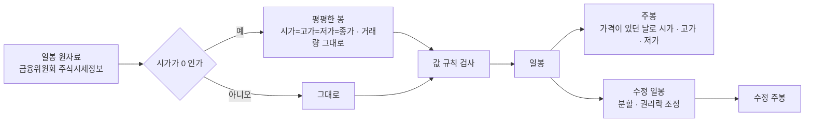

> [!GOAL]
> - 봉 하나에 담긴 다섯 숫자(OHLCV)가 각각 언제의 무엇인지 설명할 수 있습니다.
> - 일봉을 묶어 주봉을 만들고, 휴장일 · 거래정지일이 낀 주를 바르게 처리할 수 있습니다.
> - 봉이 지켜야 할 값 규칙으로 깨진 봉을 골라내고, 그 까닭을 가려낼 수 있습니다.

## 봉 하나에는 무엇이 담기나요?

봉(bar)은 정해진 시간 동안 일어난 거래를 숫자 다섯 개로 줄인 것입니다. 그 시간의 첫 체결 가격인 시가(Open), 가장 높았던 고가(High), 가장 낮았던 저가(Low), 마지막 체결 가격인 종가(Close), 그동안 거래된 주식 수인 거래량(Volume)입니다. 머리글자를 따서 OHLCV 라고 부르고, 거래된 금액의 합인 거래대금을 함께 적는 경우가 많습니다.

봉을 그림으로 옮기면 촛대 모양이 되어 캔들 차트라고 합니다. 시가와 종가 사이를 굵은 몸통으로, 고가와 저가까지를 가는 꼬리로 그립니다. 종가가 시가보다 높으면 양봉, 낮으면 음봉입니다. 한국 증권 화면은 양봉을 빨강, 음봉을 파랑으로 칠합니다. 미국 화면은 대개 오른 봉을 초록, 내린 봉을 빨강으로 칠하므로 같은 빨강이 반대 뜻이 됩니다.

<figure>
<svg viewBox="0 0 760 270" xmlns="http://www.w3.org/2000/svg" role="img" aria-label="양봉과 음봉의 구조">
<rect x="8" y="8" width="360" height="254" rx="14" fill="#f8fafc" stroke="#dde2ec"/>
<text x="24" y="36" font-size="15" font-weight="700" fill="#0f172a">양봉 — 종가가 시가보다 높은 봉</text>
<line x1="130" y1="62" x2="130" y2="232" stroke="#dc2626" stroke-width="2.5"/>
<rect x="106" y="96" width="48" height="104" rx="3" fill="#dc2626"/>
<line x1="160" y1="62" x2="196" y2="62" stroke="#94a3b8" stroke-dasharray="3 3"/>
<text x="202" y="67" font-size="13" fill="#334155">고가 — 가장 높았던 가격</text>
<line x1="160" y1="96" x2="196" y2="96" stroke="#94a3b8" stroke-dasharray="3 3"/>
<text x="202" y="101" font-size="13" fill="#b91c1c" font-weight="700">종가 — 마지막 가격</text>
<line x1="160" y1="200" x2="196" y2="200" stroke="#94a3b8" stroke-dasharray="3 3"/>
<text x="202" y="205" font-size="13" fill="#b91c1c" font-weight="700">시가 — 첫 가격</text>
<line x1="160" y1="232" x2="196" y2="232" stroke="#94a3b8" stroke-dasharray="3 3"/>
<text x="202" y="237" font-size="13" fill="#334155">저가 — 가장 낮았던 가격</text>
<text x="60" y="150" font-size="12" fill="#64748b" text-anchor="end">몸통</text>
<text x="60" y="80" font-size="12" fill="#64748b" text-anchor="end">윗꼬리</text>
<rect x="392" y="8" width="360" height="254" rx="14" fill="#f8fafc" stroke="#dde2ec"/>
<text x="408" y="36" font-size="15" font-weight="700" fill="#0f172a">음봉 — 종가가 시가보다 낮은 봉</text>
<line x1="514" y1="62" x2="514" y2="232" stroke="#2563eb" stroke-width="2.5"/>
<rect x="490" y="96" width="48" height="104" rx="3" fill="#2563eb"/>
<line x1="544" y1="62" x2="580" y2="62" stroke="#94a3b8" stroke-dasharray="3 3"/>
<text x="586" y="67" font-size="13" fill="#334155">고가</text>
<line x1="544" y1="96" x2="580" y2="96" stroke="#94a3b8" stroke-dasharray="3 3"/>
<text x="586" y="101" font-size="13" fill="#1d4ed8" font-weight="700">시가</text>
<line x1="544" y1="200" x2="580" y2="200" stroke="#94a3b8" stroke-dasharray="3 3"/>
<text x="586" y="205" font-size="13" fill="#1d4ed8" font-weight="700">종가</text>
<line x1="544" y1="232" x2="580" y2="232" stroke="#94a3b8" stroke-dasharray="3 3"/>
<text x="586" y="237" font-size="13" fill="#334155">저가</text>
<text x="444" y="222" font-size="12" fill="#64748b" text-anchor="end">아랫꼬리</text>
</svg>
<figcaption>그림 1. 봉의 구조 — 몸통의 위아래가 양봉과 음봉에서 서로 바뀝니다. 색이 그 차이를 알려 줍니다(한국 화면 기준).</figcaption>
</figure>

봉 하나만 보고는 하루 동안 무엇이 먼저 일어났는지 알 수 없습니다. 장 초반에 고가를 찍고 밀린 날과 장 막판에 치솟은 날이 같은 모양의 양봉으로 그려지기도 합니다. 「고가에서 팔고 저가에서 산다」 같은 장중 조건을 일봉으로 시험하면 이 순서를 모르는 채로 계산하게 되어 결과가 실제보다 좋게 나오기 쉽습니다. 더 짧은 봉(분봉)이 필요한 까닭입니다.

## 왜 체결 하나하나 대신 봉으로 볼까요?

정규장은 09:00 부터 15:30 까지 6시간 30분 동안 열리고, 인기 종목은 그동안 수만 번 체결됩니다. 체결 하나하나(틱)를 모두 보면 가장 정확하지만 양이 너무 많고 흐름이 눈에 들어오지 않습니다. 봉은 정해진 시간마다 다섯 숫자만 남겨 흐름을 압축합니다. 2020-01-02 부터 2026-09-29 까지 코스피 · 코스닥 · 코넥스에 상장됐던 3,308종목의 일봉을 모두 모아도 4,477,927개입니다.

시가와 종가는 장중 거래와 정하는 방식이 다릅니다. 시가는 08:30~09:00 에 들어온 주문을 모아 09:00 에 한 가격으로, 종가는 15:20~15:30 에 들어온 주문을 모아 15:30 에 한 가격으로 체결합니다(단일가 매매). 그 사이에는 주문이 들어오는 대로 체결됩니다.

## 일봉 · 주봉 · 분봉은 무엇이 다른가요?

봉의 길이(주기)만 다르고 만드는 법은 같습니다. 표 1 은 정규장 하루를 기준으로 주기마다 봉이 몇 개 생기는지 보여 줍니다.

**표 1. 주기별 봉**

| 주기 | 봉 하나의 시간 | 정규장 하루의 봉 수 | 주로 보는 것 |
|---|---|---:|---|
| 1분봉 | 1분 | 390 | 체결 시점 · 아주 짧은 매매 |
| 5분봉 | 5분 | 78 | 장중 흐름 |
| 60분봉 | 1시간 | 7 (마지막 봉은 15:00~15:30) | 며칠 단위 흐름 |
| 일봉 | 하루(정규장) | 1 | 대부분의 전략 · 백테스트 |
| 주봉 | 월~금 한 주 | 1주에 1 | 긴 추세 · 하루 잡음 줄이기 |

표의 봉 수는 정규장 390분을 나눈 값입니다. 실제로 받는 분봉은 출처에 따라 이보다 적을 수 있습니다 — [분봉과 시간대](#/p/intraday-timezone) 장에서 실제로 받은 분봉이 하루 몇 개였는지 확인합니다.

## 일봉을 묶어 주봉을 만드는 규칙은?

긴 봉은 짧은 봉을 묶어서 만듭니다. 주봉이라면 같은 주(월~금)의 일봉을 모아 칸마다 정해진 방식으로 하나로 합칩니다.

**표 2. 일봉 → 주봉 규칙**

| 칸 | 주봉의 값 | 까닭 |
|---|---|---|
| 시가 | 그 주에 가격이 있던 첫날의 시가 | 한 주의 첫 체결 가격 |
| 고가 · 저가 | 가격이 있던 날의 최고 · 최저 — 마지막 날 종가가 그 밖이면 그 종가까지 | 한 주 동안 실제로 체결된 범위 |
| 종가 | 그 주 마지막 거래일의 종가 | 한 주의 마지막 체결 가격 |
| 거래량 | 모든 날의 합 | 한 주 동안 거래된 주식 수 |
| 날짜 | 그 주의 마지막 거래일 | 그 값을 알 수 있게 된 날 |

그림 2 는 2025년 개천절(10-03 금)이 낀 주의 삼성전자 일봉 넷이 주봉 하나가 되는 모습입니다. 금요일이 휴장이라 그 주의 마지막 거래일은 목요일 10-02 이고, 주봉의 날짜도 10-02 가 됩니다.

<figure>
<svg viewBox="0 0 760 290" xmlns="http://www.w3.org/2000/svg" role="img" aria-label="삼성전자 2025년 10월 첫 주의 일봉 넷과 주봉">
<defs><marker id="ob1" viewBox="0 0 10 10" refX="9" refY="5" markerWidth="7" markerHeight="7" orient="auto-start-reverse"><path d="M0,0 L10,5 L0,10 z" fill="#64748b"/></marker></defs>
<rect x="8" y="8" width="744" height="274" rx="14" fill="#f8fafc" stroke="#dde2ec"/>
<line x1="56" y1="204.7" x2="740" y2="204.7" stroke="#e2e8f0"/><text x="50" y="208" font-size="11" fill="#94a3b8" text-anchor="end">84,000</text>
<line x1="56" y1="154.0" x2="740" y2="154.0" stroke="#e2e8f0"/><text x="50" y="158" font-size="11" fill="#94a3b8" text-anchor="end">86,000</text>
<line x1="56" y1="103.3" x2="740" y2="103.3" stroke="#e2e8f0"/><text x="50" y="107" font-size="11" fill="#94a3b8" text-anchor="end">88,000</text>
<line x1="56" y1="52.7" x2="740" y2="52.7" stroke="#e2e8f0"/><text x="50" y="57" font-size="11" fill="#94a3b8" text-anchor="end">90,000</text>
<line x1="100" y1="179.3" x2="100" y2="224.9" stroke="#dc2626" stroke-width="2"/><rect x="82" y="199.6" width="36" height="22.8" fill="#dc2626"/>
<line x1="180" y1="181.9" x2="180" y2="219.9" stroke="#2563eb" stroke-width="2"/><rect x="162" y="189.5" width="36" height="17.7" fill="#2563eb"/>
<line x1="260" y1="148.9" x2="260" y2="186.9" stroke="#dc2626" stroke-width="2"/><rect x="242" y="154.0" width="36" height="27.9" fill="#dc2626"/>
<line x1="340" y1="45.1" x2="340" y2="85.6" stroke="#2563eb" stroke-width="2"/><rect x="322" y="70.4" width="36" height="7.6" fill="#2563eb"/>
<rect x="402" y="60" width="36" height="160" rx="4" fill="none" stroke="#cbd5e1" stroke-dasharray="4 4"/><text x="420" y="145" font-size="12" fill="#94a3b8" text-anchor="middle">휴장</text>
<text x="100" y="252" font-size="12" fill="#334155" text-anchor="middle">09-29 월</text>
<text x="180" y="252" font-size="12" fill="#334155" text-anchor="middle">09-30 화</text>
<text x="260" y="252" font-size="12" fill="#334155" text-anchor="middle">10-01 수</text>
<text x="340" y="252" font-size="12" fill="#334155" text-anchor="middle">10-02 목</text>
<text x="420" y="252" font-size="12" fill="#94a3b8" text-anchor="middle">10-03 금</text>
<line x1="470" y1="140" x2="560" y2="140" stroke="#64748b" stroke-width="1.6" marker-end="url(#ob1)"/>
<text x="515" y="128" font-size="12" fill="#64748b" text-anchor="middle">묶기</text>
<line x1="620" y1="45.1" x2="620" y2="224.9" stroke="#dc2626" stroke-width="2.5"/><rect x="597" y="78.0" width="46" height="144.4" fill="#dc2626"/>
<text x="652" y="50" font-size="11.5" fill="#334155">고가 90,300 (목)</text>
<text x="652" y="82" font-size="11.5" fill="#b91c1c">종가 89,000 (목)</text>
<text x="652" y="219" font-size="11.5" fill="#b91c1c">시가 83,300 (월)</text>
<text x="652" y="236" font-size="11.5" fill="#334155">저가 83,200 (월)</text>
<text x="620" y="252" font-size="12" fill="#0f172a" font-weight="700" text-anchor="middle">주봉 · 10-02</text>
<text x="24" y="274" font-size="11" fill="#64748b">삼성전자 2025-09-29 ~ 10-02 일봉 (출처: 금융위원회 주식시세정보) · 세로축은 원</text>
</svg>
<figcaption>그림 2. 일봉 넷을 주봉 하나로 — 시가는 월요일, 고가 · 종가는 목요일, 저가는 월요일 값이 그대로 올라옵니다.</figcaption>
</figure>

## 직접 해 보기 — 주봉 만들기

예제 [`ohlcv_bars.py`](/learn/examples/ohlcv_bars.py) 는 표준 라이브러리만 씁니다. 핵심은 주(週)마다 일봉을 모은 뒤 표 2 의 규칙대로 칸을 채우는 열 줄입니다.

```python
def weekly(bars: list[Bar]) -> list[Bar]:
    groups: dict[tuple[int, int], list[Bar]] = {}
    for b in bars:
        groups.setdefault(_week(b.day), []).append(b)      # ISO 주 — 월요일에 시작
    out = []
    for days in groups.values():
        priced = [b for b in days if b.open > 0] or flatten(days[-1:])
        close = days[-1].close                 # 마지막 날에 거래가 없으면 기준가 — 범위를 거기까지 넓힌다
        out.append(Bar(days[-1].day, priced[0].open, max(max(b.high for b in priced), close),
                       min(min(b.low for b in priced), close), close, sum(b.volume for b in days)))
    return out
```

`priced` 는 그날 정규장 가격이 있던 일봉만 고른 목록입니다. 왜 필요한지는 바로 다음 절에서 봅니다. 고가 · 저가를 마지막 날 종가까지 넓히는 줄은 거래가 드문 종목 때문입니다. 금요일에 한 주도 거래되지 않은 ETF 는 그날 종가로 거래소가 정한 기준가(순자산가치를 따라 움직임)를 받는데, 이 값이 월~목요일에 거래된 범위 밖에 있을 수 있습니다. 2020-01-02 ~ 2026-09-30 의 ETF 주봉 가운데 1,683개가 그런 주였고, 넓히지 않으면 「저가 ≤ 종가 ≤ 고가」 를 어긴 주봉이 됩니다. 삼성전자의 2025년 추석 전후 일봉 12개를 넣으면 주봉 넷이 나옵니다.

```output
④ 휴장이 낀 주 — 삼성전자 2025년 추석 전후
  2025-09-26  시가  84,400  고가  86,200  저가  82,400  종가  83,300  거래량  43,736,344  ✓
  2025-10-02  시가  83,300  고가  90,300  저가  83,200  종가  89,000  거래량 101,310,544  ✓
  2025-10-10  시가  94,000  고가  94,500  저가  92,700  종가  94,400  거래량  35,269,748  ✓
  2025-10-17  시가  91,300  고가  99,100  저가  90,200  종가  97,900  거래량 131,350,523  ✓
```

10-06 이 있는 주는 추석 연휴와 한글날이 이어져 거래일이 10-10 하루뿐이었습니다. 그 주의 주봉은 일봉 하나와 같습니다.

같은 자료를 pandas 의 `resample("W-FRI")` 로 묶으면 값은 같은데 날짜가 다릅니다.

```output
⑤ pandas resample('W-FRI') 로 묶은 같은 자료 — 줄 이름(날짜)을 보세요
  2025-09-26  시가  84,400  종가  83,300  거래량  43,736,344
  2025-10-03  시가  83,300  종가  89,000  거래량 101,310,544
  2025-10-10  시가  94,000  종가  94,400  거래량  35,269,748
  2025-10-17  시가  91,300  종가  97,900  거래량 131,350,523
```

pandas 는 주 단위로 묶을 때 기본으로 구간의 오른쪽 끝 날짜를 이름으로 붙입니다(`label="right"`). 그래서 휴장일인 10-03 이 주봉의 날짜가 됐습니다. 이 날짜로 배당 일정이나 다른 종목의 자료와 맞추면 하루가 어긋나고, 「10-03 에 알 수 있었던 값」 처럼 읽히기도 합니다. pandas 를 쓴다면 묶은 뒤 날짜를 그 주의 마지막 거래일로 다시 붙입니다.

<small>실행 환경: 2026-10-01 · Windows 11 · Python 3.12.13 · pandas 3.0.3</small>

## 거래가 없던 날이 끼면 어떻게 하나요?

카카오는 2021년 4월 1주를 5주로 나누는 액면분할을 했고, 그 절차 때문에 04-12 부터 04-14 까지 사흘 동안 거래가 정지됐습니다. 공공데이터포털의 원자료는 이런 날을 지우지 않고, 시가 · 고가 · 저가를 0 으로, 종가를 직전 종가(558,000원)로 적어 줍니다. 이 원자료를 그대로 묶으면 주봉이 깨집니다.

```output
① 원자료 일봉의 값 규칙 — 카카오
  15개 중 3개가 규칙을 어김: 2021-04-12, 2021-04-13, 2021-04-14
② 원자료를 그대로 묶은 주봉 (흔한 실수)
  2021-04-09  시가 503,000  고가 561,000  저가 500,000  종가 558,000  거래량   4,557,607  ✓
  2021-04-16  시가       0  고가 132,500  저가       0  종가 119,000  거래량  30,824,570  ✗ 가격이 0 이하
  2021-04-23  시가 120,000  고가 122,000  저가 114,500  종가 117,500  거래량  17,608,403  ✓
③ 가격이 있던 날로만 시가 · 고가 · 저가를 정한 주봉
  2021-04-09  시가 503,000  고가 561,000  저가 500,000  종가 558,000  거래량   4,557,607  ✓
  2021-04-16  시가 120,500  고가 132,500  저가 115,500  종가 119,000  거래량  30,824,570  ✓
  2021-04-23  시가 120,000  고가 122,000  저가 114,500  종가 117,500  거래량  17,608,403  ✓
```

②의 둘째 주봉은 시가와 저가가 0 입니다. 차트에는 0 원까지 내려가는 긴 꼬리가 그려지고, 이 주봉으로 수익률을 계산하면 0 으로 나누게 됩니다. ③은 정지일을 지우지 않고 남기되, 주봉의 시가 · 고가 · 저가는 실제로 가격이 있던 목 · 금요일로만 정했습니다. 정지일의 가격(직전 종가)은 그날 체결된 가격이 아니어서, 고가나 저가에 넣으면 그 주에 한 번도 거래되지 않은 값이 범위가 되기 때문입니다.

정지일 자체는 지우지 않습니다. 지우면 그 종목만 날짜 줄이 빠져, 여러 종목을 같은 날짜로 맞출 때 어긋납니다. 대신 일봉으로는 「시가 = 고가 = 저가 = 종가 = 직전 종가 · 거래량 0」 인 평평한 봉으로 둡니다.

그런데 ③도 끝난 문제가 아닙니다. 둘째 주의 종가 119,000원을 첫째 주 558,000원과 비교하면 한 주에 −78.7% 가 떨어진 것처럼 보입니다. 주식 수가 다섯 배가 된 것을 가격에 반영하지 않았기 때문이고, 이것은 [수정주가](#/p/adjusted-price) 장에서 고칩니다.

## 봉이 지켜야 할 값 규칙은 무엇인가요?

어디서 받은 봉이든 지켜야 하는 규칙이 있습니다. 이 규칙을 어긴 봉은 자료가 깨졌거나, 그 출처가 특별한 날을 특별한 방식으로 적은 것입니다.

**표 3. 봉의 값 규칙**

| # | 규칙 | 어기면 보이는 모습 |
|:-:|---|---|
| 1 | 네 가격 모두 0 보다 크다 | 정지일의 0 · 빈 칸을 0 으로 읽은 경우 |
| 2 | 저가 ≤ 시가 · 종가 ≤ 고가 | 칸 순서가 뒤섞인 파일 · 서로 다른 출처를 이어 붙인 경우 |
| 3 | 거래량 ≥ 0 | 계산 오류 |
| 4 | 같은 종목 · 날짜 · 주기의 봉은 하나 | 같은 날을 두 번 받은 경우 |
| 5 | 날짜는 거래일 | 시간대를 잘못 바꿔 휴일 날짜가 붙은 경우 |
| 6 | 정지일은 지우지 않는다 | 날짜 줄이 종목마다 달라짐 |

검사 코드는 짧습니다.

```python
def problems(bar: Bar) -> list[str]:
    found = []
    if min(bar.open, bar.high, bar.low, bar.close) <= 0:
        found.append("가격이 0 이하")
    elif not (bar.low <= min(bar.open, bar.close) and max(bar.open, bar.close) <= bar.high):
        found.append("저가 ≤ 시가·종가 ≤ 고가 를 어김")
    if bar.volume < 0:
        found.append("거래량이 음수")
    return found
```

이 검사를 2020-01-02 ~ 2026-09-29 의 원자료 일봉 4,477,927개 전체에 돌리면 규칙 1을 어긴 봉이 203,281개(4.5%) 나옵니다. 그중 203,262개는 거래량도 0 인 거래정지일이고, 나머지 19개는 거래량은 있는데 시가 · 고가 · 저가가 0 인 날입니다. 시가가 있는 봉 가운데 규칙 2 를 어긴 봉은 하나도 없었습니다. 규칙 위반의 대부분이 「값이 틀렸다」 가 아니라 「거래가 없는 날을 0 으로 적는 방식」 이었던 셈입니다. **그래서 검사는 위반을 찾는 데서 끝내지 않고, 정지일처럼 까닭이 분명한 것과 정말로 깨진 것을 나눠야 합니다.** 다른 곳에서 받은 파일을 이렇게 판정하는 방법은 [데이터 품질 검사](#/p/data-quality-check) 장에서 다룹니다.

## Qurious 의 봉은 이렇게 만듭니다



일봉은 금융위원회 주식시세정보(한국거래소 자료)를 매 거래일 받아 씁니다. 이 자료는 영업일 오후 1시 이후에 하루 늦게 갱신됩니다. 주봉은 따로 받지 않고 일봉에서 계산하므로, 일봉과 주봉이 서로 어긋날 일이 없습니다. 진행 중인 주의 주봉은 마지막으로 받은 날까지의 값이고 「진행 중」 으로 표시합니다.

## 흔한 실수

1. **휴장 금요일을 주봉 날짜로 쓰기** — pandas 의 주 단위 기본값이 그렇습니다. 묶은 뒤 날짜를 마지막 거래일로 바꿉니다.
2. **정지일의 0 을 그대로 묶기** — 시가 · 저가 0 인 주봉이 생깁니다. 가격이 있던 날로만 범위를 정합니다.
3. **정지일을 지우기** — 종목마다 날짜 줄이 달라집니다. 평평한 봉으로 남깁니다.
4. **원 가격 주봉에 조정계수를 곱해 수정 주봉을 만들기** — 주 중간에 분할 · 권리락이 있으면 고칠 수 없습니다. 수정 일봉을 묶습니다([수정주가](#/p/adjusted-price)).
5. **분봉 거래량을 더해 일봉을 만들기** — 출처에 따라 장 마감 전 30분이 빠져 있어 일봉과 맞지 않습니다([분봉과 시간대](#/p/intraday-timezone)).

## 정리

- 봉은 정해진 시간의 거래를 시가 · 고가 · 저가 · 종가 · 거래량 다섯 숫자로 줄인 것이고, 주기만 다를 뿐 만드는 법은 같습니다.
- 주봉은 일봉을 묶어 만듭니다 — 날짜는 그 주의 마지막 거래일, 시가 · 고가 · 저가는 가격이 있던 날로 정합니다.
- 정지일은 지우지 않고 평평한 봉으로 남기며, 값 규칙 위반은 까닭을 가려서 다룹니다.

<details>
<summary>확인 문제 1 — 2025-10-03(금)이 휴장인 주의 주봉 날짜는 언제인가요?</summary>

10-02(목)입니다. 주봉의 날짜는 그 주의 마지막 거래일이고, pandas 기본값이 붙이는 10-03 은 거래가 없던 날입니다.
</details>

<details>
<summary>확인 문제 2 — 어느 주에 월요일만 거래가 정지됐다면 그 주봉의 시가는 어느 날 값인가요?</summary>

화요일 시가입니다. 월요일은 정규장 가격이 없는 날(시가 0)이라 주봉의 시가 · 고가 · 저가를 정할 때 빠집니다. 거래량 합과 날짜 계산에는 월요일도 들어갑니다.
</details>

<details>
<summary>확인 문제 3 — 시가 100,500 · 고가 103,000 · 저가 101,000 · 종가 102,000 인 봉은 규칙을 지키나요?</summary>

지키지 않습니다. 저가(101,000)가 시가(100,500)보다 높아 「저가 ≤ 시가 · 종가」 를 어깁니다. 칸 순서가 바뀐 파일이나 서로 다른 출처를 이어 붙인 자료에서 자주 나옵니다.
</details>

## 더 읽을거리

- 금융위원회 「주식시세정보」 — 공공데이터포털 <https://www.data.go.kr/data/15094808/openapi.do> · 항목(기준일자 · 시가 · 고가 · 저가 · 종가 · 거래량)과 갱신 주기(영업일 오후 1시 이후 · 하루 늦게), 이용 조건(출처 표시 · 비영리 · 변경 금지 · 제3자 재배포 금지). 2026-10-01 확인.
- pandas `DataFrame.resample` — <https://pandas.pydata.org/docs/reference/api/pandas.DataFrame.resample.html> · 주 단위(`W`)는 `closed` · `label` 기본값이 `right`. 3.0.6 문서, 2026-10-01 확인.
- 찾기 쉬운 생활법령정보(법제처) 「매매거래일 · 거래시간 및 거래 원칙」 — <https://easylaw.go.kr/CSP/CnpClsMain.laf?popMenu=ov&csmSeq=1701&ccfNo=2&cciNo=1&cnpClsNo=2> · 정규시장 09:00~15:30, 호가 접수 08:30 부터, 근거 「유가증권시장 업무규정」. 2026-09-15 기준 글.
- KB Think 「시간외거래란? 주식 거래 시간은 언제일까요?」 — <https://kbthink.com/stock/hours.html> · 시가(08:30~09:00 주문)와 종가(15:20~15:30 주문)를 정하는 방식. 2024-11-13 글.

**용어**

| 말 | 뜻 |
|---|---|
| 봉 · 캔들 | 정해진 시간의 거래를 시가 · 고가 · 저가 · 종가 · 거래량으로 줄인 것 · 그것을 촛대 모양으로 그린 것 |
| OHLCV | Open · High · Low · Close · Volume 의 머리글자 |
| 양봉 · 음봉 | 종가가 시가보다 높은 봉 · 낮은 봉 |
| 단일가 매매 | 일정 시간 주문을 모아 한 가격으로 체결하는 방식 — 시가 · 종가를 정할 때 쓴다 |
| 거래일 | 장이 열린 날 — 주말 · 공휴일 · 연말 휴장일이 빠진다 |
| 거래정지 | 거래소가 그 종목의 매매를 멈춘 것 — 분할 절차 · 공시 문제 등 |
| 평평한 봉 | 시가 = 고가 = 저가 = 종가 인 봉 — 정규장 가격이 없던 날을 이렇게 둔다 |
