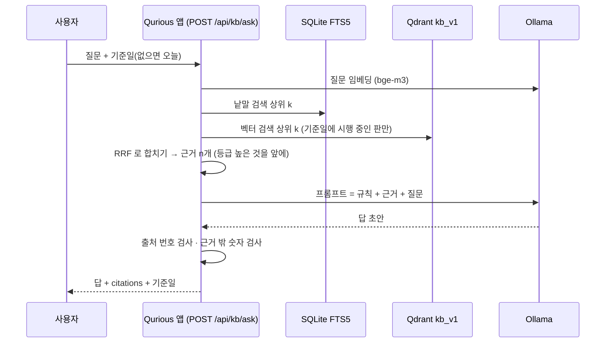

> [!GOAL]
> - 언어 모델이 기억만으로 답할 때 생기는 문제 세 가지를 실제 답을 예로 들어 설명할 수 있습니다.
> - RAG 의 두 단계(색인 · 질의)와 부품 다섯(조각내기 · 임베딩 · 찾기 · 프롬프트 · 생성)을 그림으로 그릴 수 있습니다.
> - 표준 라이브러리만으로 작은 RAG 를 돌리고, 단계마다 나온 결과를 읽을 수 있습니다.
> - Qurious 의 근거 질의응답(W5 · W6)이 부품마다 무엇을 골랐고 왜 골랐는지 말할 수 있습니다.

## 언어 모델에게 2026년 세율을 물으면 어떻게 될까요?

이 장은 질문 하나로 시작합니다. 2026년 10월 1일, 이 교재를 쓰는 PC 에 설치된 언어 모델 `llama3.1`(80억 매개변수 · Ollama)에 아무 자료도 주지 않고 이렇게 물었습니다.

```output
질문: 2026년 현재 한국 코스피 시장에서 주식을 팔 때 내는 증권거래세율은 몇 %인가요? 한두 문장으로 답하세요.
모델: llama3.1 | 걸린 시간: 15.9 초
답: 2026년 현재 한국 코스피 시장에서 주식을 팔 때 내는 증권거래세율은 0.3%입니다.
```

답은 틀렸습니다. 2026년 1월 1일부터 시행된 증권거래세법 시행령 제5조(대통령령 제36001호)는 유가증권시장(코스피)에서 양도되는 주권의 세율을 1만분의 5, 곧 0.05% 로 정합니다. 여기에 농어촌특별세법 제5조가 정한 1만분의 15(0.15%)가 붙어 코스피에서 주식을 팔 때의 세금은 모두 0.20% 입니다. Qurious 의 비용 모델(`app/services/trading_cost.py`)도 2026년 코스피 매도에 0.20% 를 씁니다.

더 곤란한 점은 답의 모양입니다. 숫자는 하나로 단정되어 있고, 그 숫자가 어느 법의 어느 조문에서 왔는지는 없습니다. 이 답을 받은 사람은 맞는지 틀린지 확인할 길이 없습니다. RAG 에 관한 대표적인 서베이(Gao 등, 2023)는 언어 모델의 약점을 세 가지로 꼽는데, 위 답 하나에 셋이 다 들어 있습니다.

**표 1. 기억만으로 답할 때 생기는 문제**

| 문제 | 뜻 | 위 답에서 |
|---|---|---|
| 환각(hallucination) | 사실이 아닌 내용을 그럴듯하게 만들어 낸다 | 「0.3%입니다」 — 근거 없는 숫자를 단정한다 |
| 낡은 지식 | 학습이 끝난 뒤에 바뀐 사실을 모른다 | 2025년 12월 31일에 공포된 개정을 반영하지 못한다 |
| 추적할 수 없는 근거 | 무엇을 보고 그렇게 답했는지 보여 줄 수 없다 | 출처가 없어 사람이 검증할 수 없다 |

금융 서비스에서 세 번째 문제는 특히 무겁습니다. 세율 · 공시 · 규정은 답보다 근거가 먼저 확인되어야 하는 정보이기 때문입니다. Qurious 의 목표 기능 ①-3 이 「근거 문서와 출처를 포함한 질의응답」 인 까닭이 여기에 있습니다.

## RAG 를 한 문장으로 말하면 무엇일까요?

RAG(Retrieval-Augmented Generation, 검색 증강 생성)는 **질문이 들어오면 먼저 믿을 만한 문서에서 관련 조각을 찾고, 그 조각을 질문과 함께 언어 모델에 넣어 그 근거로 답하게 하는 방법**입니다.

이 이름을 처음 쓴 논문(Lewis 등, NeurIPS 2020)은 모델이 가진 기억을 둘로 나눠 설명합니다. 하나는 모델의 가중치 안에 녹아 있는 **매개변수 기억**(parametric memory)이고, 다른 하나는 모델 밖에 두고 필요할 때 찾아 읽는 **비매개변수 기억**(non-parametric memory)입니다. 그 논문에서 비매개변수 기억은 위키백과 전체를 벡터로 바꿔 둔 색인이었습니다. Qurious 에서는 법령 · 감독규정 · 공시가 그 자리에 들어갑니다.

시험에 빗대면 쉽습니다. 기억만으로 답하는 모델은 닫힌 책 시험을 보는 학생이고, RAG 는 열린 책 시험을 보는 학생입니다. 열린 책 시험에서는 책을 잘 찾는 능력과 찾은 쪽을 정확히 읽는 능력이 함께 필요합니다. 이 장의 나머지는 그 두 능력을 어떻게 만드는지에 대한 이야기입니다.

<figure>
<svg viewBox="0 0 760 270" xmlns="http://www.w3.org/2000/svg" role="img" aria-label="기억만으로 답하기와 찾아서 답하기 비교">
<defs><marker id="ar1" viewBox="0 0 10 10" refX="9" refY="5" markerWidth="7" markerHeight="7" orient="auto-start-reverse"><path d="M0,0 L10,5 L0,10 z" fill="#64748b"/></marker></defs>
<rect x="8" y="8" width="360" height="254" rx="14" fill="#f8fafc" stroke="#dde2ec"/>
<text x="24" y="36" font-size="15" font-weight="700" fill="#0f172a">닫힌 책 — 기억만으로 답하기</text>
<rect x="24" y="58" width="150" height="40" rx="8" fill="#ffffff" stroke="#c5cdde"/>
<text x="99" y="83" font-size="13" text-anchor="middle" fill="#334155">질문</text>
<line x1="99" y1="98" x2="99" y2="122" stroke="#64748b" stroke-width="1.5" marker-end="url(#ar1)"/>
<rect x="24" y="126" width="150" height="54" rx="8" fill="#eef2f8" stroke="#c5cdde"/>
<text x="99" y="149" font-size="13" text-anchor="middle" fill="#0f172a">언어 모델</text>
<text x="99" y="168" font-size="11.5" text-anchor="middle" fill="#64748b">가중치 속 기억만</text>
<line x1="174" y1="153" x2="200" y2="153" stroke="#64748b" stroke-width="1.5" marker-end="url(#ar1)"/>
<rect x="204" y="114" width="150" height="78" rx="10" fill="#fef2f2" stroke="#fecaca"/>
<text x="279" y="140" font-size="13" text-anchor="middle" fill="#b91c1c" font-weight="700">「0.3%입니다」</text>
<text x="279" y="160" font-size="11.5" text-anchor="middle" fill="#b91c1c">틀린 숫자</text>
<text x="279" y="177" font-size="11.5" text-anchor="middle" fill="#b91c1c">출처 없음</text>
<text x="24" y="226" font-size="12" fill="#64748b">llama3.1 8B · 2026-10-01 · 이 PC 에서 실제로 낸 답</text>
<rect x="392" y="8" width="360" height="254" rx="14" fill="#f8fafc" stroke="#dde2ec"/>
<text x="408" y="36" font-size="15" font-weight="700" fill="#0f172a">열린 책 — 찾아서 답하기(RAG)</text>
<rect x="408" y="58" width="96" height="40" rx="8" fill="#ffffff" stroke="#c5cdde"/>
<text x="456" y="83" font-size="13" text-anchor="middle" fill="#334155">질문</text>
<line x1="504" y1="78" x2="530" y2="78" stroke="#64748b" stroke-width="1.5" marker-end="url(#ar1)"/>
<rect x="534" y="54" width="202" height="48" rx="8" fill="#eff6ff" stroke="#bfdbfe"/>
<text x="635" y="74" font-size="13" text-anchor="middle" fill="#1d4ed8">문서 찾기</text>
<text x="635" y="92" font-size="11.5" text-anchor="middle" fill="#2563eb">시행령 제5조 · 농특세법 제5조</text>
<line x1="635" y1="102" x2="635" y2="122" stroke="#64748b" stroke-width="1.5" marker-end="url(#ar1)"/>
<rect x="534" y="126" width="202" height="54" rx="8" fill="#eef2f8" stroke="#c5cdde"/>
<text x="635" y="149" font-size="13" text-anchor="middle" fill="#0f172a">언어 모델</text>
<text x="635" y="168" font-size="11.5" text-anchor="middle" fill="#64748b">찾은 조각 + 질문을 함께 읽음</text>
<line x1="534" y1="153" x2="510" y2="153" stroke="#64748b" stroke-width="1.5" marker-end="url(#ar1)"/>
<rect x="408" y="114" width="98" height="78" rx="10" fill="#ecfdf3" stroke="#bbf7d0"/>
<text x="457" y="140" font-size="12.5" text-anchor="middle" fill="#15803d" font-weight="700">근거 + 답</text>
<text x="457" y="160" font-size="11.5" text-anchor="middle" fill="#15803d">[출처 1]</text>
<text x="457" y="177" font-size="11.5" text-anchor="middle" fill="#15803d">확인할 수 있음</text>
<text x="408" y="226" font-size="12" fill="#64748b">찾는 능력(검색)과 읽는 능력(생성)이 함께 필요하다</text>
</svg>
<figcaption>그림 1. 기억만으로 답하기와 찾아서 답하기. 왼쪽 답은 이 PC 의 llama3.1 이 실제로 낸 답입니다. 오른쪽이 늘 맞는 답을 내는 것은 아닙니다 — 무엇을 찾았는지가 답을 정하며, 그 사례는 「직접 해 보기」 에서 봅니다.</figcaption>
</figure>

RAG 와 자주 비교되는 방법이 둘 있습니다. 모델을 우리 자료로 더 학습시키는 미세 조정(fine-tuning)과, 자료를 통째로 프롬프트에 붙여 넣는 방법입니다. 셋은 서로를 대신하지 않고 푸는 문제가 다릅니다.

**표 2. RAG · 미세 조정 · 통째로 넣기**

| | RAG | 미세 조정 | 자료를 통째로 프롬프트에 |
|---|---|---|---|
| 지식을 바꾸는 법 | 문서를 바꾸고 다시 색인한다 | 다시 학습한다 | 넣는 글을 바꾼다 |
| 출처를 보이기 | 찾은 조각이 곧 출처라 쉽다 | 어렵다 — 지식이 가중치에 섞인다 | 가능하지만 어느 부분인지 짚기 어렵다 |
| 잘 맞는 일 | 자주 바뀌는 사실 · 근거가 필요한 답 | 말투 · 형식 · 특정 작업 습관 | 자료가 짧을 때 |
| Qurious 에서 | 법령 · 규정 · 공시 질의응답(W5 · W6) | 쓰지 않는다(GPU 없음 · 비용) | 쓰지 않는다 — 법령 목록만 수천 조각 |

## RAG 는 어떤 차례로 움직일까요?

RAG 는 두 단계로 나뉩니다. **색인 단계**는 질문이 오기 전에 미리, 문서가 바뀔 때마다 한 번 돕니다. **질의 단계**는 질문이 올 때마다 돕니다. 그림 2 는 두 단계와 Qurious 가 고른 부품을 함께 보여 줍니다.

<figure>
<svg viewBox="0 0 760 300" xmlns="http://www.w3.org/2000/svg" role="img" aria-label="RAG 의 색인 단계와 질의 단계">
<defs><marker id="ar2" viewBox="0 0 10 10" refX="9" refY="5" markerWidth="7" markerHeight="7" orient="auto-start-reverse"><path d="M0,0 L10,5 L0,10 z" fill="#64748b"/></marker></defs>
<text x="8" y="22" font-size="13" font-weight="700" fill="#2563eb">① 색인 단계 — 미리 · 문서가 바뀔 때마다 (W5)</text>
<g font-size="12.5" text-anchor="middle">
<rect x="8" y="34" width="168" height="68" rx="10" fill="#eff6ff" stroke="#bfdbfe"/><text x="92" y="60" fill="#0f172a" font-weight="700">문서 모으기</text><text x="92" y="80" fill="#475569">법령 · 규정 · 공시</text><text x="92" y="95" fill="#475569">시행 중인 판</text>
<rect x="200" y="34" width="168" height="68" rx="10" fill="#eff6ff" stroke="#bfdbfe"/><text x="284" y="60" fill="#0f172a" font-weight="700">조각내기</text><text x="284" y="80" fill="#475569">조문 하나 = 조각 하나</text><text x="284" y="95" fill="#475569">머리에 법령명 · 조문</text>
<rect x="392" y="34" width="168" height="68" rx="10" fill="#eff6ff" stroke="#bfdbfe"/><text x="476" y="60" fill="#0f172a" font-weight="700">임베딩</text><text x="476" y="80" fill="#475569">bge-m3 · 1024차원</text><text x="476" y="95" fill="#475569">(제안 · 평가 뒤 확정)</text>
<rect x="584" y="34" width="168" height="68" rx="10" fill="#eff6ff" stroke="#bfdbfe"/><text x="668" y="60" fill="#0f172a" font-weight="700">저장</text><text x="668" y="80" fill="#475569">Qdrant(뜻 · 벡터)</text><text x="668" y="95" fill="#475569">FTS5(낱말)</text>
</g>
<g stroke="#64748b" stroke-width="1.5"><line x1="176" y1="68" x2="198" y2="68" marker-end="url(#ar2)"/><line x1="368" y1="68" x2="390" y2="68" marker-end="url(#ar2)"/><line x1="560" y1="68" x2="582" y2="68" marker-end="url(#ar2)"/></g>
<line x1="668" y1="102" x2="668" y2="176" stroke="#94a3b8" stroke-width="1.5" stroke-dasharray="5 4" marker-end="url(#ar2)"/>
<text x="676" y="146" font-size="11.5" fill="#64748b">찾을 때 읽는다</text>
<text x="8" y="166" font-size="13" font-weight="700" fill="#15803d">② 질의 단계 — 질문이 올 때마다 (W6)</text>
<g font-size="12.5" text-anchor="middle">
<rect x="8" y="180" width="128" height="72" rx="10" fill="#ecfdf3" stroke="#bbf7d0"/><text x="72" y="208" fill="#0f172a" font-weight="700">질문</text><text x="72" y="228" fill="#475569">+ 기준일</text>
<rect x="160" y="180" width="128" height="72" rx="10" fill="#ecfdf3" stroke="#bbf7d0"/><text x="224" y="208" fill="#0f172a" font-weight="700">찾기 둘</text><text x="224" y="228" fill="#475569">뜻 상위 k</text><text x="224" y="243" fill="#475569">낱말 상위 k</text>
<rect x="312" y="180" width="128" height="72" rx="10" fill="#ecfdf3" stroke="#bbf7d0"/><text x="376" y="208" fill="#0f172a" font-weight="700">합치기</text><text x="376" y="228" fill="#475569">RRF → 근거 n개</text>
<rect x="464" y="180" width="128" height="72" rx="10" fill="#ecfdf3" stroke="#bbf7d0"/><text x="528" y="208" fill="#0f172a" font-weight="700">프롬프트</text><text x="528" y="228" fill="#475569">규칙 + 근거 + 질문</text>
<rect x="616" y="180" width="136" height="72" rx="10" fill="#ecfdf3" stroke="#bbf7d0"/><text x="684" y="208" fill="#0f172a" font-weight="700">생성 · 검사</text><text x="684" y="228" fill="#475569">llama3.1 → 답</text><text x="684" y="243" fill="#475569">출처 · 숫자 검사</text>
</g>
<g stroke="#64748b" stroke-width="1.5"><line x1="136" y1="216" x2="158" y2="216" marker-end="url(#ar2)"/><line x1="288" y1="216" x2="310" y2="216" marker-end="url(#ar2)"/><line x1="440" y1="216" x2="462" y2="216" marker-end="url(#ar2)"/><line x1="592" y1="216" x2="614" y2="216" marker-end="url(#ar2)"/></g>
<text x="8" y="286" font-size="12" fill="#64748b">파란 상자 = 색인(미리) · 초록 상자 = 질의(매번) · 점선 = 질의 단계가 색인을 읽는 곳</text>
</svg>
<figcaption>그림 2. RAG 의 두 단계와 Qurious 가 고른 부품(목표 기능 ① 상세 설계서 5.3절). 임베딩 모델 bge-m3 는 제안이며, 검색 평가셋으로 다른 모델과 비교한 뒤 확정합니다.</figcaption>
</figure>

부품마다 하는 일을 표로 정리하면 다음과 같습니다. 오른쪽 두 칸은 다음 장들에서 하나씩 자세히 다룹니다.

**표 3. RAG 의 부품**

| 부품 | 하는 일 | Qurious 의 선택 | 자세히 |
|---|---|---|---|
| 조각내기(chunking) | 긴 문서를 찾기 좋은 크기로 자른다 | 조문 하나 = 조각 하나, 머리에 「법령명 제○조(제목)」 | [3.4 문서 쪼개기와 법령 판](#/p/chunking-legal-versions) |
| 임베딩(embedding) | 글을 숫자 목록(벡터)으로 바꾼다 | Ollama `bge-m3`(제안) | [3.2 임베딩과 벡터 검색](#/p/embedding-vector-search) |
| 찾기(retrieval) | 질문과 가까운 조각을 고른다 | 벡터 검색(Qdrant) + 낱말 검색(SQLite FTS5) → RRF | [3.3 낱말 검색과 섞어 찾기](#/p/hybrid-search-rrf) |
| 프롬프트 | 근거와 규칙을 질문과 함께 모델에 넘긴다 | 근거만 · 문장마다 `[출처 n]` · 없으면 「근거를 찾지 못했다」 | [3.5 프롬프트와 출처 표기](#/p/prompt-citation) |
| 생성(generation) | 답을 쓴다 | 로컬 Ollama `llama3.1` 8B(평가 뒤 비교) | [3.7 로컬 LLM](#/p/local-llm-ollama) |

## 문서는 왜 잘게 자를까요?

찾기의 단위가 곧 근거의 단위이기 때문입니다. 법령 한 편을 통째로 한 조각으로 두면, 질문과 조금만 닿아도 수십 개 조문이 한꺼번에 딸려 와 모델이 정작 필요한 줄을 놓칩니다. 반대로 너무 잘게 자르면 「1만분의 5」 라는 숫자만 남고 그것이 어느 세금의 세율인지가 잘려 나갑니다.

법령은 자를 자리가 이미 정해져 있는 드문 문서입니다. 조 · 항 · 호 · 목이 뜻의 경계이고, 사람도 「시행령 제5조 제1호」 처럼 그 단위로 인용합니다. 그래서 Qurious 는 조문 하나를 한 조각으로 하고, 긴 조문만 항 단위로 나누되 조각마다 머리에 「법령명 제○조(제목)」 를 되풀이해 붙입니다. 아래가 이 장의 예제가 쓰는 조각 하나입니다.

```text
증권거래세법 시행령 제5조(탄력세율) 유가증권시장에서 양도되는 주권: 1만분의 5
```

조각마다 문맥을 덧붙이는 방법은 Anthropic 이 2024년에 「문맥 검색(Contextual Retrieval)」 이라는 이름으로 실험한 적이 있습니다. 조각 앞에 그 조각이 어디서 왔는지 설명하는 한두 문장을 붙였더니, 그들의 평가에서 상위 20개 안에 정답 조각이 들지 않는 비율이 35% 줄었고, 낱말 검색(BM25)을 함께 쓰자 49%, 재순위 모델까지 더하자 67% 줄었습니다. 우리 머리 붙이기는 그 방법을 아주 단순하게 쓴 것입니다. 효과가 얼마나 되는지는 뒤에서 직접 재 봅니다.

## 임베딩은 왜 글을 숫자로 바꿀까요?

컴퓨터가 「주식을 팔 때 내는 세금」 과 「주권의 양도에 대한 과세」 가 비슷한 말이라는 것을 알게 하려면, 두 글을 서로 비교할 수 있는 모양으로 바꿔야 합니다. 임베딩은 글을 수백에서 수천 개의 숫자 목록, 곧 벡터로 바꾸는 일입니다. 잘 학습된 임베딩 모델은 뜻이 비슷한 글을 가까운 벡터로 보냅니다.

두 벡터가 얼마나 가까운지는 보통 코사인 유사도로 잽니다. 두 벡터가 이루는 각의 코사인 값이고, 같은 방향이면 1, 직각이면 0 입니다.

```text
코사인 유사도(a, b) = (a · b) / (|a| × |b|)
```

Ollama 의 임베딩 API(`POST /api/embed`)는 길이가 1 인 벡터를 돌려줍니다. 길이가 1 이면 분모가 1 이 되어 코사인 유사도는 그냥 두 벡터의 내적입니다. 이 PC 에서 `bge-m3` 로 문장 여섯 개를 바꿔 보았습니다.

```python
import json, urllib.request

body = {"model": "bge-m3", "input": ["주식을 팔 때 내는 세금은 얼마인가요?", "배당기준일에 주식을 가진 주주가 배당을 받습니다."]}
req = urllib.request.Request("http://localhost:11434/api/embed", data=json.dumps(body).encode(),
                             headers={"Content-Type": "application/json"})
vecs = json.load(urllib.request.urlopen(req))["embeddings"]
print(len(vecs[0]), round(sum(x * x for x in vecs[0]) ** 0.5, 3))
```

```output
1024 1.0
```

벡터 하나가 숫자 1,024개이고 길이는 1 입니다. 그림 3 은 이 벡터들이 놓인 공간을 평면에 빗대어 그린 개념도입니다.

<figure>
<svg viewBox="0 0 760 300" xmlns="http://www.w3.org/2000/svg" role="img" aria-label="뜻이 비슷한 글이 가까이 모이는 공간의 개념도">
<rect x="8" y="8" width="744" height="284" rx="14" fill="#f8fafc" stroke="#dde2ec"/>
<g font-size="12.5">
<ellipse cx="200" cy="120" rx="150" ry="74" fill="#eff6ff" stroke="#bfdbfe"/>
<text x="92" y="66" fill="#1d4ed8" font-weight="700">세금 · 과세</text>
<circle cx="140" cy="104" r="5" fill="#2563eb"/><text x="152" y="108" fill="#334155">증권거래세법 제1조(양도에 과세)</text>
<circle cx="120" cy="150" r="5" fill="#2563eb"/><text x="132" y="154" fill="#334155">시행령 제5조(탄력세율)</text>
<circle cx="250" cy="170" r="5" fill="#2563eb"/><text x="262" y="174" fill="#334155">농특세법 제5조</text>
<ellipse cx="560" cy="96" rx="130" ry="52" fill="#fefce8" stroke="#fde68a"/>
<text x="470" y="62" fill="#b45309" font-weight="700">수수료 · 매매</text>
<circle cx="520" cy="104" r="5" fill="#d97706"/><text x="532" y="108" fill="#334155">위탁수수료(살 때 · 팔 때)</text>
<ellipse cx="560" cy="226" rx="140" ry="46" fill="#f5f3ff" stroke="#ddd6fe"/>
<text x="468" y="200" fill="#7c3aed" font-weight="700">배당 · 일정</text>
<circle cx="500" cy="236" r="5" fill="#7c3aed"/><text x="512" y="240" fill="#334155">배당기준일 · 옵션 만기일</text>
<circle cx="370" cy="134" r="8" fill="#0f172a"/><text x="352" y="160" fill="#0f172a" font-weight="700">질문</text>
<text x="300" y="178" fill="#64748b">「주식을 팔 때 내는 세금」</text>
<line x1="362" y1="132" x2="282" y2="168" stroke="#94a3b8" stroke-dasharray="4 4"/>
<line x1="378" y1="128" x2="512" y2="106" stroke="#94a3b8" stroke-dasharray="4 4"/>
</g>
<text x="24" y="280" font-size="11.5" fill="#64748b">개념도 — 실제 벡터는 1,024차원이라 이렇게 평면에 놓이지 않습니다. 실제 점수는 표 4.</text>
</svg>
<figcaption>그림 3. 뜻이 비슷한 글은 가까이 모인다는 생각을 평면에 그린 개념도. 질문은 「세금」 무리와 「매매」 무리 사이에 놓입니다 — 「팔 때」 라는 말이 수수료 문장과도 닿아 있기 때문입니다.</figcaption>
</figure>

그림 3 의 마지막 문장이 이 장에서 가장 쓸모 있는 관찰일 수 있습니다. 실제로 재 보면 어떨까요? 같은 질문과 문장 다섯을 두 방법으로 비교했습니다. 하나는 낱말과 글자 두세 개 묶음을 해시로 384칸에 던져 넣는 **해시 임베딩**이고(통합본 `rag-lab` 의 학습용 임베딩과 같은 방식입니다), 다른 하나는 `bge-m3` 입니다.

**표 4. 같은 질문 「주식을 팔 때 내는 세금은 얼마인가요?」 에 대한 두 방법의 순위** (2026-10-01 · 이 PC)

| 순위 | 해시 임베딩(글자 겹침) | 점수 | bge-m3(뜻) | 점수 |
|:-:|---|---:|---|---:|
| 1 | 설명 · 수수료 | 0.322 | 설명 · 수수료 | 0.647 |
| 2 | 설명 · 배당 | 0.169 | 증권거래세법 제1조 | 0.522 |
| 3 | 설명 · 옵션 만기 | 0.077 | 설명 · 배당 | 0.505 |
| 4 | 시행령 제5조 제1호 | 0.032 | 시행령 제5조 제1호 | 0.446 |
| 5 | 증권거래세법 제1조 | 0.019 | 설명 · 옵션 만기 | 0.383 |

읽을 것이 세 가지 있습니다.

첫째, 해시 임베딩은 글자가 겹치는 문장을 위로 올립니다. 「주식을」 「팔 때」 가 그대로 들어 있는 수수료 · 배당 문장이 1 · 2위이고, 정작 세금을 정한 법령 두 조각은 4 · 5위입니다. 법령은 「팔다」 대신 「양도」 를, 「세금」 대신 「과세」 를 씁니다. 해시 임베딩은 뜻을 모르니 이 둘을 잇지 못합니다.

둘째, `bge-m3` 는 「증권거래세법 제1조」 를 5위에서 2위로 끌어올렸습니다. 「양도에 대하여 과세」 가 「팔 때 내는 세금」 과 같은 뜻이라는 것을 압니다. 뜻 검색이 하는 일이 바로 이것입니다.

셋째, 그런데도 정답이 들어 있는 「시행령 제5조 제1호」 는 4위에 머뭅니다. 조각 머리에 「증권거래세법 시행령 제5조(탄력세율)」 를 붙이고 다시 재 보았더니 점수는 0.446 에서 0.481 로 올랐지만 순위는 그대로였습니다. 이 조각에는 「유가증권시장」 이라는 법령 용어가 있는데, 질문을 한 사람은 그것을 「코스피」 라고 부릅니다. 임베딩 모델이 두 말이 같다는 것까지 알지는 못한 것입니다. 이 간극은 뒤의 「직접 해 보기」 에서 용어 사전으로 메워 봅니다.

> [!TIP]
> 코사인 점수는 확률이 아닙니다. 표 4 의 bge-m3 점수는 0.38~0.65 사이에 몰려 있습니다. 「0.5 이상이면 관련 있음」 같은 문턱을 정하려면, 우리 문서와 질문으로 만든 평가셋에서 재 봐야 합니다([3.6 RAG 평가](#/p/rag-evaluation)).

## 뜻으로 찾기와 낱말로 찾기를 왜 섞을까요?

뜻 검색은 말이 달라도 뜻이 같으면 찾지만, 반대로 정확한 낱말이 중요한 질문에는 약합니다. 「제17조」 「적합성 원칙」 「코넥스」 처럼 하나만 정확히 맞으면 되는 질문이 그렇습니다. 낱말 검색은 그 반대입니다. 그래서 실무에서는 둘을 함께 돌리고 결과를 합칩니다.

낱말 검색은 SQLite 에 들어 있는 전문 검색 기능 FTS5 로 합니다. 따로 서버가 필요 없고, 순위는 BM25 점수로 매깁니다. SQLite 의 `bm25()` 는 **잘 맞을수록 더 작은 값**(음수 쪽)을 돌려주므로 `ORDER BY bm25(kb)` 가 곧 좋은 순서입니다. 한국어는 「시장에서」 처럼 조사가 붙어 낱말 경계가 흐리므로, 글자 세 개씩 잘라 색인하는 `trigram` 토크나이저를 씁니다. 다만 trigram 은 세 글자보다 짧은 검색어로는 아무것도 찾지 못합니다(SQLite 문서). 「세금」 같은 두 글자 낱말은 낱말 검색에서 빠진다는 뜻입니다.

두 검색의 결과를 합칠 때는 점수를 그대로 더할 수 없습니다. BM25 점수와 코사인 점수는 단위가 다르기 때문입니다. RRF(Reciprocal Rank Fusion)는 점수 대신 **순위**만 씁니다. 문서마다 각 검색에서의 순위에 상수 k 를 더한 값의 역수를 모두 더합니다.

```text
RRF 점수(문서) = Σ  1 / (k + 그 검색에서의 순위)        k = 60 (Elasticsearch 등의 기본값)
```

k 가 클수록 1등과 5등의 차이가 줄어, 한 검색에서만 1등인 문서가 독주하지 못합니다. 아래는 「직접 해 보기」 의 첫 실행에서 나온 실제 순위로 계산한 것입니다.

**표 5. RRF 계산 예** (질문 「2026년 현재 코스피 시장에서 주식을 팔 때 내는 세금은 몇 %인가요?」)

| 조각 | 낱말 순위 | 뜻 순위 | RRF 점수 | 최종 |
|---|:-:|:-:|---:|:-:|
| 설명 · 수수료 | 3 | 1 | 1/63 + 1/61 = 0.03227 | 1 |
| 시행령 제5조 제1호(코스피) | 4 | 5 | 1/64 + 1/65 = 0.03101 | 2 |
| 시행령 제5조 제2호(코넥스) | 5 | 4 | 1/65 + 1/64 = 0.03101 | 3 |
| 설명 · 옵션 만기 | 1 | — | 1/61 = 0.01639 | 4 |
| 시행령 제5조 제3호(코스닥) | — | 2 | 1/62 = 0.01613 | 5 |
| 설명 · 배당 | 2 | — | 1/62 = 0.01613 | 6 |
| 농어촌특별세법 제5조 | — | 3 | 1/63 = 0.01587 | 7 |

두 검색 모두에 든 조각이 위로 올라오는 것이 RRF 의 성질입니다. 그 결과 상위 4 개에 농어촌특별세 조각이 빠졌습니다. 이것이 다음 절에서 답이 반쪽이 되는 까닭입니다.

## 프롬프트에는 무엇을 적을까요?

찾은 조각을 모델에 넘길 때는 조각마다 번호를 달고, 답에서 그 번호를 쓰게 합니다. 그리고 세 가지를 분명히 적습니다 — 근거 밖의 내용을 말하지 않는다, 문장마다 출처 번호를 단다, 근거가 없으면 없다고 말한다.

```text
아래 출처만 근거로 한국어로 답하세요. 문장마다 [출처 n] 을 다세요.
출처에 없는 내용은 말하지 말고, 근거가 없으면 「근거를 찾지 못했습니다」 라고 답하세요.

[출처 1] 증권거래세법 시행령 제5조 제1호 (대통령령 제36001호, 시행 2026-01-01)
증권거래세법 시행령 제5조(탄력세율) 유가증권시장에서 양도되는 주권: 1만분의 5
[출처 2] …

질문: 2026년 현재 코스피 시장에서 주식을 팔 때 내는 세금은 몇 %인가요?
답:
```

조각을 넣는 차례도 답에 영향을 줍니다. Liu 등(2023)은 긴 문맥에서 정보가 **앞이나 끝에 있을 때** 모델이 가장 잘 쓰고, **가운데에 묻히면** 성능이 크게 떨어진다는 것을 보였습니다(「Lost in the Middle」). 가장 믿을 만한 근거를 맨 앞에 두는 까닭입니다.

## 직접 해 보기 — 작은 RAG 를 세 번 돌려 봅니다

예제 파일은 [`/learn/examples/rag_mini.py`](/learn/examples/rag_mini.py) 입니다. 법령 원문 넷(국가법령정보센터 Open API 로 2026-10-01 에 받은 그대로)과 설명 문장 셋을 조각으로 씁니다. 다른 라이브러리 없이 파이썬 3.10 이상과 그 안의 SQLite 만으로 1~4단계가 돌고, `--ollama` 를 주면 뜻 검색 · RRF · 답 만들기까지 갑니다.

색인과 낱말 검색은 이렇게 짧습니다.

```python
def build_index() -> sqlite3.Connection:
    db = sqlite3.connect(":memory:")
    # trigram: 글자 세 개씩 잘라 색인한다 → 한국어 조사(「시장에서」 의 「에서」)가 붙어도 부분이 맞으면 찾는다
    db.execute("CREATE VIRTUAL TABLE kb USING fts5(text, tokenize='trigram')")
    db.executemany("INSERT INTO kb(rowid, text) VALUES (?, ?)", [(i, c["text"]) for i, c in enumerate(CHUNKS)])
    return db


def keyword_search(db: sqlite3.Connection, question: str, k: int = 5) -> list[int]:
    words = [w for w in re.findall(r"[0-9A-Za-z가-힣]+", question) if len(w) >= 3]   # trigram 은 세 글자 이상만 찾는다
    if not words:
        return []
    query = " OR ".join(f'"{w}"' for w in words)
    rows = db.execute("SELECT rowid, bm25(kb) FROM kb WHERE kb MATCH ? ORDER BY bm25(kb) LIMIT ?", (query, k))
    return [rowid for rowid, _ in rows]          # bm25() 는 작을수록(음수 쪽) 더 맞는 문서다
```

순위 합치기는 위의 식을 그대로 옮긴 열 줄입니다.

```python
def rrf(rankings: list[list[int]], k: int = 60) -> list[int]:
    """Reciprocal Rank Fusion — 문서마다 Σ 1/(k + 순위). 점수의 크기가 다른 검색 둘을 순위만으로 합친다."""
    score: dict[int, float] = {}
    for ranking in rankings:
        for rank, doc in enumerate(ranking, start=1):
            score[doc] = score.get(doc, 0.0) + 1.0 / (k + rank)
    return sorted(score, key=lambda d: -score[d])
```

답을 받은 뒤에는 두 가지를 검사합니다. 답 속 `[출처 n]` 이 실제로 넘긴 번호인지, 그리고 답에 나온 숫자가 넘긴 출처 어딘가에 그대로 있는지입니다.

```python
def check_citations(answer: str, n_sources: int) -> list[int]:
    """답 속 [출처 n] 이 실제로 넘긴 출처 번호 안에 있나 — 없는 번호를 돌려준다(비면 통과)."""
    cited = {int(n) for n in re.findall(r"\[출처\s*(\d+)\]", answer)}
    return sorted(n for n in cited if not 1 <= n <= n_sources)


def unsupported_numbers(answer: str, ids: list[int]) -> list[str]:
    """답에 나온 숫자 가운데 넘긴 출처 어디에도 글자 그대로 없는 것 — 「근거 밖 숫자」 를 거칠게 잡는다."""
    haystack = " ".join(f"{CHUNKS[i]['title']} {CHUNKS[i]['version']} {CHUNKS[i]['effective']} {CHUNKS[i]['text']}" for i in ids)
    found = dict.fromkeys(re.findall(r"\d+(?:\.\d+)?%?", answer))
    return [n for n in found if n not in haystack and n.rstrip("%") not in haystack]
```

아래 출력은 2026-10-01 이 PC(Python 3.12 · SQLite 3.53 · Ollama `bge-m3` · `llama3.1`)에서 실제로 나온 것입니다. 모델 설정은 `temperature 0` · `seed 42` 라 같은 PC 에서는 같은 답이 다시 나왔습니다. 길이를 줄이려고 프롬프트 부분은 빼고 실었습니다.

### 첫째 — 낱말 검색만 (표준 라이브러리)

```bash
python rag_mini.py
```

```output
질문: 2026년 현재 코스피 시장에서 주식을 팔 때 내는 세금은 몇 %인가요?

[낱말 검색] 순위: ['설명 · 옵션 만기', '설명 · 배당', '설명 · 수수료', '증권거래세법 시행령 제5조 제1호', '증권거래세법 시행령 제5조 제2호']
```

낱말 검색 1위는 옵션 만기 문장입니다. 질문의 「코스피」 가 「코스피200」 과 글자로 겹쳤을 뿐입니다. 이 단계는 모델 없이 프롬프트까지만 만들어 보여 줍니다.

### 둘째 — 뜻 검색 + RRF + 답 (`--ollama`)

```bash
python rag_mini.py --ollama
```

```output
[뜻 검색]   순위: ['설명 · 수수료', '증권거래세법 시행령 제5조 제3호', '농어촌특별세법 제5조 제1항 표 제5호', '증권거래세법 시행령 제5조 제2호', '증권거래세법 시행령 제5조 제1호']
[RRF 합침]  상위 4: ['설명 · 수수료', '증권거래세법 시행령 제5조 제1호', '증권거래세법 시행령 제5조 제2호', '설명 · 옵션 만기']

── 답(llama3.1) ──
[출처 2] 증권거래세법 시행령 제5조 제1호에 따르면, 2026년 현재 코스피 시장에서 주식을 팔 때 내는 세금은 1만분의 5입니다.

출처 번호 검사: 통과
근거 밖 숫자 : 없음
```

처음의 「0.3%」 에서 나아졌습니다. 근거가 맞는 조문이고 출처 번호도 달렸습니다. 그러나 답은 반쪽입니다. 농어촌특별세 0.15% 가 빠졌습니다. 뜻 검색이 농어촌특별세 조각을 3위로 찾았지만 낱말 검색에는 없어서, RRF 를 거치며 7위로 밀려났습니다(표 5). 뜻 검색은 코스닥 조항(제3호)을 코스피 조항(제1호)보다 위에 두기도 했습니다 — 「코스피」 와 「유가증권시장」 이 같은 시장이라는 것을 모르기 때문입니다.

### 셋째 — 검색어 넓히기 (`--ollama --expand`)

사람이 쓰는 말을 법령이 쓰는 말로 이어 주는 작은 사전을 두고, **검색에만** 그 말을 덧붙여 봅니다. 모델에 보내는 질문은 그대로입니다.

```python
SYNONYMS = {
    "코스피": ["유가증권시장"],
    "세금": ["증권거래세", "농어촌특별세", "세율"],
    "팔 때": ["양도"],
}
```

```output
검색어: 2026년 현재 코스피 시장에서 주식을 팔 때 내는 세금은 몇 %인가요? 유가증권시장 증권거래세 농어촌특별세 세율 양도

[낱말 검색] 순위: ['증권거래세법 시행령 제5조 제1호', '설명 · 옵션 만기', '농어촌특별세법 제5조 제1항 표 제5호', '설명 · 배당', '설명 · 수수료']
[뜻 검색]   순위: ['농어촌특별세법 제5조 제1항 표 제5호', '증권거래세법 시행령 제5조 제3호', '증권거래세법 시행령 제5조 제1호', '설명 · 수수료', '증권거래세법 시행령 제5조 제2호']
[RRF 합침]  상위 4: ['증권거래세법 시행령 제5조 제1호', '농어촌특별세법 제5조 제1항 표 제5호', '설명 · 수수료', '설명 · 옵션 만기']

── 답(llama3.1) ──
[출처 1] 증권거래세법 시행령 제5조 제1호 (대통령령 제36001호, 시행 2026-01-01)에 따르면, 유가증권시장에서 양도되는 주권의 세율은 1만분의 5입니다.

따라서, 2026년 현재 코스피 시장에서 주식을 팔 때 내는 세금은 1만분의 5, 즉 0.5%입니다.

출처 번호 검사: 통과
근거 밖 숫자 : 0.5%
```

이번에는 검색이 두 근거를 모두 1 · 2위로 찾았습니다. 그런데 모델이 「1만분의 5, 즉 0.5%」 라고 열 배 틀리게 바꾸었고(맞는 값은 0.05%), 넘겨받은 농어촌특별세 근거는 쓰지 않았습니다. 출처 번호 검사는 통과했습니다 — 번호 1 은 실제로 넘긴 번호이기 때문입니다. 「근거 밖 숫자」 검사만이 0.5% 를 잡아냈습니다.

**표 6. 같은 질문, 네 가지 결과**

| 방법 | 찾은 근거(상위) | 답 | 판정 |
|---|---|---|---|
| 기억만으로(llama3.1) | — | 0.3% | 틀림 · 출처 없음 |
| RAG — 낱말 + 뜻 + RRF | 수수료 · 시행령 1호 · 2호 · 옵션 | 1만분의 5 [출처 2] | 근거는 맞지만 농어촌특별세가 빠짐 |
| RAG + 검색어 넓히기 | 시행령 1호 · 농특세 · 수수료 · 옵션 | 1만분의 5, 즉 0.5% [출처 1] | 환산이 틀림 · 근거 하나를 버림 · 숫자 검사가 잡음 |
| 맞는 답 | 시행령 제5조 제1호 + 농어촌특별세법 제5조 | 0.05% + 0.15% = 0.20% | 비용 모델 `trading_cost.py` 와 같다 |

세 번의 실행에서 얻는 교훈은 셋입니다. 검색이 근거를 놓치면 모델이 아무리 성실해도 답은 반쪽이 됩니다. 근거를 다 찾아도 작은 모델은 단위를 바꾸거나 더하는 계산에서 틀릴 수 있습니다. 그리고 출처 번호가 맞는다고 내용이 맞는 것은 아닙니다.

> [!IMPORTANT]
> 그래서 Qurious 는 **숫자는 코드가 계산하고, 언어 모델은 근거를 읽어 설명하게** 합니다. 2026년 코스피 매도세 0.20% 는 이미 `app/services/trading_cost.py` 가 시행일별 표로 계산합니다. 근거 질의응답은 그 계산의 근거 조문을 찾아 보여 주는 쪽을 맡습니다.

## 우리 프로젝트에서는 어떻게 만들까요?

Qurious 의 근거 질의응답은 목표 기능 ① 상세 설계서 5.3절에 설계되어 있고, W5(10-07 · 색인)와 W6(10-08 · 질의응답)에 구현합니다. 그림 4 는 질문 하나가 처리되는 차례입니다.



그림 4 의 각 칸이 설계서의 어디에 해당하는지는 표 7 과 같습니다.

**표 7. 설계서와 부품의 대응**

| 부품 | 설계서 | 고른 것과 까닭 |
|---|---|---|
| 근거 문서 | 5.3.1 표 10 | 등급 1 법령 → 2 감독규정 → 3 협회 · 거래소 → 4 공시 → 5 뉴스. 법 · 규정을 묻는 질문은 등급 1 · 2 근거가 있어야 답한다 |
| 판 고르기 | 5.3.2 | 기준일 D 에 대해 「시행일 ≤ D 인 판 중 공포일이 가장 늦은 판」. 법령 DB 의 「현행」 표시만 믿으면 2026년 세율을 틀린다(설계서 3.3절 실측) |
| 조각 ID | 5.3.2 | `sha256(문서 · 판 · 조문 · 순번)` — 실행마다 같은 값이라 다시 색인해도 중복이 쌓이지 않는다 |
| 색인 | 5.3.3 | Qdrant 컬렉션 `kb_v1` 하나에 `kind` · `grade` · `effective_at` 을 함께 저장해 거른다 |
| 응답 | 5.3.4 | `answer` · `as_of` · `citations[]`(번호 · 등급 · 법령명 · 조문 · 시행일 · 공포번호 · 주소) · `notice` |
| 평가 | 5.3.5 | 질문 50개 평가셋 · Recall@5 · MRR · 출처 일치율 · 근거 밖 문장 비율 |

지금 저장소에서 확인할 수 있는 출발점은 다음과 같습니다(2026-10-01).

- 채팅 응답의 `citations` 는 늘 빈 목록입니다 — `app/services/langgraph_agent.py:247` · `:275`. 근거 질의응답은 채팅 안에 덧붙이지 않고 새 API(`/api/kb/ask`)로 만들어, 채팅은 나중에 그 API 를 도구로 부릅니다.
- Qurious 의 `docker-compose.yml` 에는 아직 Qdrant · Ollama 서비스가 없습니다. Ollama 는 PC 에서 직접 돌고 있고, `bge-m3` 는 이 장을 쓰며 받아 두었습니다.
- 통합본(`rag-lab/`)은 출처를 「문서 이름 § 절」 로 붙이는 함수를 갖고 있습니다. 옮겨 올 때 판(시행일 · 공포번호)을 더합니다.

```python
# rag-lab/app/api/routes/rag.py:145 — 통합본의 출처 표기(읽기 전용 사본에서 발췌)
def _cite(chunk: dict[str, object]) -> str:
    doc = str(chunk.get("source_doc", ""))
    section = str(chunk.get("section", "") or "").strip()
    return f"{doc} § {section}" if section else doc
```

## 흔한 실수

**글자 겹침을 뜻 검색으로 착각한다.** 해시 임베딩도 벡터이고 코사인 유사도도 잴 수 있어서, 겉으로는 뜻 검색처럼 보입니다. 표 4 처럼 「양도」 와 「팔다」 를 잇지 못한다면 그것은 낱말 검색입니다.

**조각 ID 를 실행마다 바뀌는 값으로 만든다.** 파이썬 내장 `hash()` 는 프로세스마다 다른 값을 냅니다(`PYTHONHASHSEED`). 그 값을 ID 로 쓰면 다시 색인할 때마다 같은 조각이 새 ID 로 또 들어가 결과가 중복됩니다. 강사님 원본 분석(옛 A11)에서 실제로 재현된 일입니다. 내용에서 계산한 `sha256` 을 씁니다.

**법령 DB 의 「현행」 표시만 믿는다.** 2026-10-01 에 증권거래세법 시행령을 조회하면 「현행」 은 제35947호이고, 그 판의 제5조에는 2026년 세율이 들어 있지 않습니다. 시행일 판 목록에서 고르는 규칙이 필요합니다.

**근거가 없을 때도 답하게 둔다.** 프롬프트에 「근거가 없으면 없다고 말하라」 를 적고, 검색 점수가 낮으면 모델을 부르기 전에 그렇게 답하는 쪽이 안전합니다.

**출처 번호만 검사한다.** 셋째 실행처럼 번호는 맞고 내용은 틀릴 수 있습니다. 숫자 · 날짜 · 조문 번호처럼 확인하기 쉬운 것부터 근거와 대조합니다.

**일상어와 법령 용어의 차이를 놓친다.** 「코스피 · 유가증권시장」 「팔다 · 양도」 「세금 · 과세」 처럼 사람이 쓰는 말과 문서가 쓰는 말이 다릅니다. Qurious 용어사전(목표 기능 ①-1 · 용어 755개)의 이름 · 별칭 · 연관 관계가 검색어를 넓히는 재료가 됩니다([4.1 용어 사전과 시소러스](#/p/thesaurus-skos)).

## 정리

1. RAG 는 질문에 맞는 문서 조각을 먼저 찾고, 그 조각을 근거로 답하게 하는 방법입니다. 모델을 다시 학습시키지 않고 문서만 바꿔 지식을 바꿉니다.
2. 색인 단계(조각내기 · 임베딩 · 저장)는 미리 한 번, 질의 단계(찾기 · 합치기 · 프롬프트 · 생성)는 질문마다 돕니다.
3. 뜻 검색과 낱말 검색은 서로의 빈틈을 메우고, RRF 는 점수 대신 순위로 둘을 합칩니다.
4. 답의 품질은 검색이 정합니다. 검색이 놓친 근거는 모델이 쓸 수 없습니다.
5. 숫자는 코드가 계산하고, 언어 모델은 근거를 읽어 설명합니다. 출처 번호 검사와 숫자 검사는 따로 합니다.

<details><summary>확인 문제 1. Lewis 등(2020)이 말한 「비매개변수 기억」 은 Qurious 에서 무엇인가요?</summary>

모델 밖에 두고 필요할 때 찾아 읽는 기억입니다. Qurious 에서는 법령 · 감독규정 · 공시를 조각내 색인한 것(Qdrant `kb_v1` 과 FTS5 색인)이 그 자리에 있습니다. 모델의 가중치(매개변수 기억)는 바꾸지 않습니다.

</details>

<details><summary>확인 문제 2. 표 4 에서 bge-m3 가 「증권거래세법 제1조」 를 해시 임베딩보다 높게 놓은 까닭은 무엇인가요?</summary>

질문은 「팔 때 내는 세금」 이라고 쓰고 조문은 「양도에 대하여 과세」 라고 씁니다. 글자는 거의 겹치지 않지만 뜻이 같습니다. 해시 임베딩은 글자 겹침만 세므로 이 조문을 5위에 두고, 뜻을 학습한 bge-m3 는 2위에 둡니다.

</details>

<details><summary>확인 문제 3. 표 5 에서 농어촌특별세 조각이 7위로 밀린 까닭과, 그것을 바로잡는 방법 두 가지를 말해 보세요.</summary>

뜻 검색에서는 3위였지만 낱말 검색 결과에는 없어서 RRF 점수가 한쪽 몫(1/63)뿐이었습니다. 두 검색에 모두 든 조각들이 위로 올라가며 밀렸습니다. 바로잡는 방법으로는 검색어를 법령 용어로 넓히기(셋째 실행), 모델에 넘기는 근거 수 n 을 늘리기, 상위 후보를 다시 매기는 재순위 모델 쓰기, 질문을 「증권거래세」 「농어촌특별세」 처럼 나눠 따로 찾기 등이 있습니다.

</details>

<details><summary>확인 문제 4. 셋째 실행에서 「출처 번호 검사」 는 통과했는데 답은 틀렸습니다. 왜 그럴까요?</summary>

번호 검사는 답에 적힌 `[출처 1]` 이 실제로 넘긴 번호인지만 봅니다. 그 문장의 내용(「0.5%」)이 출처와 맞는지는 보지 않습니다. 내용 검사는 따로 해야 하며, 숫자가 근거에 그대로 있는지 보는 것이 가장 싼 출발점입니다.

</details>

<details><summary>확인 문제 5. RRF 의 k 를 60 에서 1 로 바꾸면 무엇이 달라지나요?</summary>

1등의 몫이 1/2, 2등이 1/3 처럼 순위 차이가 크게 벌어집니다. 한 검색에서만 1등을 한 조각이 두 검색에 고르게 든 조각보다 위로 오기 쉬워집니다. k 가 크면 순위 차이가 줄어 「여러 검색에서 고르게 높은」 조각이 유리합니다.

</details>

## 더 읽을거리

- Lewis 등, 「Retrieval-Augmented Generation for Knowledge-Intensive NLP Tasks」, NeurIPS 2020 — <https://arxiv.org/abs/2005.11401>
- Gao 등, 「Retrieval-Augmented Generation for Large Language Models: A Survey」, 2023 — <https://arxiv.org/abs/2312.10997>
- Liu 등, 「Lost in the Middle: How Language Models Use Long Contexts」, 2023 — <https://arxiv.org/abs/2307.03172>
- Chen 등, 「M3-Embedding(BGE M3)」, 2024 — 100개 넘는 언어 · 밀집 · 다중 벡터 · 희소 검색 · 최대 8,192토큰 — <https://arxiv.org/abs/2402.03216>
- Anthropic, 「Introducing Contextual Retrieval」, 2024-09-19 — <https://www.anthropic.com/news/contextual-retrieval>
- Elastic, 「Reciprocal rank fusion」(RRF 식 · k 기본값 60 · 원 논문 링크) — <https://www.elastic.co/docs/reference/elasticsearch/rest-apis/reciprocal-rank-fusion>
- SQLite, 「FTS5」(bm25() · trigram 토크나이저) — <https://www.sqlite.org/fts5.html>
- Ollama, 임베딩 API(`POST /api/embed`) — <https://github.com/ollama/ollama/blob/main/docs/api.md>
- 국가법령정보센터 Open API — <https://open.law.go.kr>
- Qurious 목표 기능 ① 상세 설계서 5.3절 — 저장소 `docs/설계/목표기능1-데이터지식-설계_v0.1.md`

## 이 장의 용어

| 말 | 뜻 | 이 장에서 | 헷갈리기 쉬운 점 |
|---|---|---|---|
| RAG | 찾아서(검색) 근거를 붙여(증강) 답을 만드는(생성) 방법 | 장 전체 | 모델을 다시 학습시키는 방법이 아니다 |
| 매개변수 기억 · 비매개변수 기억 | 모델 가중치 속 지식 · 모델 밖에서 찾아 읽는 지식 | Lewis 등(2020) | Qurious 의 비매개변수 기억 = 법령 · 규정 색인 |
| 조각(청크) | 찾기의 단위로 자른 글 | 조문 하나 | 너무 크면 잡음, 너무 작으면 문맥이 잘린다 |
| 임베딩 | 글을 숫자 목록(벡터)으로 바꾼 것 | bge-m3 · 1,024개 | 해시 임베딩은 뜻을 모른다 |
| 코사인 유사도 | 두 벡터의 방향이 얼마나 같은지(1 이면 같음) | 표 4 | 확률이 아니다 — 문턱은 평가로 정한다 |
| BM25 | 낱말이 얼마나 자주 · 드물게 나오는지로 매기는 검색 점수 | FTS5 `bm25()` | SQLite 는 잘 맞을수록 **작은** 값 |
| trigram | 글자 세 개씩 잘라 색인하는 방식 | FTS5 토크나이저 | 세 글자 미만 검색어는 못 찾는다 |
| RRF | 여러 검색의 순위를 Σ 1/(k+순위) 로 합치는 법 | 표 5 | 점수가 아니라 순위를 쓴다 |
| 환각 | 근거 없는 내용을 그럴듯하게 만들어 내는 것 | 「0.3%」 | 출처 번호가 있어도 생길 수 있다(셋째 실행) |
| 기준일 · 시행일 판 | 답이 기대는 날짜 · 그날 효력이 있는 법령 판 | 표 7 | 「현행」 표시판과 다를 수 있다 |
