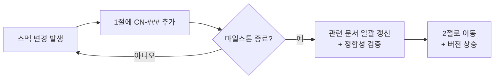

# 변경이력

> - **버전**: v0.1
> - **최종 수정**: 2026-09-22 (KST)
> - **상태**: 초안
> - **기준 코드**: `main @ 1ba5a1c`
> - **역할**: 모든 스펙 변경을 `CN-###` 단위로 추적한다. 마일스톤까지 쌓아 두었다가 일괄 반영한다.
> - **관련**: [마스터인덱스](마스터인덱스.md) · [작성 규칙](../README.md)

---

## 0. 한 장 요약

| 항목 | 내용 |
| --- | --- |
| 무엇인가 | 문서·설계 변경의 **단일 대장** |
| 왜 필요한가 | [작성 규칙 2.2절](../README.md)에 따라 버전은 마일스톤에서만 올린다. 그 사이의 변경을 잃지 않으려면 어딘가에 쌓아야 한다 |
| 어떻게 쓰는가 | 스펙이 바뀌면 **미반영 변경노트** 절에 `CN-###` 한 줄 추가. 마일스톤 종료 시 **반영 완료**로 옮기고 관련 문서를 일괄 갱신 |
| ID 규칙 | `CN-###`. **절대 재사용하지 않는다** — 폐기해도 번호를 회수하지 않는다 ([작성 규칙 3절](../README.md)) |

---

## 1. 미반영 변경노트

> 아래 항목은 아직 관련 문서에 **반영되지 않은** 스펙 변경입니다.
> 마일스톤 종료 시 해당 문서를 갱신하고 2절로 옮깁니다.

| CN | 일시 | 요약 | 영향 문서 | 근거 | 상태 |
| --- | --- | --- | --- | --- | --- |
| CN-001 | 2026-09-22 | **과제 상세 안내(A-1~A-6) 수신 → 범위 전면 변경** — 목표 기능이 "용어사전 1개"에서 "두 사이트 통합 + 10단원 재구성 + RAG 인덱싱 + GNB/LNB 재배치 + EC2 배포"로 확대됨 | 과업지시서 · 범위기술서 · 요구사항정의서 · ADR-0001 · docs/README.md (5절) | [과제-상세-안내.md 4.1절](../10-착수/과제-상세-안내.md) — A-1~A-6 이 기존 설계의 전제를 두 군데서 무너뜨림 | 미반영 |
| CN-002 | 2026-09-22 | **별도 저장소 분리** — `projects/domain-rag-lab` 작업본에서 `projects/investment-rag-lab` 으로 이전. GitHub: `EST-Bootcamp-Dongwon/investment-rag-lab`, GitLab: `mygithub05253/investment-rag-lab`. 기준 코드 sha 가 `a13b9a8` → `1ba5a1c` 로 변경 | 전 문서의 머리말 `기준 코드` | 과제 요건 A-5 "레포지토리는 무조건 별도로 파서 하기" | 미반영 |
| CN-003 | 2026-09-22 | **일정 압축** — 20세션 로드맵(S01~S20)이 **이틀**(9/22~9/23)로 축소됨 | 과업지시서 6절 · 범위기술서 3절 · 30-일정/ 전체 | 과제 요건 A-6 "오늘부터 내일까지 이틀만 사용할 수 있으면 된다" | 미반영 |
| CN-004 | 2026-09-22 | **학습 자료 색인 범위 확대** — `docs/` 를 의도적으로 색인하지 않던 방침(docs/README.md 5절)을 변경해야 함. 3주 학습 내용을 RAG 로 인덱싱하는 것이 과제 요건 자체(A-3)이므로 색인 대상을 넓히되 단원 메타데이터로 분리 | docs/README.md 5절 · RAG 파이프라인 · ADR 신규 | 과제 요건 A-2 + A-3 | 미반영 |
| CN-005 | 2026-09-22 | **GNB/LNB 2단 구조로 전면 재편** — 현재 메뉴(홈·종목보기·RAG 질문 등 단층)를 상단 GNB + 좌측 LNB 로 바꿔야 함 | 범위기술서 2.3절 · 40-화면/ | 과제 요건 A-4 "GNB/LNB 구조로 재구성" | 미반영 |
| CN-006 | 2026-09-22 | **REQ-001~005 재정의 필요** — 범위기술서 2.1절이 예약한 REQ-001~005 의 정의가 "용어사전 1개" 전제에 기반. 과제 상세 요건에 맞춰 다시 정의해야 함 | 범위기술서 2.1절 · 요구사항정의서 | CN-001 의 결과 | 미반영 |
| CN-007 | 2026-09-22 | **ADR-0001 범위 변경** — 원래 "통합 범위를 용어사전 한 기능으로 한정한다" 였으나, 과제 상세에 의해 전면 통합으로 확대됨. ADR-0001 을 **대체(superseded)** 하고 새 ADR 을 작성해야 함 | decisions/0001-*.md | CN-001 의 결과 | 미반영 |
| CN-008 | 2026-09-22 | **제출물 형식 확정** — `이동원 - <EIP> - https://github.com/EST-Bootcamp-Dongwon/investment-rag-lab` 3요소. 프리티어 한계점 별도 첨부 | 95-배포운영/ | [과제-상세-안내.md 6절](../10-착수/과제-상세-안내.md) | 미반영 |
| CN-009 | 2026-09-28 | **저장소 결정 변경 — pgvector 단독 → 역할별 다중 저장소** (PostgreSQL · pgvector · Qdrant · MongoDB · HF Hub 읽기 전용). ADR-0001 의 저장소 결정만 대체 · 과업지시서 5.3 의 ADR-0002 예정 제목(「Qdrant → pgvector 로 접는다」)과 반대 | ADR-0001 · 과업지시서 5.3 · 범위기술서 · 60-시스템/ · compose | [ADR-0002](../decisions/0002-역할별-다중-저장소.md) — 코드 대조(분석 RAG 늘 503 · Mongo 기동 의존 · 임베딩 두 방식) + 사용자 결정(여러 DB 를 유연하게 · HF 데이터 활용) | 미반영 |
| CN-010 | 2026-09-28 | **HF 데이터 원천 추가 · 공개 경계** — 팀 HF `qurious-quant/krx-daily-market`(private)을 분석 · ML 의 과거 데이터 원천으로. 파케이 커밋 금지 · 공개 배포는 원천 `off` · 행 덤프 API 금지. 화면 표시용 외부 차트 호출은 그대로(저장 안 함 · 사용자 판단) | 60-시스템/ · 50-데이터/(원천자료 대장) · 80-개발형상/(환경변수 대장) · .gitignore | [설계 §6](../60-시스템/아키텍처-다중저장소_v0.1.md) · Qurious `collector/README.md` §9.2 (private · 팀 범위가 유일한 근거) | 미반영 |
| CN-011 | 2026-09-28 | **규칙을 「고정」에서 「권장 · 리서치로 재검토」로** — 과업지시서 머리말 · 5.3(ADR 「작성 예정」 → **후보 목록**, 절 구성 권장) · 새 5.5절 · 7.2(1 GiB 전제는 배포 대상이 정해질 때 다시) · 범위기술서 머리말. 안전 규칙(원본 읽기 전용 · 번호 재사용 금지 · 비밀 커밋 금지 · 저작권 · 근거)은 그대로 | 과업지시서 · 범위기술서 · docs/README.md | 사용자 지시(2026-09-28): 「너무 고정적이면 작업의 한계치가 크기 때문」 | 🟡 문구는 S57 에 먼저 고침 · 버전은 마일스톤에서 |
| CN-012 | 2026-09-28 | **ADR-0002 1단계 적용 — compose `vector` 프로필** — `qdrant`(v1.15.1 · 로컬 `cpus` 2 · prod 는 제한 없음) + 색인 잡(`docs-index` · prod `curriculum-index`) · api 에 `QDRANT_URL` · 503 안내문 · `.gitignore` 에 HF 캐시 · 계약 시험 17건. 분석 RAG 늘 503(P1) · 없는 Qdrant 로 색인(P5) 해소 | 아키텍처 v0.1 §1.2 · §5 · §7 · compose · tests/ | [결정 기록 §6](../60-시스템/저장소-결정-5건_v0.1.md) — 통합 점검 43건 실패 0 · 재색인 4.6초 · Qdrant 146 MiB(2코어) | 코드 반영 · 문서는 아키텍처 v0.2 에서 |
| CN-013 | 2026-09-28 | **저장소 결정 5건** — ① HF org 10개 전부 원천 ② `MARKET_HISTORY_SOURCE` 기본 `off` → **`auto`**(토큰 있으면 켬 · 끄는 곳은 팀 밖에 여는 서버만 — CN-010 의 「공개 배포 off」를 좁힘) ③ `/period-return/extend` 그대로(HF 에 ETF 0/1,009) · 외부 값 저장 경로는 1곳이 아니라 **3곳**(백필 2 포함) ④ Mongo 계정 옮기지 않음(0개) · 3단계에서 PG 해시 강화 ⑤ `/chat` 문서 색인은 Qdrant 로(4단계) | 아키텍처 v0.1 §4.3 · §4.4 · §5 · §6 · §10 · ADR-0002 | [결정 기록](../60-시스템/저장소-결정-5건_v0.1.md) — 사용자 답(1 · 2) + 리서치 · 실측(3 · 4 · 5) | 미반영 |

---

## 2. 반영 완료

> 마일스톤에서 일괄 반영된 항목입니다. 아직 없습니다.

| CN | 반영 일시 | 반영 마일스톤 | 갱신된 문서 | 버전 변경 |
| --- | --- | --- | --- | --- |
| — | — | — | — | — |

---

## 3. 운영 규칙

### 3.1 CN 작성법

1. 스펙이 바뀌면 **즉시** 1절에 한 줄 추가한다.
2. ID 는 `CN-001` 부터 순번. **절대 재사용하지 않는다.**
3. **근거**를 반드시 적는다 — 과제 요건(A-#), 사용자 결정, 코드 실측, 또는 `(확인 필요)`.
4. **영향 문서**에는 갱신이 필요한 문서를 모두 나열한다.

### 3.2 반영 절차

### 3.3 폐기

CN 이 불필요해지면 상태를 `폐기` 로 바꾸고 사유를 적는다. 행을 삭제하지 않는다.
