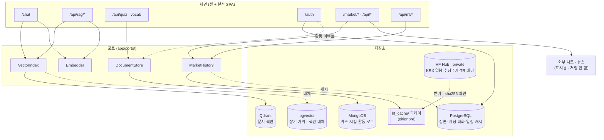

# 역할별 다중 저장소 아키텍처 v0.1 — 데이터베이스 배치와 포트 설계

> - **버전**: v0.1 (초안 · 검토 전)
> - **최종 수정**: 2026-09-28 (KST)
> - **상태**: 초안 — [ADR-0002](../decisions/0002-역할별-다중-저장소.md) 와 함께 검토
> - **기준 코드**: `main @ 220c4a7`
> - **역할**: 어떤 데이터를 **어느 저장소가 정본으로** 맡고, 코드는 저장소를 **어떤 포트로** 부르며, 저장소가 없을 때 **어떻게 물러서는지** 정한다.
> - **관련**: [ADR-0001](../10-착수/ADR-0001-통합범위-확대.md)(저장소 결정만 대체됨) · [변경이력](../00-index/변경이력.md) CN-009 · CN-010
> - **확실도**: 🟢 코드 · 실행으로 확인 / 🟡 추론 · 재확인 전 / 🔴 알려진 위험

---

## 0. 한 장 요약

| 항목 | 내용 |
|---|---|
| 무엇을 바꾸나 | 「PostgreSQL + pgvector 단독」(ADR-0001) → **데이터별 정본 저장소 + 포트/어댑터 + 폴백** |
| 저장소 | PostgreSQL(+pgvector) · **Qdrant** · **MongoDB** · **HF Hub(읽기 전용)** · (선택) Meilisearch · Redis |
| 원칙 3 | ① 엔티티마다 정본은 **하나** ② 벡터 색인 · 캐시는 **파생** — 언제든 다시 만든다 ③ 저장소 하나가 없어도 **앱은 뜬다** |
| 바로 고쳐지는 것 | 분석 화면 RAG 의 **늘 503** (Qdrant 가 compose 에 없음) · Mongo 없으면 기동 실패 |
| 새로 생기는 것 | 팀 HF 데이터(KRX 일봉 · 수정주가 · TR · 배당 · 벤치마크)를 **분석 · ML 의 과거 데이터 원천**으로 |
| 그대로 두는 것 | 화면 표시용 외부 차트 호출 — 받아서 보여 주기만 한다(사용자 판단 · 2026-09-28) |
| 🔴 경계 | HF 데이터는 **private** — 공개 저장소에 커밋 금지 · 공개 배포에서는 원천을 끈다(§6) |

---

## 1. 지금 모습 — 실측 (2026-09-28)

### 1.1 저장소별 사용처 🟢 (`grep` · compose)

| 저장소 | compose (로컬 / prod) | 쓰는 코드 | 무엇 |
|---|---|---|---|
| PostgreSQL + pgvector | ✅ / ✅ | `vector_store.py` · `hybrid_search.py` · `rag_service.py` · 모델 7표 | `users` · `user_sessions` · `chat_logs` · `document_chunks` · `long_term_memories` · `personal_calendar_events` · `stock_price_history` + `vector_chunks`(벡터) |
| **Qdrant** | ❌ / ❌ | `routes/rag_analysis.py` · `ops/index_curriculum.py` | 분석 화면 「근거 문서 검색」 컬렉션 `investment_docs` |
| **MongoDB** | ✅ / ✅ (api 가 depends_on) | `routes/auth.py` · `routes/quiz.py` · `routes/vocabulary_exam.py` · `mongo_db.py` | `users` · `auth_sessions` · `user_activity` · `quiz_questions` · `vocabulary_exam_submissions` · `app_metadata` |
| Meilisearch | ✅ / ❌ | `routes/analysis_main.py` (없으면 원문 검색 폴백) · `ops/index_search.py` | 학습 문서 전문 검색 |
| Redis | ✅ / ✅ | **없음** (설정 값만 `config.py`) | — |
| 외부 API | — | `routes/market.py`(외부 차트 9곳 · 네이버 1 · 뉴스 RSS 1) · `analysis_main.py`(yfinance · pykrx) | 화면 표시용 시세 · 뉴스 |

### 1.2 이 모습이 만드는 문제

```
                 ┌───────────── 앱 (FastAPI 한 프로세스) ─────────────┐
                 │  /chat ──────────▶ pgvector  vector_chunks          │
                 │                    (blake2b n-gram 해시 384)         │
                 │  /api/rag/* ─────▶ Qdrant    investment_docs  ✕ 없음│ ← 늘 503
                 │                    (sha256 토큰 해시 384)            │ ← 같은 문서 · 다른 임베딩
                 │  /api/quiz 기동 ─▶ Mongo 시드 ─ 없으면 기동 실패 🟡   │
                 │  /auth ─▶ PG users   /api/auth ─▶ Mongo users        │ ← 계정 두 벌
                 │  Redis ─ 아무도 안 씀                                │
                 └──────────────────────────────────────────────────────┘
```

| # | 문제 | 근거 | 확실도 |
|:-:|---|---|:-:|
| P1 | 분석 RAG 가 늘 503 — 코드는 Qdrant, compose 에는 없음 | `rag_analysis.py:16` · compose 서비스 목록 | 🟢 |
| P2 | **같은 교재가 두 방식으로 임베딩** — `/chat` 은 blake2b 문자 n-gram, 분석 RAG 는 sha256 토큰. 섞어 쓰면 검색이 조용히 틀린다 | `embedder.py:26-46` · `index_curriculum.py:28-` · `rag_analysis.py:58-65` | 🟢 |
| P3 | Mongo 가 없으면 API 기동이 멈춘다 — 퀴즈 라우터 `startup` 이 Mongo 에 인덱스 · 시드 | `quiz.py:124-127` · `mongo_db.py:38`(5초 타임아웃) | 🟡 (실행 확인 전) |
| P4 | 계정 두 벌 — 셸은 PG `/auth`, 분석 화면은 Mongo `/api/auth` · 토큰 키도 다르다 | `domain_auth.py` · `auth.py` · `analysis/js/auth.js:1` | 🟢 |
| P5 | Redis · (prod) 교재 색인 잡이 뜻 없이 돈다 — Redis 사용처 0 · `curriculum-index` 는 없는 Qdrant 로 색인 | compose · `index_curriculum.py:15` | 🟢 |
| P6 | ML API 14개 중 5개가 **합성 데이터**(`make_classification` 등) — 실제 시장 데이터를 쓰지 않는다 | `routes/ml.py` | 🟢 |

---

## 2. 목표 구조



### 2.1 데이터별 정본 — 한 표

| 데이터 | 정본 | 파생 · 캐시 | 없을 때 |
|---|---|---|---|
| 계정 · 세션 | **PostgreSQL** `users` · `user_sessions` | — | 로그인 기능만 503 |
| 대화 기록 · 장기 기억 | **PostgreSQL** `chat_logs` · **pgvector** `long_term_memories` | — | `/chat` 은 기억 없이 답한다 |
| 개인 일정 | **PostgreSQL** `personal_calendar_events` | — | 일정 기능만 503 |
| 교재 · 강의 · 업로드 문서 원문 | **PostgreSQL** `document_chunks` (+ `data/*.md` 파일) | **Qdrant** 컬렉션 · pgvector `vector_chunks` (다시 만들 수 있음) | 벡터 검색 대신 키워드 검색(`hybrid_search` 키워드 쪽) |
| 퀴즈 문제은행 · 단어시험 제출 · 앱 메타 | **MongoDB** | — | 퀴즈 · 시험만 「준비 안 됨」 · **앱은 뜬다** |
| 이용 활동 로그 | **MongoDB** `user_activity` (추가만) | — | 기록을 건너뛴다(기능은 그대로) |
| KRX 과거 일봉 · 수정주가 · TR · 배당 · 벤치마크 | **HF Hub** `qurious-quant/krx-daily-market` (팀 수집기) | 로컬 `data/hf_cache/` 파케이 · PG `stock_price_history` | 분석은 「과거 데이터 없음」 · 표시용 외부 차트는 그대로 |
| 실시간 시세 · 뉴스 (표시용) | 외부 API (저장 안 함) | (선택) Redis TTL 캐시 | 그 위젯만 비운다 |

**정본을 하나로 두는 이유** — 저장소 사이에는 트랜잭션이 없다. 같은 사실을 두 곳에 「정본」으로 쓰면 어긋났을 때 어느 쪽이
맞는지 알 수 없다(지금의 계정 두 벌이 그렇다). 그래서 둘째 자리는 늘 **파생**이고, 파생은 정본에서 다시 만든다.

---

## 3. 포트와 어댑터

코드는 저장소 SDK 를 직접 부르지 않고 아래 포트를 부른다. 어댑터는 환경 변수로 고른다(§5).

| 포트 | 하는 일 | 어댑터 | 고르는 변수 |
|---|---|---|---|
| `Embedder` | 글 → 벡터 · **방식 id** (`hash-ngram-384@v1` 등) | `HashNgramEmbedder`(지금 `embedder.py`) · (나중) 모델 임베더 | `EMBEDDER` |
| `VectorIndex` | 색인 만들기 · 넣기 · 찾기 · 개수 · 상태 · **방식 id 기록** | `QdrantIndex`(HTTP · SDK 없음) · `PgVectorIndex`(지금 `vector_store.py`) | `DOCS_INDEX_BACKEND` · `MEMORY_INDEX_BACKEND` |
| `DocumentStore` | 문서형 컬렉션 CRUD · 추가 전용 이벤트 | `MongoStore`(motor) · `NullStore`(없을 때 「준비 안 됨」) | `MONGODB_URL` 유무 |
| `MarketHistory` | 종목 · 기간 → 일봉(수정/원) · TR · 배당 · 지수 | `HfParquetHistory` · `PgCacheHistory`(`stock_price_history`) · `NoHistory` | `MARKET_HISTORY_SOURCE` |

```python
# app/ports/vector_index.py — 모양만 (구현은 §7 의 4단계)
class VectorIndex(Protocol):
    def ensure(self, collection: str, dim: int, embed_method: str) -> None: ...
    def upsert(self, collection: str, items: list[Chunk], vectors: list[list[float]]) -> None: ...
    def search(self, collection: str, vector: list[float], top_k: int, *,
               embed_method: str, filters: dict | None = None) -> list[Hit]: ...
    def count(self, collection: str) -> int: ...
    def health(self) -> Health: ...          # 연결 · 컬렉션 · 방식 id — 화면 상태 배지가 읽는다
```

- **방식 id 검사** — 색인을 만들 때 `embed_method` 를 기록한다(Qdrant 는 컬렉션 메타, pgvector 는 행 칸). 질의의 방식 id 가 다르면
  **예외로 거절한다.** P2(같은 문서 · 다른 해시)가 조용히 틀리는 것을 막는 유일한 장치다.
- **폴백은 None 이 아니라 상태로** — 저장소가 없으면 어댑터가 `Health(available=False, reason=…)` 를 돌려주고, 라우터는 503 대신
  「준비 안 됨 · 이유」를 화면에 준다. 앱 기동은 어떤 저장소에도 **막히지 않는다**(기동 때 연결 시도 금지 — 첫 요청 때 게으르게).
- **재사용** — 「원천 → 쓸 수 없으면 옛 경로」 모양은 Qurious 의 수집 DB 다리(`app/services/collector_db.py` · 2026-09-28)와 같다.
  같은 사람이 두 저장소를 오가므로 모양을 맞춘다.

---

## 4. 데이터별 설계

### 4.1 문서 검색 — Qdrant 가 정본 색인, pgvector 는 대체 경로

```
data/*.md · 업로드 ──▶ PG document_chunks (원문 정본)
                          │  색인 잡 (다시 만들 수 있음)
                          ├──▶ Qdrant   collection "docs"    embed_method = hash-ngram-384@v1
                          └──▶ pgvector vector_chunks        embed_method = hash-ngram-384@v1   (DOCS_INDEX_BACKEND=pgvector 일 때)
/chat · /api/rag/* ──▶ Embedder(같은 id) ──▶ VectorIndex(골라진 쪽) ──▶ 조각 + 유사도
```

- 두 경로(`/chat` · `/api/rag/*`)가 **같은 색인 · 같은 임베더**를 본다. 지금의 컬렉션 둘(`investment_docs` · `vector_chunks`)은 하나로 모은다.
- 키워드 검색(`hybrid_search` 의 PG `ILIKE`)은 그대로 두고, 벡터 쪽만 포트로 바꾼다 — RRF 병합은 그대로.
- 1단계(§7)는 **코드를 고치지 않고** compose 에 Qdrant 와 색인 잡만 되살려 분석 RAG 를 살린다. 통합(한 색인 · 한 임베더)은 4단계.

### 4.2 대화 · 장기 기억 — PostgreSQL + pgvector

계정 · 대화와 한 트랜잭션에 묶이는 벡터라 pgvector 에 둔다(지금과 같다). `MEMORY_INDEX_BACKEND` 는 두되 기본값은 `pgvector`.

### 4.3 계정 · 활동 — 계정 정본은 PostgreSQL, 활동 로그는 MongoDB

| 지금 | 목표 |
|---|---|
| 셸 `/auth`(PG) · 분석 `/api/auth`(Mongo) — 계정 두 벌 · 토큰 키 둘 | 계정은 PG `/auth` 하나 · 분석 화면도 같은 토큰 키 → **한 번 로그인(SSO)** |
| 활동 기록 Mongo `/api/auth/activity` | `/auth/activity` 가 PG 계정으로 확인한 뒤 **Mongo `user_activity` 에 추가만** |

- 강사님 KMS 포털(`learning/th24` · `frontend/auth.js` 87줄 · 공통 토큰 키 `finance-rag-auth-token`)이 같은 방향이다 — 화면 코드는 거기서 가져온다.
- Mongo `/api/auth` 는 이관 뒤 폐기 — 기존 Mongo 계정의 옮김 여부는 🟡 결정 필요(§9).

### 4.4 시장 데이터 — 표시용 외부 호출은 그대로, 과거 데이터는 HF

| 쓰임 | 원천 | 저장 | 이 설계에서 |
|---|---|---|---|
| 화면 표시용 시세 · 차트 · 뉴스 (`market.py` · `analysis_main.py`) | 외부 차트 · 네이버 · 뉴스 RSS · yfinance · pykrx | **안 함** | **그대로 둔다** (사용자 판단 · 2026-09-28 — 받아서 보여 주기만 하므로 수집이 아니다) |
| `/period-return/extend` | 외부 차트 | ⚠️ **`stock_price_history` 에 저장** (`market.py:637`) | 🟡 이 한 경로는 「받아서 저장」이다 — 그대로 둘지, HF 원천으로 채울지 결정 필요(§9) |
| 분석 · 백테스트 · ML 의 **과거** 일봉 · 수정주가 · TR · 배당 · 지수 | **HF `qurious-quant/krx-daily-market`** | 로컬 파케이 캐시(gitignore) | **새로** — `MarketHistory` 포트 |
| ML 합성 데이터 5곳 | `make_classification` 등 | — | 실제 KRX 수익률 피처로 바꿀 수 있는 자리가 생긴다(선택) |

HF 데이터셋(Qurious 수집기가 매일 12:30 에 올린다 · 🟡 수치는 09-21 기준): 파케이 약 27파일 · 약 555.6MB · private.

| HF 표 | 쪼개기 | 이 앱에서 |
|---|---|---|
| `price_daily` | 연도별 | 원 가격 · 거래량 · 시가총액 |
| `price_adjusted` | 연도별 | **분석 · 백테스트 기본값** (분할 · 권리락을 이은 수정주가) |
| `price_total_return` | 연도별 | 배당까지 넣은 성과 비교 |
| `dividend` · `corporate_action` | 한 파일 | 배당 캘린더 · 분할 표시 |
| `benchmark_index` | 한 파일 | 시장 대비 초과 수익 |
| `raw_response` · `ingest_day` | — | **받지 않는다** (감사용 원문 · 이 앱에 필요 없음) |

⚠️ 알려진 값 오염 — 장기 거래정지 뒤 감자 · 병합 2곳(052670 · 086460)은 수정주가에 **300배 · 20배 도약**이 남아 있다
(Qurious 결함대장 DF-01 · 2026-09-28 재측정). 어댑터는 이 종목을 막거나 표시해야 한다 🟡.

### 4.5 퀴즈 · 단어시험 — MongoDB

문제 모양이 단원마다 다르고(객관식 · 주관식 · 이미지), 제출 기록은 추가만 하므로 문서 DB 가 맞다(지금과 같다).
바꾸는 것은 하나 — **기동 때 시드하지 않는다.** 시드는 `quiz-init` 잡(이미 compose profile 로 있음)이 맡고, 라우터는 첫 요청 때 연결한다.

### 4.6 검색 · 캐시 — 선택 저장소

- Meilisearch: 지금처럼 **없으면 원문 검색 폴백**. compose `search` 프로필로 내린다.
- Redis: 지금 사용처 0. 쓰려면 역할을 하나만 준다 — **외부 표시용 호출의 짧은 TTL 캐시**(같은 종목 차트를 몇 초 안에 다시 부르지 않게). 아니면 compose 에서 뺀다
  — 과업지시서 5.3 이 예정한 ADR-0006(「redis · streamlit · LEAN 을 제거한다」)과 같은 방향이다. 역할을 주지 않으면 그 ADR 로 뺀다.

---

## 5. 설정 · compose 프로필

| 변수 | 값 | 기본 | 뜻 |
|---|---|---|---|
| `DOCS_INDEX_BACKEND` | `qdrant` · `pgvector` | `qdrant` | 문서 색인 저장소 |
| `MEMORY_INDEX_BACKEND` | `pgvector` · `qdrant` | `pgvector` | 장기 기억 색인 |
| `QDRANT_URL` | URL | `http://qdrant:6333` | (있으면) Qdrant |
| `MONGODB_URL` | URL · 비움 | `mongodb://mongo:27017` | 비우면 `NullStore` — 퀴즈 · 시험 「준비 안 됨」 |
| `MARKET_HISTORY_SOURCE` | `hf` · `pg` · `off` | `off` | **공개 배포는 반드시 `off`**(§6) |
| `HF_DATASET_REPO` · `HF_REVISION` | repo id · 태그/커밋 | `qurious-quant/krx-daily-market` · (고정 태그) | 재현을 위해 **판을 고정**해 받는다 |
| `HUGGINGFACE_ACCESS_TOKEN` | 토큰 | 없음 | `.env` 만 · 어떤 경로로도 출력하지 않는다 |
| `HF_CACHE_DIR` | 경로 | `data/hf_cache` | `.gitignore` 에 추가 |

| compose 프로필 | 서비스 | 언제 |
|---|---|---|
| (기본) | `postgres` · `api` | 최소 — 계정 · 대화 · 키워드 검색 |
| `vector` | `qdrant` · `docs-index`(잡) | 문서 벡터 검색 · 분석 RAG |
| `docs` | `mongo` · `quiz-init`(잡) | 퀴즈 · 단어시험 · 활동 로그 |
| `search` · `cache` · `llm` | `meilisearch` · `redis` · `ollama` | 선택 |
| `full` | 위 전부 | 로컬 개발 기본 권장 |

자원 어림 🟡 — Qdrant 는 청크 약 1,190개 · 384차원이면 수십 MB 수준, Mongo · PG 도 이 규모에서는 수백 MB 안쪽이다.
로컬(22코어)에는 부담이 없고, **1GiB 급 인스턴스에는 `full` 을 올리지 않는다**(ADR-0001 의 우려는 그 환경에서 여전히 맞다).

---

## 6. 🔴 HF 데이터 경계 — private 데이터를 공개 저장소 앱이 읽을 때

팀이 이 데이터를 HF 에 올려 쓰기로 한 근거는 **「private 저장소 · 팀(org `qurious-quant`) 범위」 하나뿐**이다(Qurious
`collector/README.md` §9.2 — 공공누리 「변경금지」 해석은 미확정 · 원문 반출을 포함). 그 전제가 깨지면 판단을 처음부터 다시 해야 한다.
이 앱은 **공개 저장소**이고 EC2 배포 이력이 있다. 그래서:

| 규칙 | 어떻게 지키나 |
|---|---|
| 파케이 · 캐시를 커밋하지 않는다 | `.gitignore` 에 `data/hf_cache/` · `*.parquet` — 1단계에서 먼저 넣는다 |
| 토큰을 출력 · 커밋하지 않는다 | `.env` 에서만 읽고, 상태 API 는 「토큰 있음/없음」만 말한다 |
| 공개 배포에서는 원천을 끈다 | `MARKET_HISTORY_SOURCE=off` 가 기본값 · prod compose 는 명시적으로 `off` |
| 원자료 행을 그대로 내보내는 API 를 만들지 않는다 | 포트는 계산 결과(수익률 · 지표 · 백테스트 요약)를 돌려주고, 행 덤프 엔드포인트는 두지 않는다 🟡 |
| 누가 쓰나 | 팀원(HF org 구성원) · 로컬 실행. 팀 밖 사람에게 이 앱을 HF 원천을 켠 채 열어 주면 → 판단을 다시 한다 |

```
로컬 (팀원)                           공개 배포
────────────────────────────          ────────────────────────────
MARKET_HISTORY_SOURCE=hf              MARKET_HISTORY_SOURCE=off
HF ─▶ data/hf_cache (gitignore)       과거 데이터 기능은 「준비 안 됨」
     ─▶ MarketHistory ─▶ 계산 결과     표시용 외부 차트는 그대로
```

---

## 7. 단계 — 작게 · 하나씩 확인하며

| 단계 | 무엇 | 바뀌는 파일 (예상) | 확인 | 규모 |
|:-:|---|---|---|:-:|
| **1** | Qdrant 를 compose `vector` 프로필로 되살리고 `docs-index` 잡(`app.ops.index_curriculum`)을 붙인다 · prod `curriculum-index` 도 같은 Qdrant 로 · `.gitignore` 에 HF 캐시 | `docker-compose*.yml` · `.gitignore` | `docker compose --profile vector up` → 색인 잡 → `python -m app.ops.verify_integration` 의 `/api/rag/search` count > 0 | 작음 |
| **2** | Mongo 없이 기동 — 퀴즈 `startup` 시드 제거(잡이 맡음) · 게으른 연결 · `NullStore` | `routes/quiz.py` · `mongo_db.py` | Mongo 를 끈 채 `uvicorn` 기동 · 퀴즈만 「준비 안 됨」 | 작음 |
| **3** | 계정 정본 PG · SSO — th24 `auth.js` · 활동 로그 Mongo 추가 전용 | `frontend/auth.js` · `index.html` · `routes/domain_auth.py` · `analysis/js/auth.js` | 셸에서 가입 → 분석 화면 로그인 유지 → 활동 1건 | 중간 |
| **4** | `Embedder` · `VectorIndex` 포트 — 색인 하나 · 임베더 하나 · **방식 id 검사** · `/chat` 과 `/api/rag` 가 같은 색인 | `app/ports/*` · `vector_store.py` · `rag_analysis.py` · `hybrid_search.py` · `index_curriculum.py` | **같은 계약 시험을 두 어댑터(Qdrant · pgvector)에 돌린다** · 방식 id 가 다르면 거절 | 중간 |
| **5** | `MarketHistory` 포트 + `HfParquetHistory` — 판 고정 받기 · sha256 확인 · 계산 결과만 반환 · DF-01 종목 표시 | `app/ports/market_history.py` · `app/adapters/hf_parquet.py` · `requirements.txt`(`huggingface_hub` · `pyarrow`) | 합성 파케이 골든 픽스처(실데이터를 커밋하지 않음) · 토큰 없으면 「준비 안 됨」 | 중간 |
| 6 | (선택) ML 합성 데이터 5곳 → 실제 수익률 피처 · Redis TTL 캐시 · Meili 프로필 | `routes/ml.py` 등 | 화면 비교 | 선택 |

1단계만으로 사용자에게 보이는 결함(P1)이 사라진다. 4단계 전까지는 **두 색인 · 두 임베딩이 공존**한다(지금과 같다) — 그 사이 섞어 쓰지 않는다.

---

## 8. 시험 계획

| 시험 | 무엇을 지키나 | 계층 |
|---|---|---|
| 벡터 색인 계약 시험 — **같은 시험 묶음을 Qdrant · pgvector 어댑터에 각각** | 어느 저장소를 골라도 같은 입력에 같은 모양 · 같은 순서 | 계약 · 통합(도커) |
| 방식 id 불일치 거절 | 다른 임베딩으로 만든 색인을 조용히 쓰지 않는다 | 단위 |
| Mongo 없이 기동 | 저장소 하나가 앱 전체를 멈추지 않는다 | 통합 |
| HF 어댑터 골든 픽스처 — **합성 파케이**(작은 가짜 표) | 판 고정 · sha256 확인 · 계산만 반환 · 토큰 없음 = 「준비 안 됨」 | 단위 |
| 공개 배포 설정 검사 — prod compose 의 `MARKET_HISTORY_SOURCE` 가 `off` | 🔴 경계가 설정 실수로 풀리지 않는다 | 정적 |

---

## 9. 코드 재사용 판정

| 지금 코드 | 판정 | 어디로 |
|---|---|---|
| `routes/rag_analysis.py` (Qdrant HTTP) | 🟢 **살린다** — 1단계는 그대로, 4단계에 포트로 | `QdrantIndex` 어댑터의 뼈대 |
| `routes/rag.py` (262줄 · `main.py` 가 안 부름) | 🔴 지운다 | — (`rag_analysis.py` 와 환경 변수 이름만 다름) |
| `services/vector_store.py` (pgvector) | 🟢 살린다 | `PgVectorIndex` 어댑터 |
| `services/embedder.py` (blake2b n-gram) | 🟢 **표준 임베더** | `HashNgramEmbedder` — 방식 id `hash-ngram-384@v1` |
| `ops/index_curriculum.py` 의 `embed()` (sha256 토큰) | 🟡 바꾼다 | 표준 임베더를 쓰게 — 4단계 |
| `services/hybrid_search.py` | 🟢 살린다 · 벡터 쪽만 포트로 · 한국어 조사 처리(th24 `hybrid_search.py:76-89`) 이식 | — |
| `mongo_db.py` · 퀴즈 · 단어시험 | 🟢 살린다 · 기동 시드만 뺀다 | `MongoStore` |
| `routes/auth.py` (Mongo 계정) | 🟡 이관 뒤 폐기 | `/auth`(PG) + 활동 로그만 Mongo |
| Qurious `app/services/collector_db.py` · `scripts/hf_dataset.py` | 🟢 **모양 재사용** | 「원천 → 없으면 물러섬」 · 판 고정 · sha256 확인 |
| th24 `app/services/vector_store.py`(Qdrant) · `ops/reindex_vector_store.py` | 🟡 참고 | 4단계 Qdrant 어댑터 · 재색인 잡 |

---

## 10. 결정이 필요한 것 (사용자)

1. **HF 데이터셋** — `qurious-quant/krx-daily-market` 이 맞나? 다른 org(`mirae-pb-assistant` · `stock-coin-trade`)의 데이터도 쓰나?
2. **공개 배포에서 HF 원천** — 끄는 것(`off`)을 기본으로 했다. 켜야 한다면 §6 의 전제를 다시 판단해야 한다.
3. **`/period-return/extend`** — 외부 차트 값을 `stock_price_history` 에 **저장**하는 한 경로를 그대로 둘까, HF 원천으로 채울까?
4. **기존 Mongo 계정** — PG 로 옮길까, 새로 가입하게 할까?
5. **`/chat` 의 문서 색인** — 4단계에서 Qdrant 로 모을까(기본안), pgvector 로 남길까?
