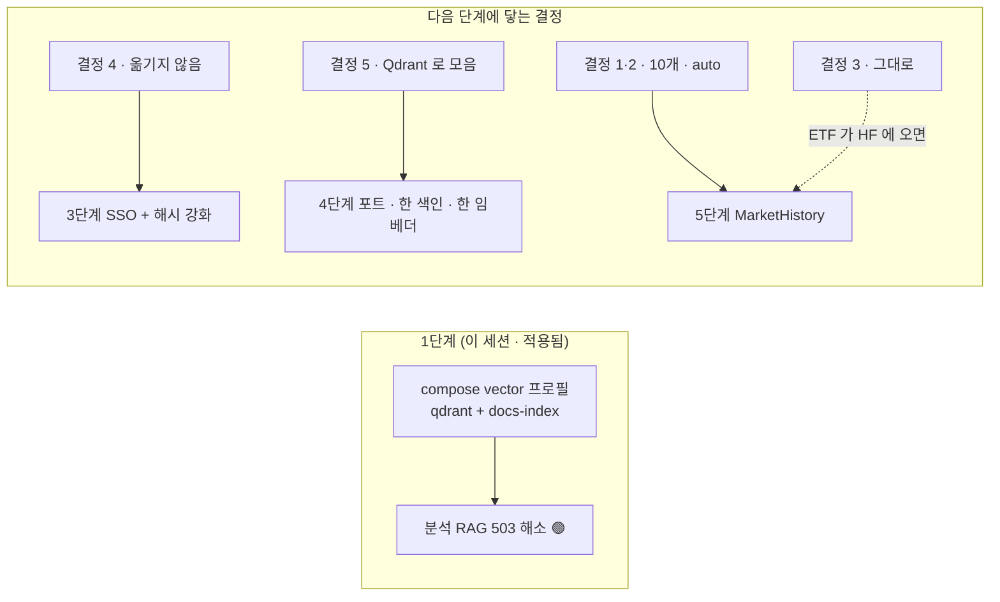

# 저장소 결정 5건 — 사용자 답 · 리서치 · 1단계 실측

> - **버전**: v0.1
> - **작성일**: 2026-09-28 (KST) · S58
> - **상태**: 결정 기록 — 되돌릴 수 있다. 결정마다 **다시 볼 조건**을 적었다([과업지시서 5.5절](../10-착수/과업지시서.md) — 규칙은 출발점)
> - **기준 코드**: `main @ 220c4a7` + 이 세션의 작업 트리(1단계)
> - **답하는 곳**: [아키텍처 v0.1 §10](아키텍처-다중저장소_v0.1.md) 「결정이 필요한 것」 5개 · [ADR-0002](../decisions/0002-역할별-다중-저장소.md)
> - **변경이력**: CN-012(1단계) · CN-013(이 결정들) — 아키텍처 문서는 **다음 판(v0.2)** 에서 이 내용을 접는다(§7)
> - **확실도**: 🟢 코드 · 실행으로 확인 / 🟡 추론 · 재확인 전 / 🔴 알려진 위험

---

## 0. 한 장 요약

| # | 질문 (§10) | 결정 | 한 줄 근거 | 다시 볼 조건 |
|:-:|---|---|---|---|
| 1 | 어떤 HF 데이터셋을 쓰나 | **org `qurious-quant` 의 10개 전부**를 쓸 수 있는 원천으로 둔다. 시장 과거 데이터 1순위는 `krx-daily-market` | 사용자 답 + 목록 실측(10개 · 전부 private 🟢) | 데이터셋이 늘거나 카드의 사용 조건이 바뀔 때 |
| 2 | 공개 배포에서 HF 원천 | 기본값 **`auto` — 토큰이 있으면 켠다.** 끄는 곳은 **팀 밖 사람이 접속하는 서버** 하나 | 데이터는 private 이라 안전(사용자 답) · 위험은 「서버가 대신 받아 보여 주는」 경우뿐 | 팀 밖에 여는 서버를 올릴 때 |
| 3 | `/period-return/extend` | **지금은 그대로**(버튼 1회 · 1종목 · Yahoo). HF 에 ETF 시세가 생기면 HF 로 바꾼다 | HF 에 ETF 가 **0 / 1,009** 🟢 — 대신할 값이 없다 | Qurious 수집기에 ETF 시세가 들어올 때 |
| 4 | 기존 Mongo 계정 | **옮기지 않는다** — 옮길 계정이 **0개** 🟢. 3단계에서 Mongo 로그인을 닫고 PG 하나로 | 이관 비용 > 이득 0 · 인프라 비용 차이 0 | 옛 서버 · 백업에서 계정이 나올 때 |
| 5 | `/chat` 의 문서 색인 | **Qdrant 로 모은다**(4단계 · 기본안 유지). pgvector 는 대체 경로 · 장기 기억은 pgvector | 분석 RAG 가 이미 Qdrant · 이 규모에선 속도 차이 없음 · 하이브리드를 서버로 옮길 길 | 4단계 계약 시험에서 두 어댑터 결과가 크게 갈릴 때 |



---

## 1. 결정 1 — HF 데이터셋: org 10개 전부

> 사용자(2026-09-28): *"https://huggingface.co/qurious-quant의 모든 데이터셋을 활용한다고 생각하시면 됩니다 … private organization이기
> 때문에 절대 다른 사람들에게 공개되지 않습니다."* · 같은 날 *"Dataset 전부 다 private으로 전환 완료"*.

조회 결과(🟢 `HfApi.list_datasets(author="qurious-quant")` · 16시대 두 번 — 처음엔 **6개가 public** 이었고, 사용자가 바꾼 뒤 **10 / 10 private**):

| 데이터셋 | 크기 | 무엇 | 이 앱에서 | 카드에 적힌 사용 조건 |
|---|--:|---|---|---|
| `krx-daily-market` | 584.2 MB | 주식 일봉 · 수정주가 · TR · 배당 · 분할 · 벤치마크 (Qurious 수집기 · 매일 12:30) | **MarketHistory 1순위** — 분석 · 백테스트 · ML | `raw_response` · `ingest_day` 는 받지 않는다 · **ETF 없음** · DF-01 두 종목(052670 · 086460) 값 오염 |
| `alphastack-krx-dev` | 581.9 MB | KRX 개발 구간(~2024-08-31) · 8,491,701행 × 207칸 · 재무 · 거시 · 텍스트 | 피처 · 재무 · 거시 지표 참고 | 🔴 **KRX 약관 제11조 ② 제3자 제공 금지** · 홀드아웃 구간 없음(찾지 않는다) |
| `alphastack-dart` | 477.6 MB | DART 재무 `pit/`(350사 · 662,933행) · `bulk/` | 재무 지표 | 학습에는 `pit/` 만 · 시점은 `rcept_dt` |
| `alphastack-krx-holdout` | 1.5 MB | 홀드아웃 예측 결과(원자료 가격 없음) | 결과 표시만 | 결과를 보고 모델 · 피처를 **다시 고르지 않는다** |
| `alphastack-backtest-*` 등 6개 | 각 0.1 MB 이하 | 백테스트 결과 · 비용 민감도 · 손익분기 비용 · KOSPI200 · 체결/거래 로그 | 화면 예시 · 비교 표 | 가공 결과 |

- 합계 약 **1.65 GB** — 전부 받지 않는다. 어댑터는 필요한 파일만(`allow_patterns`) · 판(커밋 해시)을 고정해 받는다.
- **새로 만드는 데이터셋도 private 으로** — 공개 여부는 저장소마다 따로다(이번에 6개가 public 이었던 이유). 만들 때 `private=True` 를
  주고, 올리기 전에 원격이 실제로 private 인지 검사한다(Qurious `scripts/hf_dataset.py` 의 `_assert_private()` 가 이 모양). 팀 규칙은 Qurious 이슈로 제안한다.

## 2. 결정 2 — 「공개 배포에서 HF 원천을 끈다」의 뜻과 새 기본값

사용자 말이 맞다 — **HF 에 두는 것 자체는 안전하다**(private org · 팀원만 읽는다). v0.1 이 걱정한 것은 다른 한 가지였다.

```
                 ① 코드 저장소 공개 (GitHub Public)        ② 웹 서비스 공개 (누구나 여는 주소 · 옛 EC2)
올라가는 것        코드 · 설정 · 문서                         화면에 보이는 숫자 · 표
HF 데이터         올라가지 않는다                            서버가 팀 토큰으로 HF 에서 받아
                  (.gitignore · 토큰은 .env 에만)            방문자 화면에 그려 주면 → 팀 밖 사람이 본다
위험              없음 (1단계에서 .gitignore 추가)           alphastack-krx-dev 카드의 「제3자 제공 금지」와 부딪힌다
```

| 변수 | 값 | 뜻 |
|---|---|---|
| `MARKET_HISTORY_SOURCE` | **`auto`(기본)** | HF 토큰이 있으면 `hf`, 없으면 `off` — 로컬 · 팀원은 따로 켤 일이 없다 |
| | `hf` · `pg` · `off` | 강제로 고른다. **팀 밖 사람이 접속하는 서버**(prod compose)만 `off` 를 적는다 |

AWS 는 지금 제외라 ②에 닿는 곳은 당분간 없다. 설계 v0.1 의 기본값 `off` 는 이 결정으로 바뀐다(CN-013).

## 3. 결정 3 — `/period-return/extend`: 지금은 그대로

사실(🟢):

| 항목 | 값 |
|---|---|
| 쓰는 화면 | ETF 탐색기 — 카탈로그 `frontend/days/assets/etf-catalog.json` **1,009개 코드** |
| 표 `stock_price_history` 를 채우는 곳 | ① `ops/backfill_etf_ohlcv.py`(1,009종목 × 1년 · Yahoo) ② `ops/backfill_ohlcv.py`(Yahoo) ③ `POST /period-return/extend`(버튼 · 1종목 · Yahoo) |
| HF `krx-daily-market` 의 ETF | **0 / 1,009** — 수집기가 `getStockPriceInfo`(주식)만 받는다 |
| 로컬 PG `stock_price_history` | 0행 — 백필이 로컬에서 돈 적이 없다 |

🟡 **S57 기록 정정**: 「받은 값을 저장하는 경로는 extend 한 곳」이 아니라 **백필 스크립트 2개까지 세 곳**이다(`market.py` 밖 `ops/`).

| 원천 | 조건 | 이 경로에 |
|---|---|---|
| Yahoo 차트 API (지금) | 비공식 API · 약관상 개인 · 비상업 이용, 자동 접근은 허가 필요 · yfinance 도 「연구 · 교육용」으로만 안내 | 학습자가 누를 때 1종목 — 로컬 학습 용도로는 유지 가능 |
| 공공데이터포털 **금융위원회_증권상품시세정보** | ETF · ETN · ELW 일별 시세 · **공공누리 제4유형**(출처표시 · 상업적 이용금지 · 변경금지) · 일 1회 갱신 · 개발계정 10,000건 | Qurious 주식 시세(`getStockPriceInfo`)와 **같은 기관 · 같은 약관 · 같은 키** — 수집기에 한 오퍼레이션을 더하는 일 |
| HF | 없음 | — |

**결정**: 지금은 그대로 둔다(대신할 값이 없다). **다음**: Qurious 수집기에 ETF 시세가 들어와 HF 에 올라오면, 세 경로 모두 `MarketHistory` 포트로 HF 에서
채우고 Yahoo 저장 경로를 닫는다. 수집기 확장은 Qurious 데이터 파트의 일이라, Qurious 화면에 ETF 가 필요한지부터 본다(후보 · 아직 이슈 아님).

## 4. 결정 4 — 기존 Mongo 계정: 옮기지 않는다

사실(🟢 임시 컨테이너로 볼륨을 열어 셈):

| 저장소 | 계정 | 그 밖 |
|---|--:|---|
| Mongo `domain-rag-lab-local_investment_mongo_data` | **0** (`users` 컬렉션 없음) | 퀴즈 34 · 앱 메타 1 |
| Mongo `investment-analysis_investment_mongo_data`(통합 전 원본) | **0** | 퀴즈 34 · 앱 메타 1 · 단어시험 제출 1 |
| PG `domain-rag-lab-local_postgres_data` | **0** | 문서 조각 1,452 |
| 옛 EC2 | 🟡 확인 불가(AWS 제외) | — |

비밀번호 저장 방식과 권장값([OWASP Password Storage Cheat Sheet](https://cheatsheetseries.owasp.org/cheatsheets/Password_Storage_Cheat_Sheet.html)):

| | 지금 | OWASP 권장 | 이 PC 실측 |
|---|---|---|---|
| Mongo `/api/auth` | PBKDF2-HMAC-SHA256 **310,000회** · 문자열에 방식 표기(`pbkdf2_sha256$…`) | 600,000회 | 600,000회 0.098초 |
| PG `/auth` | scrypt **N=2^14** · r=8 · p=1 · 방식 표기 없음(`솔트$다이제스트`) | 최소 N=2^17 · r=8 · p=1 (128 MiB) | 🔴 N=2^17 은 파이썬 기본 `maxmem`(32 MiB)에 걸려 **`ValueError`** · `maxmem=256MiB` 주면 0.356초 |

| 비용 | 옮긴다 | 옮기지 않는다(새로 가입) |
|---|---|---|
| 옮길 계정 | 0개 | 0개 |
| 코드 | 이관 스크립트 + 두 해시 검증 + 시험 | 없음 |
| 인프라 | 차이 없음 — Mongo 는 퀴즈 · 시험 때문에 남는다 | 같음 |

**결정**: 옮기지 않는다. 3단계(SSO)에서 Mongo `/api/auth` 를 닫고 PG `/auth` 하나로 모은다. 같은 단계에서 PG 해시에 **방식 표기 + OWASP 값**을 넣고,
옛 형식은 **로그인에 성공할 때 새 방식으로 다시 해시**한다(OWASP 「Upgrading Legacy Hashes」). 메모리가 작은 서버라면 OWASP 표의 낮은 메모리 조합을 고른다.
**다시 볼 조건**: 옛 서버 · 백업에서 계정이 나오면 그때 1회 옮긴다 — `pbkdf2_sha256$…` 는 방식이 문자열에 있어 비밀번호 없이도 옮기고 로그인 때 바꿀 수 있다.

## 5. 결정 5 — `/chat` 의 문서 색인: Qdrant 로 모은다

지금(🟢):

| | `/chat` | 분석 RAG `/api/rag/*` |
|---|---|---|
| 벡터 저장소 | pgvector `vector_chunks` | Qdrant `investment_docs` |
| 임베딩 | blake2b 문자 n-gram · 384 | sha256 토큰 해시 · 384 |
| 같은 교재 10단원의 조각 수 | **772** (앱 청커) | **291** (1,200자 · 겹침 180) |
| 키워드 · 병합 | PG `ILIKE` + 파이썬 RRF | 없음 |

| 기준 | pgvector | Qdrant | 출처 · 실측 |
|---|---|---|---|
| 이 규모(수백 ~ 천 점)의 속도 · 정확도 | 색인 없이 **정확 검색**(재현율 100%) | 둘 다 ms 수준 | [pgvector README](https://github.com/pgvector/pgvector) |
| 하이브리드 | PG 전문 검색 + 앱에서 RRF | Query API `prefetch` + **서버 RRF(v1.10~)** · DBSF(v1.11~) · 한 점에 dense + sparse | [Qdrant Hybrid Queries](https://qdrant.tech/documentation/concepts/hybrid-queries/) |
| 한국어 키워드 | 기본 파서에 한국어 형태소 없음 → 지금 `ILIKE` | 전문 색인 `multilingual` 토크나이저(charabia) — 한국어 품질 🟡 미확인 | [Qdrant Indexing](https://qdrant.tech/documentation/concepts/indexing/) |
| 필터 | 근사 색인은 **스캔 뒤에** 거른다 → iterative scan | payload 필터를 색인과 함께 | pgvector README |
| 트랜잭션 | 원문 · 계정과 한 트랜잭션 | 없음 — 색인은 파생이라 괜찮다 | ADR-0002 §2 |
| 메모리 | PG 컨테이너 전체 46.6 MiB | **146 MiB**(2코어 · 291점) — CPU 수를 따라간다(§6) | `docker stats` · `/proc` |

**결정**: 문서 색인은 Qdrant 하나로 모은다(4단계 · 기본안 유지) — 분석 RAG 코드가 이미 Qdrant 이고, 색인은 파생이라 PG 트랜잭션에 묶일 이유가 없고,
하이브리드 병합을 서버로 옮길 길이 있다(S57 사용자 방향 「Qdrant 와 Mongo 에 맞춰」와도 같다). pgvector 어댑터는 **대체 경로**로 남기고 같은 계약 시험을 돌린다.
대화 장기 기억은 계정과 묶이므로 pgvector 그대로. 키워드 쪽은 PG `ILIKE` 를 두고 th24 의 한국어 조사 처리를 옮긴다.
**다시 볼 조건**: 4단계 계약 시험에서 두 어댑터의 상위 k 겹침이 낮거나, 배포 대상의 메모리가 모자랄 때.

## 6. 1단계 — 바꾼 것과 잰 것

| 파일 | 바꾼 것 |
|---|---|
| `docker-compose.yml` | `qdrant`(vector 프로필 · `qdrant:v1.15.1` · `cpus: ${QDRANT_CPUS:-2}` · `/readyz` 헬스체크) · `docs-index` 잡 · api 에 `QDRANT_URL` · `RAG_QDRANT_COLLECTION` · 볼륨 |
| `docker-compose.prod.yml` | 같은 `qdrant`(포트 안 엶 · **`cpus` 없음** — 1 vCPU 서버에서 `cpus: 2` 는 기동 실패) · `curriculum-index` 를 vector 프로필로 · Qdrant 가 준비된 뒤에 돈다 · api 에 주소 |
| `app/api/routes/rag_analysis.py` | 503 안내문의 옛 명령(`--profile tools`) → `--profile vector` (문구만) |
| `.gitignore` | `data/hf_cache/` · `*.parquet` |
| `tests/` (새로) | 계약 시험 17건 — 프로필 · api 가 Qdrant 를 기다리지 않음 · 같은 컬렉션 · **색인 임베딩 = 질의 임베딩** · 안내문 · .gitignore |

```
전 (220c4a7)                                         후 (S58 1단계)
api ─/api/rag/*─▶ localhost:6333 ✕  → 늘 503            api ─▶ qdrant:6333 (vector 프로필) → 200 🟢
                                                       api 는 qdrant 를 기다리지 않는다 → 없으면 그 기능만 503
prod curriculum-index ─▶ 없는 qdrant ✕                  docs-index · curriculum-index ─▶ qdrant + PG · pgvector
```

| 확인 | 결과 |
|---|---|
| 색인 전 (`qdrant` 떠 있음 · 컬렉션 없음) | `/api/rag/search` 503 — 옛 안내문 |
| 색인 잡 첫 실행 | Qdrant **291** 조각 · PG/pgvector **772** 조각 · 4분 42초(대부분 첫 이미지 빌드) |
| 재색인(컬렉션 지우고) | 4.6초 · PG `document_chunks` **1,452 그대로**(중복 없음) · `vector_chunks` 0 → **772** — `/chat` 의 벡터 쪽도 이제 찬다 |
| 검색 | 「채권 금리」 → unit08(0.3588) · 「ETF 분산투자」 → unit04 · 「PER 주가수익비율」 → unit02 — 각 3건 |
| `python -m app.ops.verify_integration` | **43건 · 실패 0** |
| Qdrant 를 멈춤 | `/health` 200 · `/chat` 200 · `/api/rag/search` 503(새 안내문) — 앱은 뜬다 |
| 배포 스크립트 방식(`run --rm curriculum-index`, 프로필 없이) | dry-run 에서 Qdrant 를 의존 서비스로 함께 띄운다 — `deploy_ec2.sh` 그대로 동작 |
| `--profile tools` 에 색인 잡을 같이 두면 | compose 가 「depends on undefined service qdrant」로 **전체를 거절** → 잡은 vector 하나에만 둔다 |
| 호스트 코어보다 큰 `cpus` | 도커가 「range of CPUs is from 0.01 to 22.00」로 거절 → prod 는 `cpus` 를 두지 않고, 로컬은 `QDRANT_CPUS` 로 바꾼다 |

메모리(Qdrant 본체 RSS · `/proc/<pid>/status`):

| 조건 | RSS | 스레드 |
|---|--:|--:|
| 빈 저장소 · CPU 22 | 476 MiB | 94 |
| 빈 저장소 · CPU 2 | 88 MiB | 15 |
| 291점 · CPU 22 로 만든 컬렉션(세그먼트 8) | 507 MiB | 98 |
| 291점 · **CPU 2 로 다시 만든 컬렉션(세그먼트 2)** | **146 MiB** | 21 |

→ 메모리는 데이터가 아니라 **CPU 수(스레드 풀 · 세그먼트 수)** 를 따라간다. ADR-0001 의 「1 GiB 에 Qdrant 는 무겁다」는 코어가 적은 서버에서는
크게 줄어든다(🟡 실제 서버에서 재측정 전).

## 7. 아키텍처 다음 판(v0.2)에 접을 것

- §5 자원 어림 → §6 실측 표 · 로컬 `cpus` 이유 · prod 에 두지 않는 이유
- §5 · §6 `MARKET_HISTORY_SOURCE` 기본값 `off` → `auto` (결정 2) · §6 문구를 「서비스 공개」로 좁힌다
- §4.4 외부 값 저장 경로 1곳 → 3곳 (결정 3 정정) · HF 데이터셋 표를 10개로 (결정 1)
- §4.3 「기존 Mongo 계정 옮김 🟡」 → 옮기지 않음 · 해시 강화 (결정 4)
- §1.2 P1 · P5 → 1단계로 해소 · §10 → 이 문서로 대체

## 출처

- [OWASP Password Storage Cheat Sheet](https://cheatsheetseries.owasp.org/cheatsheets/Password_Storage_Cheat_Sheet.html) — scrypt · PBKDF2 권장값 · Upgrading Legacy Hashes
- [pgvector README](https://github.com/pgvector/pgvector) — 정확 검색 · HNSW / IVFFlat · 하이브리드 · 필터와 iterative scan
- [Qdrant — Hybrid Queries](https://qdrant.tech/documentation/concepts/hybrid-queries/) — prefetch · RRF(v1.10) · DBSF(v1.11)
- [Qdrant — Indexing](https://qdrant.tech/documentation/concepts/indexing/) — 전문 색인 토크나이저(`multilingual`)
- [공공데이터포털 — 금융위원회_증권상품시세정보](https://www.data.go.kr/data/15094806/openapi.do) — ETF · ETN · ELW · 공공누리 제4유형 · 일 1회
- [yfinance (PyPI)](https://pypi.org/project/yfinance/0.2.16) — 「Yahoo 와 무관 · 연구 · 교육용 · 개인 이용」 안내
- [Yahoo Finance 약관 요약 (Scrapfly)](https://scrapfly.io/blog/posts/guide-to-yahoo-finance-api) — 자동 접근은 허가 필요 · 개인 · 비상업 🟡 2차 출처
