<link rel="stylesheet" href="https://cdnjs.cloudflare.com/ajax/libs/font-awesome/6.5.2/css/all.min.css" />

# 목표 시스템

## 나만의 로보 어드바이저 개발 및 성과 검증 프로젝트	
- AI 기반의 자동화 로보 어드바이저 모델 개발 
- 패턴 인식 기법을 활용한 주식 시장 예측 프로젝트 
- 자산배분모델을 활용한 포트폴리오 최적화, 주식 스크리닝을 통한 종목 선정 등 직접 수행 
- 구축한 퀀트 모델의 결과를 해석해보고 자체적으로 모의 투자 의사결정 진행	

## 나만의 투자 인디케이터 개발 및 성과 검증 프로젝트	
- 기본적인 인디케이터(MA, RSI등)로 전략 설계 
- 커스텀 인디케이터 개발 
- 트레이딩뷰 플랫폼으로 성과 확인 및 코딩 실습(PineScript) 
- 파이썬 프로그래밍을 통한 성과 검증 
- 증권사 연동(API 활용)을 통한 자동화 모델 구현
  
## 목차

1. [프로젝트 시작 전 개인별 준비사항](#프로젝트-시작-전-개인별-준비사항)
2. [기능 개요](#기능-개요)
3. [기술 스택](#기술-스택)
4. [아키텍처](#아키텍처)
5. [로컬 실행 가이드](#로컬-실행-가이드)
6. [환경변수](#환경변수)
7. [Qdrant 구성 제안](#qdrant-구성-제안)
8. [Qdrant 데이터 공유 방법](#qdrant-데이터-공유-방법)
9. [주요 화면](#주요-화면)

---

## 프로젝트 시작 전 개인별 준비사항

### 1) 개인별 습득 기술 스택 (권장 우선순위)

| 우선순위 | 영역 | 학습 포인트 |
|---|---|---|
| 1 | Python / FastAPI | 비동기 API(`async`/`await`), 라우팅, 의존성 주입, Pydantic 모델 |
| 1 | Docker / Docker Compose | 컨테이너 기동, 볼륨, 서비스 간 네트워크, 로그 확인 |
| 1 | 데이터 기초 | SQLite 쿼리, MongoDB 기본 CRUD, Redis 세션 개념 |
| 2 | LLM / RAG | Ollama 모델 관리, 임베딩, Qdrant 컬렉션/업서트/검색 |
| 2 | 금융 데이터 처리 | pandas/numpy 기반 지표 계산(RSI, SMA, Bollinger) |
| 3 | 운영/배포 | 환경변수 관리, 로컬·온프레미스 배포 흐름, 모니터링 기초 |

### 2) 본인 PC 사양 가이드

| 구분 | 최소 사양(학습/실습) | 권장 사양(원활한 개발) |
|---|---|---|
| OS | Windows 11 / macOS / Ubuntu 최신 | 동일 |
| CPU | 4코어 이상 | 8코어 이상 |
| RAM | 16GB | 32GB 이상 |
| 저장공간 | 여유 30GB 이상(도커 이미지+모델+데이터) | 여유 80GB 이상 |
| Docker | Desktop/Engine + Compose v2 필수 | 필수 |
| Python | 3.12 | 3.12 |
| 네트워크 | 모델/이미지 다운로드 가능한 안정적 회선 | 동일 |

> 참고: 로컬에서 Ollama(`llama3.1`, `nomic-embed-text`)까지 구동하므로 메모리와 디스크 여유가 작업 체감 성능에 큰 영향을 줍니다.

### 3) 가입/계정 준비가 필요한 플랫폼

| 구분 | 필수 여부 | 용도 |
|---|---|---|
| GitHub | 필수 | 코드 접근, 토큰 발급(`GITHUB_TOKEN`) 시 크롤링 rate limit 완화 |
| Docker Hub 계정 | 권장 | 도커 이미지 pull rate limit 관리 |
| Qdrant Cloud 계정 | 선택 | 로컬 대신 관리형 벡터DB 사용 시 |
| 증권 API 계정(Alpaca/키움/토스 등) | 선택 | 현재는 Mock 기반, 실거래/외부 연동 확장 시 필요 |

### 4) 예상 비용(카드 청구 예상금액)

| 시나리오 | 월 예상비용(1인) | 비고 |
|---|---|---|
| 로컬 개발만 사용 | **0원 ~ 2만원** | 기본은 무료, 필요 시 유료 IDE/클라우드 스토리지 구독 정도 |
| 로컬 + Qdrant Cloud(PoC) | **2만원 ~ 8만원** | 사용량/플랜에 따라 변동 |

> 비용은 2026년 기준 일반적인 사용 패턴 기준의 보수적 범위입니다.  
> 실제 청구액은 사용 시간, 저장 용량, 트래픽, GPU 사양에 따라 달라집니다.

---

## 기능 개요

| GNB | 기능 |
|---|---|
| **금융정보 Agent** | ReAct 루프 기반 AI 챗봇. 개인CB / 기업CB / 금융상품 CSV를 SQLite로 집계 후 자연어 질의 |
| **크롤링** | GitHub docs (python-quant) 크롤링 → Qdrant RAG. URL 직접 크롤링 지원 |
| **직접매매** | 가상 포트폴리오 관리, 매수/매도 주문, 키움증권·토스증권 API Mockup |
| **모의투자** | (stock-coin-trade 이식) 공유 현금 1억원 모의계좌 — 국내주식 실시간 시세 모의주문·미리보기·계좌 리셋, Upbit KRW 마켓 코인 모의매매(국내 거래소 가격 비교·거래대금 랭킹), 대체자산(선물·옵션·파생 ETN·금·은·부동산 지분) 모의주문, 외부 시스템용 Open API 키 발급(`/openapi/v1`), Alpaca Paper 읽기 전용 연결 테스트 |
| **퀀트자동매매** | RSI·SMA·볼린저밴드 시그널, 10분 주기 Agentic AI 자동매매 Mockup, 10년 백테스트, **QuantConnect LEAN 백테스트**(domain-rag-lab 이식: Yahoo 일봉 → LEAN Docker 실행, 매수후보유·MA교차·DCA·모멘텀 전략) |

---

## 기술 스택

### Backend
| 항목 | 기술 |
|---|---|
| 언어 / 프레임워크 | Python 3.12 / FastAPI (async) |
| LLM / 임베딩 | Ollama (`llama3.1` / `nomic-embed-text`) |
| 벡터 DB | Qdrant |
| 사용자 인증 DB | MongoDB (motor async driver) |
| 세션 | Redis (`redis.asyncio`) + HTTP-only 쿠키 |
| 관계형 / 시계열 | aiosqlite (CB 통계, 금융상품, 포트폴리오, 주문) |
| 외부 HTTP | httpx (async) – Yahoo Finance, Ollama API |
| HTML 파싱 | BeautifulSoup4 |
| 환경변수 | pydantic-settings |

### Frontend
| 항목 | 기술 |
|---|---|
| 빌드 | Vanilla JS (ES Modules, CDN-only, 빌드 툴 없음) |
| 스타일 | Tailwind CSS v3 (CDN) |
| 차트 | TradingView Lightweight Charts v4 (CDN) |

### Infra (로컬 Docker)
```
MongoDB 8  ·  Redis 8  ·  Ollama  ·  Qdrant latest
```

---

## 퀀트 매매 ML 파이프라인

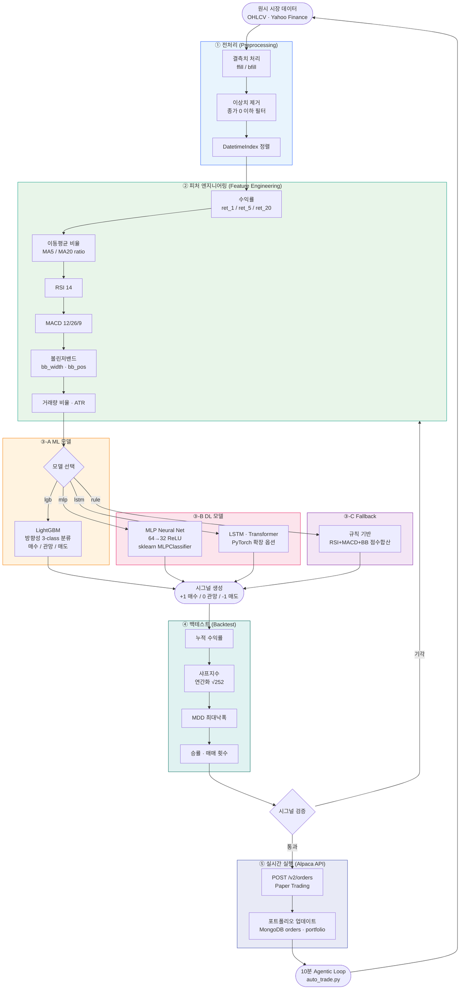

---

## 매매비용 (`app/services/trading_cost.py`)

백테스트와 주문이 **같은 요율표**를 쓴다. 국내주식 비용은 매수·매도가 대칭이 아니다.

| 항목 | 요율 (편도) | 매수 | 매도 |
|---|---:|:---:|:---:|
| 위탁수수료 (뱅키스 온라인 KRX) | 0.0140527% | ○ | ○ |
| 유관기관 제비용 | 0.0036396% | ○ | ○ |
| 증권거래세 + 농어촌특별세 | **연도별** (아래) | ✕ | ○ |
| 슬리피지 | 기본 10bp (가정) | ○ | ○ |

매도세 합계는 시행일로 갈린다 — **코스피와 코스닥이 같다**(농특세는 코스피에만 붙지만
코스닥은 거래세가 그만큼 높다). 코넥스만 0.10% 로 낮다.

| 시행일 | 2019-06-03 | 2021-01-01 | 2023-01-01 | 2024-01-01 | 2025-01-01 | 2026-01-01 |
|---|---:|---:|---:|---:|---:|---:|
| 매도세 합계 | 0.25% | 0.23% | 0.20% | 0.18% | **0.15%** | **0.20%** |

2025년 구간에 0.20% 를 쓰면 매도 비용을 33% 과대계상하고, 2026년에 0.15% 를 쓰면
과소계상한다. 왕복 실제 비용은 2026년 기준 **0.4354%** 로, 예전에 쓰던 대칭 가정
(왕복 10bp = 0.2%)의 **2.18배**다.

### API 파라미터 (`GET /api/quant/pipeline`)

| 파라미터 | 기본값 | 뜻 |
|---|---|---|
| `cost_model` | `real` | `real`(연도별 실제 요율) · `flat`(왕복 대칭 `cost_bps`) · `none`(무비용) |
| `slippage_bps` | `10` | 편도 슬리피지(bp). `cost_model=real` 에서만 쓴다 |
| `market` | (자동) | `KOSPI`·`KOSDAQ`·`KONEX`. 비우면 종목코드 접미사로 추론 |
| `cost_bps` | `10` | `cost_model=flat` 에서만 쓰는 왕복 대칭 비용 |

응답에 `cost`(무엇을 어떤 기준으로 뗐는지) · `gross_return_pct`(비용 전) ·
`cost_drag_pct`(깎인 폭)가 함께 나간다. 비용을 넣지 않으면 `cost.model` 이 `none` 으로
나가므로, 무비용 수치가 아무 표시 없이 화면에 나가지 않는다.

`cost_basis` 는 그 비용이 어디서 왔는지다 — `none`(안 뗌) · `estimated`(요율표로 계산) ·
`broker`(증권사가 준 실제 금액). 백테스트와 화면이 만드는 값은 모두 `estimated` 이고,
`broker` 는 증권사 체결을 들여왔을 때만 붙는다 (아래 「증권사 체결 들여오기」).

### 주문 쪽 — 현금은 `net_amount` 로 움직인다

```
매수: net_amount = 체결가 × 수량 + 수수료 + 유관기관비
매도: net_amount = 체결가 × 수량 − 수수료 − 유관기관비 − 증권거래세 − 농어촌특별세
```

주문 세 경로(직접매매 화면 · 자동매매 · 모의투자 화면)가 모두 이 값으로 현금을 옮긴다.
`가격 × 수량` 으로 옮기면 매수는 수수료만큼 부족해지고 매도는 세금만큼 많이 들어온다.

`orders` 에 집계값(`filled_quantity`·`avg_fill_price`·비용 4칸·`net_amount`)을 두고,
부분체결의 근거는 `order_fills` 에 남긴다 — FIX 가 `CumQty`·`AvgPx`(집계)와
`LastQty`·`LastPx`(개별)를 둘 다 두는 것과 같은 구조다.

`portfolio.avg_price` 는 **체결가 기준**으로 둔다. 매입부대비용을 단가에 녹이면 화면의
"평균단가"가 체결가와 달라져 읽는 사람이 혼동한다 — 비용은 주문 행에 남고, 현금이
그만큼 덜 남으므로 총자산에는 이미 반영된다.

### 증권사 체결 들여오기 (`app/services/fill_sync.py`)

실전 주문 경로(직접매매 화면의 증권사 주문 · 자동매매)는 **증권사에 주문만 내고 DB 에는
아무것도 남기지 않는다.** 그래서 실제 체결은 우리 쪽에 기록이 없다. 체결 조회가 그
구멍을 메운다.

```
BrokerClient.get_daily_fills(계좌, 시작일, 종료일) → list[FillInfo]
        │
        └─ fill_sync.sync_daily_fills() ─→ orders (증권사 주문번호로 갱신)
                                        └─ order_fills (근거)
```

KIS 는 주식일별주문체결조회에서 **추정제비용합계(`prsm_tlex_smtl`)** 를 함께 준다.
우리 요율표로 계산한 값과 이것을 맞대어 보고, **합계가 맞을 때만** `cost_basis="broker"`
를 붙인다. 어긋나면 `estimated` 로 두고 차액을 `mismatched` 에 담아 돌려준다 — 틀린
값을 "증권사가 준 값" 이라 부르면 검증이 무의미해진다.

| 상황 | `cost_basis` | `net_amount` |
|---|---|---|
| 증권사 합계 = 우리 추정 (±1원) | `broker` | 증권사 합계 기준 |
| 어긋남 | `estimated` | 우리 추정 기준 + 차액 보고 |
| 증권사가 제비용을 안 줌 | `estimated` | 우리 추정 기준 |

어긋났을 때 증권사 합계를 `net_amount` 에 쓰지 않는 이유는, 그러면 `net = 체결금액 ±
세목합` 이라는 불변식이 깨져 **어느 세목이 틀렸는지 알 수 없게** 되기 때문이다.

**TR 이 기간으로 갈린다.** 같은 URL 인데 최근 3개월과 그 이전이 서로 다른 TR 이다
(`TTTC0081R` / `CTSC9215R`, 모의는 `V` 접두사). 한쪽만 알면 과거 체결을 못 본다.

구현하지 않은 증권사는 `NotImplementedError` 를 던진다. 빈 리스트를 돌려주면 "체결이
없다" 와 "조회할 수 없다" 가 구분되지 않아 비용 검증이 조용히 건너뛰어진다.

#### KIS 응답을 다룰 때 조심할 것

- 🔴 **KIS 는 실패해도 HTTP 200 을 준다.** 성공 여부는 본문 `rt_cd` 에 있다
  (`0` 이 성공). `raise_for_status()` 만 보면 거부된 주문이 성공으로 올라간다 —
  2026-09-20(일) 모의계좌 주문이 `모의투자 영업일이 아닙니다`(`rt_cd=1`) 로 거부됐는데
  화면에는 `{"ok": true}` 가 뜨고 "주문 완료" 알림까지 나갔다. 지금은 모든 호출이
  `KISClient._check()` 를 지난다.
- 🔴 **계좌번호는 8자리 + 상품코드 2자리다.** `.env` 에 8자리만 있으면 `ACNT_PRDT_CD`
  가 빈 칸으로 나가고 **잔고 조회가 HTTP 500** 으로 떨어진다. `_split_account()` 가
  8자리일 때 `01`(종합위탁)을 채운다.
- 🟡 체결시각을 주지 않는다. `ord_tmd` 는 **주문시각**이라 지정가가 나중에 체결되면
  둘이 다르다. 지금은 이 값을 체결시각 자리에 쓴다.
- 🟡 일별주문체결조회는 **주문 단위 집계**(총체결수량·체결평균가)를 준다. 개별
  부분체결 한 건씩이 아니다 — 그래서 `order_fills` 에는 집계 행 하나(`seq=1`)만 남고,
  `broker_exec_id` 가 비어 있는 것이 그 표시다.

### 검증

```bash
PYTHONPATH=. python scripts/verify_trading_cost.py            # 요율표·방향·경계
PYTHONPATH=. python scripts/verify_trading_cost.py --repro     # 실데이터 재현 (수집기 DB 필요)
PYTHONPATH=. python scripts/verify_fill_sync.py               # 체결 동기화 (임시 Postgres 필요)
PYTHONPATH=. python scripts/sync_fills.py --days 90           # KIS 모의계좌 실조회·비용 대조
```

`sync_fills.py` 는 기본이 **모의계좌**(`KIS_MOCK_*`)다. 실계좌(`--real`)는 승인 없이
쓰지 않는다.

---

## 아키텍처

배포 환경별 상세 목표 설계서는 다음 문서를 기준으로 합니다.

- [온프레미스 아키텍처 설계서](onprem.md): Docker Compose, Kubernetes, 로컬 Ollama, NVIDIA GPU, 데이터·보안·백업·관측성
- [데이터 파이프라인 설계서](pipeline.md): 주식 백데이터 원천 인벤토리, 수집 스케줄, 캐시·적재 스키마, OHLCV/텍스트 전처리 규칙, 히스토리 테이블 목표안

> 아래 구성도와 이 README의 일부 로컬 설명에는 과거 MongoDB/SQLite 기준 내용이 남아 있습니다. 신규 인프라 설계는 현재 코드의 PostgreSQL/Redis/Neo4j/Celery 및 선택형 LLM provider를 반영한 위 두 설계서를 우선합니다.

```
Browser
  │
  ▼
FastAPI (Uvicorn)
  ├── /api/auth/*         → MongoDB (motor)
  ├── /api/chat           → ReAct Agent → SQLite + Qdrant RAG
  ├── /api/stocks/*       → Yahoo Finance API (httpx)
  ├── /api/portfolio/*    → SQLite (aiosqlite)
  ├── /api/orders/*       → SQLite + 포트폴리오 동기화
  ├── /api/crawl/*        → GitHub API + Qdrant upsert
  ├── /api/quant/*        → Yahoo Finance + 기술지표 계산
  └── /api/admin/*        → 관리자 전용 초기화
  │
  ├── Redis ──── 세션 (fin_session:{uuid})
  ├── MongoDB ── users collection
  ├── SQLite ─── 10개 테이블
  │               personal_cb_stats, corporate_cb_stats,
  │               bank_products, fund_products, chats,
  │               portfolio, orders, broker_settings,
  │               crawled_docs, audit_events
  ├── Qdrant ─── fin_chunks collection (크롤링 문서)
  └── Ollama ─── llama3.1 (chat) + nomic-embed-text (embed)
```

---

## 로컬 실행 가이드

### 사전 요구사항
- Docker Desktop + Docker Compose v2
- Python 3.12 (로컬 개발 시)

### 1. 인프라 기동

```bash
# Ollama 모델 포함 전체 기동
docker compose up -d

# 모델 준비 대기 (약 1~5분)
docker compose logs -f model-pull
```

### 2. Python 앱 로컬 실행

```bash
# 가상환경
python -m venv .venv
source .venv/bin/activate          # Windows: .venv\Scripts\activate

pip install -r requirements.txt

# 환경변수
cp .env.example .env.dev

# DB 초기화 + CSV 인제스트
python -m app.services.financial_ingest

# 앱 실행
uvicorn app.main:app --reload --port 8000
```

### 3. Docker 전체 실행

```bash
docker compose up -d --build

# CSV 인제스트 (최초 1회)
docker compose run --rm ingest
```

브라우저: `http://localhost:8000`

---

## 환경변수

`.env.example` 참고. 핵심 변수:

| 변수 | 기본값 | 설명 |
|---|---|---|
| `OLLAMA_BASE_URL` | `http://127.0.0.1:11434` | Ollama 서버 주소 |
| `LLM_MODEL` | `llama3.1` | 채팅 모델 |
| `EMBED_MODEL` | `nomic-embed-text` | 임베딩 모델 |
| `MONGO_URI` | — | MongoDB 연결 문자열 |
| `REDIS_URL` | `redis://localhost:6379` | Redis 연결 문자열 |
| `SQLITE_PATH` | `./data/app.db` | SQLite 파일 경로 |
| `DATA_DIR` | `./data` | CSV 파일 루트 디렉토리 |
| `QDRANT_URL` | `http://localhost:6333` | Qdrant 서버 주소 |
| `QDRANT_COLLECTION` | `fin_chunks` | Qdrant 컬렉션명 |
| `GITHUB_TOKEN` | — | GitHub API rate limit 완화 |
| `LEAN_MODE` | `auto` | LEAN 백테스트 실행 방식 `auto\|ssh\|docker\|local` (아래 참고) |
| `LEAN_DOCKER_IMAGE` | `quantconnect/lean:latest` | LEAN 엔진 이미지 |
| `LEAN_SSH_HOST` / `LEAN_SSH_KEY_PATH` | — | ssh 모드: 원격 LEAN 실행 서버 |
| `ALPACA_API_KEY` / `ALPACA_SECRET_KEY` | — | Alpaca Paper 연결 테스트·퀀트 파이프라인 주문 |
| `OPENAPI_RATE_LIMIT_MAX` | `60` | Open API 키당 분당 호출 제한 |

---

## 모의투자 · Open API (stock-coin-trade 이식)

`/home/ubuntu/stock-coin-trade`(Flask + MariaDB)의 모의투자 기능을 FastAPI + PostgreSQL 구조로 옮긴 것이다.
주식·코인·대체자산이 `paper_accounts.cash`(유저당 1행, 초기 1억원) 하나를 공유하며, 주식 포지션/주문은
기존 직접매매 화면의 `portfolio` / `orders` 테이블을 그대로 재사용한다(직접매매의 가상 주문도 이 현금과 연동).

| 화면 (GNB 모의투자) | API | 원본 |
|---|---|---|
| 모의계좌 현황 | `GET /api/paper/account`, `POST /api/paper/account/reset` | `stocks.py` account/reset |
| 국내주식 모의주문 | `GET /api/paper/stocks/quote`, `POST /api/paper/stocks/orders[/preview\|/buy\|/sell\|/pine]`, `GET /api/paper/stocks/positions\|orders/history` | `stock_trading.py`, `stocks.py` |
| 코인 모의매매 | `GET /api/paper/crypto/market-list\|rankings\|ticker\|{code}/candles\|{code}/domestic-prices`, `GET /api/paper/trade/hold`, `POST /api/paper/trade/order/buy\|sell\|preview` | `crypto.py` |
| 대체자산 | `GET /api/paper/alternatives/markets[/{symbol}/chart]\|positions\|orders/history`, `POST /api/paper/alternatives/orders[/preview]` | `alternatives.py` |
| Open API 키 | `GET/POST /api/paper/api-keys`, `DELETE /api/paper/api-keys/{id}` | `api_keys.py` |
| Alpaca 연결 테스트 | `POST /api/paper/alpaca/account\|positions` (읽기 전용) | `alpaca_test.py` |

외부 시스템은 발급받은 키로 `/openapi/v1/*`를 호출한다 (`Authorization: Bearer <key>`, 키당 분당 60회):

```bash
curl -H "Authorization: Bearer $KEY" http://localhost:8966/openapi/v1/quote/005930
curl -X POST -H "Authorization: Bearer $KEY" -H "Content-Type: application/json" \
     -d '{"symbol":"005930","side":"BUY","quantity":10}' http://localhost:8966/openapi/v1/orders
```

엔드포인트: `GET /stocks`, `GET /quote/{symbol}`, `GET /account`, `GET /positions`, `POST /orders`, `GET /orders`,
`GET /crypto/hold`, `GET /alternatives/positions`. 오류 응답은 원본과 같은 `{"error": CODE, "message": ...}` 형식이다.

> 원본 중 이식하지 않은 것: 봇 계정 자동 매매(`market_bots.py`), API 사용 이력·오류 분석 화면, 4일 커리큘럼 문서, KIS MCP 서버.
> 증권사 읽기 전용 테스트(KIS/KB)는 이미 있는 `/api/broker/*`(brokers/ 어댑터)가 같은 역할을 한다.

## QuantConnect LEAN 백테스트 (domain-rag-lab 이식)

`/home/ubuntu/domain-rag-lab`의 `lean_backtest_service.py` + `/backtests/run`을 `app/services/lean_backtest.py`,
`POST /api/backtests/lean/run`으로 옮겼다. 화면은 GNB **퀀트자동매매 > LEAN 백테스트**.

흐름: Yahoo Finance 일봉(httpx, yfinance 불필요) → `prices.csv` + 전략별 LEAN 알고리즘(`main.py`) 생성 →
`quantconnect/lean` 컨테이너 실행(`--environment backtesting --algorithm-language Python ...`) →
`*-summary.json` 통계 + 로그 회수 → pandas로 계산한 수익률·MDD·샤프·시장 노출 일수와 함께 반환.
LEAN이 Initialize() 전에 요구하는 `market-hours` / `symbol-properties` 참조 데이터는
`app/services/lean_reference_data/`에 벤더링되어 있다.

| `LEAN_MODE` | 동작 | 출처 |
|---|---|---|
| `docker` | 같은 호스트 Docker 데몬에서 실행. 컨테이너 안에서는 `/var/run/docker.sock` 마운트 + named volume `lean-workflows`를 `/workspace`로 공유(docker-compose.yml에 설정됨). docker CLI가 없으면 Engine API(소켓)로 실행 | stock-coin-trade `ai_sheet.py` |
| `ssh` | `LEAN_SSH_HOST`로 scp 후 원격에서 `docker run` | domain-rag-lab |
| `local` | LEAN 미실행, pandas 지표만 | — |
| `auto` (기본) | ssh 설정 → docker 가용 → local 순서로 자동 선택 | — |

```bash
docker pull quantconnect/lean:latest   # docker 모드 사전 준비 (약 14GB)
```

실행 이력은 `lean_backtest_runs` 테이블에 남고 `GET /api/backtests/lean/history`로 조회한다.

---

## Qdrant 구성 제안

### 옵션 비교

| 방식 | 비용 | 관리 | 권장 케이스 |
|---|---|---|---|
| **EC2 자가 호스팅** | EC2 비용만 | 직접 | 데이터 외부 전송 불가 / 비용 최적화 |
| **Qdrant Cloud** | 무료 1GB ~ 유료 | 관리형 | 빠른 PoC / 소규모 |
| **EKS on EC2** | 중간 | K8s 관리 | 대규모 고가용성 |

### EC2 자가 호스팅 (권장 시작점)

```bash
# r7g.large (ARM, 16GB RAM) 또는 m7i.large
docker run -d \
  -p 6333:6333 -p 6334:6334 \
  -v /data/qdrant:/qdrant/storage \
  qdrant/qdrant:latest
```

### 컬렉션 설계

```python
# fin_chunks – 크롤링 문서 RAG
VectorParams(size=768, distance=Distance.COSINE)
# payload 필드: source_url, chunk_index, doc_type, crawled_at

# 권장 인덱스
create_payload_index("fin_chunks", "doc_type", PayloadSchemaType.KEYWORD)
create_payload_index("fin_chunks", "crawled_at", PayloadSchemaType.DATETIME)
```

### 스케일링 시 고려사항

- **Qdrant Cluster 모드**: shard 수 = (총 벡터 수 / 200만) × replication factor
- **메모리**: 768차원 float32 × 벡터 수 × 1.5 (HNSW 오버헤드)
- **스냅샷 백업**: S3에 주기적 스냅샷 (`POST /collections/{name}/snapshots`)

---

## Qdrant 데이터 공유 방법

### Docker 이미지만으로는 데이터가 공유되지 않는 이유

이 프로젝트의 Qdrant 컨테이너는 **named volume**을 사용합니다 (`docker-compose.yml`):

```yaml
qdrant:
  volumes:
    - qdrant_data:/qdrant/storage   # named volume
```

Named volume은 Docker 이미지 레이어 **외부**에 존재합니다.  
따라서 `docker push` / `docker pull`로 이미지만 공유하면 크롤링·인제스트로 적재한 벡터 데이터는 전달되지 않습니다.  
데이터를 함께 전달하려면 아래 세 가지 방법 중 하나를 선택하세요.

---

### 방법 1 — Volume tarball 추출 (권장)

가장 간단한 방법으로, volume 전체를 압축 파일 하나로 내보냅니다.

**① 내보내기 (공유하는 쪽)**

```bash
# Qdrant 컨테이너를 먼저 중지해 파일 정합성 보장
docker compose stop qdrant

docker run --rm \
  -v qdrant_data:/qdrant/storage \
  -v $(pwd):/backup \
  busybox tar czf /backup/qdrant_data.tar.gz -C /qdrant/storage .

# 완료 후 재기동
docker compose start qdrant
```

생성된 `qdrant_data.tar.gz` 파일을 상대방에게 전달합니다.

**② 불러오기 (받는 쪽)**

```bash
# 1. Named volume 생성
docker volume create qdrant_data

# 2. tarball 압축 해제 후 volume에 적재
docker run --rm \
  -v qdrant_data:/qdrant/storage \
  -v $(pwd):/backup \
  busybox tar xzf /backup/qdrant_data.tar.gz -C /qdrant/storage

# 3. 전체 스택 기동
docker compose up -d
```

> **주의**: `docker compose up -d` 실행 전에 volume을 복원해야 Qdrant가 기동 시 데이터를 올바르게 인식합니다.

---

### 방법 2 — Qdrant Snapshot API (공식 방식)

Qdrant가 내장한 스냅샷 기능으로, **컬렉션 단위**로 선택적 공유가 가능합니다.

**① 스냅샷 생성 및 다운로드 (공유하는 쪽)**

```bash
# 스냅샷 생성 (컬렉션명: fin_chunks)
curl -X POST http://localhost:6333/collections/fin_chunks/snapshots

# 생성된 스냅샷 목록 확인
curl http://localhost:6333/collections/fin_chunks/snapshots
# 응답 예시: {"result":[{"name":"fin_chunks-123456789.snapshot", ...}]}

# 스냅샷 파일 다운로드
curl -O http://localhost:6333/collections/fin_chunks/snapshots/fin_chunks-123456789.snapshot
```

**② 복원 (받는 쪽)**

```bash
# Qdrant 기동 후, 스냅샷을 업로드하여 컬렉션 복원
curl -X POST 'http://localhost:6333/collections/fin_chunks/snapshots/upload?priority=snapshot' \
  -H 'Content-Type: multipart/form-data' \
  -F 'snapshot=@fin_chunks-123456789.snapshot'
```

컬렉션이 없으면 자동 생성되고, 이미 있으면 스냅샷 내용으로 덮어씁니다.

> **여러 컬렉션이 있는 경우** 각 컬렉션마다 위 명령을 반복하거나,  
> 전체 스토리지 수준 백업은 방법 1(tarball)을 사용하세요.

---

### 방법 3 — 이미지에 데이터 굽기 (비권장)

```dockerfile
FROM qdrant/qdrant:latest
COPY ./qdrant_storage /qdrant/storage
```

배포는 단순해지나, 데이터가 클수록 이미지가 비대해지고  
데이터 업데이트 시마다 이미지를 다시 빌드·푸시해야 하므로 권장하지 않습니다.

---

### 방법 비교

| 방법 | 공유 단위 | 장점 | 단점 |
|---|---|---|---|
| **Volume tarball** | 전체 storage | 명령 2개로 완전 복원, 추가 도구 불필요 | 컨테이너 중지 필요, 파일이 클 수 있음 |
| **Snapshot API** | 컬렉션 단위 | Qdrant 공식, 선택적·점진적 공유 가능 | 컬렉션이 여러 개면 반복 작업 필요 |
| **이미지에 굽기** | 이미지 전체 | 이미지 하나로 배포 완결 | 이미지 비대화, 데이터 갱신 불편 |

---

## 주요 화면

> Playwright로 캡처한 주요 화면입니다 (한글 폰트 적용, API Mock 기반).

### 1. Agent 홈 화면 (캡처 세트 01)
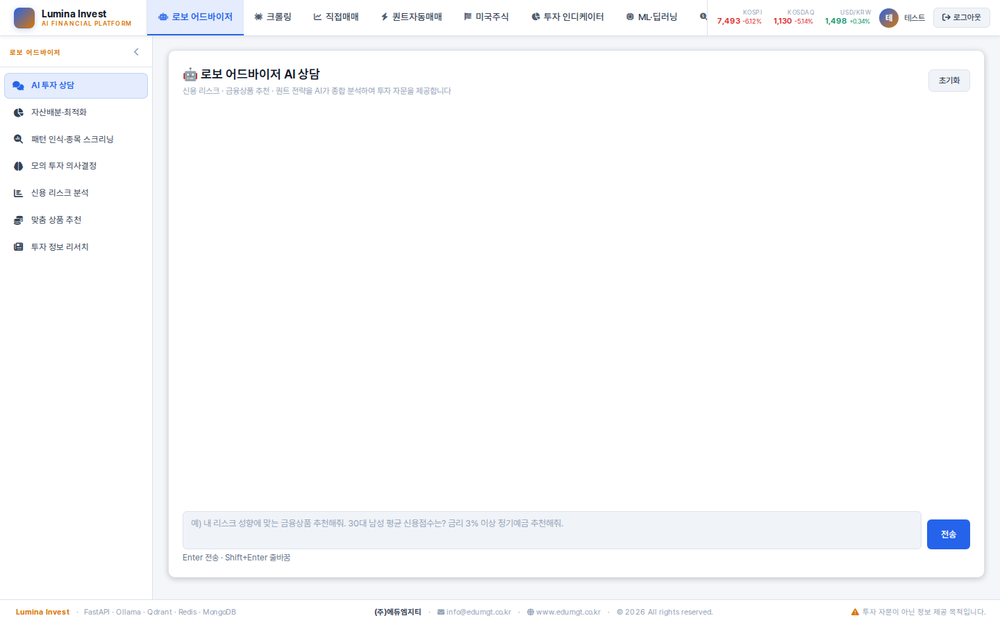

### 2. 로그인 화면 (캡처 세트 01)
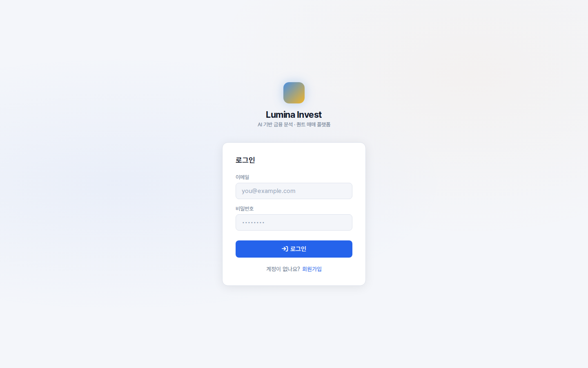

### 3. 회원가입 화면 (캡처 세트 02)
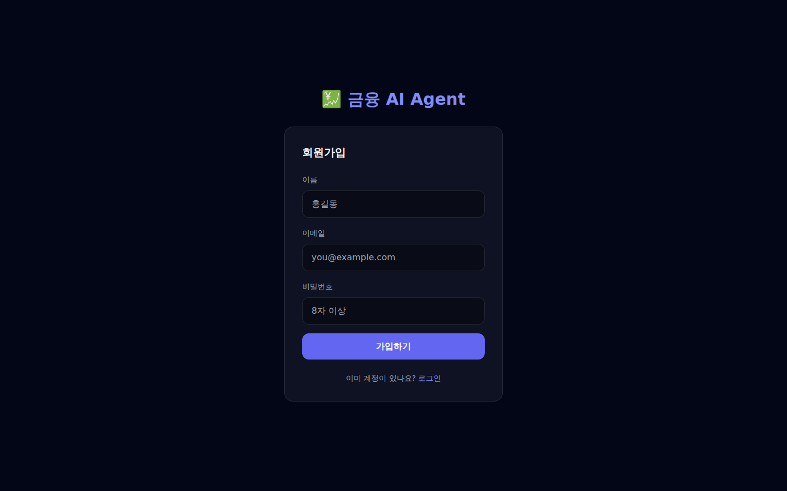

### 4. 퀀트 화면 (캡처 세트 02)
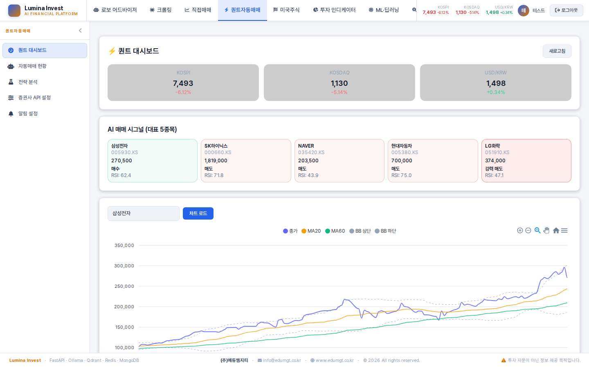

### 5. 앱 메인 화면 (캡처 세트 03)
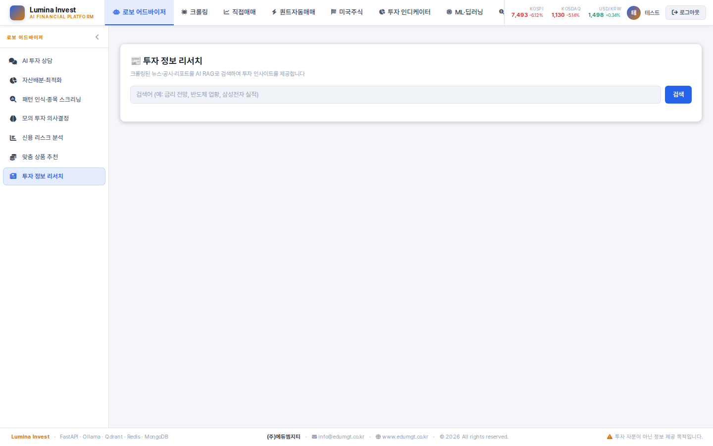

### 6. 미국 주식 화면 (캡처 세트 03)
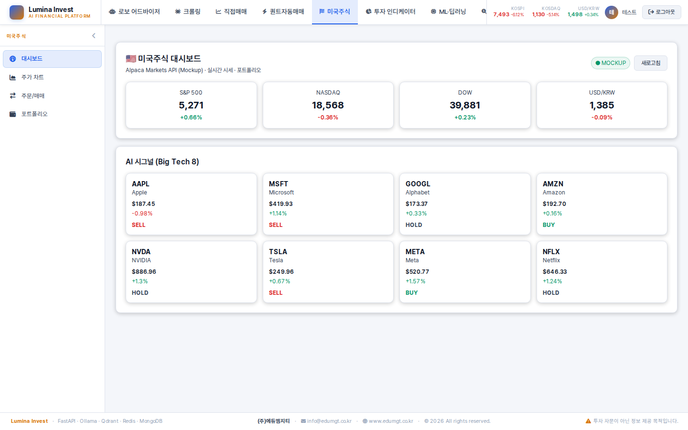

### 7. 기업 분석 화면 (캡처 세트 04)
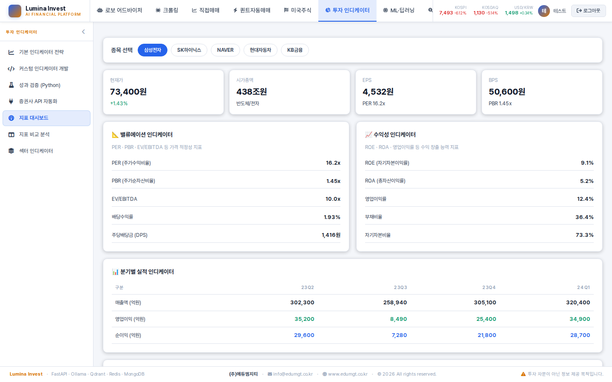

### 8. 퀀트 화면 (캡처 세트 04)


### 9. 기업 분석 화면 (캡처 세트 05)
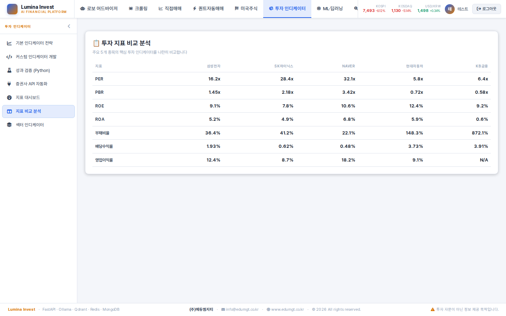

### 10. 트레이딩 화면 (캡처 세트 05)
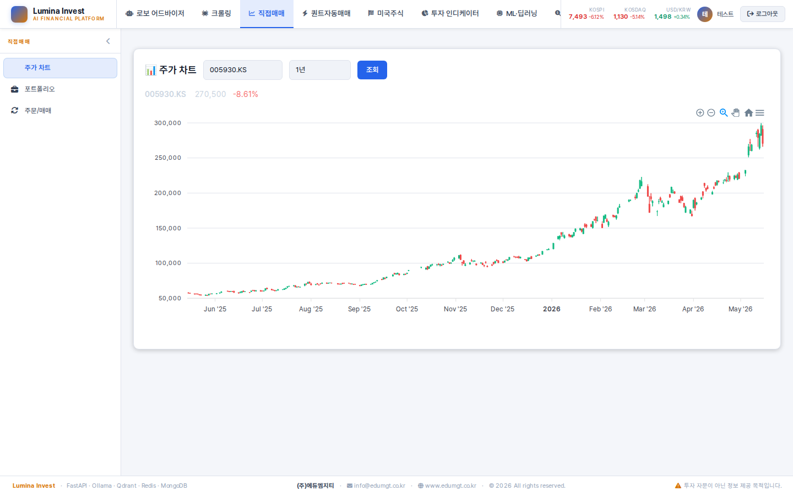

### 11. Agent 최종 화면


### 12. 주식 APEX 최종 화면


### 13. 퀀트 APEX 최종 화면
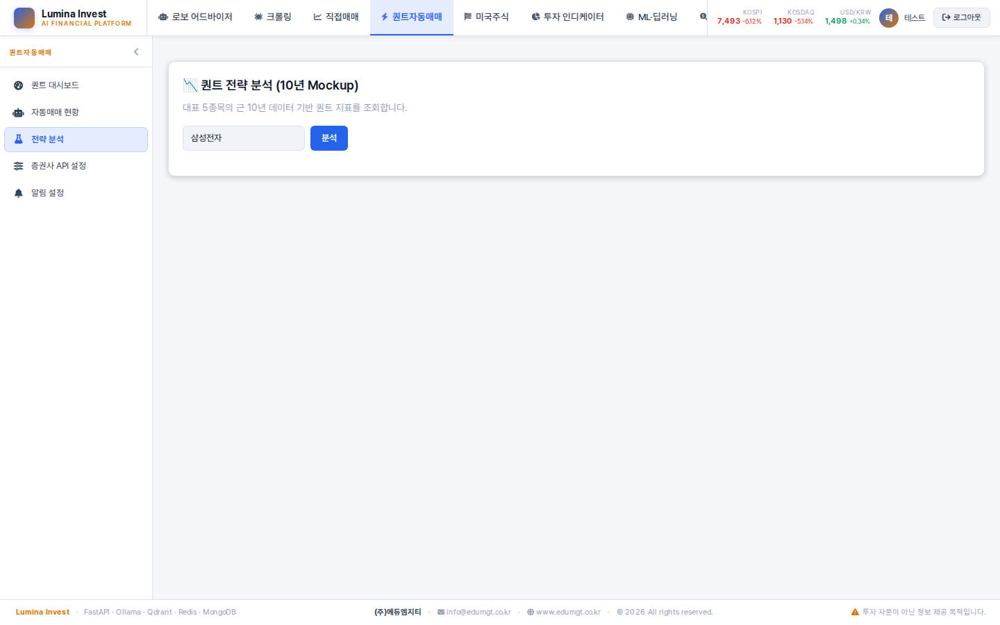

### 14. 미국 주식 APEX 최종 화면
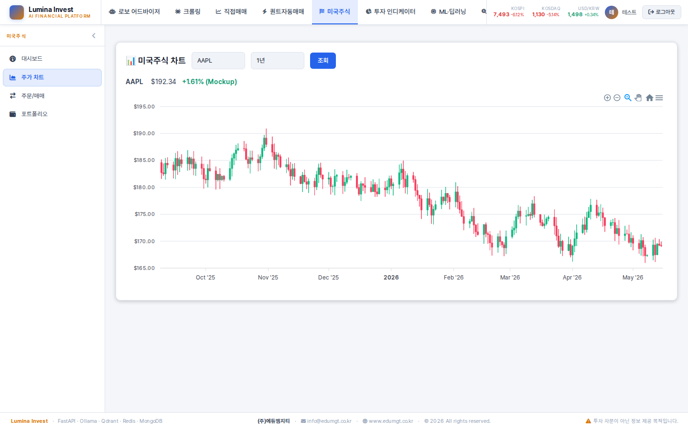

### 15. 기업 분석 최종 화면


---

### 투자분석 기초 방법론	
- 매크로 분석: 경제지표 분석(금리, 물가, 유가 등 주요 지표 보는 법 ), 거시경제상황 분석 실습 
- 산업 분석: 산업 경쟁력 분석(산업경쟁력 개념/분석모형, 산업별 분석방법), 산업 분석 실습 
- 기본적 분석: 재무제표분석 (손익계산서/대차대조표/현금흐름표), 기업가치분석(상대가치평가 밸류에이션(멀티플), 절대가치평가 밸류에이션 (DCF, EVA, FCF 등)), 분석기업선정 및 밸류에이션 실습 
- 기술적 분석: 추세 분석(지지선과 저항선, 이동평균선, 갭 반전, 되돌림 분석 등), 패턴 분석, 캔들 차트 분석, 지표 분석, 앨리어트파동이론, 분석기업선정 및 기술적 분석

### 퀀트를 위한 금융 필수 지식	
- 금융상품 이해: 주식/ETF 상품(주식/ETF 개요 및 운용 전략), 채권 상품(채권 개요 및 운용 전략), 파생상품(파생상품 개요 및 운용 전략) 
- 자산배분방법론: 포트폴리오 이론(개요 및 성과분석, 리스크 지표), 자산배분 모델(평균분산, 블랙리터만, Risk-Parity 모델 설명), 사례 분석

### 퀀트를 위한 머신러닝과 딥러닝	
- 머신러닝(회귀, SVM, Random Forest, Ensemble 등)과 딥러닝(RNN, CNN, LSTM, Transformer) 주요 모델 학습하기 
- 하이퍼 파라미터 튜닝, 교차 검증, 성능 확인 등 모델링의 주요 개념 이해하기 
- 클러스터링을 통한 군집화 및 의미 해석하기 
- 시계열에서 주로 활용되는 모델에 대한 학습(Transformer를 접목한 최신 시계열 분석 모델 학습)	

### 주가 지수 데이터 활용 머신러닝-딥러닝 프로젝트	
- 국내 증시 데이터를 활용한 시계열 머신러닝-딥러닝 프로젝트 
- 네이버 주식 웹 페이지 크롤링을 통한 주가 정보 수집 
- 주가 데이터 클러스터링을 통한 주식 항목 군집화 및 해석 
- 다양한 지표를 투입한 머신러닝-딥러닝 모델링을 통해 주가 변동 방향성을 직접 예측해보고 검증

### 데이터 활용 퀀트 모델링	
- 백테스트로 나오는 성과 지표 분석(MDD, Sharp ratio 등) 및 개선방향 논의 
- 주식 시장의 계절성 분석(연말 랠리, 월별 효과, 요일 효과) 
- 알고리즘 트레이딩 &amp; 자동매매 기초(트레이딩뷰 PineScript)

### 나만의 로보 어드바이저 개발 및 성과 검증 프로젝트	
- AI 기반의 자동화 로보 어드바이저 모델 개발 
- 패턴 인식 기법을 활용한 주식 시장 예측 프로젝트 
- 자산배분모델을 활용한 포트폴리오 최적화, 주식 스크리닝을 통한 종목 선정 등 직접 수행 
- 구축한 퀀트 모델의 결과를 해석해보고 자체적으로 모의 투자 의사결정 진행

### 나만의 투자 인디케이터 개발 및 성과 검증 프로젝트	
- 기본적인 인디케이터(MA, RSI등)로 전략 설계 
- 커스텀 인디케이터 개발 
- 트레이딩뷰 플랫폼으로 성과 확인 및 코딩 실습(PineScript) 
- 파이썬 프로그래밍을 통한 성과 검증 
- 증권사 연동(API 활용)을 통한 자동화 모델 구현


---

# <i class="fa-solid fa-book"></i> Neo4j 정리

## 1. 개요

**Neo4j**는 그래프 기반 데이터베이스(Graph Database)로,  
데이터 간의 **관계(Relationship)**를 중심으로 저장하고 조회하는 DB이다.

기존의 RDB(MySQL, Oracle 등)가 테이블 기반이라면,  
Neo4j는 **노드(Node)와 관계(Relationship)** 기반으로 데이터를 표현한다.

---

## 2. 핵심 개념

### 2.1 Node (노드)

- 데이터를 표현하는 기본 단위
- 사람, 상품, 장소 등 객체를 의미

```cypher
(:Person {name: "Kim", age: 30})

---

# AI Agent 개발을 위한 Celery 개념 정리

AI 에이전트를 만들 때 **Celery(셀러리)**는 에이전트에게 **"백그라운드에서 지치지 않고 일하는 비서"**를 고용해 주는 것과 같습니다.

LLM(대형 언어 모델)을 사용하는 AI 에이전트는 필연적으로 비싸고 무거운 작업(API 호출, 장시간의 데이터 검색, 코드 실행 등)을 수행합니다. 이때 웹 서버가 이 작업을 직접 처리하면 서버가 멈추거나 사용자가 무한 대기를 겪게 됩니다. Celery는 이 문제를 해결하는 핵심 도구입니다.

---

## 1. AI 에이전트에서 Celery가 필요한 이유

기존 웹 서비스와 달리, AI 에이전트는 한 번 요청을 받으면 뒤에서 엄청나게 바쁩니다.

* **동기식 처리 (Celery 없음):** 사용자가 "이번 달 뉴스 요약해 줘"라고 요청함 → 웹 서버가 직접 뉴스 50개 긁고, LLM API 보내고, 요약함 (이동안 웹 서버 마비, 사용자 브라우저 타임아웃 오류 발생).
* **비동기식 처리 (Celery 사용):** 사용자가 요청함 → 웹 서버가 **"접수 완료! 영수증(Task ID) 줄 테니 이따가 결과 확인해"** 하고 바로 응답 → 실제 무거운 요약 작업은 **Celery**가 백그라운드에서 조용히 처리.

---

## 2. Celery의 4가지 핵심 구성 요소

셀러리를 이해할 때 레스토랑 주방을 떠올리면 아주 쉽습니다.

```
[ 사용자/웹 서버 ] ──(요청/주문서)──> [ 브로커 (Redis/RabbitMQ) ]
                                              │
                                       (주문서 전달)
                                              ▼
[ 결과 저장소 (Result Backend) ] <──(완성)── [ 워커 (Celery Worker) ]
```

* **Task (작업):** 에이전트가 해야 할 일입니다. (예: "웹 스크래핑 하기", "LLM으로 이메일 초안 쓰기")
* **Broker (브로커/중간 관리자):** 웹 서버가 던진 작업(Task)을 순서대로 쌓아두는 큐(Queue, 대기열)입니다. 주로 **Redis**나 **RabbitMQ**라는 도구를 브로커로 사용합니다.
* **Worker (워커/일꾼):** 실제로 CPU와 메모리를 써서 AI 에이전트의 로직을 실행하는 주체입니다. 웹 서버와 완전히 분리된 별도의 프로세스(혹은 별도의 서버)에서 작동합니다.
* **Result Backend (결과 저장소):** 일꾼(Worker)이 AI 작업을 끝내고 나온 결과물(예: 요약된 텍스트)을 저장하는 곳입니다. (Redis나 데이터베이스를 주로 사용)

---

## 3. AI 에이전트 개발 시 Celery 활용 시나리오

* **롱 러닝 태스크 (Long-running Tasks):** 에이전트가 웹 서칭을 하고, 파일들을 분석하고, 여러 단계의 추론(Reasoning)을 거치는 대형 작업들을 백그라운드에서 안정적으로 처리합니다.
* **분산 처리 (Scaling):** 사용자가 몰려 대량의 AI 요청이 들어와도, Celery 워커 서버만 늘려서 작업을 쪼개어 병렬 처리할 수 있습니다.
* **예약 및 주기적 작업 (Celery Beat):** "매일 아침 9시에 뉴스 모니터링 분석 리포트 작성" 같은 스케줄링 기능을 에이전트에 쉽게 부여합니다.

---

## 4. Celery GitHub 오픈소스 프로젝트적 특징

Celery는 **GitHub에서 오픈소스로 관리되고 있는 전형적인 파이썬(Python) 프로젝트**입니다. `celery/celery` 저장소에서 전 세계 개발자들에 의해 관리됩니다.

* **100% 파이썬 기반:** 핵심 로직이 파이썬 코드로 작성되어 있어 `pip install celery`로 쉽게 설치 및 연동이 가능합니다.
* **자유로운 BSD-3-Clause 라이선스:** 상업적 목적의 수정 및 배포가 자유로워 수많은 글로벌 AI 및 IT 기업들이 안심하고 도입하고 있습니다.
* **파이썬 고급 기술의 집약체:** 데코레이터(`@app.task`)의 우아한 활용, 멀티프로세싱 및 비동기(`asyncio`) 동시성 프로그래밍 기술이 투명하게 공개되어 있습니다.


---

# Infrastructure as Code (IaC) 및 클라우드 배포 도구 비교 분석 보고서

본 보고서는 현대 데브옵스(DevOps) 생태계에서 핵심적인 역할을 하는 인프라 프로비저닝, 구성 관리, 배포 자동화 도구인 **Terraform, Ansible, AWS CloudFormation, AWS Elastic Beanstalk**의 특징과 차이점을 상세히 비교 분석합니다.

---

## 1. IaC 핵심 도구 비교: Terraform vs Ansible

테라폼(Terraform)과 앤서블(Ansible)은 종종 비교 대상이 되지만, 실제로는 서로 보완적인 관계에 가깝습니다.

* **Terraform (인프라 프로비저닝 특화)**
    * **핵심 역할:** AWS, Azure, GCP 같은 클라우드 환경에서 VPC를 만들고, 서브넷을 쪼개고, EC2 인스턴스를 생성하는 등의 **인프라 자체를 구축(Provisioning)**하는 데 최적화되어 있습니다.
    * **작동 방식 (선언적 - Declarative):** "내가 원하는 최종 상태"를 코드로 기술합니다. (예: *"나는 AWS에 EC2 인스턴스 3개가 필요해."*) 현재 상태가 2개라면 테라폼이 알아서 계산해서 1개만 추가로 생성합니다.
    * **상태 관리:** 자체적으로 State 파일(`*.tfstate`)을 유지하여 현재 인프라의 상태를 추적합니다.

* **Ansible (구성 관리 & 애플리케이션 배포 특화)**
    * **핵심 역할:** 이미 만들어진 서버(인프라)에 접속하여 사용자를 추가하고, Nginx나 Docker를 설치하고, 보안 설정을 적용하는 등의 **구성 관리(Configuration Management)**에 최적화되어 있습니다.
    * **작동 방식 (절차적/명령형에 가까운 하이브리드):** "순서대로 실행할 작업(Task)"을 순차적으로 기술하는 플레이북(Playbook) 방식을 사용합니다. 단, 개별 모듈들은 **멱등성(Idempotency)**을 보장하므로 이미 세팅된 작업은 안전하게 건너뜁니다.
    * **상태 관리:** 별도의 State 파일이 없으며, 실행할 때마다 대상 서버의 상태를 실시간으로 확인합니다.

### 아키텍처 및 통신 방식 비교

| 비교 항목 | Terraform | Ansible |
| :--- | :--- | :--- |
| **관리 대상과의 연결** | 각 클라우드 공급자의 **API**를 호출하여 제어 | 대상 서버에 **SSH** 또는 WinRM으로 직접 원격 접속 |
| **에이전트 유무** | **Agentless** (대상 서버에 아무것도 설치 안 함) | **Agentless** (대상 서버에 Python만 있으면 됨) |
| **주요 언어** | HCL (HashiCorp Configuration Language) | YAML |

---

## 2. AWS 진영의 도구 비교: CloudFormation vs Elastic Beanstalk

AWS 환경 내에서 인프라와 배포를 다루는 대표적인 두 서비스입니다. 목적지와 타겟층이 명확하게 구분됩니다.

* **AWS CloudFormation (AWS 공식 표준 IaC 도구)**
    * **인프라 중심:** VPC, 서브넷, IAM 역할, EC2, RDS 등 AWS의 거의 모든 리소스를 코드로 관리하는 테라폼의 AWS 전용 대항마입니다. JSON이나 YAML 템플릿 파일을 이용해 선언적으로 정의합니다.
    * **완전 관리형 상태 관리:** 테라폼과 달리 상태 파일(`tfstate`)을 사용자가 직접 관리할 필요 없이 AWS 백엔드에서 알아서 안전하게 관리해 줍니다.
    * **제한 사항:** AWS 전용 서비스이므로 타사 클라우드(GCP, Azure 등)에는 사용할 수 없습니다.

* **AWS Elastic Beanstalk (개발자를 위한 PaaS형 배포 도구)**
    * **애플리케이션 중심:** 인프라 제어보다 서비스 배포에 집중하는 **PaaS(Platform as a Service)**에 가깝습니다. Java, Node.js, Python, Docker 등으로 작성된 소스 코드만 업로드하면 인프라가 자동으로 구성됩니다.
    * **자동화 범위:** 로드 밸런서(ALB) 설정, 오토 스케일링 그룹(서버 자동 증설), 모니터링, OS 패치 등을 Beanstalk이 완전히 알아서 처리합니다.
    * **비밀 연결고리:** Elastic Beanstalk은 내부적으로 **CloudFormation을 기반으로 작동**합니다. 개발자가 코드를 올리면 Beanstalk이 뒤에서 자동으로 CloudFormation 템플릿을 생성해 리소스를 프로비저닝합니다.

---

## 3. 한눈에 보는 4대 도구 종합 비교 Matrix

| 도구 | 주요 역할 | 제어 범위 | 멀티 클라우드 | 난이도 및 특징 |
| :--- | :--- | :--- | :--- | :--- |
| **Terraform** | 인프라 프로비저닝 | 인프라 겉껍데기 | **지원 (강점)** | 표준적인 IaC, 대규모 인프라 및 전사적 아키텍처에 적합. |
| **CloudFormation** | 인프라 프로비저닝 | 인프라 겉껍데기 | **AWS 전용** | AWS 리소스 관리에 최적화, 인프라의 안정적인 선언적 관리. |
| **Ansible** | 구성 관리 (OS 내부 세팅) | OS 내부 및 소프트웨어 | **지원 (SSH 기반)** | 서버 내 환경 설정, 미들웨어 설치 및 앱 배포 자동화에 탁월. |
| **Elastic Beanstalk** | 앱 배포 및 관리 (PaaS) | 인프라 + 앱 전체 | **AWS 전용** | 인프라 구조를 몰라도 빠르게 코드를 배포하려는 개발자 친화형. |

---

## 💡 실무 적용 및 조합 가이드 (Best Practice)

현업에서는 단일 도구만 사용하기보다 각 도구의 장점을 결합하여 파이프라인을 구축하는 것이 일반적입니다.

1.  **Terraform + Ansible 조합 (멀티 클라우드/하이브리드 표준)**
    * `Terraform`으로 클라우드 상에 VPC, 보안 그룹, EC2 인스턴스를 깨끗하게 생성합니다.
    * 인스턴스 생성이 완료되면 해당 서버들의 IP 정보를 `Ansible` 인벤토리에 넘겨줍니다.
    * `Ansible`이 생성된 서버들에 SSH로 접속하여 보안 패치를 적용하고 필요한 소프트웨어 패키지를 배포합니다.
2.  **CloudFormation vs Elastic Beanstalk 선택 기준**
    * **"우리 회사는 오직 AWS만 쓰고, 인프라 아키텍처를 완벽하게 통제하고 싶다"** ➔ **CloudFormation** (또는 시장 주도권이 높은 **Terraform**)
    * **"인프라 구축이나 복잡한 설정은 최소화하고, 웹 서비스 코드를 AWS에 빠르게 배포하여 서비스하는 것이 최우선이다"** ➔ **Elastic Beanstalk**

---

# Vector DB 차원(Dimension) 이해하기

우리가 3차원 공간만 보고 살다 보니, AI가 다루는 **수백~수천 차원의 '고차원 벡터 공간(Vector Space)'**은 상상하기조차 어렵습니다. 머릿속으로 100개의 축이 직교하는 공간을 그리려고 하면 당연히 과부하가 걸립니다.

하지만 너무 어렵게 생각할 필요 없습니다. AI의 고차원을 이해하는 가장 좋은 방법은 차원을 공간이 아니라 **'특징(Feature)의 개수'**로 바라보는 것입니다.

---

## 1. 차원 = 공간의 축 (X) → 특징의 개수 (O)

수학이나 AI에서 1차원은 축 1개가 아니라 **'정보 1개'**를 의미합니다.

과일을 분류하는 AI 모델이 있다고 가정해 봅시다.

* **1차원 데이터**: 과일의 **[당도]**만 측정 (예: `[9.5]`)
* **2차원 데이터**: 과일의 **[당도, 신맛]**을 측정 (예: `[9.5, 2.1]`)
* **3차원 데이터**: 과일의 **[당도, 신맛, 단단함]**을 측정 (예: `[9.5, 2.1, 8.4]`)

여기까지는 우리가 사는 3차원 공간에 점으로 찍을 수 있습니다. 그렇다면 여기에 **[무게, 색상, 향기, 수분량, 가격...]**을 계속 추가하면 어떻게 될까요?

특징이 100개가 되면 100차원 벡터 `[9.5, 2.1, 8.4, 150, 0.8, ...]`가 됩니다. 기하학적으로는 그릴 수 없지만, 데이터 표(Table)의 열(Column)이 100개인 것과 다를 바 없습니다. 즉, 고차원 벡터는 대상을 엄청나게 구체적으로 묘사한 '특징 리스트'입니다.

---

## 2. 고차원 공간에서 '의미'를 찾는 방법

AI의 Vector DB는 이 수많은 특징들을 가지고 무엇을 할까요? 핵심은 **"비슷한 것끼리는 고차원 공간에서도 가까이 모인다"**는 점입니다.

우리가 3차원 공간에서 두 점 사이의 거리를 구할 때 피타고라스 정리를 쓰는 것처럼, AI도 고차원 공간에서 두 벡터 사이의 거리를 계산합니다. (주로 코사인 유사도 같은 방식을 씁니다.)

예를 들어 단어를 벡터로 변환하는 LLM(대형 언어 모델)의 경우:

* **'왕(King)'**과 **'여왕(Queen)'**은 [권력, 왕실, 인간, 역사...] 등 수천 개의 특징(차원)에서 매우 유사한 값을 가집니다. 따라서 수천 차원의 공간 속에서도 두 데이터는 아주 가까운 거리에 위치하게 됩니다.
* 반면 **'컴퓨터'**는 이들과 특징이 전혀 다르므로 고차원 공간에서 아주 멀리 떨어진 곳에 위치합니다.

결국 Vector DB는 인간처럼 공간을 시각적으로 '보는' 게 아니라, 수천 개의 숫자를 계산해서 "아, 이 두 데이터는 거리가 가까우니 의미가 비슷하구나!" 하고 수학적으로 인지하는 것입니다.

---

## 3. 인간이 고차원을 시각적으로 이해하는 꼼수: 차원 축소

그럼에도 인간은 눈으로 봐야 직성이 풀리는 동물입니다. 그래서 과학자들은 1000차원짜리 벡터 데이터를 인간에게 보여주기 위해 **차원 축소(Dimension Reduction)**라는 기술을 씁니다.

가장 대표적인 것이 t-SNE나 UMAP 같은 알고리즘입니다. 이 기술들은 고차원 공간에서 데이터들이 가졌던 '가깝고 먼 관계'를 최대한 유지하면서, 억지로 2차원 평면이나 3차원 공간으로 꾹꾹 눌러서 압축해 줍니다.

이렇게 축소된 화면을 보면, 수천 차원 속에 있던 데이터들이 끼리끼리 모여 군집(Cluster)을 이루고 있는 모습을 우리 눈으로도 확인할 수 있게 됩니다.

---

## 💡 요약

인간은 공간의 축(X, Y, Z)으로 차원을 이해하지만, AI의 Vector DB는 **데이터가 가진 '특징의 개수'**로 차원을 이해합니다. 우리가 수천 개의 단어로 어떤 개념을 세밀하게 설명하듯, AI는 수천 개의 숫자로 이루어진 벡터로 개념을 정교하게 인지하는 것이죠.

> 참고: 이 프로젝트의 Qdrant 컬렉션(`fin_chunks`)은 `nomic-embed-text` 임베딩 모델을 사용해 `VectorParams(size=768, distance=Distance.COSINE)`로 768차원 벡터를 저장합니다. 즉 각 금융 문서 청크가 768개의 특징 값으로 표현되며, 코사인 유사도로 의미가 가까운 문서를 검색하는 것입니다.
